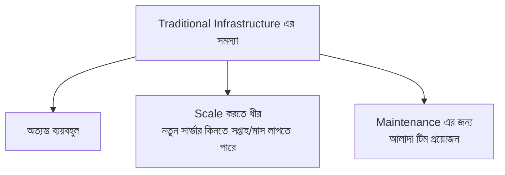
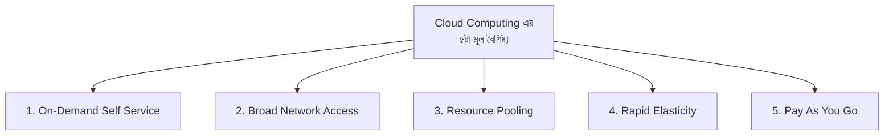
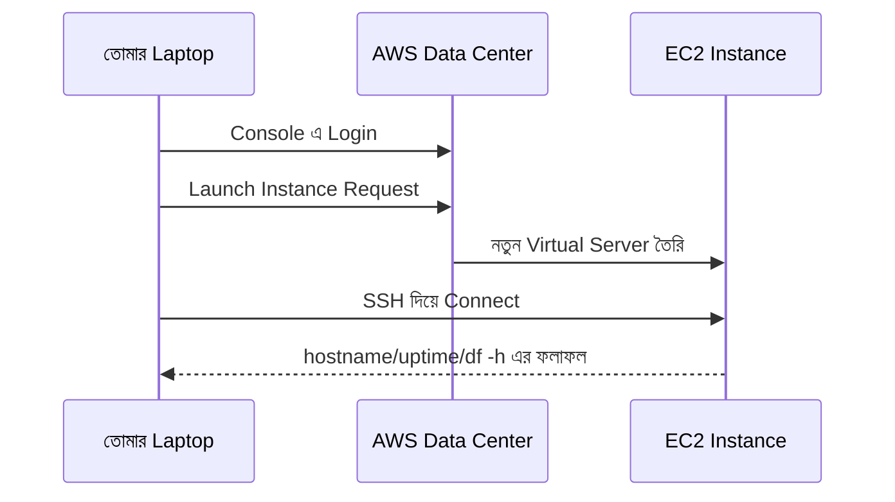
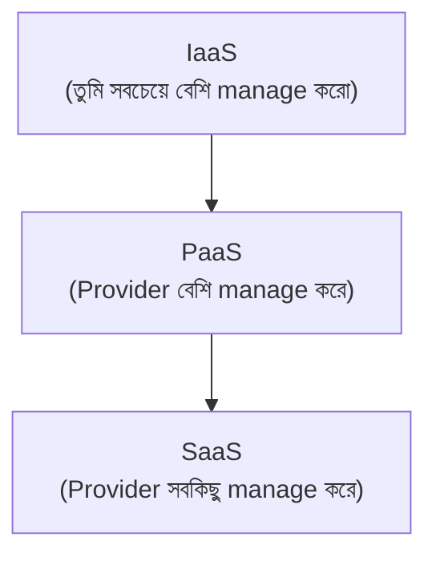
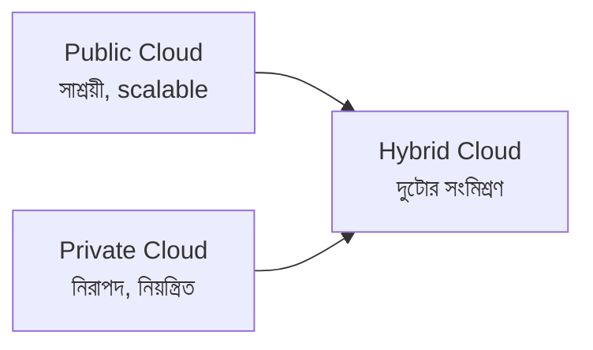

# Day 01: Cloud Computing Basics

আজকের ক্লাসে আমরা Cloud Computing এর একদম মূল ভিত্তি বুঝব — এটা কী, কেন গুরুত্বপূর্ণ, এবং AWS Console এ প্রথমবারের মতো একটা actual cloud server তৈরি করে দেখব। এই ভিত্তিটাই বাকি ৩৯ দিনের পুরো কোর্সের basis হবে।

---

## What is Cloud Computing? — Cloud Computing কী?

### সহজ সংজ্ঞা

**Cloud Computing** মানে — নিজের physical hardware না কিনে, ইন্টারনেটের মাধ্যমে computing resource (server, storage, networking, database) ব্যবহার করা। নিজের server কেনার বদলে, তুমি একটা cloud provider থেকে সেটা **ভাড়া** নিচ্ছ।

### Traditional Infrastructure — Cloud এর আগে

Cloud আসার আগে, একটা কোম্পানিকে নিজে থেকে কিনতে হতো:

- Physical Server
- Storage
- Networking device
- Data center এর জায়গা
- Cooling ও electricity ব্যবস্থা
- সেগুলো maintain করার জন্য IT engineer



---

## Cloud Computing Concept

Amazon Web Services (AWS), Microsoft Azure, Google Cloud Platform (GCP) — এই ধরনের **Cloud Provider** রা on-demand ভিত্তিতে infrastructure সরবরাহ করে।

### সুবিধা

| সুবিধা | ব্যাখ্যা |
|---|---|
| ✔ Pay only for what you use | যতটুকু ব্যবহার করবে, শুধু ততটুকুর জন্য টাকা দেবে |
| ✔ Launch servers in minutes | মিনিটের মধ্যে নতুন সার্ভার চালু করা যায় |
| ✔ Global infrastructure | বিশ্বের বিভিন্ন জায়গায় data center থেকে সার্ভিস পাওয়া যায় |
| ✔ High availability | সিস্টেম সবসময় চালু ও নির্ভরযোগ্য রাখার ব্যবস্থা |
| ✔ Auto scaling | চাহিদা বাড়লে/কমলে automatic ভাবে resource সমন্বয় হয় |

### উদাহরণ

একটা $10,000 এর physical server কেনার বদলে, তুমি AWS এ একটা সার্ভার চালু করতে পারো মাত্র **$0.01/ঘণ্টা** থেকে শুরু করে — প্রয়োজন শেষে সেটা বন্ধ করে দিলেই খরচ থেমে যায়।

---

## Key Characteristics of Cloud — ৫টা গুরুত্বপূর্ণ বৈশিষ্ট্য

::: tip ইন্টারভিউর জন্য গুরুত্বপূর্ণ
এই পাঁচটা characteristic প্রায় প্রতিটা Cloud/AWS ইন্টারভিউতে জিজ্ঞাসা করা হয় — মুখস্থ রাখা দরকার।
:::



| # | বৈশিষ্ট্য | ব্যাখ্যা |
|---|---|---|
| 1️⃣ | **On-Demand Self Service** | যেকোনো সময় নিজে থেকেই সার্ভার তৈরি করা যায়, কারো অনুমতি/সাহায্যের অপেক্ষা করতে হয় না |
| 2️⃣ | **Broad Network Access** | ইন্টারনেট থাকলে যেকোনো জায়গা থেকে অ্যাক্সেস করা যায় |
| 3️⃣ | **Resource Pooling** | Cloud provider একই infrastructure একাধিক client এর মধ্যে ভাগ করে (multi-tenancy) |
| 4️⃣ | **Rapid Elasticity** | চাহিদা অনুযায়ী তাৎক্ষণিকভাবে resource বাড়ানো/কমানো যায় |
| 5️⃣ | **Pay As You Go** | শুধু ব্যবহৃত resource এর জন্য টাকা দিতে হয়, fixed খরচ না |

---

## Hands-on Demo — প্রথম Cloud Server তৈরি করা

এখন আমরা AWS এ একটা actual cloud server (EC2 Instance) চালু করব — একদম প্রথম hands-on experience।

### ধাপ ১: AWS Console এ Login করা

```
https://console.aws.amazon.com
```

### ধাপ ২: EC2 সার্চ করা

Console এর search bar এ `EC2` লিখে EC2 Dashboard এ যাও।

### ধাপ ৩: Launch Instance

`Launch Instance` বাটনে ক্লিক করো।

### ধাপ ৪: Configuration

| Setting | মান |
|---|---|
| **Name** | `my-first-cloud-server` |
| **AMI** | Amazon Linux |
| **Instance Type** | `t2.micro` (Free Tier এর মধ্যে) |

### ধাপ ৫: Key Pair তৈরি করা

একটা নতুন Key Pair বানাও, নাম দাও `aws-demo-key`, এবং `.pem` ফাইলটা ডাউনলোড করো।

::: danger
`.pem` ফাইলটা হারিয়ে ফেললে, সেই instance এ আর SSH দিয়ে সংযুক্ত হওয়া যাবে না (নতুন করে তৈরি করতে হবে)। এই ফাইলটা নিরাপদ জায়গায় সংরক্ষণ করো, এবং কখনো Git/public জায়গায় publish করবে না।
:::

### ধাপ ৬: Security Group

নিচের দুইটা Port অনুমোদন (Allow) করো:

- **SSH (22)** — সার্ভারে দূর থেকে (remote) সংযুক্ত হওয়ার জন্য
- **HTTP (80)** — পরবর্তীতে ওয়েব সার্ভার চালালে browser থেকে অ্যাক্সেসের জন্য

### ধাপ ৭: Launch Instance

`Launch Instance` ক্লিক করে প্রায় ৩০ সেকেন্ড অপেক্ষা করো — instance চালু হয়ে যাবে।

### ধাপ ৮: সার্ভারে Connect করা

```bash
ssh -i aws-demo-key.pem ec2-user@PUBLIC-IP
```

সংযুক্ত হওয়ার পর, এই কমান্ড গুলো চালিয়ে দেখো:

```bash
hostname
uptime
df -h
```



::: tip
লক্ষ্য করো — এই সার্ভারটা তোমার **নিজের ল্যাপটপে না**, এটা AWS এর কোনো data center এ চলছে। তুমি শুধু ইন্টারনেটের মাধ্যমে সেটার সাথে সংযুক্ত হচ্ছ — এটাই Cloud Computing এর মূল সারমর্ম।
:::

---

## IaaS vs PaaS vs SaaS — তিনটা Service Model

### IaaS (Infrastructure as a Service)

Provider তোমাকে virtual machine, storage, networking দেয় — বাকি সবকিছু (OS, Application, Security, Runtime) তোমাকেই manage করতে হয়।

**উদাহরণ:** Amazon EC2, Amazon EBS, DigitalOcean

### PaaS (Platform as a Service)

Provider infrastructure + OS + runtime সবকিছু manage করে — তুমি শুধু তোমার কোড deploy করো।

**উদাহরণ:** AWS Elastic Beanstalk, Heroku, Google App Engine

### SaaS (Software as a Service)

User সরাসরি browser দিয়ে ready-made software ব্যবহার করে — কোনো infrastructure management করার প্রয়োজনই নেই।

**উদাহরণ:** Gmail, Google Docs, Zoom, Dropbox, Salesforce



### Comparison Table

| Feature | IaaS | PaaS | SaaS |
|---|---|---|---|
| **Infrastructure** | Cloud Provider | Cloud Provider | Cloud Provider |
| **OS** | তুমি manage করো | Provider manage করে | Provider manage করে |
| **Runtime** | তুমি manage করো | Provider manage করে | Provider manage করে |
| **Application** | তুমি | তুমি | Provider |
| **উদাহরণ** | EC2 | Elastic Beanstalk | Gmail |

::: tip মনে রাখার সহজ উপায়
IaaS = "আমি সবচেয়ে বেশি নিয়ন্ত্রণ চাই, কষ্ট করতে রাজি"
PaaS = "আমি শুধু কোড লিখতে চাই, বাকিটা provider সামলাক"
SaaS = "আমি শুধু ব্যবহার করতে চাই, কিছুই manage করতে চাই না"
:::

---

## Public vs Private vs Hybrid Cloud

### Public Cloud

একাধিক কোম্পানির মধ্যে infrastructure শেয়ার করা হয়।

**উদাহরণ:** AWS, Microsoft Azure, Google Cloud Platform

| সুবিধা |
|---|
| ✔ সাশ্রয়ী |
| ✔ অত্যন্ত scalable |
| ✔ Maintenance এর চিন্তা নেই |

### Private Cloud

একটা নির্দিষ্ট organization এর জন্য নিবেদিত cloud।

**উদাহরণ:** একটা ব্যাংক নিজের data center এ নিজস্ব cloud চালাচ্ছে

**Technology:** OpenStack, VMware vSphere

| সুবিধা | অসুবিধা |
|---|---|
| ✔ উচ্চ নিরাপত্তা | ❌ ব্যয়বহুল |
| ✔ সম্পূর্ণ নিয়ন্ত্রণ | |

### Hybrid Cloud

Public এবং Private Cloud এর সংমিশ্রণ।

**উদাহরণ:** একটা ব্যাংকের গ্রাহক ডেটা Private Cloud এ থাকে, কিন্তু তাদের public-facing ওয়েবসাইট AWS (Public Cloud) এ চলে

**Technology:** VMware Cloud, AWS Outposts

| সুবিধা |
|---|
| ✔ Flexibility |
| ✔ Security |
| ✔ Cost Optimization |



---

## Real World Example — Netflix

**Netflix** সম্পূর্ণভাবে **Amazon Web Services** এর উপর চলে। লক্ষ লক্ষ মানুষ প্রতিদিন movie/series দেখে, কিন্তু Netflix নিজে কোনো physical server owns করে না — সবকিছু AWS এর infrastructure এর উপর নির্ভরশীল।

::: tip
এটা Cloud Computing এর শক্তির একটা বাস্তব প্রমাণ — এমনকি বিশ্বের সবচেয়ে বড় streaming platform ও নিজের data center না বানিয়ে, cloud provider এর উপর নির্ভর করে scale করছে।
:::

---

## DevOps Perspective — DevOps এর জন্য Cloud কেন গুরুত্বপূর্ণ

| কারণ |
|---|
| ✔ Infrastructure Automation |
| ✔ CI/CD Pipeline |
| ✔ Kubernetes Cluster পরিচালনা |
| ✔ Monitoring |
| ✔ Scalability |

এই কোর্সের পরবর্তী Phase গুলোতে (বিশেষত Phase 7-9) তুমি যেসব টুল ব্যবহার করবে:

- **Terraform** (Infrastructure as Code)
- **Kubernetes** (Container Orchestration)
- **Docker** (Containerization)
- **Jenkins** (CI/CD)

এই সবগুলোই Cloud এর উপর ভিত্তি করে কাজ করে — তাই আজকের এই মূল concept গুলো ভালোভাবে বোঝা পুরো কোর্সের ভিত্তি।

---

## Common Mistakes

- Free Tier এর সীমার বাইরে instance type ব্যবহার করা (`t2.micro` এর বদলে ভুলে বড় instance বেছে নেওয়া), অপ্রত্যাশিত বিল আসা
- `.pem` key ফাইল হারিয়ে ফেলা বা secure জায়গায় না রাখা
- Security Group এ প্রয়োজনের বেশি port open রাখা (নিরাপত্তা ঝুঁকি)
- Hands-on lab শেষে instance বন্ধ/terminate করতে ভুলে যাওয়া

---

## Best Practices

- সবসময় Free Tier eligible resource (`t2.micro`) দিয়ে practice শুরু করো
- Key pair ফাইল local এ নিরাপদ, backup রাখার জায়গায় সংরক্ষণ করো
- Security Group এ শুধু প্রয়োজনীয় port ই open রাখো
- প্রতিটা lab শেষে ব্যবহৃত resource বন্ধ/মুছে ফেলার অভ্যাস করো

---

## Interview Questions

**প্রশ্ন: Cloud Computing এর ৫টা মূল বৈশিষ্ট্য কী কী?**
> On-Demand Self Service, Broad Network Access, Resource Pooling, Rapid Elasticity, এবং Pay As You Go।

**প্রশ্ন: IaaS, PaaS, এবং SaaS এর মধ্যে পার্থক্য কী?**
> IaaS এ শুধু infrastructure (VM, storage, network) দেওয়া হয়, বাকি সব তুমি manage করো। PaaS এ infrastructure + OS + runtime provider manage করে, তুমি শুধু কোড deploy করো। SaaS এ সম্পূর্ণ software ready-made, browser দিয়ে ব্যবহার করা যায়, কোনো management লাগে না।

**প্রশ্ন: Hybrid Cloud কেন ব্যবহার করা হয়?**
> সংবেদনশীল ডেটা (যেমন ব্যাংকিং তথ্য) নিরাপদে Private Cloud এ রেখে, কম sensitive অংশ (যেমন public website) Public Cloud এ চালিয়ে — নিরাপত্তা এবং সাশ্রয়ীতা দুটোরই সুবিধা নেওয়া যায়।

**প্রশ্ন: Resource Pooling বলতে কী বোঝায়?**
> Cloud provider একই physical infrastructure একাধিক client এর মধ্যে ভাগ করে ব্যবহার করে (multi-tenancy), যার ফলে resource efficient ভাবে ব্যবহৃত হয় এবং খরচ কমে।

---

## Summary

- **Cloud Computing** মানে নিজের hardware না কিনে, ইন্টারনেটের মাধ্যমে computing resource ব্যবহার করা
- **৫টা মূল বৈশিষ্ট্য**: On-Demand Self Service, Broad Network Access, Resource Pooling, Rapid Elasticity, Pay As You Go
- **IaaS, PaaS, SaaS** — তিনটা service model, ভিন্ন ভিন্ন মাত্রার management responsibility
- **Public, Private, Hybrid Cloud** — deployment model, নিরাপত্তা ও খরচের ভারসাম্য অনুযায়ী বেছে নেওয়া হয়
- আজকে আমরা প্রথমবারের মতো AWS Console দিয়ে একটা **actual EC2 Instance** চালু করে SSH দিয়ে সংযুক্ত হয়েছি

## পরবর্তী ধাপ

**Day 02: AWS Introduction** এ আমরা AWS Account তৈরি করা, MFA সেটআপ, Budget Alert, এবং Regions & Availability Zone নিয়ে বিস্তারিত শিখব।
