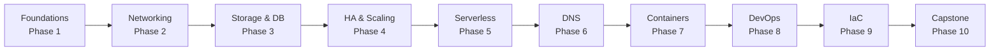
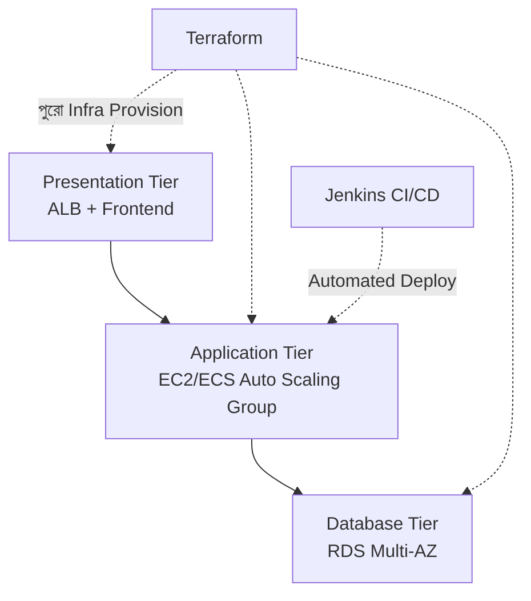

# AWS Complete Course — সম্পূর্ণ কোর্স আউটলাইন

এই কোর্সটা AWS (Amazon Web Services) কে একদম ভিত্তি থেকে শুরু করে একটা সম্পূর্ণ, প্রোডাকশন-গ্রেড 3-Tier Capstone Project পর্যন্ত কভার করে — মোট **৪০ দিন**, **১০টা Phase** এ ভাগ করা। প্রতিটা দিন আগের দিনের উপর ভিত্তি করে তৈরি, তাই ক্রম অনুযায়ী পড়াই সবচেয়ে ভালো ফলাফল দেবে।

---

## Prerequisite — শুরু করার আগে

- Basic Linux command line ব্যবহারের ধারণা (`cd`, `ls`, `ssh`, ফাইল এডিট করা)
- Networking এর একদম মৌলিক concept (IP address, Port কী তা জানা)
- কোনো AWS অভিজ্ঞতা লাগবে না — Day 02 থেকেই account তৈরি শুরু হবে

::: tip
Programming/DevOps background থাকলে দ্রুত এগোতে পারবে, কিন্তু এটা আবশ্যক না — এই কোর্স ধরে নেয় তুমি cloud সম্পর্কে সম্পূর্ণ নতুন।
:::

---

## কেন এই কোর্স এভাবে সাজানো হয়েছে

এই ক্রমটা ইচ্ছাকৃতভাবে **একটা বাস্তব application এর জীবনচক্র** অনুসরণ করে — প্রথমে একটা মাত্র সার্ভার চালানো শেখা (Phase 1), তারপর সেটাকে নেটওয়ার্কে সংযুক্ত করা (Phase 2), ডেটা সংরক্ষণ করা (Phase 3), একাধিক সার্ভারে scale করা (Phase 4), সার্ভারবিহীন আর্কিটেকচার শেখা (Phase 5), এবং শেষে সবকিছু automate করে (Phase 8-9) একটা সম্পূর্ণ প্রোডাকশন সিস্টেম বানানো (Phase 10)।

---

## সম্পূর্ণ Roadmap — এক নজরে

### 🔹 Phase 1 — Cloud & AWS Foundations (Day 1-8)

| Day | Topic |
|---|---|
| 01 | Cloud Computing Basics (IaaS vs PaaS vs SaaS, Public vs Private vs Hybrid) |
| 02 | AWS Introduction (Account, MFA, Budget, Regions & AZ) |
| 03 | IAM Deep Dive (Users, Groups, Policies) |
| 04 | AWS CLI Setup ও Configuration |
| 05 | EC2 — Key Pairs, Security Groups, SSH, Launch, Pricing |
| 06 | EBS (Elastic Block Store) |
| 07 | EFS (Elastic File System) |
| 08 | AMI (Amazon Machine Image) |

### 🔹 Phase 2 — Networking (Day 9-12)

| Day | Topic |
|---|---|
| 09 | VPC Fundamentals |
| 10 | Firewall ও Elastic IP |
| 11 | VPC Peering |
| 12 | Load Balancer (ALB, NLB) |

### 🔹 Phase 3 — Storage & Databases (Day 13-17)

| Day | Topic |
|---|---|
| 13 | S3 Deep Dive, Versioning, Lifecycle Policy |
| 14 | S3 Static Website Hosting |
| 15 | RDS Introduction (MySQL/Postgres) |
| 16 | EC2 তে MySQL Install (Self-managed) |
| 17 | EFS Advanced Hands-on |

### 🔹 Phase 4 — High Availability & Scaling (Day 18-22)

| Day | Topic |
|---|---|
| 18 | Auto Scaling Groups |
| 19 | Launch Templates, Multi-AZ Architecture |
| 20 | SNS (Simple Notification Service) |
| 21 | CloudWatch Alarms |
| 22 | SQS (Simple Queue Service) |

### 🔹 Phase 5 — Serverless & Modern AWS (Day 23-26)

| Day | Topic |
|---|---|
| 23 | Lambda Introduction |
| 24 | API Gateway + Lambda |
| 25 | Project: S3 → Lambda → SNS |
| 26 | Elastic Beanstalk |

### 🔹 Phase 6 — DNS & Traffic Management (Day 27)

| Day | Topic |
|---|---|
| 27 | Route 53 |

### 🔹 Phase 7 — Containers & Kubernetes (Day 28-31)

| Day | Topic |
|---|---|
| 28 | Docker Basics |
| 29 | ECR & ECS |
| 30 | ECS Fargate + ALB + Auto Scaling Deployment |
| 31 | EKS Introduction ও Deployment |

### 🔹 Phase 8 — DevOps on AWS (Day 32-37)

| Day | Topic |
|---|---|
| 32 | CI/CD Basics ও AWS DevOps Services |
| 33 | CodeCommit |
| 34 | CodeBuild |
| 35 | CodePipeline |
| 36 | CodeDeploy |
| 37 | Blue-Green Deployment |

### 🔹 Phase 9 — Infrastructure as Code (Day 38-40)

| Day | Topic |
|---|---|
| 38 | CloudFormation |
| 39 | Terraform on AWS |
| 40 | Terraform দিয়ে সম্পূর্ণ Infrastructure Deploy |

### 🔹 Phase 10 — Real-World Capstone Project

| | Topic |
|---|---|
| Capstone | AWS 3-Tier Project — Terraform + Jenkins CI/CD + Docker |

---

## Capstone Project — চূড়ান্ত লক্ষ্য

এই কোর্সের শেষে তুমি একটা সম্পূর্ণ **3-Tier Architecture** (Presentation → Application → Database) বানাবে, যেটা:
- **Terraform** দিয়ে সম্পূর্ণ infrastructure হিসেবে code আকারে সংজ্ঞায়িত
- **Jenkins CI/CD** দিয়ে automated deployment
- **Docker** দিয়ে containerized application
- High Availability, Auto Scaling, এবং Monitoring সহ — production-grade practice

---

## কীভাবে এই কোর্স পড়বে

- **ক্রম অনুযায়ী পড়ো** — প্রতিটা Day আগেরটার উপর নির্ভর করে (বিশেষত Phase 1-2, যেগুলো ভিত্তি তৈরি করে)
- **প্রতিটা Hands-on Lab নিজে করো** — শুধু পড়ে বোঝা যথেষ্ট না, AWS Console/CLI এ নিজে করে দেখো
- **AWS Free Tier ব্যবহার করো** — Day 02 এ Free Tier setup নিয়ে বিস্তারিত থাকবে, বেশিরভাগ hands-on lab Free Tier এর মধ্যেই করা যাবে
- **Budget Alert সেট করো** — Day 02 এ শেখানো হবে, অপ্রত্যাশিত বিল এড়াতে এটা প্রথম দিনেই করে ফেলা উচিত

::: warning
AWS একটা pay-as-you-go সার্ভিস — Free Tier এর বাইরে গেলে বা resource বন্ধ করতে ভুলে গেলে বিল আসতে পারে। প্রতিটা hands-on lab শেষে ব্যবহৃত resource (EC2 instance, RDS, ইত্যাদি) বন্ধ/মুছে ফেলার অভ্যাস করো, যতক্ষণ না পরবর্তী lab এ আবার দরকার হয়।
:::

---

## পরবর্তী ধাপ

শুরু করো **Day 01: Cloud Computing Basics** দিয়ে — যেখানে আমরা Cloud Computing এর একদম মৌলিক ধারণা (IaaS/PaaS/SaaS, Public/Private/Hybrid Cloud) দিয়ে শুরু করব।
