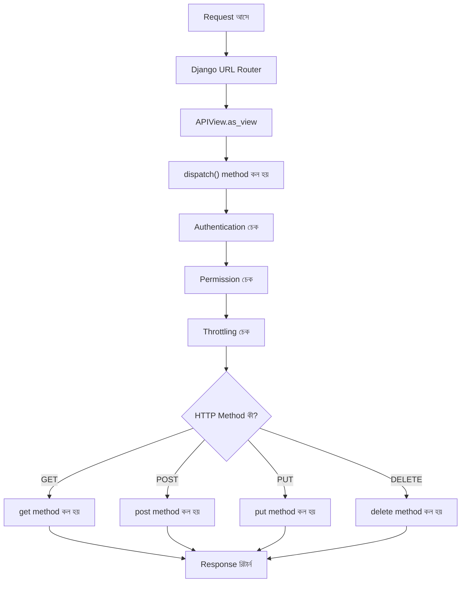
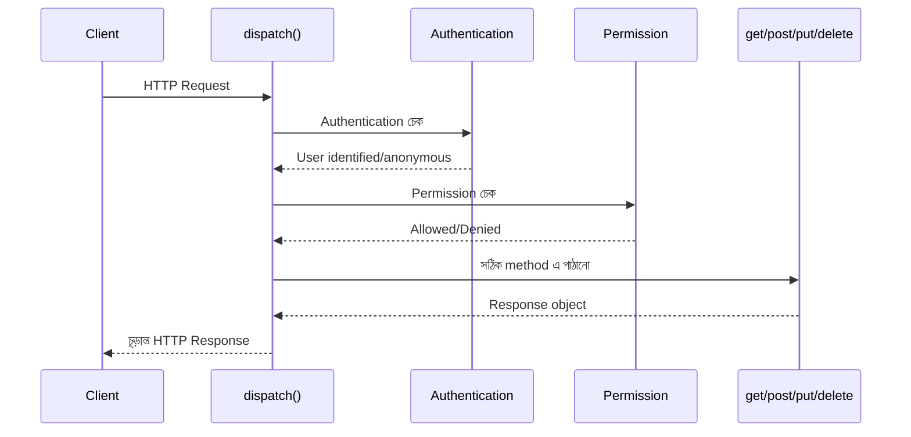

# Section 4: APIView

এতদিন আমরা শুধু Model বানিয়েছি — এখন প্রথমবারের মতো একটা **actual API endpoint** বানাব, যেটা দিয়ে client (Postman, browser, React app) আমাদের Blog data এর সাথে interact করতে পারবে। এই কাজের প্রথম এবং সবচেয়ে মৌলিক টুল হলো **APIView**।

---

## Why — কেন APIView দরকার?

Plain Django এ view লেখার জন্য `HttpResponse`/`JsonResponse` ব্যবহার করতে হয় — কিন্তু এতে REST API এর জন্য প্রয়োজনীয় অনেক কিছু (JSON parsing, content negotiation, authentication, ইত্যাদি) নিজে থেকে হাতে করতে হয়।

**APIView** হলো DRF এর সবচেয়ে মৌলিক (basic) view class — এটা Django এর সাধারণ `View` class এর একটা enhanced ভার্সন, যেটা REST API এর জন্য প্রয়োজনীয় জিনিসগুলো built-in ভাবে দেয়।

```
Django এর সাধারণ View                    DRF এর APIView

class PostView(View):                    class PostView(APIView):
    def get(self, request):                  def get(self, request):
        # নিজে থেকে JSON parse করতে হয়            # request.data এ ready-made
        # নিজে থেকে JsonResponse বানাতে হয়            JSON পাওয়া যায়
        # Authentication নিজে হ্যান্ডেল             # Authentication/Permission
        # করতে হয়                                   built-in ভাবে চেক হয়
```

---

## Analogy

APIView কে ভাবা যায় একটা **বিশেষ "রিসেপশনিস্ট"** হিসেবে, যে ভবনে (Django) ঢোকার সময় প্রতিটা ভিজিটরকে (request) আগে থেকেই নির্দিষ্ট নিয়মে যাচাই করে — সঠিক পরিচয়পত্র (authentication) আছে কিনা, প্রবেশাধিকার (permission) আছে কিনা — তারপরই ভিতরে ঢুকতে দেয়। সাধারণ Django `View` এ এই যাচাইয়ের কাজ তোমাকে নিজে করতে হতো।

---

## APIView এর Lifecycle



### `dispatch()` method এর ভূমিকা

DRF এর ভিতরে, প্রতিটা request প্রথমে `dispatch()` নামের একটা method দিয়ে যায় — এটাই Authentication, Permission, Throttling চেক করে, এবং তারপর নির্ধারণ করে ঠিক কোন method (`get`, `post`, ইত্যাদি) কল হবে HTTP method অনুযায়ী। এই `dispatch()` method টা DRF নিজে থেকেই সামলায় — আমাদের শুধু `get`, `post` এই ধরনের method গুলো লিখতে হয়।

---

## কোড: GET — সব Post এর তালিকা দেখা

```python
# blog/views.py

from rest_framework.views import APIView
from rest_framework.response import Response
from rest_framework import status
from .models import Post

class PostListAPIView(APIView):
    def get(self, request):
        posts = Post.objects.all()
        data = []
        for post in posts:
            data.append({
                "id": post.id,
                "title": post.title,
                "content": post.content,
                "author": post.author.username,
            })
        return Response(data, status=status.HTTP_200_OK)
```

### লাইন ব্যাখ্যা

- `from rest_framework.views import APIView` — DRF এর মূল view class import করা হচ্ছে
- `from rest_framework.response import Response` — DRF এর নিজস্ব `Response` object, যেটা automatic ভাবে content negotiation (JSON/Browsable API) সামলায়
- `def get(self, request)` — এই method automatic কল হবে যখন `GET` request আসবে
- `Post.objects.all()` — ORM দিয়ে Database থেকে সব Post নিয়ে আসা
- `Response(data, status=status.HTTP_200_OK)` — চূড়ান্ত JSON response, status code সহ

::: tip Django এর `JsonResponse` আর DRF এর `Response` এর পার্থক্য
`Response` শুধু plain dictionary/list দিয়েই কাজ করে না, এটা `content negotiation` করে — অর্থাৎ, browser এ দেখলে সুন্দর HTML UI (Browsable API), আর `Accept: application/json` header পাঠালে সরাসরি JSON রিটার্ন করে। `JsonResponse` এ এই সুবিধা নেই।
:::

---

## `urls.py` তে Connect করা

```python
# blog/urls.py

from django.urls import path
from .views import PostListAPIView

urlpatterns = [
    path('posts/', PostListAPIView.as_view(), name='post-list'),
]
```

::: warning
`.as_view()` লিখতে ভুলো না — Class-based view কে URL এ ব্যবহার করতে এটা বাধ্যতামূলক। শুধু `PostListAPIView` লিখলে error আসবে।
:::

---

## Request & Response — বাস্তব উদাহরণ

### Request

```
GET /api/posts/
```

### Response

```json
[
    {
        "id": 1,
        "title": "আমার প্রথম পোস্ট",
        "content": "এটা একটা টেস্ট পোস্ট।",
        "author": "rahim"
    }
]
```

---

## কোড: POST — নতুন Post তৈরি করা

```python
class PostListAPIView(APIView):
    def get(self, request):
        posts = Post.objects.all()
        data = [{"id": p.id, "title": p.title, "content": p.content} for p in posts]
        return Response(data, status=status.HTTP_200_OK)

    def post(self, request):
        title = request.data.get('title')
        content = request.data.get('content')

        if not title or not content:
            return Response(
                {"error": "title এবং content বাধ্যতামূলক।"},
                status=status.HTTP_400_BAD_REQUEST
            )

        post = Post.objects.create(
            title=title,
            content=content,
            author=request.user,
            slug=title.lower().replace(" ", "-")
        )

        return Response(
            {"id": post.id, "title": post.title, "message": "Post তৈরি হয়েছে।"},
            status=status.HTTP_201_CREATED
        )
```

### লাইন ব্যাখ্যা

- `request.data` — DRF এর নিজস্ব attribute, incoming JSON ডেটা এখানে automatic ভাবে parse হয়ে আসে (Django এর `request.POST` এর মতো শুধু form-data না, JSON ও সমর্থন করে)
- Manual validation (`if not title or not content`) — এটা basic, পরের chapter (Serializer) এ আমরা দেখব কীভাবে এই validation অনেক বেশি robust এবং কম কোডে করা যায়
- `status.HTTP_201_CREATED` — নতুন resource তৈরি হলে `201` status code দেওয়াই standard practice, `200` না

### Request

```
POST /api/posts/
Content-Type: application/json

{
    "title": "দ্বিতীয় পোস্ট",
    "content": "আরেকটা টেস্ট কনটেন্ট।"
}
```

### Response

```json
{
    "id": 2,
    "title": "দ্বিতীয় পোস্ট",
    "message": "Post তৈরি হয়েছে।"
}
```

---

## কোড: GET, PUT, PATCH, DELETE — একটা নির্দিষ্ট Post নিয়ে কাজ করা

```python
from rest_framework.exceptions import NotFound

class PostDetailAPIView(APIView):
    def get_object(self, pk):
        try:
            return Post.objects.get(pk=pk)
        except Post.DoesNotExist:
            raise NotFound("এই ID এর Post পাওয়া যায়নি।")

    def get(self, request, pk):
        post = self.get_object(pk)
        return Response({
            "id": post.id,
            "title": post.title,
            "content": post.content
        })

    def put(self, request, pk):
        post = self.get_object(pk)
        post.title = request.data.get('title', post.title)
        post.content = request.data.get('content', post.content)
        post.save()
        return Response({"message": "Post আপডেট হয়েছে।"})

    def delete(self, request, pk):
        post = self.get_object(pk)
        post.delete()
        return Response(status=status.HTTP_204_NO_CONTENT)
```

### লাইন ব্যাখ্যা

- `get_object(self, pk)` — একটা helper method, যেটা `pk` (primary key) দিয়ে নির্দিষ্ট Post খুঁজে বের করে; না পেলে DRF এর built-in `NotFound` exception raise করে, যেটা automatic ভাবে `404` response এ রূপান্তরিত হয়
- এই একই `get_object` method চারটা HTTP method (`get`, `put`, `delete`) এই reuse হচ্ছে — কোড পুনরাবৃত্তি এড়ানো হচ্ছে
- `HTTP_204_NO_CONTENT` — delete সফল হলে কোনো body দরকার নেই, শুধু status code যথেষ্ট

### `urls.py` তে যোগ করা

```python
urlpatterns = [
    path('posts/', PostListAPIView.as_view(), name='post-list'),
    path('posts/<int:pk>/', PostDetailAPIView.as_view(), name='post-detail'),
]
```

---

## Request-Response উদাহরণ (PUT)

### Request

```
PUT /api/posts/2/
Content-Type: application/json

{
    "title": "আপডেটেড শিরোনাম",
    "content": "আপডেটেড কনটেন্ট।"
}
```

### Response

```json
{
    "message": "Post আপডেট হয়েছে।"
}
```

---

## APIView এর ভিতরে কী ঘটছে — Internal Working



DRF এর `APIView` ক্লাস মূলত Django এর `View` ক্লাসকে override করে, এবং নিজের `dispatch()` method যুক্ত করে — এই override করা `dispatch()` ই DRF এর "জাদু" — Authentication, Permission, exception handling, content negotiation — সব এখানেই ঘটে, তারপর প্রকৃত `get`/`post`/`put`/`delete` method কল হয়।

---

## Common Mistakes

- `.as_view()` লিখতে ভুলে যাওয়া URL এ
- `Response` এর বদলে ভুলে `JsonResponse` ব্যবহার করা (Browsable API কাজ করবে না)
- Manual validation না করে সরাসরি `request.data['title']` ব্যবহার করা — key না থাকলে `KeyError` হয়ে সরাসরি `500` error আসবে, `get()` ব্যবহার করা নিরাপদ
- `get_object` এ `try/except` না রাখা — না থাকা object এর জন্য অস্পষ্ট `500` error আসবে, সঠিক `404` না

---

## Best Practices

- সবসময় নির্দিষ্ট, সঠিক status code ব্যবহার করো (`201` for create, `204` for delete)
- Validation logic যতটা সম্ভব আলাদা রাখো (পরের chapter এ Serializer দিয়ে এটা আরও পরিষ্কার হবে)
- Repeated logic (যেমন `get_object`) কে helper method এ বের করে আনো
- `request.data.get()` ব্যবহার করো, সরাসরি `[]` bracket দিয়ে key access না করে

---

## Interview Questions

**প্রশ্ন: `APIView` আর Django এর সাধারণ `View` এর মধ্যে পার্থক্য কী?**
> `APIView` হলো Django এর `View` এর একটা extended ভার্সন, যেটা REST API এর জন্য প্রয়োজনীয় জিনিস (JSON parsing, authentication, permission, content negotiation, DRF এর `Request`/`Response` object) built-in ভাবে দেয়।

**প্রশ্ন: `request.data` আর Django এর `request.POST` এর পার্থক্য কী?**
> `request.POST` শুধু form-encoded ডেটা পার্স করে, `request.data` JSON, form-data সহ যেকোনো content-type এর ডেটা automatic ভাবে পার্স করে।

**প্রশ্ন: `dispatch()` method কী কাজ করে?**
> এটা প্রতিটা incoming request এর জন্য প্রথমে কল হয়, Authentication/Permission/Throttling চেক করে, তারপর নির্ধারণ করে HTTP Method অনুযায়ী কোন method (`get`/`post` ইত্যাদি) কল হবে।

---

## Summary

- **APIView** হলো DRF এর সবচেয়ে মৌলিক view class, যেটা `dispatch()` এর মাধ্যমে Authentication, Permission, এবং method routing সামলায়
- `request.data` দিয়ে সহজে JSON ইনপুট পাওয়া যায়, `Response` দিয়ে সঠিক status code সহ output দেওয়া যায়
- GET (list ও detail), POST, PUT, DELETE — সবগুলো HTTP Method এর জন্য আলাদা method define করে handle করা হয়
- `get_object()` এর মতো helper method দিয়ে কোড পুনরাবৃত্তি এড়ানো যায়

এই chapter এ আমরা প্রতিটা কাজ **ম্যানুয়ালি** করেছি — validation, JSON conversion, সবকিছু হাতে লিখে। পরের chapter এ, **Serializer** দিয়ে আমরা দেখব কীভাবে এই একই কাজ অনেক কম কোডে, অনেক বেশি নির্ভরযোগ্যভাবে করা যায়।
