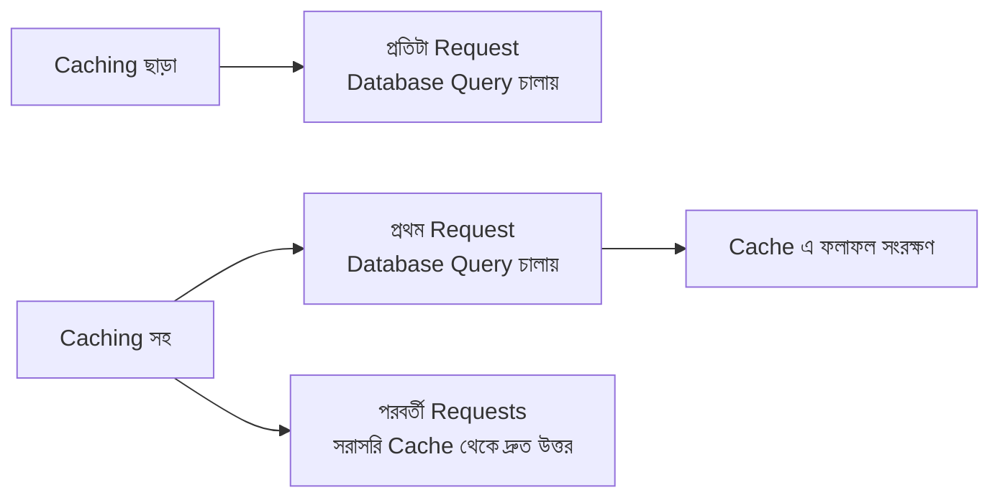
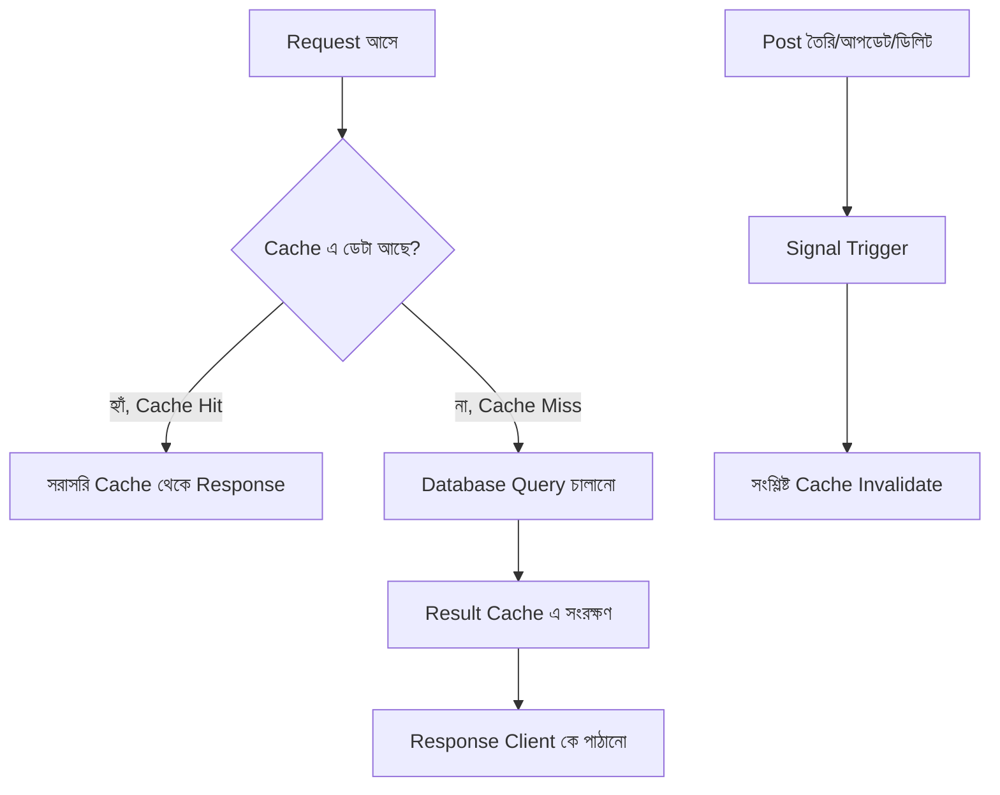

# Section 20: Caching

আগের chapter এ আমরা Performance নিয়ে কথা বলেছি (N+1 query সমাধান), এবং Throttling দিয়ে server কে অতিরিক্ত request থেকে বাঁচিয়েছি। এই chapter এ আমরা দেখব **Caching** কীভাবে বারবার একই ডেটা database থেকে না এনে, আরও দ্রুত response দিতে সাহায্য করে।

---

## Why — কেন Caching দরকার?

মনে করো, আমাদের Category লিস্ট (`/api/categories/`) খুব কম পরিবর্তন হয় — হয়তো মাসে একবার নতুন Category যোগ হয়। কিন্তু যদি প্রতি সেকেন্ডে ১০০ জন user এই endpoint কল করে, প্রতিবার database এ query চালানো অপ্রয়োজনীয় — কারণ ডেটা প্রায় সবসময়ই একই থাকে।



Caching হলো — একবার হিসাব করা ফলাফল **সাময়িকভাবে সংরক্ষণ** করে রাখা, যাতে বারবার একই কাজ (database query, জটিল গণনা) না করতে হয়।

---

## Cache Backend সেটআপ

Django একাধিক cache backend সাপোর্ট করে — development এ সহজ `LocMemCache`, production এ `Redis`।

### Development (দ্রুত, ছোট প্রজেক্ট)

```python
# settings.py
CACHES = {
    'default': {
        'BACKEND': 'django.core.cache.backends.locmem.LocMemCache',
    }
}
```

### Production (Redis — recommended)

```bash
pip install django-redis
```

```python
CACHES = {
    'default': {
        'BACKEND': 'django_redis.cache.RedisCache',
        'LOCATION': 'redis://127.0.0.1:6379/1',
        'OPTIONS': {
            'CLIENT_CLASS': 'django_redis.client.DefaultClient',
        }
    }
}
```

::: tip
আগের Throttling chapter এ যেমন বলেছিলাম — Redis একাধিক server instance এর মধ্যে shared cache দেয়, যেটা `LocMemCache` দিতে পারে না। Production এ সবসময় Redis (বা Memcached) ব্যবহার করা উচিত।
:::

---

## View-level Caching — `@cache_page`

```python
from django.utils.decorators import method_decorator
from django.views.decorators.cache import cache_page
from rest_framework import viewsets

class CategoryViewSet(viewsets.ReadOnlyModelViewSet):
    queryset = Category.objects.all()
    serializer_class = CategorySerializer

    @method_decorator(cache_page(60 * 15))  # ১৫ মিনিট
    def list(self, request, *args, **kwargs):
        return super().list(request, *args, **kwargs)
```

### লাইন ব্যাখ্যা

- `cache_page(60 * 15)` — এই response ১৫ মিনিট (৬০ সেকেন্ড × ১৫) এর জন্য cache করে রাখা হবে
- প্রথম request এ normal ভাবে database query চলবে এবং response cache এ সংরক্ষিত হবে
- পরবর্তী ১৫ মিনিটের মধ্যে যেকোনো একই request সরাসরি cache থেকে ফেরত আসবে, database এ কোনো query ছাড়াই

::: warning
`@cache_page` সরাসরি `ModelViewSet` এর `list()` method এ ব্যবহার করলে, এটা **সবার জন্য একই cached response** দেখাবে — যদি response user-specific হয় (যেমন "আমার নিজের Post"), তাহলে এই পদ্ধতি ভুল ডেটা দেখানোর ঝুঁকি তৈরি করে। শুধু public, non-personalized ডেটার জন্য এটা নিরাপদ।
:::

---

## Low-level Caching — নির্দিষ্ট নিয়ন্ত্রণ

যখন `@cache_page` এর চেয়ে বেশি precise নিয়ন্ত্রণ দরকার, Django এর cache API সরাসরি ব্যবহার করা যায়।

```python
from django.core.cache import cache
from rest_framework.views import APIView
from rest_framework.response import Response

class PopularPostsView(APIView):
    def get(self, request):
        cache_key = 'popular_posts'
        cached_data = cache.get(cache_key)

        if cached_data is not None:
            return Response(cached_data)

        posts = Post.objects.filter(is_published=True).order_by('-likes')[:10]
        serializer = PostSerializer(posts, many=True)
        data = serializer.data

        cache.set(cache_key, data, timeout=60 * 30)  # ৩০ মিনিট
        return Response(data)
```

### লাইন ব্যাখ্যা

- `cache.get(cache_key)` — প্রথমে cache এ ডেটা আছে কিনা চেক করা
- যদি cache এ থাকে (`cached_data is not None`), সরাসরি সেটা রিটার্ন করা — কোনো database query ছাড়াই
- না থাকলে, স্বাভাবিকভাবে database থেকে ডেটা এনে, **cache এ সংরক্ষণ করে** (`cache.set()`), তারপর client কে পাঠানো

এই প্যাটার্ন — **"cache-aside"** নামে পরিচিত — Low-level caching এর সবচেয়ে common ব্যবহার।

---

## Cache Invalidation — সবচেয়ে কঠিন সমস্যা

::: danger
কম্পিউটার সায়েন্সে একটা বিখ্যাত উক্তি আছে — *"There are only two hard things in Computer Science: cache invalidation and naming things."* Caching এর সবচেয়ে কঠিন অংশ হলো **কখন পুরনো cache মুছে ফেলতে হবে**, যাতে user পুরনো (stale) ডেটা না দেখে।
:::

### সমস্যা

যদি একটা নতুন Post তৈরি হয়, কিন্তু `popular_posts` এর cache এখনো আগের (পুরনো) ডেটা ধরে রেখেছে ৩০ মিনিটের জন্য — user নতুন Post টা দেখতে পাবে না, যতক্ষণ না cache expire হয়।

### সমাধান: Signal দিয়ে Cache Invalidate করা

```python
# blog/signals.py

from django.db.models.signals import post_save, post_delete
from django.dispatch import receiver
from django.core.cache import cache
from .models import Post

@receiver([post_save, post_delete], sender=Post)
def invalidate_post_cache(sender, **kwargs):
    cache.delete('popular_posts')
```

```python
# blog/apps.py
from django.apps import AppConfig

class BlogConfig(AppConfig):
    name = 'blog'

    def ready(self):
        import blog.signals
```

### লাইন ব্যাখ্যা

- `@receiver([post_save, post_delete], sender=Post)` — যখনই কোনো Post তৈরি, আপডেট, বা ডিলিট হয় (Django এর built-in signal ব্যবহার করে), এই function automatic কল হবে
- `cache.delete('popular_posts')` — সেই নির্দিষ্ট cache key মুছে ফেলা হচ্ছে, যাতে পরের request এ fresh ডেটা database থেকে আনা হয় এবং নতুন করে cache হয়
- `apps.py` এর `ready()` method এ signal import করা — Django কে জানানো এই signal গুলো চালু আছে

---

## Cache Key Strategy — গতিশীল Cache Key

শুধু একটা static string না, dynamic cache key ব্যবহার করে একই View এর জন্য বিভিন্ন প্যারামিটারের ফলাফল আলাদাভাবে cache করা যায়।

```python
class PostSearchView(APIView):
    def get(self, request):
        query = request.query_params.get('q', '')
        cache_key = f'post_search_{query}'

        cached_data = cache.get(cache_key)
        if cached_data is not None:
            return Response(cached_data)

        posts = Post.objects.filter(title__icontains=query)
        serializer = PostSerializer(posts, many=True)
        cache.set(cache_key, serializer.data, timeout=60 * 5)

        return Response(serializer.data)
```

এখানে প্রতিটা ভিন্ন `query` এর জন্য আলাদা `cache_key` (`post_search_django`, `post_search_python`, ইত্যাদি) তৈরি হচ্ছে — একে অপরের সাথে conflict করছে না।

---

## Caching এর সম্পূর্ণ Flow



---

## কোন ডেটা Cache করা উচিত (এবং কোনটা না)

| Cache করা উচিত | Cache করা উচিত না |
|---|---|
| Category/Tag লিস্ট (কম পরিবর্তনশীল) | User-specific ডেটা (personalized feed) |
| Popular/Trending Post (নির্দিষ্ট সময় পর পর আপডেট যথেষ্ট) | Real-time ডেটা (live notification count) |
| Public, ভারী গণনা-নির্ভর ফলাফল | Authentication-sensitive ডেটা |
| Static-ish configuration ডেটা | দ্রুত পরিবর্তনশীল ডেটা (stock price, live score) |

---

## Common Mistakes

- User-specific ডেটা `@cache_page` দিয়ে cache করা, যার ফলে একজন user আরেকজনের ডেটা দেখতে পারা (গুরুতর নিরাপত্তা সমস্যা)
- Cache invalidation ভুলে যাওয়া — ডেটা আপডেট হওয়ার পরও পুরনো cache রয়ে যাওয়া (stale data)
- সব endpoint এ ঢালাওভাবে caching প্রয়োগ করা, এমনকি যেসব ডেটা প্রায়ই পরিবর্তন হয় সেগুলোতেও
- Production এ `LocMemCache` ব্যবহার করা, যেখানে একাধিক server instance আছে

---

## Best Practices

- শুধু সেই ডেটা cache করো যেটা কম পরিবর্তনশীল এবং সবার জন্য একই (non-personalized)
- সবসময় একটা reasonable `timeout` সেট করো, চিরস্থায়ী cache না রেখে
- Signal ব্যবহার করে automatic cache invalidation নিশ্চিত করো, ম্যানুয়ালি মনে রাখার উপর নির্ভর না করে
- Production এ Redis ব্যবহার করো, এবং cache hit/miss ratio মনিটর করো performance বোঝার জন্য

---

## Interview Questions

**প্রশ্ন: Cache Invalidation কেন এত কঠিন সমস্যা বলা হয়?**
> কারণ ডেটা পরিবর্তন হলে ঠিক কোন cache entry গুলো stale হয়ে গেছে তা নির্ভুলভাবে চিহ্নিত করে মুছে ফেলা জটিল — খুব তাড়াতাড়ি মুছলে caching এর সুবিধা কমে যায়, দেরিতে মুছলে user ভুল/পুরনো ডেটা দেখে।

**প্রশ্ন: `@cache_page` কখন ব্যবহার করা উচিত না?**
> যখন response user-specific/personalized (যেমন "আমার প্রোফাইল," "আমার নোটিফিকেশন") — কারণ এটা প্রথম user এর response cache করে সবাইকে সেটাই দেখিয়ে দিতে পারে, যা একটা গুরুতর নিরাপত্তা ও প্রাইভেসি সমস্যা।

**প্রশ্ন: Signal দিয়ে Cache Invalidation কীভাবে কাজ করে?**
> Django এর `post_save`/`post_delete` signal ব্যবহার করে, যখনই কোনো Model instance তৈরি/আপডেট/ডিলিট হয়, একটা function automatic ভাবে trigger হয়ে সংশ্লিষ্ট cache key মুছে ফেলে — যাতে পরের request এ fresh ডেটা আসে।

---

## Summary

- **Caching** বারবার একই ডেটা গণনা/query না করে সাময়িকভাবে সংরক্ষিত ফলাফল থেকে দ্রুত response দেয়
- **`@cache_page`** — সহজ, view-level caching, কিন্তু শুধু non-personalized ডেটার জন্য নিরাপদ
- **Low-level caching (`cache.get`/`cache.set`)** — নির্দিষ্ট নিয়ন্ত্রণ দেয়, dynamic cache key দিয়ে বিভিন্ন প্যারামিটার আলাদাভাবে cache করা যায়
- **Cache Invalidation** সবচেয়ে কঠিন অংশ — Django Signal দিয়ে automatic ভাবে করা সবচেয়ে নির্ভরযোগ্য পদ্ধতি
- Production এ অবশ্যই **Redis** ব্যবহার করতে হবে, এবং শুধু কম-পরিবর্তনশীল, non-personalized ডেটাই cache করা উচিত

পরের chapter — **Section 21: Testing** — এ আমরা দেখব কীভাবে আমাদের এই পুরো Blog API এর জন্য নির্ভরযোগ্য automated test লেখা যায়।
