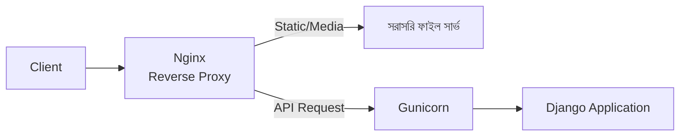
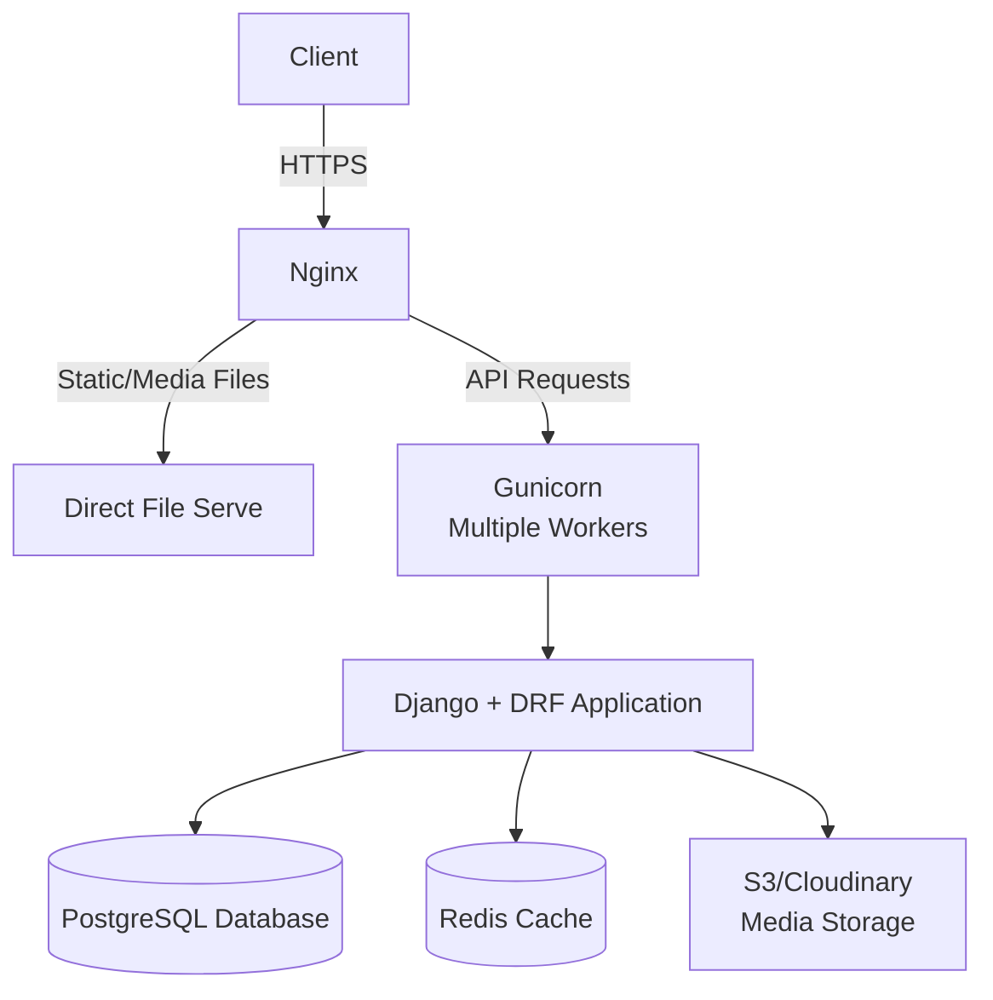

# Section 22: Deployment Best Practices

আমাদের Blog API ফিচার-সম্পূর্ণ এবং টেস্ট করা। এই chapter এ আমরা দেখব কীভাবে এটাকে **নিরাপদভাবে, নির্ভরযোগ্যভাবে production এ deploy** করতে হয় — development এর সেটআপ থেকে production এর সেটআপ কীভাবে আলাদা হওয়া উচিত।

---

## Why — Development আর Production এর সেটআপ কেন আলাদা হওয়া উচিত?

```
Development                              Production

DEBUG=True                                DEBUG=False
SQLite database                           PostgreSQL database
Django dev server                         Gunicorn/uWSGI + Nginx
সব origin থেকে CORS allow                 নির্দিষ্ট domain থেকে CORS allow
Secret key কোডে হার্ডকোড                  Environment variable থেকে secret key
```

Development সেটআপ সরাসরি production এ ব্যবহার করলে **গুরুতর নিরাপত্তা ঝুঁকি** এবং **performance সমস্যা** হয়।

---

## ধাপ ১: `DEBUG=False` করা

```python
# settings.py
DEBUG = False
ALLOWED_HOSTS = ['yourdomain.com', 'www.yourdomain.com']
```

::: danger
`DEBUG=True` অবস্থায় production এ কোনো error হলে, Django পুরো traceback, database credential, environment variable — সব কিছু browser এ দেখিয়ে দেয়। এটা attacker দের জন্য একটা "gift" — অবশ্যই production এ `DEBUG=False` করতে হবে।
:::

---

## ধাপ ২: Environment Variable ব্যবহার করা

কখনোই secret key, database password সরাসরি কোডে লিখবে না।

```bash
pip install python-decouple
```

```python
# settings.py
from decouple import config

SECRET_KEY = config('SECRET_KEY')
DEBUG = config('DEBUG', default=False, cast=bool)

DATABASES = {
    'default': {
        'ENGINE': 'django.db.backends.postgresql',
        'NAME': config('DB_NAME'),
        'USER': config('DB_USER'),
        'PASSWORD': config('DB_PASSWORD'),
        'HOST': config('DB_HOST'),
        'PORT': config('DB_PORT', default='5432'),
    }
}
```

```bash
# .env ফাইল (কখনো Git এ commit হবে না)
SECRET_KEY=তোমার-গোপন-key-এখানে
DEBUG=False
DB_NAME=blogapi_production
DB_USER=blogapi_user
DB_PASSWORD=খুবই-শক্তিশালী-পাসওয়ার্ড
DB_HOST=localhost
```

---

## ধাপ ৩: SQLite থেকে PostgreSQL এ স্থানান্তর

```python
DATABASES = {
    'default': {
        'ENGINE': 'django.db.backends.postgresql',
        'NAME': config('DB_NAME'),
        'USER': config('DB_USER'),
        'PASSWORD': config('DB_PASSWORD'),
        'HOST': config('DB_HOST'),
        'PORT': config('DB_PORT', default='5432'),
    }
}
```

```bash
pip install psycopg2-binary
```

### কেন SQLite Production এ উপযুক্ত না

| বৈশিষ্ট্য | SQLite | PostgreSQL |
|---|---|---|
| Concurrent write | সীমিত (একবারে একটা write) | ভালো (multiple concurrent write সাপোর্ট) |
| স্কেলেবিলিটি | ছোট প্রজেক্টের জন্য উপযুক্ত | বড়, high-traffic প্রজেক্টের জন্য ডিজাইন করা |
| Backup/Replication | সীমিত টুলিং | পরিপক্ব, production-grade টুলিং |

---

## ধাপ ৪: Static ও Media Files — Production Setup

```python
# settings.py
STATIC_URL = '/static/'
STATIC_ROOT = BASE_DIR / 'staticfiles'
```

```bash
python manage.py collectstatic
```

`collectstatic` সব app এর static file একটা জায়গায় (`STATIC_ROOT`) জমা করে, যেটা তখন Nginx বা একটা CDN দিয়ে সার্ভ করা হয় — Django নিজে static file সার্ভ করে না production এ।

### Media Files — External Storage

```bash
pip install django-storages boto3
```

```python
# settings.py — AWS S3 উদাহরণ
DEFAULT_FILE_STORAGE = 'storages.backends.s3boto3.S3Boto3Storage'
AWS_STORAGE_BUCKET_NAME = config('AWS_STORAGE_BUCKET_NAME')
AWS_S3_REGION_NAME = config('AWS_S3_REGION_NAME')
```

আগের **Upload chapter** এ যেমন বলেছিলাম — production এ media file server এর নিজস্ব disk এ না রেখে external storage (S3, Cloudinary) এ রাখা হয়, যাতে scaling এবং reliability ভালো থাকে।

---

## ধাপ ৫: WSGI Server — Gunicorn

Django এর built-in `runserver` শুধু development এর জন্য — এটা production-grade না (একবারে একটা মাত্র request handle করে, ধীরগতির)।

```bash
pip install gunicorn
```

```bash
gunicorn blogapi.wsgi:application --bind 0.0.0.0:8000 --workers 3
```

- `--workers 3` — একসাথে ৩টা worker process চালানো হচ্ছে, যাতে multiple request একসাথে handle করা যায়

---

## ধাপ ৬: Nginx — Reverse Proxy



Nginx কে সামনে রাখার কারণ:
- Static/Media file সরাসরি Nginx সার্ভ করে (Gunicorn/Django কে বিরক্ত না করে) — অনেক দ্রুত
- SSL/HTTPS handle করে
- একাধিক Gunicorn worker এর মধ্যে load balance করতে পারে
- Security layer হিসেবে কাজ করে (direct application access ব্লক করা)

---

## ধাপ ৭: CORS — নির্দিষ্ট Domain এ সীমাবদ্ধ করা

আগে development এ আমরা লিখেছিলাম:

```python
CORS_ALLOW_ALL_ORIGINS = True  # শুধু development এর জন্য
```

Production এ এটা **কখনোই** রাখা উচিত না।

```python
# settings.py (Production)
CORS_ALLOWED_ORIGINS = [
    "https://yourdomain.com",
    "https://www.yourdomain.com",
]
CORS_ALLOW_ALL_ORIGINS = False
```

::: danger
`CORS_ALLOW_ALL_ORIGINS = True` production এ রাখলে, **যেকোনো ওয়েবসাইট** তোমার API কল করতে পারবে — এটা data scraping এবং abuse এর দরজা খুলে দেয়।
:::

---

## ধাপ ৮: HTTPS বাধ্যতামূলক করা

```python
SECURE_SSL_REDIRECT = True
SESSION_COOKIE_SECURE = True
CSRF_COOKIE_SECURE = True
SECURE_HSTS_SECONDS = 31536000
```

- `SECURE_SSL_REDIRECT` — HTTP request কে automatic ভাবে HTTPS এ redirect করে
- `SECURE_HSTS_SECONDS` — Browser কে বলে দেয় ভবিষ্যতে সবসময় HTTPS দিয়েই যোগাযোগ করতে

---

## Deployment Checklist — সম্পূর্ণ তালিকা

| ✅ | কাজ |
|---|---|
| ☐ | `DEBUG = False` |
| ☐ | `SECRET_KEY` environment variable এ, কোডে হার্ডকোড না |
| ☐ | `ALLOWED_HOSTS` নির্দিষ্ট domain এ সীমাবদ্ধ |
| ☐ | PostgreSQL (SQLite না) |
| ☐ | `collectstatic` চালানো হয়েছে |
| ☐ | Media file external storage এ (S3/Cloudinary) |
| ☐ | Gunicorn/uWSGI দিয়ে সার্ভ করা হচ্ছে, `runserver` না |
| ☐ | Nginx reverse proxy হিসেবে সেটআপ করা |
| ☐ | `CORS_ALLOWED_ORIGINS` নির্দিষ্ট domain এ সীমাবদ্ধ |
| ☐ | HTTPS বাধ্যতামূলক (`SECURE_SSL_REDIRECT`) |
| ☐ | Redis cache backend (আগের chapter অনুযায়ী) |
| ☐ | সব test পাস করেছে (`python manage.py test`) |
| ☐ | Database backup strategy আছে |

---

## Deployment এর সম্পূর্ণ Architecture



---

## Common Mistakes

- Production এ `DEBUG=True` রেখে দেওয়া — সবচেয়ে সাধারণ এবং বিপজ্জনক ভুল
- `.env` ফাইল Git এ commit করে ফেলা (secret key/password leak হওয়া)
- `CORS_ALLOW_ALL_ORIGINS=True` production এ রেখে দেওয়া
- `runserver` দিয়ে সরাসরি production traffic সার্ভ করা
- Database backup strategy না রাখা

---

## Best Practices

- সবসময় Deployment Checklist অনুসরণ করো, প্রতিটা deploy এর আগে
- CI/CD pipeline সেটআপ করো, যাতে test পাস না করলে deploy না হয়
- Staging environment রাখো, production এ যাওয়ার আগে সেখানে টেস্ট করার জন্য
- Environment variable এর জন্য `.env.example` ফাইল রাখো (আসল মান ছাড়া), যাতে টিমের অন্যরা কী কী variable দরকার তা জানতে পারে

---

## Interview Questions

**প্রশ্ন: Production এ `DEBUG=True` রাখলে কী সমস্যা হতে পারে?**
> Error হলে Django পুরো traceback, sensitive settings, environment variable ব্রাউজারে দেখিয়ে দেয় — এটা attacker কে system সম্পর্কে গুরুত্বপূর্ণ তথ্য দিয়ে দেয়, যা exploit করা যেতে পারে।

**প্রশ্ন: কেন Gunicorn/Nginx দরকার, শুধু `runserver` কেন যথেষ্ট না?**
> `runserver` development এর জন্য ডিজাইন করা — এটা single-threaded, security hardening নেই, এবং static file efficient ভাবে সার্ভ করতে পারে না। Gunicorn multiple worker দিয়ে concurrent request handle করে, আর Nginx static file serving, SSL, এবং load balancing সামলায়।

**প্রশ্ন: কেন media file S3/Cloudinary এর মতো external storage এ রাখা উচিত, server এর local disk এ না?**
> Server এর local disk এ রাখলে, একাধিক server instance (horizontal scaling) এ ফাইল sync করা কঠিন হয়ে যায়, এবং server crash হলে ডেটা হারানোর ঝুঁকি থাকে। External storage এই সমস্যাগুলো এড়ায় এবং reliability বাড়ায়।

---

## Summary

- Production সেটআপ development থেকে **মৌলিকভাবে আলাদা** হওয়া উচিত — `DEBUG=False`, environment variable, PostgreSQL, external storage
- **Gunicorn** (WSGI server) + **Nginx** (reverse proxy) — এই কম্বিনেশন production এর standard architecture
- **CORS, HTTPS, Secret Key** — নিরাপত্তার তিনটা গুরুত্বপূর্ণ দিক, যেগুলো ভুলে গেলে গুরুতর ঝুঁকি তৈরি হয়
- একটা সম্পূর্ণ **Deployment Checklist** অনুসরণ করা উচিত প্রতিটা deploy এর আগে

পরের chapter — **Section 23: Security** — এ আমরা আরও গভীরভাবে দেখব API কে সাধারণ আক্রমণ (SQL injection, XSS, ইত্যাদি) থেকে কীভাবে সুরক্ষিত রাখতে হয়।
