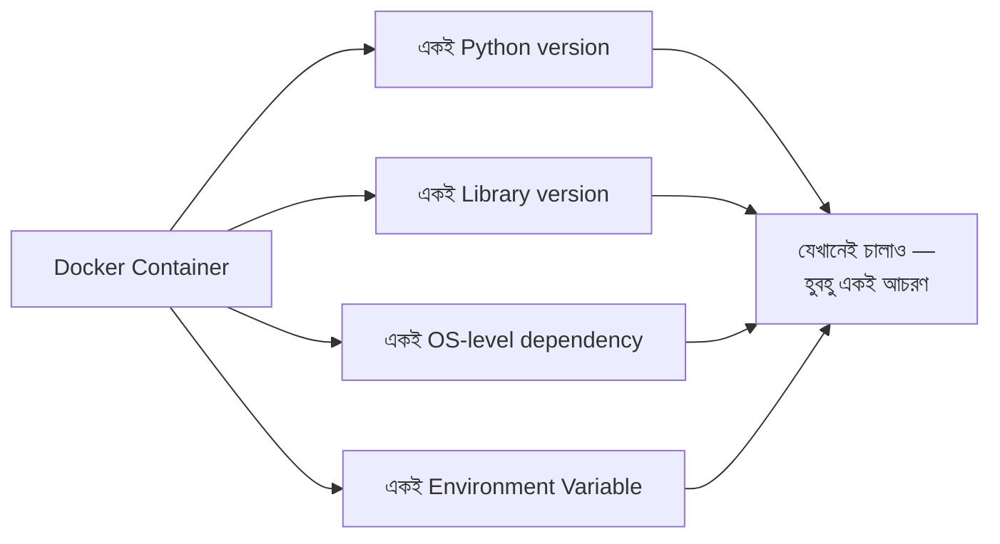
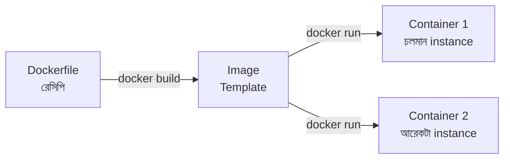
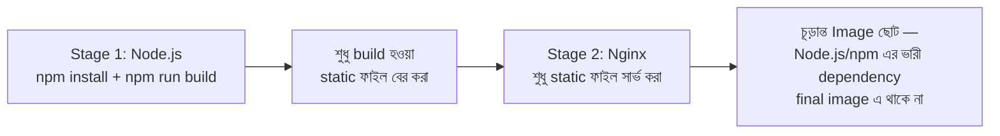
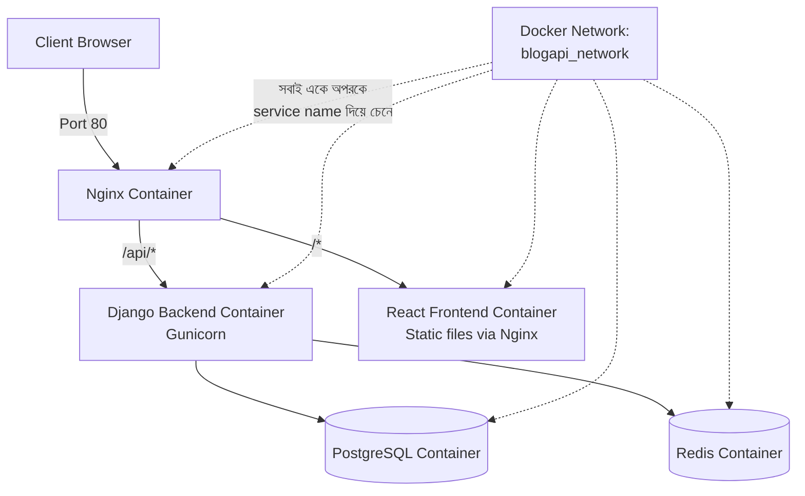

# DRF + React Full Stack প্রজেক্ট Dockerize করা — সম্পূর্ণ গাইড

এই chapter এ আমরা দেখব কীভাবে একটা সম্পূর্ণ **Django REST Framework (Backend) + React (Frontend)** প্রজেক্টকে Docker দিয়ে containerize করতে হয় — একদম concept থেকে শুরু করে production-ready setup পর্যন্ত।

---

## Docker কী, এবং কেন দরকার?

### সমস্যা: "আমার কম্পিউটারে তো চলছিল!"

```
Developer এর কম্পিউটার:                    Server/অন্য Developer এর কম্পিউটার:

Python 3.11                                Python 3.9
PostgreSQL 15                              PostgreSQL 13
Node.js 20                                 Node.js 16
→ সব ঠিকমতো চলছে                            → Version conflict, dependency missing,
                                              "এটা তো আমার এখানে চলছিল!" সমস্যা
```

এই সমস্যাটাকে বলা হয় **"works on my machine"** সমস্যা — একজন developer এর environment এ কাজ করা কোড আরেকজনের environment এ, বা production server এ ভিন্নভাবে আচরণ করে, কারণ underlying software version, OS, configuration আলাদা।

### সমাধান: Docker

**Docker** একটা **container** এর মধ্যে পুরো application এবং তার সব dependency (Python version, library, environment variable — সবকিছু) প্যাক করে দেয়। এই container যেকোনো কম্পিউটারে (developer এর ল্যাপটপ, staging server, production server) **হুবহু একইভাবে** চলে।



---

## Image vs Container — মূল পার্থক্য

| টার্ম | মানে |
|---|---|
| **Dockerfile** | একটা text ফাইল, যেটা বলে দেয় image কীভাবে বানাতে হবে (recipe/নির্দেশনা) |
| **Image** | Dockerfile থেকে তৈরি হওয়া একটা "snapshot" — application + সব dependency সহ (একটা read-only template) |
| **Container** | Image থেকে **চালু (running)** হওয়া একটা actual instance — এটাই সত্যিকারের চলমান application |

### Analogy

**Dockerfile** = রান্নার রেসিপি, **Image** = রেসিপি অনুযায়ী বানানো একটা কেক এর ছাঁচ (mold), **Container** = সেই ছাঁচ দিয়ে বানানো একটা actual কেক, যেটা তুমি খেতে পারো (ব্যবহার করতে পারো)। একটা Image থেকে একাধিক Container চালানো যায় — ঠিক যেমন একটা ছাঁচ দিয়ে একাধিক কেক বানানো যায়।



---

## প্রজেক্ট Structure

আমাদের সম্পূর্ণ full-stack প্রজেক্ট এভাবে সাজানো থাকবে:

```
myproject/
├── backend/                  ← Django + DRF
│   ├── blogapi/
│   ├── blog/
│   ├── manage.py
│   ├── requirements.txt
│   └── Dockerfile
├── frontend/                  ← React
│   ├── src/
│   ├── package.json
│   └── Dockerfile
├── nginx/
│   └── nginx.conf
└── docker-compose.yml           ← সবকিছু একসাথে চালানোর নির্দেশনা
```

---

## Backend Dockerfile — Django/DRF

```dockerfile
# backend/Dockerfile

FROM python:3.11-slim

WORKDIR /app

ENV PYTHONDONTWRITEBYTECODE=1
ENV PYTHONUNBUFFERED=1

RUN apt-get update && apt-get install -y \
    libpq-dev \
    gcc \
    && rm -rf /var/lib/apt/lists/*

COPY requirements.txt .
RUN pip install --no-cache-dir -r requirements.txt

COPY . .

RUN python manage.py collectstatic --noinput

EXPOSE 8000

CMD ["gunicorn", "blogapi.wsgi:application", "--bind", "0.0.0.0:8000", "--workers", "3"]
```

### প্রতিটা লাইন ব্যাখ্যা

| লাইন | কাজ |
|---|---|
| `FROM python:3.11-slim` | Base image — Python 3.11 এর একটা lightweight ভার্সন দিয়ে শুরু করা |
| `WORKDIR /app` | Container এর ভিতরে working directory সেট করা |
| `ENV PYTHONDONTWRITEBYTECODE=1` | Python কে `.pyc` ফাইল তৈরি করতে না দেওয়া (container এ অপ্রয়োজনীয়) |
| `ENV PYTHONUNBUFFERED=1` | Python এর output সরাসরি terminal এ দেখানো (logging এর জন্য জরুরি) |
| `RUN apt-get install libpq-dev gcc` | PostgreSQL driver কম্পাইল করার জন্য প্রয়োজনীয় system dependency |
| `COPY requirements.txt .` | শুধু requirements.txt আগে কপি করা |
| `RUN pip install ...` | Dependency ইনস্টল করা |
| `COPY . .` | বাকি সব কোড কপি করা |
| `CMD [...]` | Container চালু হলে যে কমান্ড চলবে — এখানে Gunicorn দিয়ে সার্ভার চালু |

::: tip গুরুত্বপূর্ণ কৌশল: `requirements.txt` আগে কপি করা কেন?
Docker প্রতিটা লাইনকে "layer" হিসেবে cache করে। যদি `COPY . .` আগে করো এবং কোড পরিবর্তন হয়, পুরো `pip install` আবার চালাতে হবে (ধীর)। কিন্তু `requirements.txt` আলাদা করে আগে কপি করলে — শুধু dependency পরিবর্তন হলেই `pip install` আবার চলবে, শুধু কোড পরিবর্তনে না — এতে build অনেক দ্রুত হয়।
:::

---

## Frontend Dockerfile — React (Multi-stage Build)

```dockerfile
# frontend/Dockerfile

# ---- Stage 1: Build ----
FROM node:20-alpine AS build

WORKDIR /app

COPY package.json package-lock.json ./
RUN npm install

COPY . .
RUN npm run build

# ---- Stage 2: Serve ----
FROM nginx:alpine

COPY --from=build /app/dist /usr/share/nginx/html
COPY nginx.conf /etc/nginx/conf.d/default.conf

EXPOSE 80

CMD ["nginx", "-g", "daemon off;"]
```

### Multi-stage Build কেন ব্যবহার করা হচ্ছে



React app কে চালাতে Node.js/npm এর দরকার শুধু **build করার সময়**, কিন্তু চূড়ান্ত production এ শুধু static HTML/CSS/JS ফাইল লাগে, যেটা Nginx দিয়ে সার্ভ করাই যথেষ্ট এবং অনেক efficient। Multi-stage build এই দুই ধাপকে আলাদা করে — শেষ image এ শুধু Nginx + build হওয়া ফাইল থাকে, ভারী Node.js dependency বাদ যায়।

::: tip
Multi-stage build ছাড়া চূড়ান্ত image এ Node.js, npm, node_modules — সবকিছু থেকে যেত, যেটা image এর আকার কয়েকশো MB বাড়িয়ে দিতে পারত। Multi-stage build দিয়ে এই একই কাজ ২০-৩০ MB এর মধ্যে সম্পন্ন হয়।
:::

---

## `docker-compose.yml` — সবকিছু একসাথে চালানো

Django, React, PostgreSQL, Redis — একাধিক service একসাথে সমন্বিতভাবে চালাতে `docker-compose` ব্যবহার করা হয়।

```yaml
# docker-compose.yml

version: '3.9'

services:
  db:
    image: postgres:15
    environment:
      POSTGRES_DB: blogapi
      POSTGRES_USER: blogapi_user
      POSTGRES_PASSWORD: ${DB_PASSWORD}
    volumes:
      - postgres_data:/var/lib/postgresql/data
    networks:
      - blogapi_network

  redis:
    image: redis:7-alpine
    networks:
      - blogapi_network

  backend:
    build: ./backend
    command: gunicorn blogapi.wsgi:application --bind 0.0.0.0:8000
    volumes:
      - static_volume:/app/staticfiles
      - media_volume:/app/media
    env_file:
      - ./backend/.env
    depends_on:
      - db
      - redis
    networks:
      - blogapi_network

  frontend:
    build: ./frontend
    networks:
      - blogapi_network

  nginx:
    image: nginx:alpine
    ports:
      - "80:80"
    volumes:
      - ./nginx/nginx.conf:/etc/nginx/conf.d/default.conf
      - static_volume:/app/staticfiles
      - media_volume:/app/media
    depends_on:
      - backend
      - frontend
    networks:
      - blogapi_network

volumes:
  postgres_data:
  static_volume:
  media_volume:

networks:
  blogapi_network:
    driver: bridge
```

### প্রতিটা অংশের ব্যাখ্যা

| Concept | ব্যাখ্যা |
|---|---|
| **`services`** | প্রতিটা container কে একটা "service" হিসেবে define করা হয় |
| **`build: ./backend`** | এই folder এর `Dockerfile` ব্যবহার করে image build করা হবে |
| **`volumes`** | Container ডিলিট হয়ে গেলেও ডেটা যেন হারিয়ে না যায় (যেমন database ডেটা, media file), এর জন্য disk এ persist করা |
| **`env_file`** | `.env` ফাইল থেকে environment variable লোড করা |
| **`depends_on`** | নির্দিষ্ট করা কোন service কোনটার আগে চালু হবে (যেমন backend চালু হওয়ার আগে database চালু থাকা দরকার) |
| **`networks`** | একটা virtual network, যেখানে সব container একে অপরের সাথে service-name দিয়ে কথা বলতে পারে |

---

## Container-to-Container Communication — কীভাবে একে অপরকে চেনে


Docker Compose এ প্রতিটা service কে তার **নাম দিয়ে** অন্য service থেকে অ্যাক্সেস করা যায় — `localhost` না।

```python
# backend/.env
DB_HOST=db          # "db" — docker-compose.yml এ service এর নাম, IP address না!
REDIS_URL=redis://redis:6379/1   # "redis" — একইভাবে service name
```

::: tip
এটাই Docker networking এর সবচেয়ে গুরুত্বপূর্ণ ধারণা — প্রতিটা service একে অপরকে তাদের `docker-compose.yml` এ দেওয়া নামে চেনে, যেন সেটাই তাদের hostname। `db` লিখলে Docker automatic ভাবে সেটাকে database container এর ভিতরের IP address এ resolve করে দেয়।
:::

---

## Nginx Configuration — Backend আর Frontend কে একসাথে Route করা

```nginx
# nginx/nginx.conf

server {
    listen 80;

    location /api/ {
        proxy_pass http://backend:8000/api/;
        proxy_set_header Host $host;
        proxy_set_header X-Real-IP $remote_addr;
    }

    location /admin/ {
        proxy_pass http://backend:8000/admin/;
    }

    location /static/ {
        alias /app/staticfiles/;
    }

    location /media/ {
        alias /app/media/;
    }

    location / {
        proxy_pass http://frontend:80/;
    }
}
```

### লাইন ব্যাখ্যা

- `location /api/` — `/api/` দিয়ে শুরু হওয়া যেকোনো request Django backend এ পাঠানো হবে
- `location /` — বাকি সব request (React app) frontend container এ পাঠানো হবে
- `proxy_pass http://backend:8000` — এখানেও `backend` হলো service name, IP না

এভাবে একটা মাত্র entry point (Nginx, port 80) দিয়ে client উভয় Backend API এবং Frontend UI অ্যাক্সেস করতে পারে, যদিও ভিতরে ভিতরে এরা সম্পূর্ণ আলাদা container।

---

## প্রজেক্ট চালানো

```bash
docker-compose up --build
```

```bash
# Background এ চালাতে
docker-compose up -d --build

# Migration চালানো (backend container এর ভিতরে)
docker-compose exec backend python manage.py migrate

# Superuser তৈরি
docker-compose exec backend python manage.py createsuperuser

# Log দেখা
docker-compose logs -f backend

# সব বন্ধ করা
docker-compose down
```

### `docker-compose exec` কেন ব্যবহার করা হয়

Migration/createsuperuser এর মতো কমান্ড সরাসরি host machine থেকে চালানো যায় না, কারণ database driver, Python environment — সবকিছু container এর ভিতরে। `docker-compose exec backend <command>` দিয়ে সেই running container এর ভিতরে গিয়ে কমান্ড execute করা হয়।

---

## Development vs Production Compose File

Development এ আমরা চাই code পরিবর্তন সাথে সাথে reflect হোক (hot reload), কিন্তু Production এ আমরা চাই optimized, static build। এর জন্য আলাদা কনফিগারেশন রাখা ভালো।

```yaml
# docker-compose.dev.yml (development এর জন্য)
services:
  backend:
    build: ./backend
    command: python manage.py runserver 0.0.0.0:8000
    volumes:
      - ./backend:/app     # Local কোড সরাসরি container এ mount করা — সাথে সাথে পরিবর্তন দেখা যায়
    ports:
      - "8000:8000"
```

```bash
docker-compose -f docker-compose.dev.yml up
```

::: warning
Production `docker-compose.yml` এ কখনো `volumes: - ./backend:/app` এর মতো local code mount রাখবে না — Production এ image এর ভিতরের কোডই ব্যবহার করা উচিত, live-mounted local code না, যাতে deployment predictable এবং consistent থাকে।
:::

---

## Environment Variables — Secret নিরাপদে রাখা

```yaml
# docker-compose.yml
services:
  backend:
    env_file:
      - ./backend/.env
```

```bash
# backend/.env (কখনো Git এ commit হবে না)
SECRET_KEY=তোমার-secret-key
DB_PASSWORD=strong-password
DEBUG=False
```

```bash
# .gitignore
.env
*.env
```

আগের **Deployment chapter** এ শেখা একই নীতি এখানেও প্রযোজ্য — secret কখনো কোডে বা Dockerfile এ হার্ডকোড করা হয় না, `.env` ফাইল দিয়ে ইনজেক্ট করা হয়।

---

## সম্পূর্ণ Architecture — Dockerized Full Stack



---

## Common Mistakes

- Multi-stage build ব্যবহার না করে React Dockerfile এ Node.js dependency সহ পুরো image production এ রেখে দেওয়া — অপ্রয়োজনীয় বড় image
- `requirements.txt` কপি করার আগে পুরো কোড কপি করা, যার ফলে Docker layer caching এর সুবিধা না পাওয়া (প্রতিবার rebuild ধীর হয়)
- `docker-compose.yml` এ `localhost` ব্যবহার করা service নামের বদলে, যার ফলে container একে অপরকে খুঁজে না পাওয়া
- `.env` ফাইল Git এ commit করে ফেলা
- Volume ব্যবহার না করে database container চালানো — container রিস্টার্ট হলে সব ডেটা হারিয়ে যাওয়া

---

## Best Practices

- সবসময় `.dockerignore` ফাইল রাখো (`node_modules`, `venv`, `.git`, `__pycache__` বাদ দিতে), যাতে অপ্রয়োজনীয় ফাইল image এ না ঢোকে
- Multi-stage build ব্যবহার করো frontend এবং যেকোনো compiled/built application এর জন্য
- Development ও Production এর জন্য আলাদা `docker-compose` ফাইল রাখো
- Persistent ডেটা (database, media) সবসময় named volume এ রাখো, container এর ভিতরে না
- Image এর size ছোট রাখতে `-slim` বা `-alpine` base image ব্যবহার করো, যেখানে সম্ভব

```bash
# .dockerignore
node_modules
venv
__pycache__
*.pyc
.env
.git
media/
staticfiles/
```

---

## Interview Questions

**প্রশ্ন: Image আর Container এর মধ্যে পার্থক্য কী?**
> Image হলো একটা read-only template/blueprint (Dockerfile থেকে তৈরি)। Container হলো সেই Image থেকে চালু হওয়া একটা running instance — একটা Image থেকে একাধিক Container চালানো যায়।

**প্রশ্ন: Multi-stage Build কেন ব্যবহার করা হয়?**
> চূড়ান্ত production image এর আকার ছোট রাখার জন্য — build করার জন্য প্রয়োজনীয় ভারী টুল (Node.js, compiler) এবং চূড়ান্ত runtime environment কে আলাদা "stage" এ ভাগ করে, শেষে শুধু প্রয়োজনীয় output রাখা হয়।

**প্রশ্ন: Docker Compose এ একটা container আরেকটা container কে কীভাবে খুঁজে পায়?**
> `docker-compose.yml` এ দেওয়া service name দিয়ে — Docker একটা internal network তৈরি করে, যেখানে প্রতিটা service নাম দিয়েই hostname হিসেবে কাজ করে (যেমন `db`, `redis`, `backend`)।

**প্রশ্ন: Volume কেন ব্যবহার করা হয়?**
> Container সাধারণত ephemeral (অস্থায়ী) — container ডিলিট/রিস্টার্ট হলে তার ভিতরের ডেটা হারিয়ে যায়। Volume ব্যবহার করে ডেটা (database, uploaded file) কে container এর জীবনচক্রের বাইরে, host machine এ persist করে রাখা হয়।

---

## Summary

- **Docker** পুরো application (কোড + dependency + environment) কে একটা consistent, portable container এ প্যাক করে, "works on my machine" সমস্যা সমাধান করে
- **Dockerfile** → **Image** → **Container** — এই তিনটার সম্পর্ক (রেসিপি → ছাঁচ → actual কেক)
- **Backend Dockerfile** এ layer caching optimize করতে `requirements.txt` আগে কপি করা হয়
- **Frontend Dockerfile** এ **Multi-stage Build** ব্যবহার করে ছোট, efficient production image বানানো হয়
- **`docker-compose.yml`** দিয়ে একাধিক service (Backend, Frontend, Database, Redis, Nginx) কে একসাথে সমন্বিতভাবে চালানো যায়
- Container রা একে অপরকে **service name** দিয়ে চেনে, `localhost` দিয়ে না
- **Volume** দিয়ে persistent ডেটা সংরক্ষণ করা হয়, container এর অস্থায়ী জীবনচক্রের বাইরে
- Development এবং Production এর জন্য আলাদা compose configuration রাখা উচিত

এই একই ধারণাগুলো — image/container, multi-stage build, service networking, volume — যেকোনো full-stack প্রজেক্ট Dockerize করার সময় প্রযোজ্য, শুধু Django/React না।
