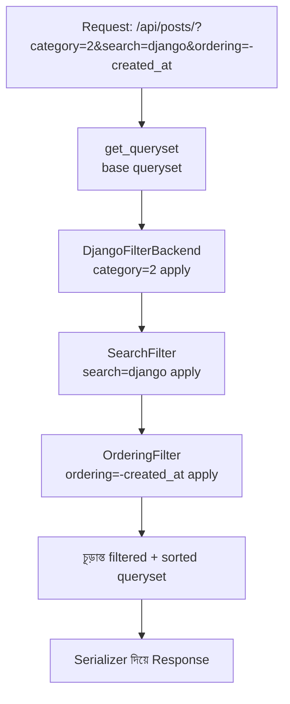

# Section 12: Filtering

আগের chapter গুলোতে আমরা `/api/posts/` কল করলে **সব** Post ফেরত পেতাম। কিন্তু বাস্তব application এ user প্রায়ই নির্দিষ্ট শর্ত অনুযায়ী ডেটা খুঁজতে চায় — যেমন শুধু "Technology" category এর Post, বা title এ "Django" শব্দ আছে এমন Post। এই chapter এ আমরা দেখব **Search, Ordering, এবং Filtering** কীভাবে API তে যোগ করতে হয়।

---

## Why — কেন Filtering দরকার?

Filtering ছাড়া, client কে **সব ডেটা** নিয়ে এসে নিজে থেকে filter করতে হতো — এটা অপচয়ী (বেশি ডেটা transfer) এবং ধীরগতির। Filtering সরাসরি database level এ query করে, শুধু প্রয়োজনীয় ডেটা রিটার্ন করে।

```
Filtering ছাড়া:                          Filtering সহ:

GET /api/posts/                          GET /api/posts/?category=technology
→ সব ১০০০টা Post আসে                     → শুধু matching ৫০টা Post আসে
→ Client নিজে filter করে
```

---

## DRF এর তিন ধরনের Filter Backend

| Backend | কাজ | Query Parameter উদাহরণ |
|---|---|---|
| `SearchFilter` | নির্দিষ্ট field এ keyword খোঁজা | `?search=django` |
| `OrderingFilter` | ফলাফল sort করা | `?ordering=-created_at` |
| `DjangoFilterBackend` | নির্দিষ্ট field এর exact/range মান দিয়ে filter করা | `?category=2&is_published=true` |

---

## Setup

```bash
pip install django-filter
```

```python
# settings.py
INSTALLED_APPS = [
    # ...
    'django_filters',
]

REST_FRAMEWORK = {
    'DEFAULT_FILTER_BACKENDS': [
        'django_filters.rest_framework.DjangoFilterBackend',
        'rest_framework.filters.SearchFilter',
        'rest_framework.filters.OrderingFilter',
    ]
}
```

---

## SearchFilter — Keyword Search

```python
from rest_framework import viewsets, filters
from .models import Post
from .serializers import PostSerializer

class PostViewSet(viewsets.ModelViewSet):
    queryset = Post.objects.all()
    serializer_class = PostSerializer
    filter_backends = [filters.SearchFilter]
    search_fields = ['title', 'content']
```

### লাইন ব্যাখ্যা

- `search_fields = ['title', 'content']` — এই দুইটা field এ keyword খোঁজা হবে
- Request: `GET /api/posts/?search=django` — যেসব Post এর `title` অথবা `content` এ "django" শব্দ আছে, সেগুলো রিটার্ন হবে (case-insensitive, partial match)

### Search Field এর বিশেষ Prefix

| Prefix | মানে | উদাহরণ |
|---|---|---|
| (কিছু না) | Case-insensitive partial match (ডিফল্ট) | `'title'` |
| `^` | শুরুতে match (startswith) | `'^title'` |
| `=` | সম্পূর্ণ মিল (exact match) | `'=title'` |
| `@` | Full-text search (PostgreSQL এ) | `'@content'` |

---

## OrderingFilter — Sort করা

```python
class PostViewSet(viewsets.ModelViewSet):
    queryset = Post.objects.all()
    serializer_class = PostSerializer
    filter_backends = [filters.OrderingFilter]
    ordering_fields = ['created_at', 'title']
    ordering = ['-created_at']  # ডিফল্ট order
```

### Request উদাহরণ

```
GET /api/posts/?ordering=title              → title অনুযায়ী A-Z
GET /api/posts/?ordering=-created_at          → নতুন থেকে পুরনো (- মানে descending)
GET /api/posts/?ordering=title,-created_at    → একাধিক field দিয়ে একসাথে sort
```

---

## DjangoFilterBackend — Exact Field Filtering

```python
class PostViewSet(viewsets.ModelViewSet):
    queryset = Post.objects.all()
    serializer_class = PostSerializer
    filter_backends = [DjangoFilterBackend]
    filterset_fields = ['category', 'is_published', 'author']
```

### Request উদাহরণ

```
GET /api/posts/?category=2
GET /api/posts/?is_published=true
GET /api/posts/?category=2&is_published=true    → একসাথে একাধিক শর্ত (AND)
```

---

## তিনটা একসাথে ব্যবহার করা

```python
from django_filters.rest_framework import DjangoFilterBackend
from rest_framework import filters

class PostViewSet(viewsets.ModelViewSet):
    queryset = Post.objects.all()
    serializer_class = PostSerializer
    filter_backends = [DjangoFilterBackend, filters.SearchFilter, filters.OrderingFilter]
    filterset_fields = ['category', 'is_published']
    search_fields = ['title', 'content']
    ordering_fields = ['created_at', 'title']
```

### সব একসাথে ব্যবহার — Request উদাহরণ

```
GET /api/posts/?category=2&search=django&ordering=-created_at
```

এই একটা request এ:
1. শুধু `category=2` এর Post
2. তার মধ্যে `title`/`content` এ "django" আছে এমন
3. নতুন থেকে পুরনো ক্রমে sorted

---

## Custom FilterSet — জটিল Filtering (Range, ইত্যাদি)

কখনো কখনো শুধু exact match যথেষ্ট না — যেমন একটা তারিখ range এর মধ্যে Post খোঁজা। এর জন্য `FilterSet` class বানাতে হয়।

```python
# blog/filters.py

import django_filters
from .models import Post

class PostFilter(django_filters.FilterSet):
    created_after = django_filters.DateFilter(field_name='created_at', lookup_expr='gte')
    created_before = django_filters.DateFilter(field_name='created_at', lookup_expr='lte')
    title_contains = django_filters.CharFilter(field_name='title', lookup_expr='icontains')

    class Meta:
        model = Post
        fields = ['category', 'is_published']
```

```python
class PostViewSet(viewsets.ModelViewSet):
    queryset = Post.objects.all()
    serializer_class = PostSerializer
    filter_backends = [DjangoFilterBackend]
    filterset_class = PostFilter
```

### লাইন ব্যাখ্যা

- `lookup_expr='gte'` — "greater than or equal" (`>=`), তারিখ range এর শুরু নির্ধারণ করতে
- `lookup_expr='lte'` — "less than or equal" (`<=`), তারিখ range এর শেষ নির্ধারণ করতে
- `lookup_expr='icontains'` — case-insensitive partial match (SearchFilter এর মতোই, কিন্তু নির্দিষ্ট field এ)

### Request উদাহরণ

```
GET /api/posts/?created_after=2026-01-01&created_before=2026-06-30
GET /api/posts/?title_contains=django
```

---

## Custom Filtering — `get_queryset()` override করে

কখনো কখনো URL query parameter না, বরং logged-in user এর অবস্থা অনুযায়ী dynamic filtering দরকার হয়।

```python
class PostViewSet(viewsets.ModelViewSet):
    serializer_class = PostSerializer
    filter_backends = [DjangoFilterBackend, filters.SearchFilter]
    filterset_fields = ['category']
    search_fields = ['title']

    def get_queryset(self):
        queryset = Post.objects.all()
        if self.request.user.is_authenticated:
            return queryset
        return queryset.filter(is_published=True)
```

এখানে — login করা user সব Post (published + unpublished) দেখতে পাবে, কিন্তু anonymous user শুধু published Post দেখতে পাবে। এই logic filter backend দিয়ে না, `get_queryset()` override করে করা হয়েছে।

---

## Filtering এর Internal Flow



প্রতিটা `filter_backend` ধারাবাহিকভাবে queryset কে refine করে — একটার output পরেরটার input হয়, exactly যেমন আমরা LangChain এ Chain দেখেছিলাম!

---

## Filtering Types — সারসংক্ষেপ তুলনা

| Type | কী করে | কখন ব্যবহার করবে |
|---|---|---|
| `SearchFilter` | একাধিক field এ keyword খোঁজা | সাধারণ text search বক্স |
| `OrderingFilter` | ফলাফল sort করা | "Newest first", "A-Z" এর মতো sort অপশন |
| `DjangoFilterBackend` | নির্দিষ্ট field এর exact/range মান | Category filter, checkbox filter |
| Custom `FilterSet` | জটিল range/pattern filtering | তারিখ range, complex condition |
| `get_queryset()` override | User-context-based filtering | "আমার নিজের ডেটা", role-based visibility |

---

## Common Mistakes

- `filter_backends` এ ভুলে একটা backend বাদ দেওয়া (যেমন `SearchFilter` না দিয়ে `search_fields` দিলে কাজ করবে না)
- `filterset_fields` এ এমন field দেওয়া যেটা relation/ManyToMany, যেখানে সরাসরি filter কাজ করে না ঠিকভাবে configure না করলে
- Custom `FilterSet` এ `Meta.model` দিতে ভুলে যাওয়া
- Search এর জন্য `filterset_fields` ব্যবহার করা (exact match), `search_fields` না (partial match) — দুটোর কাজ ভিন্ন

---

## Best Practices

- Text-based খোঁজার জন্য `SearchFilter`, exact category/status filter এর জন্য `DjangoFilterBackend` — সঠিক টুল সঠিক জায়গায় ব্যবহার করো
- জটিল filtering logic (range, custom lookup) এর জন্য আলাদা `FilterSet` class বানাও, View এর ভিতরে জটিলতা না রেখে
- User-context-based filtering এর জন্য `get_queryset()` override করো, filter backend দিয়ে না

---

## Interview Questions

**প্রশ্ন: `SearchFilter` আর `DjangoFilterBackend` এর পার্থক্য কী?**
> `SearchFilter` একাধিক field জুড়ে case-insensitive partial keyword match করে। `DjangoFilterBackend` নির্দিষ্ট field এর exact মান (বা custom lookup) দিয়ে filter করে, সাধারণত dropdown/checkbox এর মতো structured filter এর জন্য উপযুক্ত।

**প্রশ্ন: একাধিক `filter_backends` একসাথে ব্যবহার করলে কীভাবে কাজ করে?**
> প্রতিটা backend ধারাবাহিকভাবে queryset কে refine করে — একটার output পরেরটার input হয়ে যায়, শেষে সবগুলো শর্ত মিলিয়ে চূড়ান্ত queryset তৈরি হয়।

**প্রশ্ন: কখন `get_queryset()` override করবে, `filterset_fields` এর বদলে?**
> যখন filtering logic শুধু URL parameter এর উপর নির্ভর না করে, request context (যেমন logged-in user কে) এর উপর নির্ভর করে — যেমন "শুধু নিজের ডেটা দেখানো"।

---

## Summary

- **SearchFilter** — keyword দিয়ে একাধিক field জুড়ে খোঁজা (`?search=`)
- **OrderingFilter** — ফলাফল sort করা (`?ordering=`)
- **DjangoFilterBackend** — নির্দিষ্ট field এর exact মান দিয়ে filter (`?category=2`)
- **Custom `FilterSet`** — range/pattern এর মতো জটিল filtering লজিকের জন্য
- **`get_queryset()` override** — user-context-based dynamic filtering এর জন্য
- একাধিক filter backend একসাথে ব্যবহার করলে, প্রতিটা ধারাবাহিকভাবে queryset কে refine করে

পরের chapter — **Section 13: Pagination** — এ আমরা দেখব বড় dataset কে ছোট ছোট "page" এ ভাগ করে দেওয়ার পদ্ধতি।
