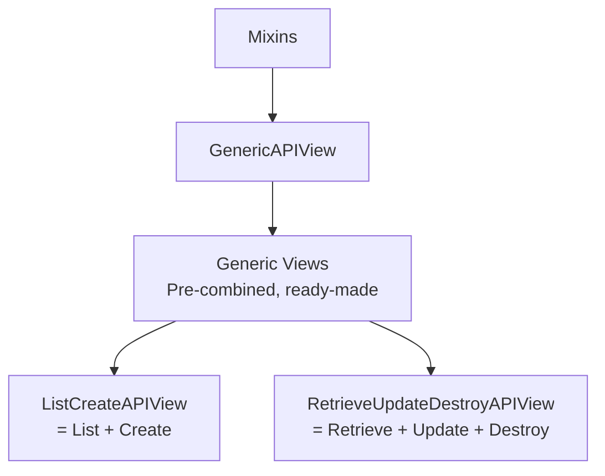

# Section 8: Generic Views

আগের chapter এ আমরা নিজেরা `Mixins` + `GenericAPIView` মিলিয়ে View বানিয়েছি — কিন্তু এই combination গুলো (List+Create, Retrieve+Update+Destroy) এতটাই common যে, DRF এগুলোকে **আগে থেকেই তৈরি করে** দিয়ে রেখেছে। এগুলোকেই বলা হয় **Generic Views**।

---

## Why — কেন Generic Views দরকার?

আগের chapter এর কোড আবার দেখি:

```python
class PostListCreateView(mixins.ListModelMixin,
                          mixins.CreateModelMixin,
                          GenericAPIView):
    queryset = Post.objects.all()
    serializer_class = PostSerializer

    def get(self, request, *args, **kwargs):
        return self.list(request, *args, **kwargs)

    def post(self, request, *args, **kwargs):
        return self.create(request, *args, **kwargs)
```

এই `get`/`post` mapping করাটাও তো একটা repetitive প্যাটার্ন — প্রতিটা "List + Create" View তে এই একই ৪ লাইন বারবার লিখতে হবে। DRF তাই এই পুরো combination কে **একটা ready-made class** বানিয়ে দিয়েছে — `ListCreateAPIView`।

```
Mixins + GenericAPIView (আগের chapter)     Generic Views (এই chapter)

class X(ListModelMixin,                    class X(ListCreateAPIView):
        CreateModelMixin,                      queryset = ...
        GenericAPIView):                       serializer_class = ...
    queryset = ...
    serializer_class = ...
    def get(...): return self.list(...)
    def post(...): return self.create(...)
```

---

## DRF এর প্রস্তুত Generic View গুলো

| Generic View | ভিতরে কোন কোন Mixin আছে | কোন HTTP Method |
|---|---|---|
| `ListAPIView` | `ListModelMixin` | GET (list) |
| `RetrieveAPIView` | `RetrieveModelMixin` | GET (detail) |
| `CreateAPIView` | `CreateModelMixin` | POST |
| `UpdateAPIView` | `UpdateModelMixin` | PUT, PATCH |
| `DestroyAPIView` | `DestroyModelMixin` | DELETE |
| `ListCreateAPIView` | `ListModelMixin` + `CreateModelMixin` | GET (list), POST |
| `RetrieveUpdateAPIView` | `RetrieveModelMixin` + `UpdateModelMixin` | GET, PUT, PATCH |
| `RetrieveDestroyAPIView` | `RetrieveModelMixin` + `DestroyModelMixin` | GET, DELETE |
| `RetrieveUpdateDestroyAPIView` | `RetrieveModelMixin` + `UpdateModelMixin` + `DestroyModelMixin` | GET, PUT, PATCH, DELETE |



---

## কোড: `ListCreateAPIView` দিয়ে Post List + Create

```python
from rest_framework.generics import ListCreateAPIView
from .models import Post
from .serializers import PostSerializer

class PostListCreateView(ListCreateAPIView):
    queryset = Post.objects.all()
    serializer_class = PostSerializer

    def perform_create(self, serializer):
        serializer.save(author=self.request.user)
```

### লাইন ব্যাখ্যা

- মাত্র **৩ লাইন কোড** — কোনো `get`/`post` method লিখতেই হয়নি! `ListCreateAPIView` নিজে থেকেই HTTP method কে `list()`/`create()` এ route করে দেয়
- `perform_create(self, serializer)` — এটা DRF এর একটা **hook method**, যেটা `create()` mixin এর ভিতর থেকে automatic কল হয়, ঠিক `serializer.save()` করার মুহূর্তে। এখানে আমরা extra ডেটা (যেমন `author=self.request.user`) যুক্ত করতে পারি, পুরো `post()` method override না করেই

::: tip
`perform_create()`, `perform_update()`, `perform_destroy()` — এই hook method গুলো DRF ইচ্ছাকৃতভাবে দিয়েছে, যাতে পুরো `create`/`update`/`destroy` logic নতুন করে না লিখেই শুধু নির্দিষ্ট অংশটুকু customize করা যায়। এটা DRF এর design philosophy এর ভালো উদাহরণ — override করার জন্য ছোট, নির্দিষ্ট hook দেওয়া, পুরো method না।
:::

---

## কোড: `RetrieveUpdateDestroyAPIView` দিয়ে Post Detail

```python
from rest_framework.generics import RetrieveUpdateDestroyAPIView

class PostDetailView(RetrieveUpdateDestroyAPIView):
    queryset = Post.objects.all()
    serializer_class = PostSerializer
    lookup_field = 'slug'
```

এইটুকু কোড দিয়েই GET (detail), PUT, PATCH, DELETE — চারটা operation ই কাজ করবে।

```python
# urls.py
from .views import PostListCreateView, PostDetailView

urlpatterns = [
    path('posts/', PostListCreateView.as_view(), name='post-list-create'),
    path('posts/<slug:slug>/', PostDetailView.as_view(), name='post-detail'),
]
```

---

## Request/Response — Full Cycle উদাহরণ

### POST (তৈরি করা)

```
POST /api/posts/
{
    "title": "Generic Views দিয়ে বানানো পোস্ট",
    "content": "মাত্র কয়েক লাইনে!"
}
```

```json
// 201 Created
{
    "id": 5,
    "title": "Generic Views দিয়ে বানানো পোস্ট",
    "content": "মাত্র কয়েক লাইনে!",
    "author": "rahim"
}
```

### PATCH (আংশিক আপডেট)

```
PATCH /api/posts/generic-views-diye-banano-post/
{
    "title": "আপডেটেড শিরোনাম"
}
```

```json
// 200 OK
{
    "id": 5,
    "title": "আপডেটেড শিরোনাম",
    "content": "মাত্র কয়েক লাইনে!",
    "author": "rahim"
}
```

---

## সব Hook Method — এক নজরে

| Hook Method | কখন কল হয় | কী জন্য ব্যবহার হয় |
|---|---|---|
| `perform_create(serializer)` | `create()` এর ভিতরে, save করার সময় | অতিরিক্ত ডেটা যোগ করা (যেমন `author`) |
| `perform_update(serializer)` | `update()` এর ভিতরে | Update এর সময় অতিরিক্ত logic |
| `perform_destroy(instance)` | `destroy()` এর ভিতরে | Delete এর আগে/পরে অতিরিক্ত কাজ (যেমন soft-delete) |

### `perform_destroy` এর উদাহরণ — Soft Delete

```python
class PostDetailView(RetrieveUpdateDestroyAPIView):
    queryset = Post.objects.all()
    serializer_class = PostSerializer

    def perform_destroy(self, instance):
        instance.is_published = False  # আসল delete না করে, শুধু unpublish
        instance.save()
```

এভাবে `DELETE` request পাঠালেও আসলে Post টা database থেকে মুছে যাচ্ছে না, শুধু `is_published=False` হয়ে যাচ্ছে — এটাই **soft delete** প্যাটার্ন, যেটা real-world application এ ডেটা হারানো থেকে বাঁচায়।

---

## Mixins vs Generic Views — তুলনা

| বৈশিষ্ট্য | Mixins + GenericAPIView (নিজে combine করা) | Generic Views (আগে থেকে combined) |
|---|---|---|
| কোড এর পরিমাণ | বেশি (get/post method নিজে লিখতে হয়) | কম (শুধু attribute সেট করলেই হয়) |
| নমনীয়তা | সম্পূর্ণ নিয়ন্ত্রণ — যেকোনো combination বানানো যায় | Pre-defined combination, তবে override করা যায় |
| কখন ব্যবহার করবে | Standard combination এ নেই এমন কাস্টম দরকার হলে | ৯০% ক্ষেত্রে — standard CRUD API |

::: tip
বাস্তব প্রজেক্টে বেশিরভাগ ক্ষেত্রেই সরাসরি **Generic Views** ব্যবহার করা হয় — Mixins আলাদাভাবে combine করার প্রয়োজন খুব কম পড়ে, যদি না তোমার কোনো অস্বাভাবিক combination দরকার হয় (যেমন শুধু Create + Destroy, কোনো Read/Update ছাড়া)।
:::

---

## Common Mistakes

- `perform_create()` override না করে সরাসরি `create()` method পুরোটা override করার চেষ্টা করা — অপ্রয়োজনীয় বেশি কোড লেখা হয়ে যায়
- `ListCreateAPIView` ব্যবহার করার সময় `queryset`/`serializer_class` না দেওয়া — এতে `AssertionError` আসবে
- Soft delete implement করতে ভুলে গিয়ে `perform_destroy` override না করা, ফলে গুরুত্বপূর্ণ ডেটা সরাসরি মুছে যাওয়া

---

## Best Practices

- Standard CRUD এর জন্য সবসময় প্রথমে Generic Views বিবেচনা করো, নিজে Mixins combine করার আগে
- `perform_create`/`perform_update`/`perform_destroy` hook ব্যবহার করো ছোট customization এর জন্য, পুরো method override না করে
- Sensitive ডেটার জন্য soft-delete প্যাটার্ন বিবেচনা করো `perform_destroy` override করে

---

## Interview Questions

**প্রশ্ন: `ListCreateAPIView` এর ভিতরে কোন কোন জিনিস আছে?**
> এটা `GenericAPIView` এর সাথে `ListModelMixin` এবং `CreateModelMixin` কে pre-combine করে বানানো একটা ready-made class — `get` request কে `list()` এ, আর `post` request কে `create()` এ automatic route করে।

**প্রশ্ন: `perform_create()` আর `create()` এর মধ্যে পার্থক্য কী?**
> `create()` হলো `CreateModelMixin` এর পুরো method, যেটা validation, save, এবং response তৈরি করা — সবকিছু সামলায়। `perform_create()` হলো তার ভিতরের একটা ছোট hook, যেটা শুধু save করার নির্দিষ্ট মুহূর্তে override করার সুযোগ দেয় — পুরো logic নতুন করে লেখার দরকার হয় না।

**প্রশ্ন: কখন Mixins আলাদাভাবে combine করবে, Generic Views ব্যবহার না করে?**
> যখন DRF এর pre-defined কোনো Generic View তোমার প্রয়োজনীয় combination দেয় না — যেমন শুধু Create আর Destroy চাই, Retrieve/Update/List কিছুই না।

---

## Summary

- **Generic Views** হলো Mixins + GenericAPIView এর **pre-combined, ready-made** ভার্সন — `ListCreateAPIView`, `RetrieveUpdateDestroyAPIView` ইত্যাদি
- মাত্র `queryset` আর `serializer_class` সেট করলেই সম্পূর্ণ কার্যকরী View তৈরি হয়ে যায়
- **`perform_create`, `perform_update`, `perform_destroy`** — এই hook method গুলো দিয়ে ছোট customization (যেমন `author` যোগ করা, soft delete) করা যায়, পুরো method override না করেই
- বাস্তব প্রজেক্টে ৯০% ক্ষেত্রে সরাসরি Generic Views ব্যবহার করা হয়

পরের chapter — **Section 9: ViewSets** — এ আমরা দেখব DRF কীভাবে এই Generic Views গুলোকেও আরেক ধাপ এগিয়ে নিয়ে গিয়ে **`ModelViewSet`** বানিয়েছে, যেখানে List+Create+Retrieve+Update+Destroy — সবকিছু একটামাত্র class এ, এবং `Router` দিয়ে URL ও automatic ভাবে তৈরি হয়ে যায়। এটাই সেই chapter, যেখানে তোমার জিজ্ঞাসা করা **ModelViewSet** সবচেয়ে বেশি গুরুত্ব পাবে!
