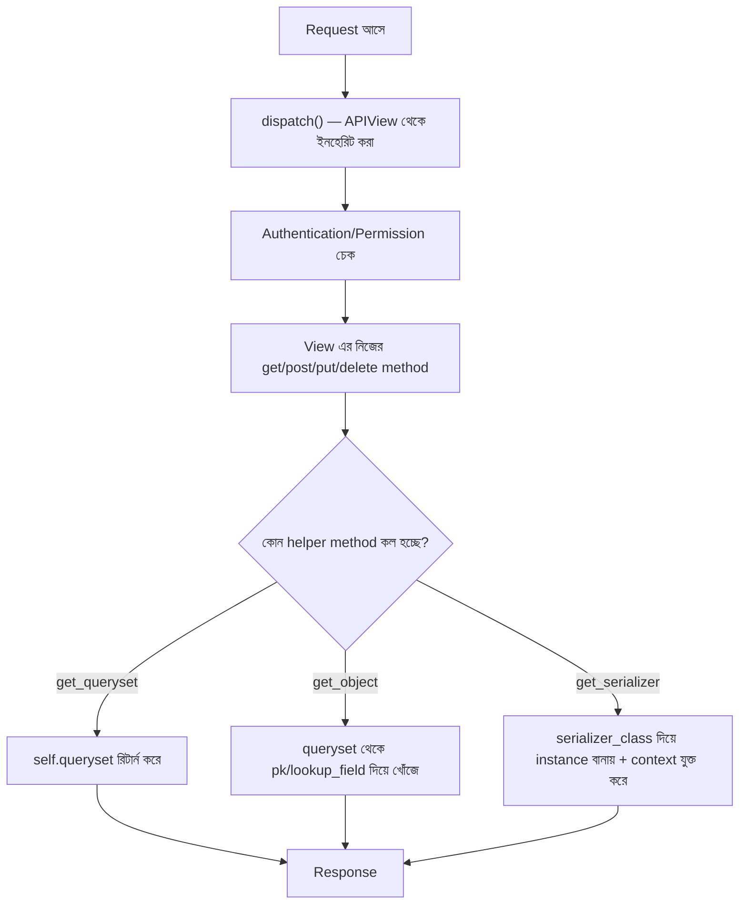

# Section 6: GenericAPIView

আগের chapter গুলোতে আমরা `APIView` দিয়ে CRUD operation বানিয়েছি — কিন্তু লক্ষ্য করলে দেখা যাবে, প্রতিটা view তে কিছু কাজ **বারবার** করতে হচ্ছে: queryset আনা, serializer instantiate করা, `get_object` লেখা। **GenericAPIView** এই common pattern গুলোকে একটা reusable base class এ পরিণত করে।

---

## Why — কেন GenericAPIView দরকার?

`APIView` দিয়ে লেখা কোড আবার দেখি:

```python
class PostDetailAPIView(APIView):
    def get_object(self, pk):
        try:
            return Post.objects.get(pk=pk)
        except Post.DoesNotExist:
            raise NotFound()

    def get(self, request, pk):
        post = self.get_object(pk)
        serializer = PostSerializer(post)
        return Response(serializer.data)
```

এই প্যাটার্নটা — `get_object` লেখা, serializer বানানো — প্রতিটা Model এর জন্য প্রায় হুবহু একইরকম কোড। **GenericAPIView** এই সাধারণ (generic) অংশটুকু একবার লিখে দিয়েছে, আমাদের শুধু কনফিগারেশন (`queryset`, `serializer_class`) দিতে হয়।

---

## APIView vs GenericAPIView — পার্থক্য

| বৈশিষ্ট্য | `APIView` | `GenericAPIView` |
|---|---|---|
| `get_object()` | নিজে লিখতে হয় | Built-in, শুধু `queryset` দিলেই কাজ করে |
| Serializer instantiate করা | নিজে করতে হয় | `get_serializer()` built-in method আছে |
| Pagination | নিজে থেকে হয় না | Built-in সাপোর্ট আছে (`pagination_class`) |
| Filtering | নিজে থেকে হয় না | Built-in সাপোর্ট আছে (`filter_backends`) |
| নমনীয়তা (Flexibility) | সম্পূর্ণ স্বাধীন | কিছুটা convention মেনে চলতে হয়, কিন্তু override করা যায় |
| কোড এর পরিমাণ | বেশি | কম |

::: tip
`GenericAPIView` নিজে থেকে কোনো HTTP method (`get`, `post`) define করে না — এটা শুধু সাধারণ প্যাটার্নের জন্য **helper method** (`get_queryset`, `get_object`, `get_serializer`) সরবরাহ করে। আসল `get`/`post` method লেখার জন্য পরের chapter এ আমরা **Mixins** ব্যবহার করব।
:::

---

## GenericAPIView এর মূল Attribute ও Method

```python
from rest_framework.generics import GenericAPIView

class PostListView(GenericAPIView):
    queryset = Post.objects.all()
    serializer_class = PostSerializer
```

শুধু এই দুই লাইন লিখলেই `GenericAPIView` জানে:
- কোন Model এর ডেটা নিয়ে কাজ করতে হবে (`queryset`)
- কোন Serializer ব্যবহার করতে হবে (`serializer_class`)

### Built-in Method গুলো

| Method | কাজ |
|---|---|
| `get_queryset()` | `queryset` attribute রিটার্ন করে (override করে dynamic filtering করা যায়) |
| `get_object()` | URL এর `pk` ব্যবহার করে queryset থেকে একটা নির্দিষ্ট object খুঁজে বের করে, না পেলে automatic `404` |
| `get_serializer(*args, **kwargs)` | `serializer_class` ব্যবহার করে serializer instance বানায়, `context` automatic ভাবে যুক্ত করে দেয় |
| `get_serializer_class()` | কোন serializer ব্যবহার হবে তা রিটার্ন করে (override করে condition-based serializer পছন্দ করা যায়) |

---

## কোড: GenericAPIView দিয়ে GET List

যেহেতু `GenericAPIView` নিজে থেকে `get`/`post` define করে না, আমাদের নিজেদেরই method লিখতে হবে — কিন্তু এখন `get_queryset()` এবং `get_serializer()` ব্যবহার করে অনেক পরিষ্কার হয়ে যায়।

```python
from rest_framework.generics import GenericAPIView
from rest_framework.response import Response
from .models import Post
from .serializers import PostSerializer

class PostListView(GenericAPIView):
    queryset = Post.objects.all()
    serializer_class = PostSerializer

    def get(self, request):
        queryset = self.get_queryset()
        serializer = self.get_serializer(queryset, many=True)
        return Response(serializer.data)

    def post(self, request):
        serializer = self.get_serializer(data=request.data)
        serializer.is_valid(raise_exception=True)
        serializer.save(author=request.user)
        return Response(serializer.data, status=201)
```

### লাইন ব্যাখ্যা

- `self.get_queryset()` — `queryset` attribute থেকে automatic ভাবে ডেটা নিয়ে আসে, override করলে dynamic filtering করা যায়
- `self.get_serializer(queryset, many=True)` — শুধু `PostSerializer(...)` লেখার বদলে `self.get_serializer()` ব্যবহার করার সুবিধা হলো, এটা automatic ভাবে `context={'request': request}` যুক্ত করে দেয় — আমাদের আলাদা করে context পাঠাতে হয় না
- `serializer.is_valid(raise_exception=True)` — `if serializer.is_valid():` লেখার বদলে `raise_exception=True` দিলে, invalid হলে DRF নিজে থেকেই সঠিক `400` error response বানিয়ে ফেলে — আলাদা `if/else` লেখা লাগে না

---

## কোড: GenericAPIView দিয়ে GET/PUT/DELETE Detail

```python
class PostDetailView(GenericAPIView):
    queryset = Post.objects.all()
    serializer_class = PostSerializer

    def get(self, request, pk):
        post = self.get_object()  # pk নিজে থেকেই URL থেকে নেয়
        serializer = self.get_serializer(post)
        return Response(serializer.data)

    def put(self, request, pk):
        post = self.get_object()
        serializer = self.get_serializer(post, data=request.data)
        serializer.is_valid(raise_exception=True)
        serializer.save()
        return Response(serializer.data)

    def delete(self, request, pk):
        post = self.get_object()
        post.delete()
        return Response(status=204)
```

### গুরুত্বপূর্ণ লক্ষণীয় বিষয়

- আমাদের নিজেদের `get_object` method লেখার প্রয়োজন নেই — `GenericAPIView` এর built-in `get_object()` automatic ভাবে URL থেকে `pk` নিয়ে queryset এ খুঁজে বের করে, এবং object না পেলে নিজে থেকেই `404` raise করে
- `self.get_serializer(post, data=request.data)` — বিদ্যমান object (`post`) কে নতুন ডেটা দিয়ে আপডেট করার জন্য serializer বানানো হচ্ছে (এটাই partial update এর ভিত্তি)

---

## `lookup_field` — যদি `pk` ছাড়া অন্য কিছু দিয়ে খুঁজতে হয়

ডিফল্ট ভাবে `get_object()` URL এর `pk` ব্যবহার করে খোঁজে। কিন্তু যদি `slug` দিয়ে খুঁজতে চাও:

```python
class PostDetailView(GenericAPIView):
    queryset = Post.objects.all()
    serializer_class = PostSerializer
    lookup_field = 'slug'
```

```python
# urls.py
path('posts/<slug:slug>/', PostDetailView.as_view()),
```

এখন `get_object()` `pk` এর বদলে `slug` দিয়ে object খুঁজবে — SEO-friendly URL (যেমন `/posts/amar-prothom-post/`) বানানোর জন্য এটা খুব দরকারি।

---

## GenericAPIView এর Internal Flow



`GenericAPIView` আসলে `APIView` কেই **extend** করে — তাই `dispatch()`, Authentication, Permission — এই সবকিছু আগের মতোই কাজ করে। শুধু এর উপরে অতিরিক্ত helper method (`get_queryset`, `get_object`, `get_serializer`) যুক্ত হয়েছে, যেগুলো Model-ভিত্তিক কাজ সহজ করে দেয়।

---

## GenericAPIView vs APIView — কখন কোনটা

| পরিস্থিতি | পছন্দ |
|---|---|
| Model-based সাধারণ CRUD API | `GenericAPIView` (অথবা এর উপরে বানানো Generic Views/ViewSets) |
| Model নেই এমন কাস্টম logic (যেমন login endpoint) | `APIView` |
| খুবই কাস্টম, unconventional response structure | `APIView` |

---

## Common Mistakes

- `queryset` attribute কে সরাসরি view এর ভিতরে ব্যবহার করা, `get_queryset()` এর বদলে — এতে dynamic filtering (যেমন logged-in user এর নিজের পোস্ট শুধু দেখানো) করা কঠিন হয়ে যায়
- `self.get_serializer()` না ব্যবহার করে সরাসরি `PostSerializer()` কল করা — এতে `context` automatic ভাবে যুক্ত হয় না
- `lookup_field` পরিবর্তন করার পর `urls.py` তে URL pattern আপডেট করতে ভুলে যাওয়া

---

## Best Practices

- সবসময় `self.get_serializer()` এবং `self.get_queryset()` ব্যবহার করো, সরাসরি attribute বা class ব্যবহার না করে
- Dynamic filtering দরকার হলে `get_queryset()` override করো:
  ```python
  def get_queryset(self):
      return Post.objects.filter(is_published=True)
  ```
- `raise_exception=True` ব্যবহার করো validation error handle করার জন্য, ম্যানুয়াল `if/else` না লিখে

---

## Interview Questions

**প্রশ্ন: `GenericAPIView` কি নিজে থেকে HTTP method handle করে?**
> না। `GenericAPIView` শুধু helper method (`get_queryset`, `get_object`, `get_serializer`) দেয়। actual `get`/`post`/`put`/`delete` method আমাদেরই লিখতে হয়, অথবা পরের chapter এ শেখা **Mixins** ব্যবহার করতে হয়।

**প্রশ্ন: `queryset` attribute আর `get_queryset()` method এর মধ্যে পার্থক্য কী?**
> `queryset` একটা static attribute, যেটা সবসময় একই থাকে। `get_queryset()` একটা method, যেটা override করে request/user অনুযায়ী dynamic ভাবে ভিন্ন queryset রিটার্ন করা যায় — তাই `get_queryset()` ব্যবহার করাই recommended।

**প্রশ্ন: `self.get_serializer()` ব্যবহার করার সুবিধা কী?**
> এটা automatic ভাবে `context={'request': request}` যুক্ত করে দেয়, যেটা Serializer এর ভিতরে `request` object অ্যাক্সেস করার জন্য দরকার হতে পারে (যেমন SerializerMethodField এ)।

---

## Summary

- **GenericAPIView** হলো `APIView` এর উপর তৈরি একটা enhanced class, যেটা `queryset` এবং `serializer_class` attribute দিয়ে অনেক common কাজ (object খোঁজা, serializer বানানো) automate করে
- `get_object()`, `get_queryset()`, `get_serializer()` — এই তিনটা built-in method বারবার একই কোড লেখা থেকে বাঁচায়
- `lookup_field` দিয়ে `pk` এর বদলে অন্য field (যেমন `slug`) দিয়ে object খোঁজা যায়
- এটা নিজে থেকে কোনো HTTP method define করে না — সেটা করার জন্য পরের chapter এ আমরা **Mixins** শিখব, যেগুলো `GenericAPIView` এর সাথে মিলিয়ে সম্পূর্ণ CRUD ফাংশনালিটি দেয়

পরের chapter — **Section 7: Mixins** — এ আমরা দেখব কীভাবে `ListModelMixin`, `CreateModelMixin` এর মতো ready-made ব্লক ব্যবহার করে `get`/`post` method-ও লেখা লাগবে না।
