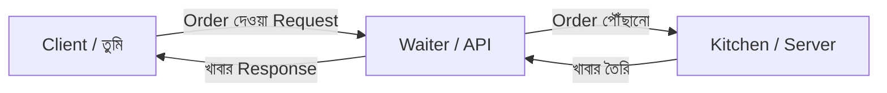
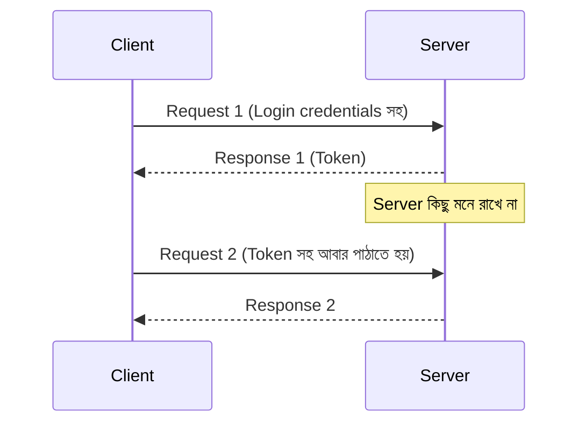
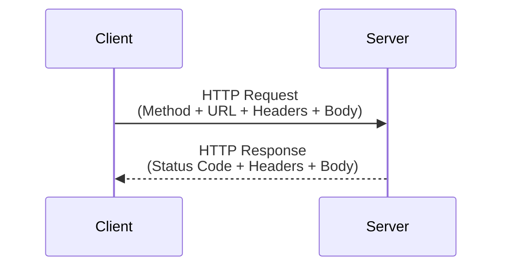
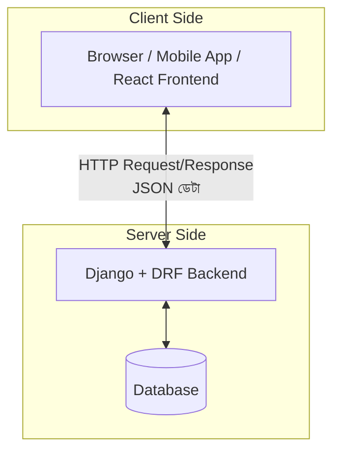
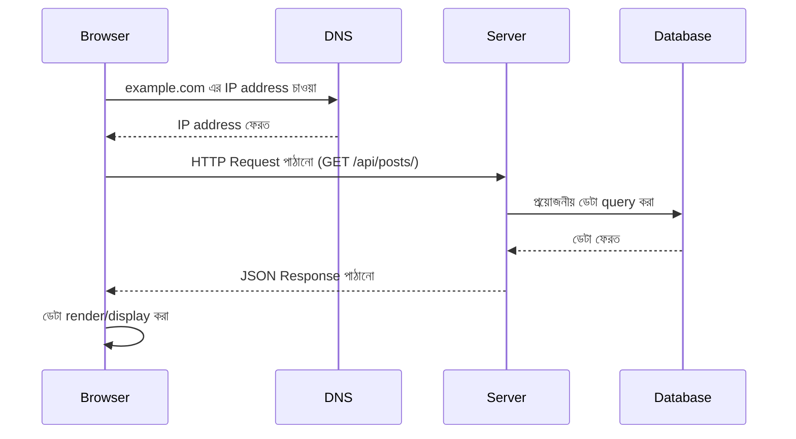
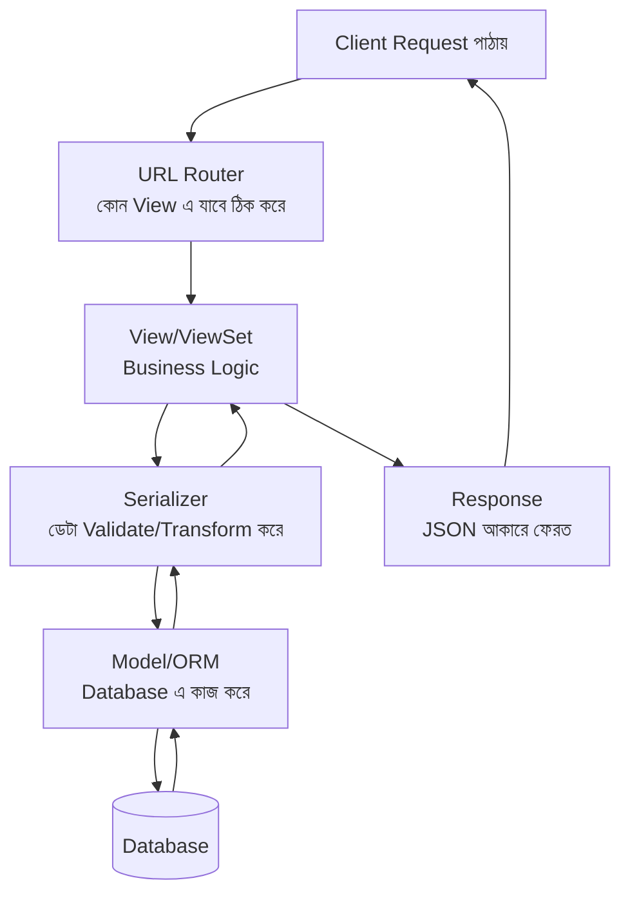

# Section 1: Introduction — DRF এর ভিত্তি

DRF শেখার আগে কিছু মৌলিক ধারণা পরিষ্কার থাকা জরুরি — API কী, REST কী, HTTP কীভাবে কাজ করে, JSON কী। এই chapter এ আমরা এই ভিত্তিগুলো একদম প্রথম নীতি (first principles) থেকে বুঝব, যাতে পরবর্তী chapter গুলোতে DRF এর প্রতিটা abstraction এর **"কেন"** সহজে বোঝা যায়।

---

## What is API?

**API (Application Programming Interface)** হলো দুইটা সফটওয়্যার সিস্টেমের মধ্যে কথা বলার একটা নিয়ম/চুক্তি (contract)। এটা define করে দেয় — একটা সিস্টেম আরেকটা সিস্টেমকে কী request পাঠাতে পারবে, এবং তার বিনিময়ে কী response পাবে।

### বাস্তব জীবনের Analogy

একটা রেস্টুরেন্টে ভাবো — তুমি (Client) শেফ (Server) এর সাথে সরাসরি কথা বলতে পারো না। তোমার আর শেফের মাঝখানে থাকে **ওয়েটার** — তুমি ওয়েটারকে (API) খাবারের অর্ডার (Request) দাও, ওয়েটার সেটা রান্নাঘরে (Server) নিয়ে যায়, এবং রান্না শেষে খাবার (Response) নিয়ে ফিরে আসে।



API না থাকলে তোমাকে সরাসরি রান্নাঘরে গিয়ে রান্না করতে হতো — অর্থাৎ, প্রতিটা client কে সরাসরি database/server এর internal logic জানতে হতো, যেটা অসম্ভব রকম জটিল এবং অনিরাপদ হতো।

---

## What is REST?

**REST (Representational State Transfer)** হলো API ডিজাইন করার একটা **architectural style** (কোনো protocol বা technology না) — এটা কতগুলো নিয়মের সেট, যেগুলো মেনে চললে একটা API সহজ, স্কেলেবল, এবং predictable হয়।

::: tip
REST একটা "standard" না, এটা একটা "স্টাইল" বা "দর্শন" — তাই কেউ "সম্পূর্ণভাবে RESTful" API বানায়, আবার কেউ আংশিকভাবে মেনে চলে।
:::

---

## REST Principles (REST এর মূলনীতি)

| Principle | ব্যাখ্যা |
|---|---|
| **Statelessness** | প্রতিটা request সম্পূর্ণ independent — server কোনো client এর আগের request মনে রাখে না, প্রতিবার সব প্রয়োজনীয় তথ্য (যেমন auth token) request এ পাঠাতে হয় |
| **Client-Server Separation** | Client (frontend) এবং Server (backend) সম্পূর্ণ আলাদা — একটা পরিবর্তন করলে আরেকটা ভাঙে না, যতক্ষণ API contract ঠিক থাকে |
| **Uniform Interface** | সব resource একই ধরনের, predictable উপায়ে access করা যায় (যেমন সবসময় URL + HTTP method) |
| **Resource-Based** | প্রতিটা জিনিস (user, post, comment) একটা "resource," এবং প্রতিটা resource এর একটা নির্দিষ্ট URL (identifier) থাকে |
| **Cacheable** | Response গুলো cache করা যায় কিনা তা স্পষ্টভাবে বলা থাকে, performance বাড়ানোর জন্য |

### Statelessness কেন গুরুত্বপূর্ণ



Server যদি "stateful" হতো (আগের request মনে রাখত), তাহলে একাধিক server এ scale করা কঠিন হতো — কারণ প্রতিটা user কে সবসময় একই server এ পাঠাতে হতো। Stateless হওয়ায় যেকোনো server request handle করতে পারে, যতক্ষণ client প্রতিবার প্রয়োজনীয় তথ্য (token) পাঠায়।

---

## What is RESTful API?

যে API REST এর নীতিগুলো মেনে ডিজাইন করা হয়, তাকে বলা হয় **RESTful API**। এটাকে চেনার একটা সহজ উপায় — URL গুলো **resource** কে represent করে (action কে না), আর কাজ (action) নির্ধারণ হয় HTTP Method দিয়ে।

```
❌ RESTful না (action URL এ):
GET /getAllPosts
POST /createNewPost
POST /deletePost/5

✅ RESTful (resource URL এ, action HTTP method এ):
GET    /posts/         → সব post দেখা
POST   /posts/          → নতুন post তৈরি
DELETE /posts/5/         → নির্দিষ্ট post মুছে ফেলা
```

---

## HTTP কী?

**HTTP (HyperText Transfer Protocol)** হলো সেই প্রোটোকল, যেটা ব্যবহার করে client আর server একে অপরের সাথে কথা বলে। প্রতিটা web request/response আসলে HTTP এর নিয়ম মেনে পাঠানো হয়।



---

## HTTP Methods

| Method | কাজ | RESTful ব্যবহার |
|---|---|---|
| **GET** | ডেটা পড়া (fetch) | Post list দেখা, একটা নির্দিষ্ট post দেখা |
| **POST** | নতুন ডেটা তৈরি | নতুন Post/Comment তৈরি করা |
| **PUT** | সম্পূর্ণ ডেটা replace করা | পুরো Post আপডেট (সব field দিতে হয়) |
| **PATCH** | আংশিক ডেটা আপডেট | শুধু Post এর title বদলানো |
| **DELETE** | ডেটা মুছে ফেলা | কোনো Post/Comment ডিলিট করা |

### PUT vs PATCH — বাস্তব উদাহরণ

```
Post আছে: {"title": "পুরনো শিরোনাম", "content": "কিছু কনটেন্ট", "category": "Tech"}

PUT দিয়ে আপডেট (সব field দিতে হবে, নাহলে missing field null হয়ে যেতে পারে):
{"title": "নতুন শিরোনাম", "content": "কিছু কনটেন্ট", "category": "Tech"}

PATCH দিয়ে আপডেট (শুধু যেটা বদলাতে চাও):
{"title": "নতুন শিরোনাম"}
```

---

## HTTP Status Codes

| Code Range | মানে | উদাহরণ |
|---|---|---|
| **2xx** | সফল (Success) | `200 OK`, `201 Created`, `204 No Content` |
| **3xx** | Redirect | `301 Moved Permanently` |
| **4xx** | Client এর ভুল | `400 Bad Request`, `401 Unauthorized`, `403 Forbidden`, `404 Not Found` |
| **5xx** | Server এর ভুল | `500 Internal Server Error` |

### সবচেয়ে বেশি ব্যবহৃত Status Code (Blog API এর জন্য)

| Code | কখন ব্যবহার হবে (Blog API তে) |
|---|---|
| `200 OK` | Post সফলভাবে fetch/update হলে |
| `201 Created` | নতুন Post সফলভাবে তৈরি হলে |
| `204 No Content` | Post সফলভাবে delete হলে |
| `400 Bad Request` | ভুল ডেটা পাঠালে (যেমন title ছাড়া Post তৈরি করার চেষ্টা) |
| `401 Unauthorized` | Login না করে protected endpoint এ access করার চেষ্টা |
| `403 Forbidden` | Login করা আছে কিন্তু অনুমতি নেই (যেমন অন্যের Post ডিলিট করার চেষ্টা) |
| `404 Not Found` | যে Post এর ID দেওয়া হয়েছে সেটা database এ নেই |

---

## JSON কী?

**JSON (JavaScript Object Notation)** হলো ডেটা আদান-প্রদানের জন্য সবচেয়ে জনপ্রিয় format — এটা human-readable এবং প্রায় সব programming language এই parse করা যায়।

```json
{
  "id": 1,
  "title": "আমার প্রথম ব্লগ পোস্ট",
  "content": "এটা একটা উদাহরণ কনটেন্ট।",
  "author": "রহিম",
  "tags": ["django", "drf", "python"],
  "is_published": true
}
```

DRF এ আমরা যা কিছু বানাই — Model থেকে ডেটা নিয়ে সেটাকে JSON এ রূপান্তর করাই মূল কাজ (এটাকেই বলা হয় **Serialization**, যেটা পরের chapter এ বিস্তারিত থাকবে)।

---

## Client-Server Architecture



- **Client** — যেটা ইউজার ব্যবহার করে (browser, mobile app, React app)
- **Server** — যেটা business logic এবং ডেটা handle করে (Django + DRF)
- **Database** — যেখানে ডেটা persist করে থাকে (PostgreSQL, SQLite ইত্যাদি)

Client কখনো সরাসরি Database এ অ্যাক্সেস করে না — সবসময় Server এর মধ্য দিয়ে, API এর নিয়ম মেনে।

---

## Browser Server এর সাথে কীভাবে কথা বলে?



---

## Why DRF? (কেন Django REST Framework?)

Django দিয়ে সরাসরি API বানানো *সম্ভব*, কিন্তু DRF ব্যবহার করলে অনেক কাজ যা বারবার করতে হতো, সেটা built-in ভাবে পাওয়া যায়।

| ছাড়া DRF (Plain Django) | DRF সহ |
|---|---|
| JSON serialization নিজে হাতে লিখতে হয় | `Serializer`/`ModelSerializer` স্বয়ংক্রিয়ভাবে করে দেয় |
| Authentication/Permission নিজে বানাতে হয় | Built-in Authentication ও Permission ক্লাস আছে |
| Pagination নিজে implement করতে হয় | Built-in Pagination ক্লাস আছে |
| Browsable API নেই | স্বয়ংক্রিয় Browsable API UI পাওয়া যায় (ব্রাউজারে সরাসরি API টেস্ট করা যায়) |
| Validation নিজে লিখতে হয় | Serializer এ built-in validation ব্যবস্থা আছে |

---

## Why NOT Plain Django? (সাধারণ Django কেন যথেষ্ট না?)

Plain Django দিয়ে API বানাতে গেলে, প্রতিটা view এ নিজে থেকে:

```python
# Plain Django দিয়ে JSON রেসপন্স বানানোর কষ্টকর পদ্ধতি
from django.http import JsonResponse

def post_list(request):
    posts = Post.objects.all()
    data = []
    for post in posts:
        data.append({
            "id": post.id,
            "title": post.title,
            "content": post.content,
            # প্রতিটা field ম্যানুয়ালি লিখতে হচ্ছে...
        })
    return JsonResponse(data, safe=False)
```

এটা ছোট প্রজেক্টে চলে, কিন্তু বড় প্রজেক্টে — যেখানে validation, nested relationship, authentication, pagination সবকিছু দরকার — এভাবে সবকিছু ম্যানুয়ালি লেখা অত্যন্ত ক্লান্তিকর এবং error-prone। DRF এই সব repetitive কাজের জন্য standardized, পরীক্ষিত সমাধান দেয়।

---

## Request-Response Cycle (একটা DRF Request এর সম্পূর্ণ জীবনচক্র)



### প্রতিটা ধাপে কী ঘটে

1. **Client Request পাঠায়** — যেমন `GET /api/posts/`
2. **URL Router** — Django ঠিক করে এই URL কোন View এ যাবে
3. **View/ViewSet** — Request গ্রহণ করে, প্রয়োজনীয় logic execute করে
4. **Serializer** — Model instance কে JSON এ রূপান্তর করে (অথবা incoming JSON কে validate করে Model এ রূপান্তরের জন্য প্রস্তুত করে)
5. **Model/ORM** — Database এর সাথে সরাসরি কথা বলে (query চালায়)
6. **Response** — চূড়ান্ত JSON ডেটা client কে ফেরত পাঠানো হয়

এই পুরো flow টাই DRF এর মূল architecture — পরবর্তী chapter গুলোতে (APIView, Serializer, GenericAPIView) আমরা প্রতিটা ধাপ গভীরভাবে দেখব।

---

## Common Mistakes

- REST কে একটা "protocol" বা "technology" ভাবা — এটা আসলে একটা architectural style/নীতিমালা
- সব ক্ষেত্রে `POST` ব্যবহার করা (যেমন ডেটা delete করতে `POST /deletePost` — এটা RESTful না)
- Status code সবসময় `200` বা `400` দিয়ে সারা — নির্দিষ্ট situation এর জন্য নির্দিষ্ট code (`201`, `204`, `403`) ব্যবহার না করা
- Statelessness ভুলে গিয়ে server এ session-based state রাখার চেষ্টা করা, যেটা scaling এ সমস্যা তৈরি করে

---

## Best Practices

- URL এ সবসময় noun (resource নাম) ব্যবহার করো, verb (action) না — `/posts/` ঠিক, `/getPosts/` ভুল
- HTTP Method সঠিকভাবে ব্যবহার করো — GET দিয়ে কখনো ডেটা পরিবর্তন করবে না
- সঠিক status code রিটার্ন করো — client কে বুঝতে সাহায্য করে ঠিক কী হয়েছে
- Response সবসময় consistent structure এ রাখো — যাতে frontend সহজে predictable ভাবে handle করতে পারে

---

## Interview Questions

**প্রশ্ন: REST এবং RESTful এর মধ্যে পার্থক্য কী?**
> REST হলো একটা architectural style/নীতিমালার সেট। RESTful হলো সেই API, যেটা REST এর নীতিগুলো মেনে ডিজাইন করা হয়েছে।

**প্রশ্ন: PUT আর PATCH এর মধ্যে পার্থক্য কী?**
> PUT সম্পূর্ণ resource replace করে (সব field দিতে হয়), PATCH শুধু নির্দিষ্ট field আংশিকভাবে আপডেট করে।

**প্রশ্ন: Statelessness বলতে কী বোঝায়, এবং এটা কেন গুরুত্বপূর্ণ?**
> প্রতিটা request server এর কাছে independent — server কোনো client এর আগের অবস্থা মনে রাখে না। এটা গুরুত্বপূর্ণ কারণ এতে server easily scale করা যায় — যেকোনো server instance যেকোনো request handle করতে পারে।

**প্রশ্ন: DRF এর প্রধান সুবিধা কী কী?**
> Built-in serialization, authentication, permission, pagination, validation, এবং browsable API — এগুলো ম্যানুয়ালি লেখার প্রয়োজন হয় না।

---

## Summary

- **API** হলো দুই সিস্টেমের মধ্যে যোগাযোগের চুক্তি
- **REST** একটা architectural style, যার মূলনীতি: statelessness, client-server separation, uniform interface, resource-based design
- **HTTP Method** (GET, POST, PUT, PATCH, DELETE) দিয়ে action নির্ধারণ হয়, **Status Code** দিয়ে ফলাফল জানানো হয়
- **JSON** হলো API তে ডেটা আদান-প্রদানের প্রধান format
- **DRF** Django এর উপর built, যা serialization, auth, permission, pagination ইত্যাদি built-in ভাবে দেয় — বারবার ম্যানুয়ালি লেখার প্রয়োজন কমায়
- **Request-Response Cycle**: Client → URL Router → View → Serializer → Model/Database → ফিরতি পথে → Response

পরবর্তী chapter এ আমরা Section 2: **Project Setup** এ যাব (ইতিমধ্যে দেওয়া হয়েছে), এরপর Section 3: **Models** এ আমাদের Blog API এর প্রথম actual code লেখা শুরু হবে।
