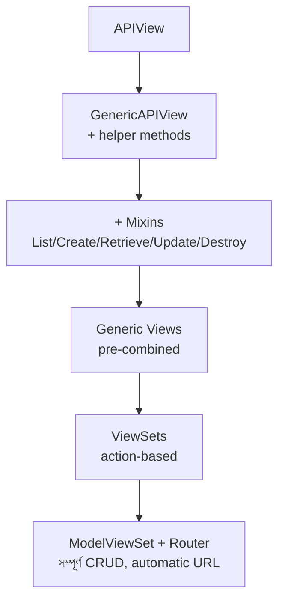

# Section 24: DRF Interview Questions — সংকলিত প্রশ্নব্যাংক

এই chapter এ আমরা পুরো ডকুমেন্টেশন জুড়ে আলোচিত প্রতিটা Section থেকে গুরুত্বপূর্ণ প্রশ্ন একসাথে সংকলন করেছি — চাকরির ইন্টারভিউর প্রস্তুতির জন্য একটা কেন্দ্রীভূত রেফারেন্স হিসেবে ব্যবহার করতে পারবে।

---

## Fundamentals (REST, HTTP)

**১. REST এবং RESTful এর মধ্যে পার্থক্য কী?**
> REST হলো একটা architectural style/নীতিমালার সেট। RESTful হলো সেই API, যেটা REST এর নীতিগুলো মেনে ডিজাইন করা হয়েছে।

**২. Statelessness কেন গুরুত্বপূর্ণ?**
> প্রতিটা request server এর কাছে independent — এটা server কে easily scale করতে দেয়, কারণ যেকোনো server instance যেকোনো request handle করতে পারে।

**৩. PUT আর PATCH এর পার্থক্য কী?**
> PUT সম্পূর্ণ resource replace করে (সব field দিতে হয়), PATCH শুধু নির্দিষ্ট field আংশিকভাবে আপডেট করে।

---

## Models

**৪. `CASCADE`, `SET_NULL`, `PROTECT` এর মধ্যে পার্থক্য কী?**
> `CASCADE` parent ডিলিট হলে child ডিলিট করে। `SET_NULL` child এর field কে NULL করে। `PROTECT` parent কে ডিলিট হতে বাধা দেয়।

**৫. `related_name` কী কাজ করে?**
> Reverse relationship অ্যাক্সেস করার নাম নির্ধারণ করে (যেমন `category.posts.all()`)।

---

## APIView ও GenericAPIView

**৬. `APIView` আর Django এর সাধারণ `View` এর পার্থক্য কী?**
> `APIView` REST API এর জন্য প্রয়োজনীয় জিনিস (JSON parsing, authentication, `Request`/`Response` object) built-in ভাবে দেয়।

**৭. `GenericAPIView` নিজে কি HTTP method handle করে?**
> না, এটা শুধু helper method (`get_queryset`, `get_object`, `get_serializer`) দেয়। HTTP method handling এর জন্য Mixins বা Generic Views দরকার হয়।

---

## Serializer

**৮. Serialization আর Deserialization এর পার্থক্য কী?**
> Serialization: Python object → JSON (output)। Deserialization: JSON → Python object (input, validation সহ)।

**৯. `Serializer` আর `ModelSerializer` এর পার্থক্য কী?**
> `ModelSerializer` Model থেকে automatic field/validation বের করে। `Serializer` এ সব ম্যানুয়ালি define করতে হয়।

**১০. `SerializerMethodField` কখন ব্যবহার করবে?**
> যখন field সরাসরি Model column না, বরং গণনা/logic থেকে আসে (যেমন comment count)।

---

## Mixins, Generic Views, ViewSets

**১১. Mixin কেন একা ব্যবহার করা যায় না?**
> কারণ এটা `GenericAPIView` এর `get_queryset()`, `get_serializer()` এর মতো method এর উপর নির্ভরশীল।

**১২. `ModelViewSet` এর ভিতরে আসলে কী আছে?**
> `GenericAPIView` + ৫টা Mixin (List, Create, Retrieve, Update, Destroy) + `GenericViewSet` — সবকিছু একসাথে combine করা।

**১৩. `DefaultRouter` আর `SimpleRouter` এর পার্থক্য কী?**
> `DefaultRouter` browsable API root view দেয় এবং `.json` suffix সাপোর্ট করে, `SimpleRouter` করে না।

**১৪. `@action` decorator এ `detail=True/False` এর পার্থক্য কী?**
> `detail=True` নির্দিষ্ট object এর জন্য (URL এ pk লাগে)। `detail=False` পুরো collection এর জন্য (pk ছাড়া)।

---

## Authentication ও Permission

**১৫. JWT কেন "stateless"?**
> Token নিজেই সব প্রয়োজনীয় তথ্য বহন করে, server কে database এ token খুঁজে যাচাই করতে হয় না।

**১৬. Access Token আর Refresh Token আলাদা কেন?**
> Access Token কম মেয়াদের রেখে নিরাপত্তা বাড়ানো হয়, Refresh Token দীর্ঘ মেয়াদের রেখে user experience ভালো রাখা হয়।

**১৭. Authentication আর Permission এর পার্থক্য কী?**
> Authentication পরিচয় যাচাই করে ("কে তুমি?"), Permission অনুমতি যাচাই করে ("তুমি কি করতে পারবে?")।

**১৮. `has_permission` আর `has_object_permission` এর পার্থক্য কী?**
> `has_permission` view-level এ প্রতিটা request এ চলে। `has_object_permission` শুধু object-specific action (retrieve/update/destroy) এ চলে।

---

## Filtering, Pagination

**১৯. `SearchFilter` আর `DjangoFilterBackend` এর পার্থক্য কী?**
> `SearchFilter` partial keyword match করে একাধিক field জুড়ে। `DjangoFilterBackend` exact field মান দিয়ে filter করে।

**২০. `PageNumberPagination` এ কী সমস্যা হতে পারে যেটা `CursorPagination` সমাধান করে?**
> নতুন ডেটা যোগ হলে item শিফট/ডুপ্লিকেট হওয়ার সমস্যা — Cursor pagination fixed position মনে রাখে বলে এটা হয় না।

---

## Relations, Validation

**২১. Nested Serializer কেন ডিফল্টভাবে writable না?**
> DRF জানে না nested ডেটা কীভাবে save করতে হবে — এই সিদ্ধান্ত application-specific, তাই `create()`/`update()` override করতে হয়।

**২২. `validate_<field>` আর `validate()` এর পার্থক্য কী?**
> `validate_<field>` একটা field, `validate()` পুরো object (একাধিক field একসাথে) validate করে।

---

## Performance, Caching, Throttling

**২৩. N+1 Query Problem কী?**
> একটা মূল query (N object আনতে) চালানোর পর, প্রতিটা object এর related ডেটার জন্য আলাদা আলাদা query চলা — মোট 1+N টা query।

**২৪. `select_related` আর `prefetch_related` এর পার্থক্য কী?**
> `select_related` JOIN দিয়ে ForeignKey/OneToOne একটা query তে আনে। `prefetch_related` আলাদা query দিয়ে ManyToMany/reverse ForeignKey efficient ভাবে আনে।

**২৫. Permission আর Throttling এর পার্থক্য কী?**
> Permission access control ("কে করতে পারবে"), Throttling rate limiting ("কতবার করতে পারবে")। ব্যর্থ হলে যথাক্রমে `403` ও `429`।

**২৬. Cache Invalidation কেন কঠিন সমস্যা?**
> ডেটা পরিবর্তন হলে ঠিক কোন cache entry stale হয়ে গেছে তা নির্ভুলভাবে চিহ্নিত করে মুছে ফেলা জটিল।

---

## Security, Deployment, Testing

**২৭. Django ORM কীভাবে SQL Injection থেকে সুরক্ষা দেয়?**
> Automatic ভাবে parameterized query তৈরি করে, user input সরাসরি SQL string এ বসায় না।

**২৮. Production এ `DEBUG=True` রাখলে কী সমস্যা?**
> Error হলে পুরো traceback ও sensitive তথ্য browser এ দেখিয়ে দেয়, যা attacker কে সাহায্য করে।

**২৯. `force_authenticate()` কী করে?**
> Test এ real JWT token তৈরি না করেই `request.user` সেট করে দেয় — authentication এর বদলে বাকি logic টেস্টে ফোকাস করা যায়।

---

## Scenario-Based Questions (বাস্তব পরিস্থিতি)

**৩০. যদি তোমাকে একটা API বানাতে বলা হয় যেখানে শুধু owner-ই নিজের ডেটা edit করতে পারবে, কীভাবে করবে?**
> Custom Permission class বানিয়ে `has_object_permission()` এ `obj.author == request.user` চেক করব, সাথে `SAFE_METHODS` চেক করে সবাইকে read access দেব।

**৩১. একটা List API খুব ধীর হয়ে গেছে, কী চেক করবে?**
> প্রথমে Django Debug Toolbar দিয়ে query count চেক করব — N+1 problem আছে কিনা দেখব, তারপর `select_related`/`prefetch_related` প্রয়োগ করব, এবং pagination সঠিকভাবে সেটআপ আছে কিনা যাচাই করব।

**৩২. পুরনো client দের না ভেঙে API তে breaking change আনতে হবে, কী করবে?**
> নতুন API version (`v2`) বানাব, পুরনো `v1` অপরিবর্তিত রাখব, এবং একটা deprecation timeline জানিয়ে দেব পুরনো client দের migrate করার জন্য।

---

## দ্রুত রিভিশনের জন্য — মূল Concept একনজরে

---

## Summary

এই chapter এ আমরা পুরো ডকুমেন্টেশনের প্রতিটা Section থেকে গুরুত্বপূর্ণ প্রশ্ন সংকলন করেছি — Fundamentals থেকে Security পর্যন্ত। ইন্টারভিউর আগে এই পেজটা দ্রুত রিভিশন করলে পুরো DRF এর মূল ধারণাগুলো মনে করিয়ে দেওয়ার জন্য যথেষ্ট হওয়া উচিত।

পরের এবং শেষ chapter — **Section 25: Complete Project Review** — এ আমরা পুরো Blog API প্রজেক্টের একটা সামগ্রিক পর্যালোচনা করব, সব টুকরো একসাথে কীভাবে কাজ করে তা দেখব।
