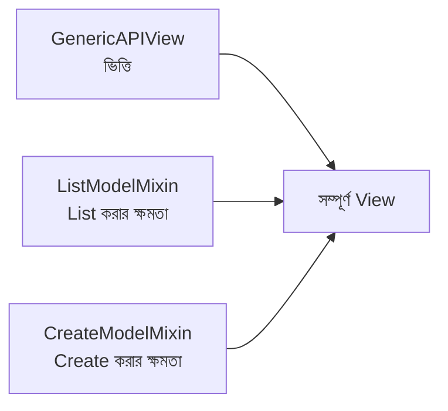
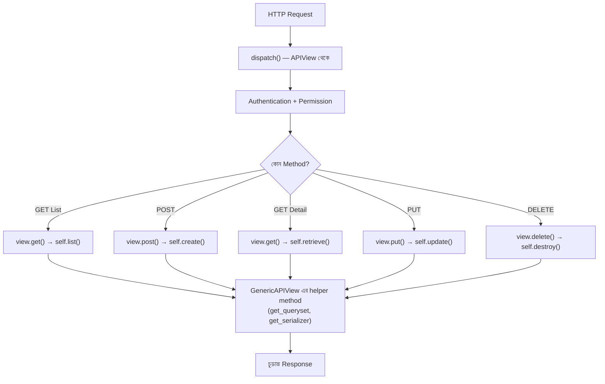

# Section 7: Mixins

আগের chapter এ আমরা `GenericAPIView` দিয়ে `get_object`, `get_queryset` লেখার ঝামেলা কমিয়েছি, কিন্তু তারপরও আমাদের নিজেদের `get`, `post`, `put`, `delete` method লিখতে হয়েছে। এই chapter এ আমরা দেখব **Mixins** কীভাবে এই শেষ ধাপটাও automate করে দেয় — এতটাই যে, বেশিরভাগ ক্ষেত্রে আমাদের নিজেদের কোনো HTTP method লিখতেই হয় না।

---

## Why — কেন Mixins দরকার?

লক্ষ্য করো, "List দেখানো" (`GET` list) বা "নতুন তৈরি করা" (`POST`) — এই কাজগুলো প্রায় **প্রতিটা Model** এর জন্যই একইরকম লজিক অনুসরণ করে:

```python
# List দেখানোর জেনেরিক প্যাটার্ন (Post, Comment, Category — সবার জন্যই একই)
def get(self, request):
    queryset = self.get_queryset()
    serializer = self.get_serializer(queryset, many=True)
    return Response(serializer.data)
```

যেহেতু এই প্যাটার্নটা সব জায়গায় একই, DRF এটাকে একবার লিখে **Mixin** নামের reusable ব্লক আকারে দিয়ে দিয়েছে — আমাদের শুধু সেটা "যোগ" (mix in) করতে হয়।

---

## Mixin কী? — একটা Programming Concept হিসেবে

**Mixin** হলো object-oriented programming এর একটা ধারণা — এটা এমন একটা class, যেটা নিজে থেকে সম্পূর্ণ ব্যবহারযোগ্য না, বরং অন্য class এর সাথে মিলিয়ে (multiple inheritance দিয়ে) নির্দিষ্ট functionality যোগ করার জন্য ডিজাইন করা।

### Analogy

Mixin কে ভাবা যায় **LEGO ব্লকের** মতো। প্রতিটা ব্লক একা কিছু না, কিন্তু কয়েকটা ব্লক একসাথে জোড়া দিলে একটা সম্পূর্ণ গঠন তৈরি হয়। DRF এ `ListModelMixin` একটা ব্লক (শুধু "list দেখানোর" ক্ষমতা দেয়), `CreateModelMixin` আরেকটা ব্লক (শুধু "তৈরি করার" ক্ষমতা দেয়) — এগুলো `GenericAPIView` এর সাথে জোড়া দিলে একটা সম্পূর্ণ কার্যকরী View তৈরি হয়।



---

## DRF এর ৫টা মূল Mixin

| Mixin | দেয় কী | কোন HTTP Method |
|---|---|---|
| `ListModelMixin` | `list()` method — সব object দেখানো | GET (list) |
| `CreateModelMixin` | `create()` method — নতুন object তৈরি | POST |
| `RetrieveModelMixin` | `retrieve()` method — একটা নির্দিষ্ট object দেখানো | GET (detail) |
| `UpdateModelMixin` | `update()` method — বিদ্যমান object আপডেট | PUT, PATCH |
| `DestroyModelMixin` | `destroy()` method — object মুছে ফেলা | DELETE |

---

## কোড: Mixins + GenericAPIView দিয়ে List ও Create

```python
from rest_framework import mixins
from rest_framework.generics import GenericAPIView
from .models import Post
from .serializers import PostSerializer

class PostListCreateView(mixins.ListModelMixin,
                          mixins.CreateModelMixin,
                          GenericAPIView):
    queryset = Post.objects.all()
    serializer_class = PostSerializer

    def get(self, request, *args, **kwargs):
        return self.list(request, *args, **kwargs)

    def post(self, request, *args, **kwargs):
        return self.create(request, *args, **kwargs)
```

### লাইন ব্যাখ্যা

- `class PostListCreateView(mixins.ListModelMixin, mixins.CreateModelMixin, GenericAPIView)` — এটা Python এর **multiple inheritance** — একসাথে দুইটা Mixin এবং `GenericAPIView` কে ইনহেরিট করা হচ্ছে
- `self.list(request, ...)` — এটা `ListModelMixin` থেকে আসছে; এটা নিজে থেকেই `get_queryset()`, serialize, এবং pagination handle করে, চূড়ান্ত `Response` রিটার্ন করে
- `self.create(request, ...)` — `CreateModelMixin` থেকে আসছে; নিজে থেকেই serializer validate করে, save করে, `201` status সহ response রিটার্ন করে

::: tip
লক্ষ্য করো — আমাদের নিজেদের `get`/`post` method এখনো লিখতে হচ্ছে, কিন্তু ভিতরের **actual logic** এখন Mixin থেকে আসছে। আমরা শুধু "কোন HTTP method এলে কোন Mixin এর method কল হবে" — সেই map টা তৈরি করছি।
:::

---

## কোড: Mixins দিয়ে Retrieve, Update, Destroy

```python
class PostDetailView(mixins.RetrieveModelMixin,
                      mixins.UpdateModelMixin,
                      mixins.DestroyModelMixin,
                      GenericAPIView):
    queryset = Post.objects.all()
    serializer_class = PostSerializer

    def get(self, request, *args, **kwargs):
        return self.retrieve(request, *args, **kwargs)

    def put(self, request, *args, **kwargs):
        return self.update(request, *args, **kwargs)

    def patch(self, request, *args, **kwargs):
        return self.partial_update(request, *args, **kwargs)

    def delete(self, request, *args, **kwargs):
        return self.destroy(request, *args, **kwargs)
```

### লাইন ব্যাখ্যা

- `self.retrieve()` — `get_object()` কল করে (GenericAPIView থেকে আসা), তারপর serialize করে রিটার্ন করে
- `self.update()` — `partial=False` দিয়ে সম্পূর্ণ replace করে (PUT এর behavior)
- `self.partial_update()` — ভিতরে ভিতরে `update()` কেই কল করে, কিন্তু `partial=True` দিয়ে, তাই শুধু পাঠানো field গুলোই আপডেট হয় (PATCH এর behavior)
- `self.destroy()` — object খুঁজে বের করে মুছে ফেলে, `204` status রিটার্ন করে

---

## Mixin এর ভিতরে কী ঘটছে — `ListModelMixin` এর Internal Logic

DRF এর ভিতরে `ListModelMixin` মূলত এভাবে লেখা (সরলীকৃত):

```python
class ListModelMixin:
    def list(self, request, *args, **kwargs):
        queryset = self.filter_queryset(self.get_queryset())

        page = self.paginate_queryset(queryset)
        if page is not None:
            serializer = self.get_serializer(page, many=True)
            return self.get_paginated_response(serializer.data)

        serializer = self.get_serializer(queryset, many=True)
        return Response(serializer.data)
```

এখানে দেখা যাচ্ছে, `list()` method ভিতরে ভিতরে `GenericAPIView` এর `get_queryset()`, `filter_queryset()`, `paginate_queryset()`, `get_serializer()` — সবগুলো method ব্যবহার করছে। এটাই বোঝায় **কেন Mixin গুলো `GenericAPIView` ছাড়া একা ব্যবহার করা যায় না** — এদের অনেক dependency `GenericAPIView` থেকে আসে।

---

## Mixins + GenericAPIView এর Flow Diagram



---

## কেন Mixins + GenericAPIView — এই combination?

এই architecture এর পেছনে DRF এর দর্শন হলো **Composition over Inheritance** (একটামাত্র বড় class না বানিয়ে, ছোট ছোট, একক-দায়িত্বসম্পন্ন অংশ একসাথে জোড়া দেওয়া)। এর ফলে:

- প্রয়োজন অনুযায়ী শুধু নির্দিষ্ট Mixin বেছে নেওয়া যায় (যেমন শুধু Read-only API চাইলে শুধু `RetrieveModelMixin` + `ListModelMixin`, Create/Update/Delete বাদ)
- প্রতিটা Mixin স্বাধীনভাবে টেস্ট এবং maintain করা যায়
- ভবিষ্যতে নতুন ধরনের operation (custom mixin) যোগ করা সহজ

---

## Common Mistakes

- Mixin ব্যবহার করার সময় `GenericAPIView` ইনহেরিট করতে ভুলে যাওয়া — Mixin একা কাজ করে না
- `self.list()` এর বদলে ভুলে `self.get_queryset()` সরাসরি ব্যবহার করে নিজে থেকে serialize করা — Mixin এর সুবিধা হারিয়ে ফেলা
- `partial_update()` এর বদলে `PATCH` এর জন্য `update()` কল করা — এতে partial update এর বদলে সব field require হয়ে যাবে

---

## Best Practices

- প্রয়োজন অনুযায়ী শুধু দরকারি Mixin ব্যবহার করো — সবসময় সবগুলো যোগ করার দরকার নেই
- Multiple inheritance এর ক্রম মনে রাখো — সাধারণত Mixin গুলো আগে, `GenericAPIView` সবার শেষে লেখা হয় (Python এর MRO — Method Resolution Order অনুসরণ করে)
- পরের chapter এ শেখা **Generic Views** ব্যবহার করলে এই Mixin combination গুলো আরও কম কোডে করা যায় — সেগুলো actually এই Mixin + GenericAPIView এরই pre-combined ভার্সন

---

## Interview Questions

**প্রশ্ন: Mixin কী, এবং কেন এটা একা ব্যবহার করা যায় না?**
> Mixin হলো একটা reusable class, যেটা নির্দিষ্ট একটা functionality (list, create, ইত্যাদি) দেয়, কিন্তু এটা `GenericAPIView` এর `get_queryset()`, `get_serializer()` এর মতো method এর উপর নির্ভরশীল — তাই সবসময় `GenericAPIView` এর সাথে মিলিয়ে ব্যবহার করতে হয়।

**প্রশ্ন: `update()` আর `partial_update()` এর মধ্যে সম্পর্ক কী?**
> `partial_update()` ভিতরে ভিতরে `update()` কেই কল করে, শুধু `partial=True` flag সহ — যার ফলে শুধু পাঠানো field গুলোই আপডেট হয়, বাকি field অপরিবর্তিত থাকে।

**প্রশ্ন: শুধু Read-only API বানাতে চাইলে কোন Mixin ব্যবহার করবে?**
> শুধু `ListModelMixin` এবং `RetrieveModelMixin` — `CreateModelMixin`, `UpdateModelMixin`, `DestroyModelMixin` বাদ দিলে API শুধু GET request ই handle করবে।

---

## Summary

- **Mixin** হলো reusable, একক-দায়িত্বসম্পন্ন class, যেটা multiple inheritance দিয়ে `GenericAPIView` এর সাথে মিলিয়ে ব্যবহার করা হয়
- ৫টা মূল Mixin: **List, Create, Retrieve, Update, Destroy** — প্রতিটা একটা নির্দিষ্ট operation এর জন্য
- আমাদের এখনো `get`/`post`/`put`/`delete` method লিখতে হচ্ছে, কিন্তু ভিতরের logic এখন Mixin থেকে আসছে (`self.list()`, `self.create()`, ইত্যাদি)
- এই architecture DRF এর **composition over inheritance** দর্শন প্রতিফলিত করে

পরের chapter — **Section 8: Generic Views** — এ আমরা দেখব DRF কীভাবে এই Mixin + GenericAPIView combination গুলোকে **আগে থেকেই তৈরি করে** দিয়ে রেখেছে (`ListCreateAPIView`, `RetrieveUpdateDestroyAPIView`) — যাতে আমাদের নিজেদের এই combination ও লিখতে না হয়।
