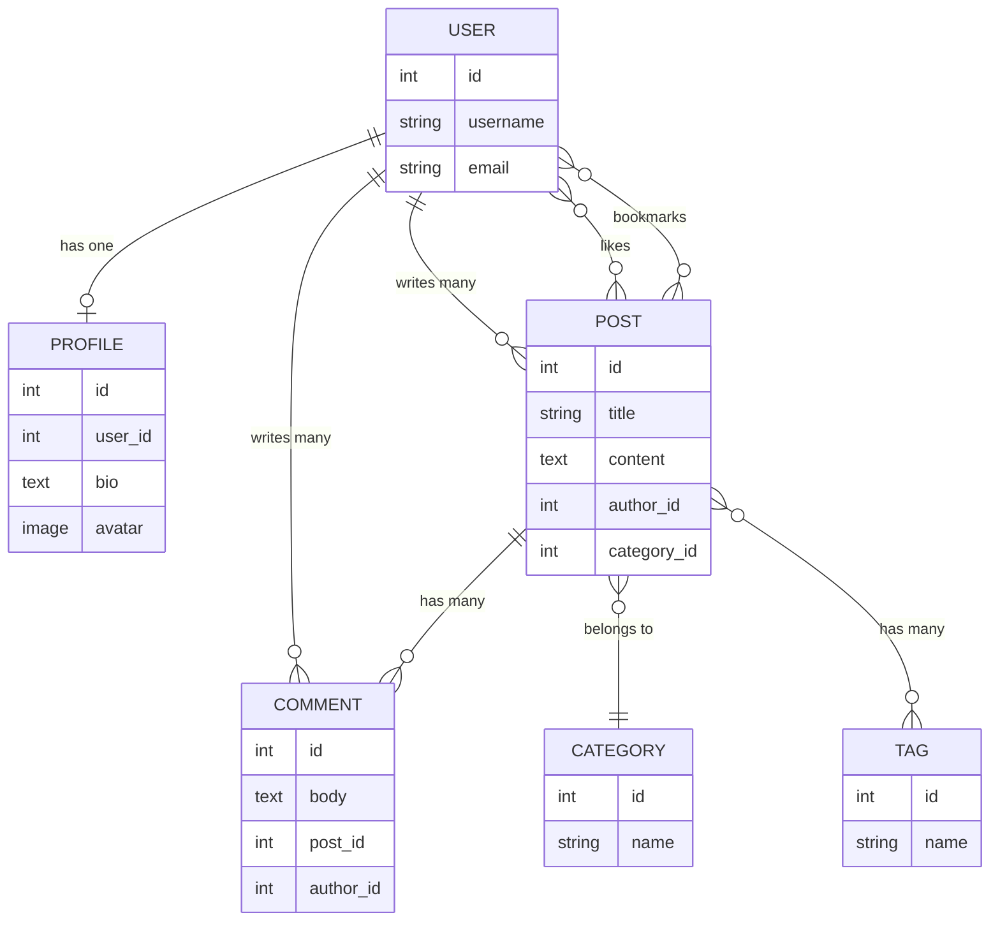

# Section 3: Models — Blog API এর ভিত্তি

এই chapter এ আমরা আমাদের Blog API এর জন্য প্রয়োজনীয় সবগুলো **Model** বানাব — User, Profile, Post, Comment, Category, Tag। এই Model গুলোই আমাদের Database এর কাঠামো নির্ধারণ করবে, এবং পরবর্তী প্রতিটা chapter (Serializer, View, ViewSet) এই Model গুলোর উপর ভিত্তি করেই তৈরি হবে।

---

## What — Model কী?

**Model** হলো Django এর একটা Python class, যেটা Database এর একটা টেবিলকে represent করে। প্রতিটা class attribute একটা column, এবং প্রতিটা instance একটা row।

```python
class Post(models.Model):
    title = models.CharField(max_length=255)
```

এটা লেখার মানে হলো — Database এ একটা `Post` নামের টেবিল তৈরি হবে, যেখানে `title` নামের একটা column থাকবে।

---

## Why — কেন Model দরকার?

Django ব্যবহার করলে সরাসরি SQL লেখার প্রয়োজন হয় না — Model দিয়ে Python code লিখলেই Django নিজে থেকে সেটাকে সঠিক SQL এ রূপান্তর করে দেয় (এটাকে বলা হয় **ORM — Object-Relational Mapping**)।

```
SQL এ সরাসরি লিখলে:                     Django ORM দিয়ে:

CREATE TABLE post (                    class Post(models.Model):
  id INT PRIMARY KEY,                      title = models.CharField(max_length=255)
  title VARCHAR(255)                       content = models.TextField()
);
```

### Analogy

Model কে ভাবা যায় একটা **blueprint/নকশা** হিসেবে — যেমন একটা বাড়ির নকশা ঠিক করে দেয় কয়টা রুম থাকবে, প্রতিটা রুমের আকার কী হবে, তেমনি Model ঠিক করে দেয় Database এর টেবিলে কী কী column থাকবে এবং তাদের ধরন কী।

---

## আমাদের Blog API এর Model Relationship Diagram

কোড লেখার আগে পুরো picture টা দেখে নেওয়া যাক — কোন Model কীভাবে অন্য Model এর সাথে সম্পর্কিত।



এই diagram থেকে বোঝা যাচ্ছে:
- একজন **User** এর একটা **Profile** থাকবে (One-to-One)
- একজন **User** অনেকগুলো **Post** লিখতে পারবে (One-to-Many)
- একটা **Post** একটা নির্দিষ্ট **Category** এর অন্তর্ভুক্ত (Many-to-One)
- একটা **Post** এর একাধিক **Tag** থাকতে পারে, এবং একটা **Tag** একাধিক **Post** এ ব্যবহার হতে পারে (Many-to-Many)
- একটা **Post** এ অনেকগুলো **Comment** থাকতে পারে

---

## Relationship এর তিনটা প্রধান ধরন

| Relationship | ব্যাখ্যা | আমাদের প্রজেক্টে উদাহরণ |
|---|---|---|
| **ForeignKey (Many-to-One)** | একটা টেবিলের একাধিক row আরেকটা টেবিলের একটা row এর সাথে যুক্ত | অনেক Post → একটা Category |
| **ManyToManyField** | দুই টেবিলের row গুলো একে অপরের সাথে বহুভাবে সম্পর্কিত | Post ↔ Tag |
| **OneToOneField** | একটা row শুধু একটা row এর সাথেই যুক্ত | User ↔ Profile |

---

## কোড: Category Model

```python
# blog/models.py

from django.db import models

class Category(models.Model):
    name = models.CharField(max_length=100, unique=True)
    slug = models.SlugField(max_length=100, unique=True)
    created_at = models.DateTimeField(auto_now_add=True)

    class Meta:
        verbose_name_plural = "Categories"
        ordering = ['name']

    def __str__(self):
        return self.name
```

### লাইন ব্যাখ্যা

- `name = models.CharField(max_length=100, unique=True)` — Category এর নাম, ১০০ অক্ষর পর্যন্ত, এবং `unique=True` মানে একই নামের দুইটা Category থাকতে পারবে না
- `slug` — URL-friendly ভার্সন (যেমন "Web Development" → "web-development")
- `auto_now_add=True` — শুধু তৈরি হওয়ার সময় automatic ভাবে timestamp বসে, পরে আর বদলায় না
- `class Meta` — Model এর অতিরিক্ত configuration (এখানে plural নাম এবং default ordering)
- `__str__` — Admin panel এ বা shell এ object কে readable ভাবে দেখানোর জন্য

---

## কোড: Tag Model

```python
class Tag(models.Model):
    name = models.CharField(max_length=50, unique=True)
    slug = models.SlugField(max_length=50, unique=True)

    def __str__(self):
        return self.name
```

Tag গঠনে Category এর মতোই সহজ — নাম এবং slug থাকলেই যথেষ্ট।

---

## কোড: Profile Model (OneToOneField)

```python
from django.contrib.auth.models import User

class Profile(models.Model):
    user = models.OneToOneField(User, on_delete=models.CASCADE, related_name='profile')
    bio = models.TextField(max_length=500, blank=True)
    avatar = models.ImageField(upload_to='avatars/', blank=True, null=True)
    website = models.URLField(blank=True)
    created_at = models.DateTimeField(auto_now_add=True)

    def __str__(self):
        return f"{self.user.username} এর Profile"
```

### লাইন ব্যাখ্যা

- `models.OneToOneField(User, ...)` — Django এর built-in `User` model এর সাথে এক-এক সম্পর্ক তৈরি করে
- `on_delete=models.CASCADE` — যদি কোনো User মুছে ফেলা হয়, তার Profile ও automatic ভাবে মুছে যাবে
- `related_name='profile'` — এর মাধ্যমে পরে `user_instance.profile` লিখে সেই user এর Profile অ্যাক্সেস করা যাবে
- `blank=True` — form-এ এই field খালি রাখা যাবে (validation level এ)
- `null=True` (শুধু `avatar` এ) — database level এ NULL রাখার অনুমতি (ImageField/FileField এ blank এর সাথে null ও দেওয়া হয়)

::: warning
`blank=True` আর `null=True` এর পার্থক্য বোঝা জরুরি — `blank` form validation নিয়ন্ত্রণ করে, `null` database column নিয়ন্ত্রণ করে। সাধারণত CharField/TextField এ শুধু `blank=True` ব্যবহার করা হয় (null না), কারণ Django convention অনুযায়ী empty string ই যথেষ্ট, আলাদা NULL দরকার নেই।
:::

---

## কোড: Post Model (ForeignKey ও ManyToMany)

```python
class Post(models.Model):
    title = models.CharField(max_length=255)
    slug = models.SlugField(max_length=255, unique=True)
    content = models.TextField()
    image = models.ImageField(upload_to='posts/', blank=True, null=True)

    author = models.ForeignKey(User, on_delete=models.CASCADE, related_name='posts')
    category = models.ForeignKey(Category, on_delete=models.SET_NULL, null=True, related_name='posts')
    tags = models.ManyToManyField(Tag, blank=True, related_name='posts')

    likes = models.ManyToManyField(User, related_name='liked_posts', blank=True)
    bookmarks = models.ManyToManyField(User, related_name='bookmarked_posts', blank=True)

    is_published = models.BooleanField(default=True)
    created_at = models.DateTimeField(auto_now_add=True)
    updated_at = models.DateTimeField(auto_now=True)

    class Meta:
        ordering = ['-created_at']

    def __str__(self):
        return self.title
```

### লাইন ব্যাখ্যা

- `author = models.ForeignKey(User, on_delete=models.CASCADE, related_name='posts')` — একজন User এর অনেকগুলো Post থাকতে পারে; User ডিলিট হলে তার সব Post ও ডিলিট হয়ে যাবে
- `category = models.ForeignKey(Category, on_delete=models.SET_NULL, null=True, ...)` — Category ডিলিট হলে Post ডিলিট হবে না, শুধু `category` field NULL হয়ে যাবে
- `tags = models.ManyToManyField(Tag, ...)` — একটা Post এ একাধিক Tag থাকতে পারে
- `likes` এবং `bookmarks` — দুটোই `User` এর সাথে ManyToMany সম্পর্ক, কিন্তু আলাদা `related_name` দেওয়া হয়েছে যাতে conflict না হয় (যেহেতু `author` ও ইতিমধ্যে User এর সাথে সংযুক্ত)
- `auto_now=True` (updated_at) — প্রতিবার save হওয়ার সময় automatic আপডেট হয়

::: tip on_delete এর বিভিন্ন অপশন
- `CASCADE` — parent ডিলিট হলে child ও ডিলিট হয়ে যাবে
- `SET_NULL` — parent ডিলিট হলে field NULL হয়ে যাবে (এর জন্য `null=True` বাধ্যতামূলক)
- `PROTECT` — parent ডিলিট করতে বাধা দেয়, যতক্ষণ child থাকে
:::

---

## কোড: Comment Model

```python
class Comment(models.Model):
    post = models.ForeignKey(Post, on_delete=models.CASCADE, related_name='comments')
    author = models.ForeignKey(User, on_delete=models.CASCADE, related_name='comments')
    body = models.TextField()
    created_at = models.DateTimeField(auto_now_add=True)

    class Meta:
        ordering = ['created_at']

    def __str__(self):
        return f"{self.author.username} এর কমেন্ট — {self.post.title}"
```

Comment এর গঠন সহজ — এটা Post এবং User দুটোর সাথেই ForeignKey সম্পর্ক রাখে, কারণ একটা Comment সবসময় একটা নির্দিষ্ট Post এর নিচে, একজন নির্দিষ্ট User এর দ্বারা লেখা হয়।

---

## Migration চালানো

```bash
python manage.py makemigrations
python manage.py migrate
```

```
Migrations for 'blog':
  blog/migrations/0001_initial.py
    - Create model Category
    - Create model Tag
    - Create model Profile
    - Create model Post
    - Create model Comment
```

---

## Django Admin এ Model Register করা

```python
# blog/admin.py

from django.contrib import admin
from .models import Category, Tag, Profile, Post, Comment

admin.site.register(Category)
admin.site.register(Tag)
admin.site.register(Profile)
admin.site.register(Post)
admin.site.register(Comment)
```

এটা করলে `/admin/` panel এ গিয়ে সরাসরি এই Model গুলোর ডেটা দেখা, যোগ করা, এবং সম্পাদনা করা যাবে — API বানানোর আগেই ডেটা দিয়ে টেস্ট করার জন্য এটা খুব সুবিধাজনক।

---

## ORM দিয়ে Django Shell এ Testing

```bash
python manage.py shell
```

```python
from blog.models import Post, Category
from django.contrib.auth.models import User

# একটা Category তৈরি
category = Category.objects.create(name="Technology", slug="technology")

# একজন User তৈরি
user = User.objects.create_user(username="rahim", password="pass1234")

# একটা Post তৈরি
post = Post.objects.create(
    title="আমার প্রথম পোস্ট",
    slug="amar-prothom-post",
    content="এটা একটা টেস্ট পোস্ট।",
    author=user,
    category=category
)

print(post)  # আমার প্রথম পোস্ট
print(post.author.username)  # rahim
print(category.posts.all())  # <QuerySet [<Post: আমার প্রথম পোস্ট>]>
```

লক্ষ্য করো — `category.posts.all()` কাজ করছে কারণ আমরা `related_name='posts'` দিয়েছিলাম Post model এ।

---

## Common Mistakes

- `on_delete` না দেওয়া (এটা বাধ্যতামূলক প্যারামিটার, ForeignKey/OneToOneField এ)
- `related_name` না দেওয়া, যার ফলে একই Model এ একাধিক ForeignKey/ManyToMany থাকলে conflict error আসে
- `ImageField` ব্যবহার করার সময় `Pillow` ইনস্টল করতে ভুলে যাওয়া
- Model পরিবর্তন করার পর `makemigrations` না চালিয়ে ভুলে যাওয়া

---

## Best Practices

- সবসময় `__str__` method define করো — Admin panel ও shell এ readable output পাওয়ার জন্য
- `related_name` সবসময় স্পষ্টভাবে দাও, বিশেষত যখন একই Model এ একাধিক সম্পর্ক থাকে
- `slug` field ব্যবহার করো URL-friendly identifier এর জন্য (SEO এর জন্যও ভালো)
- `Meta` class এ `ordering` দিয়ে default sort order ঠিক করে রাখো

---

## Interview Questions

**প্রশ্ন: `CASCADE`, `SET_NULL`, এবং `PROTECT` এর মধ্যে পার্থক্য কী?**
> `CASCADE` parent ডিলিট হলে child ও ডিলিট করে দেয়। `SET_NULL` child এর field কে NULL করে দেয় (parent ডিলিট হলেও child থেকে যায়)। `PROTECT` parent কে ডিলিট হতে বাধা দেয় যতক্ষণ child থাকে।

**প্রশ্ন: `ForeignKey` আর `ManyToManyField` এর মধ্যে পার্থক্য কী?**
> `ForeignKey` একমুখী "many-to-one" সম্পর্ক তৈরি করে (একাধিক child, একটা parent)। `ManyToManyField` দ্বিমুখী সম্পর্ক তৈরি করে, যেখানে দুই পাশেই একাধিক entry থাকতে পারে — Django পেছনে একটা আলাদা junction টেবিল তৈরি করে এটা manage করার জন্য।

**প্রশ্ন: `related_name` কী কাজ করে?**
> এটা reverse relationship অ্যাক্সেস করার নাম নির্ধারণ করে — যেমন `category.posts.all()` লেখার সুযোগ দেয়, `related_name` না দিলে ডিফল্ট ভাবে `post_set` ব্যবহার করতে হতো।

---

## Summary

- আমরা Blog API এর জন্য ৫টা Model বানিয়েছি: **Category, Tag, Profile, Post, Comment**
- **OneToOneField** (User-Profile), **ForeignKey** (Post-Category, Post-Author), এবং **ManyToManyField** (Post-Tag, Post-Likes) — তিন ধরনের relationship ব্যবহার করা হয়েছে
- `on_delete` প্যারামিটার নির্ধারণ করে parent ডিলিট হলে child এর কী হবে
- Migration চালিয়ে এই Model গুলো Database এ প্রতিফলিত করা হয়েছে
- Django Admin এ register করে ডেটা visually manage করার ব্যবস্থা করা হয়েছে

পরবর্তী chapter এ আমরা যাব **Section 4: APIView** এ — যেখানে আমরা প্রথমবারের মতো এই Model গুলোর ডেটা নিয়ে একটা actual API endpoint বানাব।
