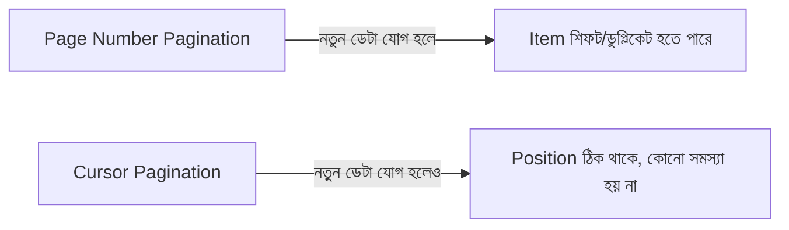
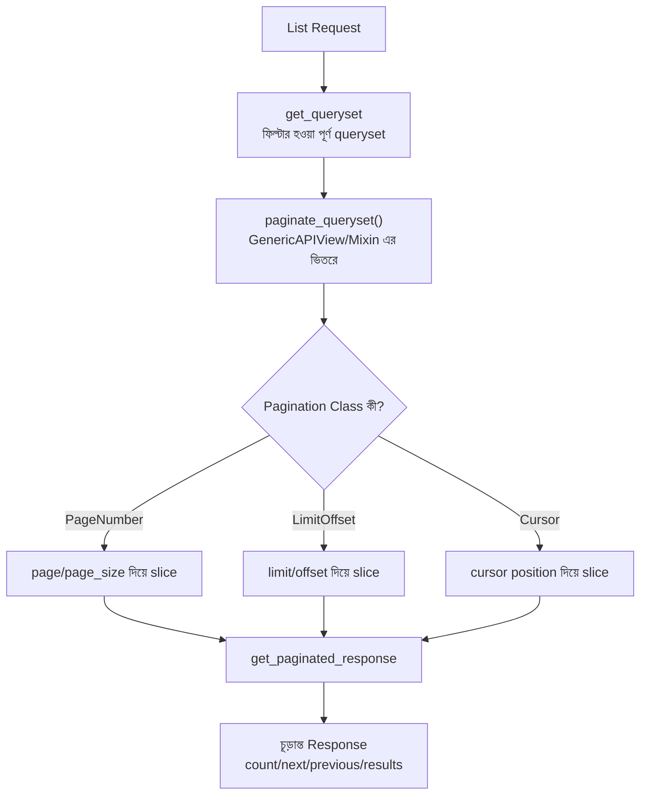

# Section 13: Pagination

আগের chapter এ আমরা Filtering দিয়ে ডেটার পরিমাণ কমিয়েছি, কিন্তু তারপরও যদি হাজার হাজার Post একসাথে match করে, সবগুলো একবারে পাঠানো ধীরগতির এবং অপচয়ী। **Pagination** বড় ডেটাসেটকে ছোট ছোট "page" এ ভাগ করে দেয়, যাতে একবারে সীমিত পরিমাণ ডেটা পাঠানো যায়।

---

## Why — কেন Pagination দরকার?

```
Pagination ছাড়া:                         Pagination সহ:

GET /api/posts/                           GET /api/posts/?page=1
→ ১০,০০০টা Post একসাথে                    → ১০,০০০টার মধ্যে শুধু প্রথম ২০টা
→ ধীরগতির, বেশি bandwidth,                → দ্রুত, কম bandwidth,
   Client এর memory তেও চাপ                   পরবর্তী page আলাদাভাবে আনা যায়
```

::: tip
Pagination শুধু performance এর জন্য না — এটা mobile app এবং infinite-scroll UI এর জন্যও অপরিহার্য, যেখানে ব্যবহারকারী ধীরে ধীরে scroll করে নতুন ডেটা লোড করে।
:::

---

## DRF এর তিন ধরনের Pagination

| ধরন | কীভাবে কাজ করে | কখন উপযুক্ত |
|---|---|---|
| `PageNumberPagination` | Page number দিয়ে (page=1, page=2) | সাধারণ, বেশিরভাগ ক্ষেত্রে — সহজবোধ্য |
| `LimitOffsetPagination` | Limit ও Offset দিয়ে (কতগুলো, কোথা থেকে শুরু) | Custom page size দরকার হলে |
| `CursorPagination` | একটা opaque cursor token দিয়ে | খুব বড় dataset, রিয়েল-টাইম আপডেট হওয়া ডেটা (যেমন social feed) |

---

## PageNumberPagination — সবচেয়ে সাধারণ

### Global Setup

```python
# settings.py
REST_FRAMEWORK = {
    'DEFAULT_PAGINATION_CLASS': 'rest_framework.pagination.PageNumberPagination',
    'PAGE_SIZE': 10,
}
```

এটা পুরো প্রজেক্টে সব ListAPIView/ViewSet এ automatic ভাবে pagination যুক্ত করে দেয়, প্রতি page এ ১০টা করে item সহ।

### Request/Response

```
GET /api/posts/?page=2
```

```json
{
    "count": 47,
    "next": "http://localhost:8000/api/posts/?page=3",
    "previous": "http://localhost:8000/api/posts/?page=1",
    "results": [
        {"id": 11, "title": "..."},
        {"id": 12, "title": "..."}
    ]
}
```

### Response এর প্রতিটা Field

| Field | মানে |
|---|---|
| `count` | মোট কতগুলো item আছে (সব page মিলিয়ে) |
| `next` | পরের page এর সম্পূর্ণ URL (শেষ page হলে `null`) |
| `previous` | আগের page এর URL (প্রথম page হলে `null`) |
| `results` | বর্তমান page এর actual ডেটা |

---

## View-Specific Custom Pagination Class

```python
# blog/pagination.py

from rest_framework.pagination import PageNumberPagination

class PostPagination(PageNumberPagination):
    page_size = 5
    page_size_query_param = 'page_size'
    max_page_size = 50
```

```python
class PostViewSet(viewsets.ModelViewSet):
    queryset = Post.objects.all()
    serializer_class = PostSerializer
    pagination_class = PostPagination
```

### লাইন ব্যাখ্যা

- `page_size = 5` — ডিফল্ট প্রতি page এ ৫টা item
- `page_size_query_param = 'page_size'` — client কে dynamically page size বদলানোর সুযোগ দেয় (`?page_size=20`)
- `max_page_size = 50` — client যতই চাক, সর্বোচ্চ ৫০টার বেশি একসাথে দেওয়া হবে না (server resource সুরক্ষা)

### Request

```
GET /api/posts/?page=1&page_size=20
```

---

## LimitOffsetPagination

```python
from rest_framework.pagination import LimitOffsetPagination

class PostViewSet(viewsets.ModelViewSet):
    queryset = Post.objects.all()
    serializer_class = PostSerializer
    pagination_class = LimitOffsetPagination
```

### Request/Response

```
GET /api/posts/?limit=5&offset=10
```

```json
{
    "count": 47,
    "next": "http://localhost:8000/api/posts/?limit=5&offset=15",
    "previous": "http://localhost:8000/api/posts/?limit=5&offset=5",
    "results": [...]
}
```

- `limit` — একবারে কতগুলো item
- `offset` — কোন index থেকে শুরু করবে

### `PageNumberPagination` vs `LimitOffsetPagination`

| বৈশিষ্ট্য | PageNumberPagination | LimitOffsetPagination |
|---|---|---|
| Query parameter | `?page=2` | `?limit=5&offset=10` |
| নমনীয়তা | কম (fixed page size) | বেশি (client নিজে limit ঠিক করতে পারে) |
| বোঝা সহজ | সহজ | তুলনামূলক জটিল |
| SQL-style thinking | কম | বেশি (SQL এর LIMIT/OFFSET এর মতোই) |

---

## CursorPagination — বড়, রিয়েল-টাইম Dataset এর জন্য

```python
from rest_framework.pagination import CursorPagination

class PostCursorPagination(CursorPagination):
    page_size = 10
    ordering = '-created_at'
```

```python
class PostViewSet(viewsets.ModelViewSet):
    queryset = Post.objects.all()
    serializer_class = PostSerializer
    pagination_class = PostCursorPagination
```

### Request/Response

```
GET /api/posts/?cursor=cD0yMDI2LTA3LTMxKzEyJTNBMDAlM0EwMA%3D%3D
```

```json
{
    "next": "http://localhost:8000/api/posts/?cursor=cD0yMDI2LTA3LTMwKzEwJTNBMDAlM0EwMA%3D%3D",
    "previous": null,
    "results": [...]
}
```

### কেন Cursor সবসময় page number এর বদলে ভালো

`page=2` ব্যবহার করলে একটা সমস্যা হয় — যদি তুমি page 1 দেখার পর, কেউ নতুন একটা Post যোগ করে, তাহলে page 2 এ যাওয়ার সময় কিছু item skip হয়ে যেতে পারে অথবা duplicate দেখা যেতে পারে (কারণ সব item এক ধাপ shift হয়ে গেছে)। **Cursor** এই সমস্যা এড়ায় — এটা একটা নির্দিষ্ট position (timestamp-based) মনে রাখে, page number না, তাই নতুন ডেটা যোগ হলেও ধারাবাহিকতা ঠিক থাকে।



::: warning
`CursorPagination` ব্যবহার করার সময় `ordering` অবশ্যই একটা consistent, unique field (সাধারণত `created_at` বা `id`) এর উপর ভিত্তি করে হতে হবে — নাহলে cursor ঠিকভাবে কাজ নাও করতে পারে।
:::

---

## Custom Pagination — Response Format পরিবর্তন করা

কখনো কখনো ডিফল্ট response format (যেমন `count`/`next`/`previous`/`results`) বদলে নিজের মতো করে চাও।

```python
from rest_framework.pagination import PageNumberPagination
from rest_framework.response import Response

class CustomPagination(PageNumberPagination):
    page_size = 10

    def get_paginated_response(self, data):
        return Response({
            'total_items': self.page.paginator.count,
            'total_pages': self.page.paginator.num_pages,
            'current_page': self.page.number,
            'has_next': self.page.has_next(),
            'has_previous': self.page.has_previous(),
            'posts': data
        })
```

### Response

```json
{
    "total_items": 47,
    "total_pages": 5,
    "current_page": 2,
    "has_next": true,
    "has_previous": true,
    "posts": [...]
}
```

`get_paginated_response()` override করে সম্পূর্ণ নিজের মতো response structure বানানো যায় — frontend team এর প্রয়োজন অনুযায়ী।

---

## Pagination এর Internal Flow



---

## Pagination Types — সারসংক্ষেপ তুলনা

| Type | Query Param | সবচেয়ে ভালো ব্যবহার |
|---|---|---|
| `PageNumberPagination` | `?page=2` | সাধারণ blog/admin panel, page number UI |
| `LimitOffsetPagination` | `?limit=5&offset=10` | Custom page size দরকার, SQL-style thinking |
| `CursorPagination` | `?cursor=...` | Real-time feed, বড় dataset, consistency জরুরি |

---

## Common Mistakes

- `PAGE_SIZE` global settings এ সেট না করে ভুলে যাওয়া, ফলে pagination কাজই না করা (ডিফল্টে disabled থাকে)
- `CursorPagination` এ non-unique field দিয়ে `ordering` সেট করা
- Frontend এ `next`/`previous` URL এর বদলে ভুলভাবে নিজে থেকে page number গুণনা করার চেষ্টা করা
- `max_page_size` সেট না করা, ফলে client অতিরিক্ত বড় `page_size` চেয়ে server কে ওভারলোড করতে পারা

---

## Best Practices

- সাধারণ ক্ষেত্রে `PageNumberPagination` দিয়েই শুরু করো, বেশিরভাগ ক্ষেত্রে যথেষ্ট
- Real-time বা দ্রুত পরিবর্তনশীল ডেটা (feed, notification) এর জন্য `CursorPagination` বিবেচনা করো
- সবসময় `max_page_size` সেট করো, নিরাপত্তার জন্য
- Frontend কে সবসময় response এর `next`/`previous` URL অনুসরণ করতে বলো, নিজে URL বানানোর চেষ্টা না করে

---

## Interview Questions

**প্রশ্ন: `PageNumberPagination` এ কী সমস্যা হতে পারে, যেটা `CursorPagination` সমাধান করে?**
> নতুন ডেটা যোগ হলে page number ভিত্তিক pagination এ item শিফট/ডুপ্লিকেট হওয়ার সমস্যা হতে পারে। Cursor pagination একটা fixed position মনে রাখে বলে এই সমস্যা হয় না।

**প্রশ্ন: `page_size_query_param` কী কাজ করে?**
> এটা client কে dynamically page size পরিবর্তনের সুযোগ দেয় (যেমন `?page_size=20`), `max_page_size` দিয়ে একটা উচ্চসীমা বেঁধে দেওয়া যায়।

**প্রশ্ন: `get_paginated_response()` override করার দরকার কখন হয়?**
> যখন ডিফল্ট `count`/`next`/`previous`/`results` structure এর বদলে নিজের নির্দিষ্ট response format দরকার হয় (যেমন frontend এর প্রয়োজন অনুযায়ী `total_pages`, `current_page` ইত্যাদি field)।

---

## Summary

- **PageNumberPagination** — সবচেয়ে সাধারণ, page number ভিত্তিক
- **LimitOffsetPagination** — SQL-style limit/offset ভিত্তিক, বেশি নমনীয়
- **CursorPagination** — বড়, রিয়েল-টাইম dataset এ consistency নিশ্চিত করে
- **Custom Pagination Class** দিয়ে `page_size`, `max_page_size`, এবং response format কাস্টমাইজ করা যায়
- Pagination `get_queryset()` (filtering এর পরে) এবং `get_serializer()` এর মাঝখানে কাজ করে — filtered queryset কে ছোট ছোট অংশে ভাগ করে

পরের chapter — **Section 14: Relations** — এ আমরা দেখব `PrimaryKeyRelatedField`, `SlugRelatedField`, এবং `HyperlinkedModelSerializer` দিয়ে related ডেটা আরও কার্যকরভাবে কীভাবে সিরিয়ালাইজ করা যায়।
