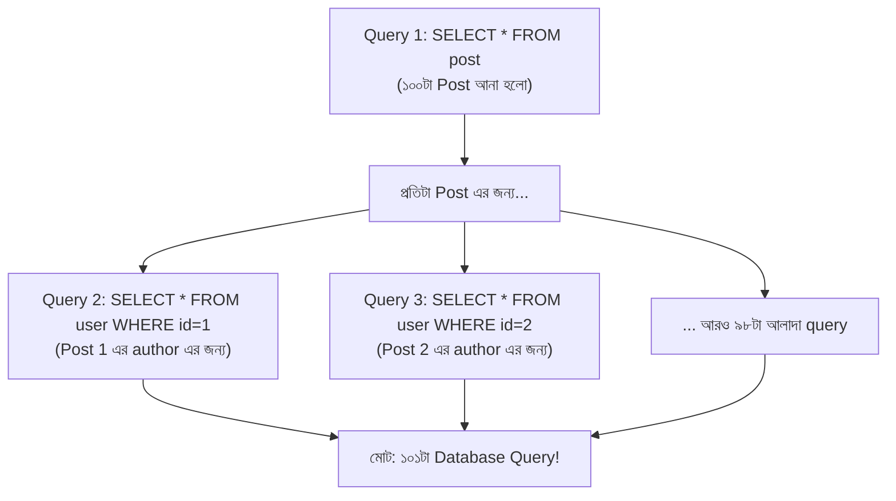
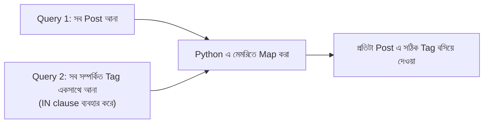
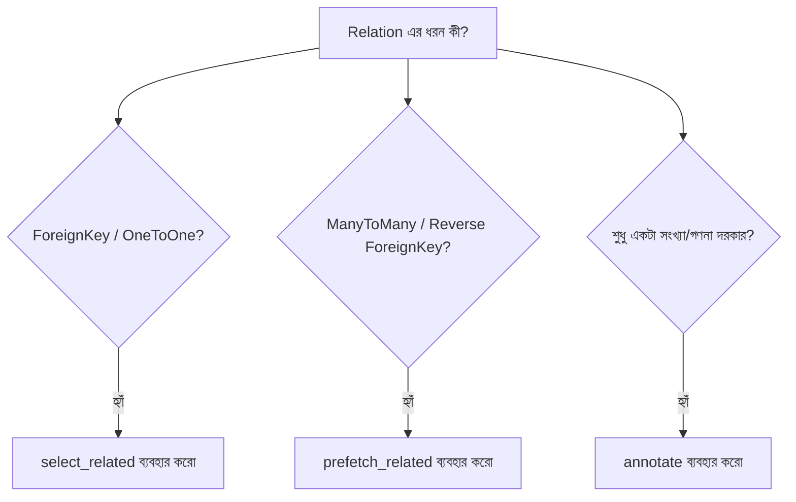

# Section 17: Performance

আমাদের Blog API প্রায় সম্পূর্ণ, কিন্তু একটা গুরুত্বপূর্ণ বিষয় এখনো আলোচনা করিনি — **performance**। ছোট dataset এ সব কিছু দ্রুত মনে হয়, কিন্তু হাজার হাজার Post আর Comment হলে, সঠিক query optimization ছাড়া API ভয়াবহ রকম ধীরগতির হয়ে যেতে পারে। এই chapter এ আমরা দেখব সবচেয়ে কুখ্যাত সমস্যা — **N+1 Query** — এবং এর সমাধান।

---

## N+1 Query Problem — সবচেয়ে সাধারণ Performance সমস্যা

### সমস্যা বোঝা

```python
class PostSerializer(serializers.ModelSerializer):
    author = serializers.CharField(source='author.username')

    class Meta:
        model = Post
        fields = ['id', 'title', 'author']
```

```python
posts = Post.objects.all()  # ১টা query — সব Post আনে
serializer = PostSerializer(posts, many=True)
```

দেখতে সহজ মনে হচ্ছে, কিন্তু ভিতরে কী ঘটছে দেখা যাক।



### কেন এটা হচ্ছে?

`author.username` অ্যাক্সেস করার সময়, Django ORM **প্রতিটা Post এর জন্য আলাদা একটা query** চালায় সেই Post এর author খুঁজে বের করতে (কারণ `Post.objects.all()` শুধু Post এর ডেটা এনেছিল, related User এর ডেটা না)। ১০০টা Post থাকলে — **১টা (Post এর জন্য) + ১০০টা (প্রতিটা author এর জন্য) = ১০১টা query** — এটাই **N+1 Query Problem**।

::: danger
এই সমস্যা প্রোডাকশনে খুবই সাধারণ এবং বিপজ্জনক — dataset ছোট থাকলে চোখে পড়ে না (হয়তো ১১টা query, চলে যায়), কিন্তু dataset বড় হলে (১০,০০০ Post) সাথে সাথে API ধীর হয়ে যায় বা timeout হয়ে যায়।
:::

---

## সমাধান ১: `select_related` — ForeignKey/OneToOne সম্পর্কের জন্য

```python
posts = Post.objects.select_related('author', 'category').all()
```

### `select_related` কীভাবে কাজ করে

এটা SQL এর **JOIN** ব্যবহার করে — একটামাত্র query তে, একসাথে Post এবং তার সম্পর্কিত `author` ও `category` এর ডেটা নিয়ে আসে।

```sql
-- select_related ছাড়া (একাধিক query):
SELECT * FROM post;
SELECT * FROM user WHERE id=1;
SELECT * FROM user WHERE id=2;
-- ... আরও অনেক

-- select_related সহ (একটামাত্র query, JOIN দিয়ে):
SELECT post.*, user.*, category.*
FROM post
JOIN user ON post.author_id = user.id
JOIN category ON post.category_id = category.id;
```

::: tip
`select_related` শুধু **ForeignKey** এবং **OneToOneField** এর জন্য কাজ করে — কারণ এগুলোতে "এক" সম্পর্ক থাকে, তাই JOIN দিয়ে একসাথে আনা সম্ভব।
:::

---

## সমাধান ২: `prefetch_related` — ManyToMany/Reverse ForeignKey এর জন্য

```python
posts = Post.objects.prefetch_related('tags', 'comments').all()
```

### `select_related` কেন এখানে কাজ করে না

`tags` (ManyToMany) বা `comments` (reverse ForeignKey — একটা Post এ **একাধিক** Comment থাকতে পারে) — এই ধরনের "many" সম্পর্কে JOIN দিয়ে একসাথে আনলে ডেটা duplicate হয়ে যায় (প্রতিটা tag/comment এর জন্য Post row আবার repeat হয়)। তাই `prefetch_related` আলাদা কৌশল ব্যবহার করে।

### `prefetch_related` কীভাবে কাজ করে

এটা **দুইটা আলাদা query** চালায় (JOIN না), কিন্তু দ্বিতীয় query তে **সব প্রয়োজনীয় ডেটা একসাথে** এনে, Python এর মধ্যে সেগুলোকে সঠিক Post এর সাথে ম্যাপ করে দেয়।

```sql
-- prefetch_related সহ (মাত্র ২টা query):
SELECT * FROM post;
SELECT * FROM tag JOIN post_tags ON ... WHERE post_id IN (1, 2, 3, ..., 100);
```



---

## সম্পূর্ণ ViewSet এ Optimization প্রয়োগ করা

```python
class PostViewSet(viewsets.ModelViewSet):
    serializer_class = PostSerializer

    def get_queryset(self):
        return Post.objects.select_related(
            'author', 'category'
        ).prefetch_related(
            'tags', 'comments', 'likes'
        ).all()
```

### লাইন ব্যাখ্যা

- `select_related('author', 'category')` — ForeignKey সম্পর্ক (একক), JOIN দিয়ে একসাথে আনা
- `prefetch_related('tags', 'comments', 'likes')` — ManyToMany/reverse ForeignKey (একাধিক), আলাদা query তে efficient ভাবে আনা
- দুইটা একসাথে chain করা যায় — একটা queryset এ উভয় ধরনের optimization প্রয়োগ করা সম্ভব

::: tip
`get_queryset()` এ এই optimization প্রয়োগ করার সুবিধা হলো — এটা প্রতিটা action (list, retrieve) এ automatic ভাবে apply হয়, প্রতিটা জায়গায় আলাদা করে লিখতে হয় না।
:::

---

## Before vs After — বাস্তব প্রভাব

```python
# ❌ Optimization ছাড়া — ১০০টা Post এর জন্য
posts = Post.objects.all()
# প্রতিটা Post এর author, category, tags, comments অ্যাক্সেস করলে
# মোট query: 1 + 100 (author) + 100 (category) + 100 (tags) + 100 (comments) = ৪০১টা query!

# ✅ Optimization সহ
posts = Post.objects.select_related('author', 'category').prefetch_related('tags', 'comments')
# মোট query: 1 (posts+author+category, JOIN) + 1 (tags) + 1 (comments) = মাত্র ৩টা query!
```

এই পার্থক্য — **৪০১টা query থেকে ৩টা query** — বাস্তব প্রজেক্টে response time কে সেকেন্ড থেকে মিলিসেকেন্ডে নামিয়ে আনতে পারে।

---

## কীভাবে N+1 সমস্যা খুঁজে বের করবে — Django Debug Toolbar

Production এ যাওয়ার আগে, N+1 সমস্যা আছে কিনা যাচাই করার সবচেয়ে ভালো উপায় হলো **Django Debug Toolbar** ব্যবহার করা।

```bash
pip install django-debug-toolbar
```

```python
# settings.py (শুধু DEBUG=True তে)
if DEBUG:
    INSTALLED_APPS += ['debug_toolbar']
    MIDDLEWARE += ['debug_toolbar.middleware.DebugToolbarMiddleware']
```

এটা ব্রাউজারে প্রতিটা page এ কতগুলো SQL query চলল, এবং প্রতিটা query দেখতে কেমন — সব দেখায়। যদি হঠাৎ ১০০+ query দেখো একটা সাধারণ list endpoint এ, সেটাই N+1 সমস্যার সংকেত।

---

## `SerializerMethodField` এবং N+1 — বিশেষ সতর্কতা

আগের chapter এ শেখা `SerializerMethodField` (যেমন `comment_count`) এও N+1 সমস্যা লুকিয়ে থাকতে পারে।

```python
# ❌ এটা প্রতিটা Post এর জন্য আলাদা query চালাবে
class PostSerializer(serializers.ModelSerializer):
    comment_count = serializers.SerializerMethodField()

    def get_comment_count(self, obj):
        return obj.comments.count()  # প্রতিবার আলাদা query!
```

```python
# ✅ Annotate ব্যবহার করে — একটা মাত্র query তে গণনা করে আনা
from django.db.models import Count

class PostViewSet(viewsets.ModelViewSet):
    def get_queryset(self):
        return Post.objects.annotate(comment_count=Count('comments'))
```

```python
class PostSerializer(serializers.ModelSerializer):
    comment_count = serializers.IntegerField(read_only=True)  # annotate থেকে সরাসরি আসে

    class Meta:
        model = Post
        fields = ['id', 'title', 'comment_count']
```

### লাইন ব্যাখ্যা

- `annotate(comment_count=Count('comments'))` — Database level এই প্রতিটা Post এর comment সংখ্যা গণনা করে দেয়, একটা মাত্র SQL query তে (GROUP BY ব্যবহার করে ভিতরে ভিতরে)
- Serializer এ এখন এটা শুধু `IntegerField` — কোনো আলাদা method/query দরকার নেই

---

## Query Optimization এর সারসংক্ষেপ



---

## Common Mistakes

- Nested Serializer বা `source='related.field'` ব্যবহার করার সময় `select_related`/`prefetch_related` না করা
- `ManyToMany` field এ ভুলে `select_related` ব্যবহার করার চেষ্টা করা (এটা কাজ করে না, `prefetch_related` লাগবে)
- `SerializerMethodField` এ `.count()` বা `.filter()` ব্যবহার করা, `annotate` এর বদলে
- শুধু development এ ছোট dataset দিয়ে টেস্ট করে performance সমস্যা ধরতে না পারা — বড় dataset দিয়ে টেস্ট করা জরুরি

---

## Best Practices

- `get_queryset()` এ সবসময় প্রয়োজনীয় `select_related`/`prefetch_related` যোগ করার অভ্যাস করো
- Django Debug Toolbar development এ সবসময় চালু রাখো, query count নিয়মিত পর্যবেক্ষণ করো
- গণনা-ভিত্তিক field (count, sum, average) এর জন্য সবসময় `annotate` ব্যবহার করো, Python loop/method না
- বড় dataset দিয়ে load testing করো, শুধু ছোট dataset দিয়ে না

---

## Interview Questions

**প্রশ্ন: N+1 Query Problem কী?**
> এটা এমন একটা সমস্যা, যেখানে একটা মূল query (N টা object আনতে) চালানোর পর, প্রতিটা object এর related ডেটার জন্য আলাদা আলাদা query চালানো হয় — ফলে মোট 1+N টা query চলে, যেটা dataset বড় হলে মারাত্মক ধীরগতির হয়ে যায়।

**প্রশ্ন: `select_related` আর `prefetch_related` এর মধ্যে পার্থক্য কী?**
> `select_related` SQL JOIN ব্যবহার করে একটা মাত্র query তে ForeignKey/OneToOne সম্পর্কের ডেটা আনে। `prefetch_related` আলাদা query চালিয়ে (কিন্তু efficient ভাবে, IN clause দিয়ে), ManyToMany/reverse ForeignKey সম্পর্কের ডেটা এনে Python এ map করে।

**প্রশ্ন: `annotate` কেন `SerializerMethodField` এর চেয়ে ভালো count এর জন্য?**
> `annotate` database level এ (SQL এর GROUP BY/COUNT দিয়ে) একটা মাত্র query তে সব Post এর জন্য গণনা করে আনে। `SerializerMethodField` এ `.count()` কল করলে, প্রতিটা object এর জন্য আলাদা query চলে — N+1 সমস্যা তৈরি হয়।

---

## Summary

- **N+1 Query Problem** হলো সবচেয়ে সাধারণ এবং বিপজ্জনক performance সমস্যা — related ডেটা অ্যাক্সেস করার সময় প্রতিটা object এর জন্য আলাদা query চলা
- **`select_related`** — ForeignKey/OneToOne এর জন্য, SQL JOIN ব্যবহার করে একটা query তে সমাধান
- **`prefetch_related`** — ManyToMany/reverse ForeignKey এর জন্য, আলাদা কিন্তু efficient query দিয়ে সমাধান
- **`annotate`** — গণনা-ভিত্তিক field এর জন্য database-level সমাধান, `SerializerMethodField` এ manual `.count()` এর বদলে
- Django Debug Toolbar দিয়ে নিয়মিত query count পর্যবেক্ষণ করা উচিত, বিশেষত production এ যাওয়ার আগে

পরের chapter — **Section 18: Versioning** — এ আমরা দেখব API এর বিভিন্ন ভার্সন কীভাবে maintain করতে হয়, যখন পুরনো client দের সাপোর্ট রাখতে হয় নতুন feature আনার সময়ও।
