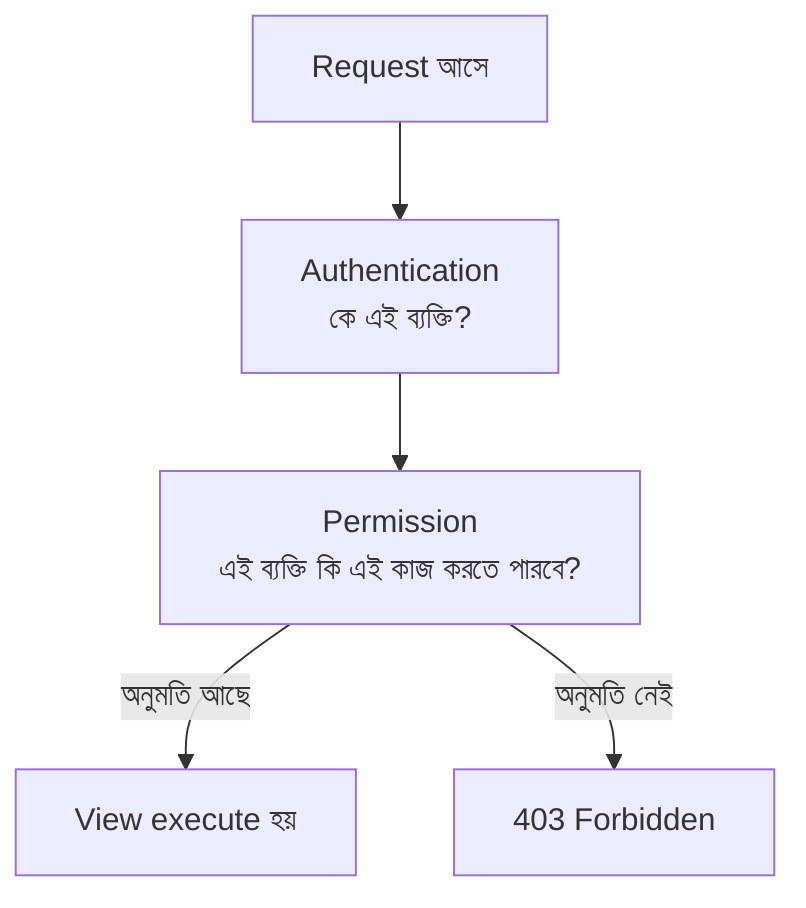
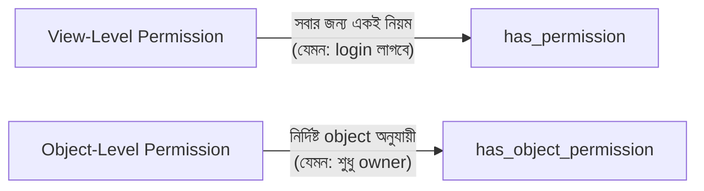
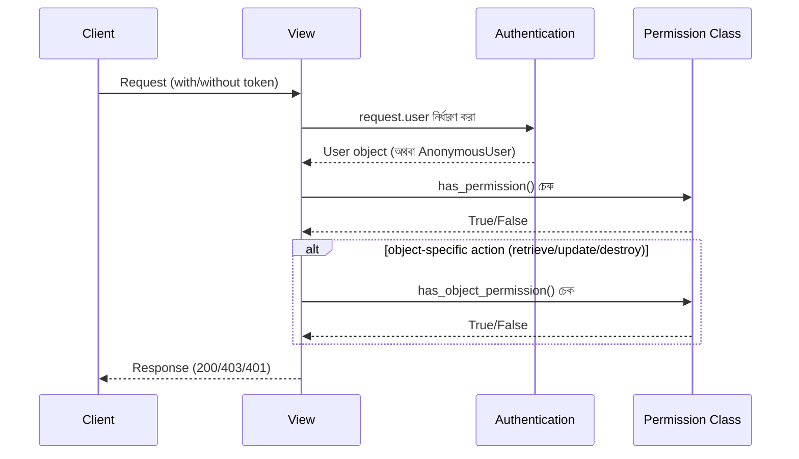

# Section 11: Permissions

আগের chapter এ আমরা Authentication দিয়ে জেনেছি **"কে"** request পাঠাচ্ছে। এই chapter এ আমরা দেখব **Permission** দিয়ে কীভাবে নিয়ন্ত্রণ করা যায় — সেই ব্যক্তি **"কী করার অনুমতি"** রাখে। যেমন, যেকেউ Post দেখতে পারবে, কিন্তু শুধু owner-ই সেই Post edit/delete করতে পারবে — এটাই Permission এর কাজ।

---

## Why — কেন Permission দরকার?

Authentication শুধু নিশ্চিত করে user login করা আছে কিনা। কিন্তু এটা বলে না:
- একজন সাধারণ user কি Admin-only ফিচার ব্যবহার করতে পারবে?
- একজন user কি অন্য কারো লেখা Post এডিট করতে পারবে?
- Anonymous (login না করা) user কি শুধু পড়তে পারবে, নাকি কিছুই দেখতে পারবে না?

এই প্রশ্নগুলোর উত্তর দেয় **Permission System**।



---

## DRF এর Built-in Permission Classes

| Permission Class | নিয়ম |
|---|---|
| `AllowAny` | সবাই অ্যাক্সেস করতে পারবে (login লাগবে না) |
| `IsAuthenticated` | শুধু login করা user অ্যাক্সেস করতে পারবে |
| `IsAdminUser` | শুধু `is_staff=True` থাকা user অ্যাক্সেস করতে পারবে |
| `IsAuthenticatedOrReadOnly` | সবাই GET করতে পারবে (পড়া), কিন্তু POST/PUT/DELETE এর জন্য login লাগবে |

---

## View এ Permission ব্যবহার করা

```python
from rest_framework.permissions import IsAuthenticated
from rest_framework import viewsets
from .models import Post
from .serializers import PostSerializer

class PostViewSet(viewsets.ModelViewSet):
    queryset = Post.objects.all()
    serializer_class = PostSerializer
    permission_classes = [IsAuthenticated]
```

### `permission_classes` — একাধিক Permission

```python
from rest_framework.permissions import IsAuthenticatedOrReadOnly

class PostViewSet(viewsets.ModelViewSet):
    queryset = Post.objects.all()
    serializer_class = PostSerializer
    permission_classes = [IsAuthenticatedOrReadOnly]
```

`permission_classes` একটা list — একাধিক class দিলে, **সবগুলো শর্ত পূরণ হলে তবেই** অনুমতি মেলে (AND logic)।

---

## Global Default Permission — Settings এ

```python
# blogapi/settings.py

REST_FRAMEWORK = {
    'DEFAULT_PERMISSION_CLASSES': [
        'rest_framework.permissions.IsAuthenticatedOrReadOnly',
    ],
}
```

এটা পুরো প্রজেক্টে ডিফল্ট permission সেট করে দেয় — কোনো View তে আলাদাভাবে `permission_classes` না দিলে এই default প্রযোজ্য হবে।

---

## বাস্তব উদাহরণ — Request/Response

### AllowAny দিয়ে — Anonymous User ও দেখতে পারবে

```
GET /api/posts/
(কোনো Authorization header ছাড়াই)
```

```json
// 200 OK — সমস্যা নেই
[{"id": 1, "title": "..."}]
```

### IsAuthenticated দিয়ে — Login ছাড়া চেষ্টা করলে

```
POST /api/posts/
(কোনো Authorization header ছাড়াই)
```

```json
// 401 Unauthorized
{
    "detail": "Authentication credentials were not provided."
}
```

---

## Object-Level Permission — সবচেয়ে গুরুত্বপূর্ণ Concept

উপরের সবগুলো Permission হলো **View-level** — অর্থাৎ, পুরো endpoint এর জন্য একই নিয়ম প্রযোজ্য। কিন্তু বাস্তবে প্রায়ই দরকার হয় **object-specific** নিয়ম — যেমন, "শুধু নিজের লেখা Post-ই edit/delete করা যাবে, অন্যেরটা না।" এর জন্য **Custom Permission** এবং **Object-Level Permission** লাগে।



---

## Custom Permission — নিজের Post শুধু নিজেই Edit করতে পারবে

```python
# blog/permissions.py

from rest_framework import permissions

class IsAuthorOrReadOnly(permissions.BasePermission):
    def has_object_permission(self, request, view, obj):
        if request.method in permissions.SAFE_METHODS:
            return True
        return obj.author == request.user
```

### লাইন ব্যাখ্যা

- `permissions.BasePermission` — সব custom permission এই class থেকে inherit করতে হয়
- `has_object_permission(self, request, view, obj)` — এই method DRF automatic ভাবে কল করে, যখন কোনো **নির্দিষ্ট object** নিয়ে কাজ করা হচ্ছে (retrieve, update, delete)
- `permissions.SAFE_METHODS` — এটা `['GET', 'HEAD', 'OPTIONS']` এর একটা tuple, অর্থাৎ শুধু পড়ার জন্য ব্যবহৃত method গুলো
- `if request.method in permissions.SAFE_METHODS: return True` — GET/HEAD/OPTIONS হলে সবসময় অনুমতি দাও (যে কেউ পড়তে পারবে)
- `return obj.author == request.user` — অন্য যেকোনো method (PUT, PATCH, DELETE) এর জন্য, শুধু তখনই অনুমতি দাও যখন request পাঠানো user-ই সেই Post এর author

### View এ ব্যবহার করা

```python
from .permissions import IsAuthorOrReadOnly

class PostViewSet(viewsets.ModelViewSet):
    queryset = Post.objects.all()
    serializer_class = PostSerializer
    permission_classes = [permissions.IsAuthenticatedOrReadOnly, IsAuthorOrReadOnly]
```

---

## `has_permission` vs `has_object_permission`

| Method | কখন কল হয় | কী চেক করে |
|---|---|---|
| `has_permission(self, request, view)` | প্রতিটা request এ, View-level এ | সাধারণ নিয়ম (যেমন login করা আছে কিনা) |
| `has_object_permission(self, request, view, obj)` | শুধু নির্দিষ্ট object নিয়ে কাজ করার সময় (retrieve, update, delete) | Object-specific নিয়ম (যেমন owner কিনা) |

::: warning
`has_object_permission()` শুধু তখনই কল হয় যখন view টা `get_object()` কল করে (যেমন Retrieve/Update/Destroy)। `list()` action এ এটা কল হয় না — তাই "শুধু নিজের Post দেখাবে" এই ধরনের filtering `has_object_permission` দিয়ে হয় না, এর জন্য `get_queryset()` override করতে হয়।
:::

---

## Queryset Filtering দিয়ে "নিজের ডেটা শুধু নিজে দেখা"

```python
class MyPostsViewSet(viewsets.ModelViewSet):
    serializer_class = PostSerializer
    permission_classes = [permissions.IsAuthenticated]

    def get_queryset(self):
        return Post.objects.filter(author=self.request.user)
```

এখানে `get_queryset()` override করে, প্রতিটা user শুধু **নিজের লেখা** Post ই দেখতে পাবে — এটা permission class দিয়ে না, বরং queryset filtering দিয়ে করা হচ্ছে।

---

## Custom Permission — শুধু Comment এর Author Delete করতে পারবে

```python
class IsCommentAuthor(permissions.BasePermission):
    def has_object_permission(self, request, view, obj):
        if request.method == 'DELETE':
            return obj.author == request.user
        return True
```

এভাবে প্রতিটা Model এর জন্য প্রয়োজন অনুযায়ী নির্দিষ্ট নিয়ম বানানো যায়।

---

## Permission Check এর সম্পূর্ণ Flow



---

## Common Mistakes

- `has_object_permission()` লিখেই ভাবা যে এটা `list()` এও কাজ করবে — এটা শুধু object-specific action এ কাজ করে
- `SAFE_METHODS` চেক করতে ভুলে যাওয়া, ফলে read করার জন্যও শুধু owner কে অনুমতি দেওয়া হয়ে যাওয়া
- `permission_classes` এ ভুল ক্রম বা ভুল combination দেওয়া, যার ফলে অপ্রত্যাশিত access denial/allowance হওয়া
- View-level এবং Object-level permission এর পার্থক্য না বুঝে ভুল জায়গায় logic লেখা

---

## Best Practices

- সাধারণ নিয়মের জন্য built-in class (`IsAuthenticated`, `IsAuthenticatedOrReadOnly`) ব্যবহার করো
- Owner-based নিয়মের জন্য সবসময় Custom Permission এ `has_object_permission()` ব্যবহার করো
- "শুধু নিজের ডেটা দেখানো" এর জন্য `get_queryset()` override করো, শুধু Permission দিয়ে এটা সমাধান করতে যেও না
- একাধিক Permission class একসাথে combine করে (AND logic) নিয়ম আরও নির্দিষ্ট করো

---

## Interview Questions

**প্রশ্ন: Authentication আর Permission এর মধ্যে পার্থক্য কী?**
> Authentication পরিচয় যাচাই করে ("তুমি কে?"), Permission অনুমতি যাচাই করে ("তুমি কি এই কাজ করতে পারবে?")। Authentication সবসময় Permission চেক করার আগে ঘটে।

**প্রশ্ন: `has_permission` আর `has_object_permission` এর পার্থক্য কী?**
> `has_permission` প্রতিটা request এ view-level এ কল হয় (সাধারণ নিয়ম)। `has_object_permission` শুধু নির্দিষ্ট object নিয়ে কাজ করার সময় (retrieve/update/destroy) কল হয় (object-specific নিয়ম)।

**প্রশ্ন: `SAFE_METHODS` কী?**
> এটা DRF এর একটা constant, যেখানে `GET`, `HEAD`, `OPTIONS` থাকে — অর্থাৎ, শুধু পড়ার (read-only) method গুলো। Custom permission এ এটা চেক করে সাধারণত সবাইকে পড়ার অনুমতি দেওয়া হয়, কিন্তু লেখার জন্য নির্দিষ্ট শর্ত রাখা হয়।

---

## Summary

- **Permission** নির্ধারণ করে একজন authenticated (বা anonymous) ব্যক্তি কী কাজ করতে পারবে
- **Built-in class**: `AllowAny`, `IsAuthenticated`, `IsAdminUser`, `IsAuthenticatedOrReadOnly`
- **Custom Permission** এ `has_object_permission()` দিয়ে owner-based নিয়ম (যেমন "শুধু নিজের Post edit করা যাবে") বানানো যায়
- **`SAFE_METHODS`** (GET/HEAD/OPTIONS) সাধারণত সবার জন্য উন্মুক্ত রাখা হয়, লেখার operation এ নির্দিষ্ট শর্ত রাখা হয়
- **`get_queryset()` filtering** ব্যবহার করা হয় যখন "শুধু নিজের ডেটা দেখা" দরকার হয়, Permission class দিয়ে না

পরের chapter — **Section 12: Filtering** — এ আমরা দেখব কীভাবে API তে Search, Ordering, এবং নির্দিষ্ট শর্ত অনুযায়ী Filtering যোগ করা যায়।
