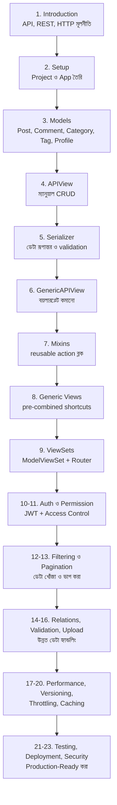
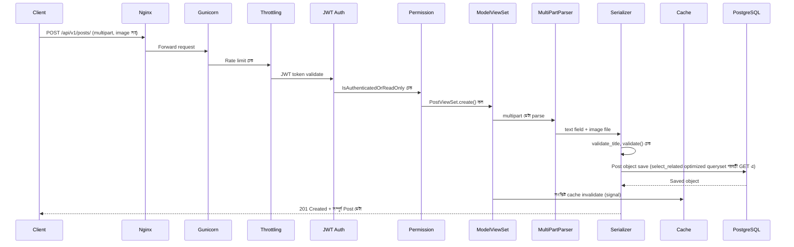

# Section 25: Complete Project Review — Blog API

এটাই এই ডকুমেন্টেশনের শেষ chapter। এখানে আমরা পুরো **Blog API** প্রজেক্টটাকে একসাথে, সামগ্রিকভাবে দেখব — কোন Section এ কী শেখা হলো, প্রতিটা টুকরো কীভাবে একটা সম্পূর্ণ, প্রোডাকশন-রেডি API তৈরি করতে একসাথে কাজ করে।

---

## যাত্রার সারসংক্ষেপ — কোন Section এ কী শেখা হলো



---

## সম্পূর্ণ Project Folder Structure

```
blogapi_project/
│
├── venv/
│
├── blogapi/                          ← মূল project config
│   ├── settings.py                    ← DRF, JWT, CORS, Cache, DB — সব কনফিগারেশন
│   ├── urls.py                         ← Root URL, Router include
│   └── wsgi.py                         ← Gunicorn এর জন্য
│
├── blog/                              ← মূল app
│   ├── migrations/
│   ├── models.py                       ← Post, Comment, Category, Tag, Profile
│   ├── serializers.py                  ← PostSerializer, CategorySerializer, ইত্যাদি
│   ├── views.py                         ← ModelViewSet গুলো
│   ├── permissions.py                   ← IsAuthorOrReadOnly (custom)
│   ├── filters.py                       ← PostFilter (custom FilterSet)
│   ├── pagination.py                    ← Custom Pagination class
│   ├── validators.py                    ← Reusable custom validator
│   ├── signals.py                       ← Cache invalidation signal
│   ├── urls.py                          ← Router registration
│   ├── admin.py                         ← Admin panel registration
│   └── tests.py                          ← APITestCase গুলো
│
├── media/                              ← Uploaded image (dev এ)
├── staticfiles/                          ← collectstatic এর output
├── requirements.txt
├── .env                                  ← Secret key, DB credential (git এ না)
└── manage.py
```

---

## একটা Single Request এর সম্পূর্ণ Journey — সব Chapter একসাথে

চলো একটা বাস্তব উদাহরণ দিয়ে দেখি — একজন user "Technology" category তে একটা image সহ নতুন Post তৈরি করছে, এবং পুরো Blog API stack কীভাবে এটা handle করে।



এই একটা diagram এ **প্রায় প্রতিটা Section** এর কাজ দেখা যাচ্ছে — Nginx/Gunicorn (Deployment), Throttling, Authentication, Permission, ViewSet, Upload (Parser), Serializer/Validation, Database (Performance-optimized), এবং Caching।

---

## প্রতিটা Layer এর দায়িত্ব — একনজরে

| Layer | দায়িত্ব | সংশ্লিষ্ট Section |
|---|---|---|
| **Nginx** | Static/Media serve, SSL, load balancing | 22 |
| **Gunicorn** | Multiple worker দিয়ে concurrent request handle | 22 |
| **Throttling** | Abuse prevention, rate limiting | 19 |
| **Authentication** | পরিচয় যাচাই (JWT) | 10 |
| **Permission** | অনুমতি যাচাই (owner-based) | 11 |
| **ViewSet + Router** | HTTP method কে action এ route করা | 9 |
| **Serializer** | ডেটা রূপান্তর ও validation | 5, 15 |
| **Filter/Pagination** | ডেটা খোঁজা ও ভাগ করা | 12, 13 |
| **ORM (select_related ইত্যাদি)** | Efficient database query | 17 |
| **Cache** | দ্রুত response, database load কমানো | 20 |
| **Model** | Database structure | 3 |

---

## Feature Checklist — সবকিছু বাস্তবায়িত হয়েছে

| Feature | বাস্তবায়িত হয়েছে | সংশ্লিষ্ট Section |
|---|---|---|
| ✅ Users, Authentication | JWT (Access + Refresh) | 10 |
| ✅ Posts CRUD | ModelViewSet | 9 |
| ✅ Categories, Tags | ForeignKey, ManyToMany | 3, 14 |
| ✅ Comments | ForeignKey সম্পর্ক | 3 |
| ✅ Likes, Bookmarks | ManyToMany self-relation | 3, 9 (@action) |
| ✅ Profiles, Images | OneToOne, ImageField | 3, 16 |
| ✅ Pagination | PageNumberPagination/CursorPagination | 13 |
| ✅ Search, Filtering, Ordering | SearchFilter, DjangoFilterBackend | 12 |
| ✅ Permissions | Custom Object-level | 11 |
| ✅ JWT Authentication | SimpleJWT | 10 |

---

## এরপর কী শিখবে (এই ডকুমেন্টেশনের বাইরে)

এই ডকুমেন্টেশন DRF এর একদম fundamentals থেকে production-ready concept পর্যন্ত কভার করেছে। এরপর গভীরে যেতে চাইলে:

- **Celery + Redis** — asynchronous task (যেমন email পাঠানো, ভারী রিপোর্ট generate করা)
- **Django Channels** — WebSocket, real-time feature (live notification)
- **GraphQL (Graphene-Django)** — REST এর বিকল্প API architecture
- **Docker ও Kubernetes** — Containerization ও orchestration
- **CI/CD Pipeline** — GitHub Actions/GitLab CI দিয়ে automated deployment
- **Microservices Architecture** — বড় সিস্টেমে Blog API কে একটা independent service হিসেবে ডিজাইন করা

---

## চূড়ান্ত পরামর্শ

DRF শেখা মানে শুধু syntax মুখস্থ করা না — এই ডকুমেন্টেশন জুড়ে আমরা বারবার দেখেছি **কেন** DRF এভাবে ডিজাইন করা (Mixin এর composition philosophy, GenericAPIView এর abstraction layer, ViewSet এর action-based approach)। এই "কেন" বোঝাটাই তোমাকে নতুন সমস্যায় নিজে থেকে সঠিক সমাধান বেছে নিতে সাহায্য করবে, শুধু আগে দেখা প্যাটার্ন কপি-পেস্ট করার বদলে।

**পরবর্তী পদক্ষেপ:** এই Blog API প্রজেক্টটা নিজে হাতে-কলমে বানাও, প্রতিটা Section এর কোড নিজে টাইপ করে চালাও (কপি-পেস্ট না করে), এবং নিজের একটা ভিন্ন প্রজেক্ট (যেমন E-commerce API বা Task Manager API) এ একই concept গুলো প্রয়োগ করার চেষ্টা করো — এটাই প্রকৃত দক্ষতা তৈরি করবে।

---

## সম্পূর্ণ ডকুমেন্টেশন সম্পন্ন! 🎉

**Section 1 থেকে 25** — API এর মূল ধারণা থেকে শুরু করে, একটা সম্পূর্ণ, secure, performant, এবং well-tested production-ready Blog API পর্যন্ত — পুরো journey টা এখানেই শেষ হলো।

শুভকামনা তোমার DRF যাত্রায়! 🚀
