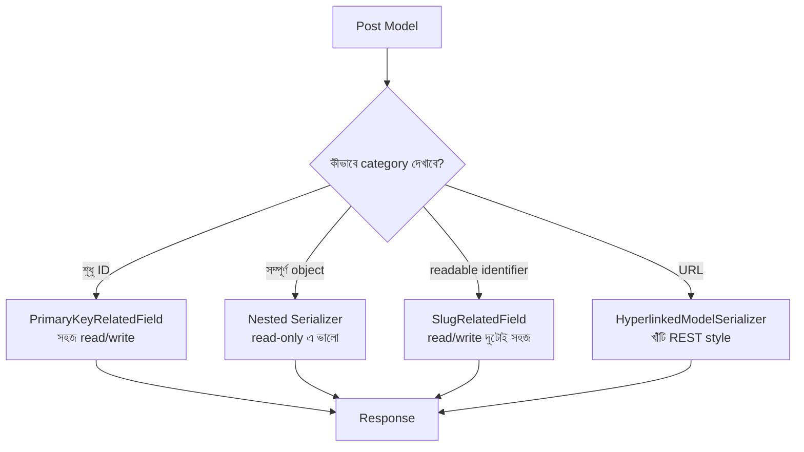

# Section 14: Relations

আমাদের Blog API তে Post এর সাথে Category, Tag, Author — একাধিক related Model যুক্ত। এই chapter এ আমরা গভীরভাবে দেখব, DRF এ related field কে **কতভাবে** সিরিয়ালাইজ করা যায় — শুধু ID, নাকি সম্পূর্ণ nested object, নাকি একটা readable slug, নাকি একটা hyperlink — এবং কখন কোনটা ব্যবহার করা উচিত।

---

## Why — কেন এতগুলো উপায় দরকার?

Post এর `category` field কে ভিন্ন ভিন্ন situation এ ভিন্নভাবে দেখানো দরকার হতে পারে:

```json
// শুধু ID (হালকা, কিন্তু client কে আবার আলাদা করে category এর নাম আনতে হবে)
{"category": 2}

// সম্পূর্ণ nested object (ভারী, কিন্তু সব তথ্য একসাথে)
{"category": {"id": 2, "name": "Technology", "slug": "technology"}}

// শুধু readable slug (compact, এবং readable)
{"category": "technology"}

// Hyperlink (client কে সরাসরি সেই resource এর URL দিয়ে দেওয়া)
{"category": "http://api.example.com/categories/2/"}
```

DRF প্রতিটা পরিস্থিতির জন্য আলাদা field type দেয়।

---

## PrimaryKeyRelatedField — ডিফল্ট আচরণ

```python
class PostSerializer(serializers.ModelSerializer):
    class Meta:
        model = Post
        fields = ['id', 'title', 'category']
```

`ModelSerializer` এ `category` কে বিশেষভাবে define না করলে, এটা ডিফল্টভাবে `PrimaryKeyRelatedField` ব্যবহার করে — শুধু ID দেখায়।

```json
{"id": 1, "title": "পোস্ট", "category": 2}
```

### Write করার সময়

```json
// Client পাঠাবে:
{"title": "নতুন পোস্ট", "category": 2}
```

শুধু ID পাঠালেই DRF automatic ভাবে সেই ID এর Category object খুঁজে নিয়ে Post এর সাথে যুক্ত করে দেয় — এটাই `PrimaryKeyRelatedField` এর সবচেয়ে বড় সুবিধা: **read এবং write দুই দিকেই সহজে কাজ করে**, কোনো অতিরিক্ত override ছাড়াই।

---

## Nested Serializer — সম্পূর্ণ Object দেখানো

আগের chapter এ আমরা এটা দেখেছিলাম, আবার মনে করিয়ে দিচ্ছি:

```python
class PostSerializer(serializers.ModelSerializer):
    category = CategorySerializer(read_only=True)

    class Meta:
        model = Post
        fields = ['id', 'title', 'category']
```

```json
{
    "id": 1,
    "title": "পোস্ট",
    "category": {"id": 2, "name": "Technology", "slug": "technology"}
}
```

### সমস্যা: Nested Serializer দিয়ে Write করা

Nested Serializer ডিফল্ট ভাবে **শুধু read-only** কাজ করে — যদি `read_only=True` না দাও এবং client nested object দিয়ে write করার চেষ্টা করে, DRF error দেবে, কারণ এটা জানে না nested ডেটা দিয়ে ঠিক কীভাবে save করতে হবে।

```python
# এভাবে write করতে চাইলে সমস্যা হবে
class PostSerializer(serializers.ModelSerializer):
    category = CategorySerializer()  # read_only=True নেই

    class Meta:
        model = Post
        fields = ['id', 'title', 'category']
```

এই সমস্যা সমাধান করতে `create()`/`update()` method নিজে override করতে হয় — এটা জটিল, তাই সাধারণত **Nested Serializer শুধু read-only হিসেবেই ব্যবহার করা হয়**।

---

## SlugRelatedField — Readable কিন্তু Compact

```python
class PostSerializer(serializers.ModelSerializer):
    category = serializers.SlugRelatedField(
        slug_field='slug',
        queryset=Category.objects.all()
    )

    class Meta:
        model = Post
        fields = ['id', 'title', 'category']
```

```json
{"id": 1, "title": "পোস্ট", "category": "technology"}
```

### লাইন ব্যাখ্যা

- `slug_field='slug'` — Category model এর `slug` field ব্যবহার করে দেখানো হবে, ID না
- `queryset=Category.objects.all()` — Write করার সময়, DRF এই queryset এ সেই slug আছে কিনা যাচাই করবে

### Write করার সময়

```json
// Client পাঠাবে:
{"title": "নতুন পোস্ট", "category": "technology"}
```

এভাবে client কে numeric ID মনে রাখতে হয় না — human-readable slug দিয়েই কাজ চলে, এবং এটা read/write দুই দিকেই স্বয়ংক্রিয়ভাবে কাজ করে (Nested Serializer এর মতো জটিলতা ছাড়াই)।

::: tip
`SlugRelatedField` একটা চমৎকার মধ্যম সমাধান — `PrimaryKeyRelatedField` এর simplicity এবং Nested Serializer এর readability — দুটোর সুবিধাই কিছুটা পাওয়া যায়, কোনো `create()`/`update()` override ছাড়াই।
:::

---

## HyperlinkedModelSerializer — REST এর "খাঁটি" দর্শন

`HyperlinkedModelSerializer` প্রতিটা resource কে (এমনকি স্বয়ং object টাকেও) একটা URL হিসেবে দেখায়, ID এর বদলে — এটা REST এর **HATEOAS** (Hypermedia as the Engine of Application State) নীতির কাছাকাছি।

```python
class PostSerializer(serializers.HyperlinkedModelSerializer):
    class Meta:
        model = Post
        fields = ['url', 'title', 'category']
```

```json
{
    "url": "http://api.example.com/posts/1/",
    "title": "পোস্ট",
    "category": "http://api.example.com/categories/2/"
}
```

### লাইন ব্যাখ্যা

- এখানে `id` এর বদলে `url` field automatic ভাবে যুক্ত হয় — যেটা সেই object এর detail endpoint এর সম্পূর্ণ URL
- `category` field ও automatic ভাবে সেই Category এর URL দেখায়, ID না

::: warning
`HyperlinkedModelSerializer` ব্যবহার করতে হলে URL Router এ `name` (যেমন `category-detail`) সঠিকভাবে সেট করা থাকতে হবে, নাহলে DRF সঠিক URL বানাতে পারবে না। এই পদ্ধতি DRF এর "খাঁটি" দর্শন প্রতিফলিত করলেও, বাস্তবে বেশিরভাগ modern API (বিশেষত React/Vue frontend এর সাথে ব্যবহৃত) সরলতার জন্য `PrimaryKeyRelatedField` বা `SlugRelatedField` ব্যবহার করে।
:::

---

## চারটা পদ্ধতির তুলনা

| পদ্ধতি | Output | Read | Write | কখন ব্যবহার করবে |
|---|---|---|---|---|
| `PrimaryKeyRelatedField` (ডিফল্ট) | `2` | ✅ | ✅ সহজ | সাধারণ ক্ষেত্রে, ডিফল্ট পছন্দ |
| Nested Serializer | `{...}` | ✅ | ❌ জটিল (override লাগে) | শুধু পড়ার জন্য, সম্পূর্ণ তথ্য দেখাতে চাইলে |
| `SlugRelatedField` | `"technology"` | ✅ | ✅ সহজ | Human-readable identifier দরকার হলে |
| `HyperlinkedModelSerializer` | `"http://.../2/"` | ✅ | ✅ সহজ | খাঁটি RESTful/HATEOAS style API |

---

## বাস্তব প্রয়োগ — Read এ Nested, Write এ ID (দুই world এর সেরাটা)

একটা খুবই common এবং practical প্যাটার্ন হলো — **আলাদা Serializer** ব্যবহার করা read এবং write এর জন্য।

```python
class PostReadSerializer(serializers.ModelSerializer):
    category = CategorySerializer(read_only=True)
    tags = TagSerializer(many=True, read_only=True)

    class Meta:
        model = Post
        fields = ['id', 'title', 'category', 'tags']


class PostWriteSerializer(serializers.ModelSerializer):
    class Meta:
        model = Post
        fields = ['id', 'title', 'category', 'tags']  # এখানে category/tags আসবে PrimaryKeyRelatedField হিসেবে (ডিফল্ট)
```

```python
class PostViewSet(viewsets.ModelViewSet):
    queryset = Post.objects.all()

    def get_serializer_class(self):
        if self.request.method in ['POST', 'PUT', 'PATCH']:
            return PostWriteSerializer
        return PostReadSerializer
```

### লাইন ব্যাখ্যা

- `get_serializer_class()` override করে, HTTP Method অনুযায়ী ভিন্ন Serializer বেছে নেওয়া হচ্ছে
- **GET request** এ সম্পূর্ণ nested category/tags তথ্য পাওয়া যায় (readable, frontend এর জন্য সুবিধাজনক)
- **POST/PUT/PATCH request** এ শুধু ID দিয়ে সহজে write করা যায় (client এর জন্য সহজ)

এই প্যাটার্নটা বাস্তব production API তে খুবই জনপ্রিয় — **read এবং write এর চাহিদা আলাদা**, তাই আলাদা Serializer ব্যবহার করাই যুক্তিসঙ্গত।

---

## Relations এর Flow Diagram



---

## Common Mistakes

- Nested Serializer কে writable বানানোর চেষ্টা করা `create()`/`update()` override না করেই — এতে error আসবে
- `SlugRelatedField` এ `queryset` দিতে ভুলে যাওয়া (write operation এ এটা বাধ্যতামূলক)
- `HyperlinkedModelSerializer` ব্যবহার করার সময় URL এর `name` ঠিকভাবে সেট না করা
- সবসময় একটাই Serializer দিয়ে read এবং write দুটোই সামলানোর চেষ্টা করা, যেখানে আলাদা Read/Write Serializer অনেক বেশি পরিষ্কার সমাধান দিত

---

## Best Practices

- সাধারণ ক্ষেত্রে ডিফল্ট `PrimaryKeyRelatedField` দিয়েই শুরু করো
- Frontend এ readable তথ্য দরকার হলে, GET এর জন্য আলাদা Nested/Read Serializer বানাও
- `get_serializer_class()` override করে Method-based Serializer selection ব্যবহার করা একটা প্রমাণিত, পরিষ্কার প্যাটার্ন
- খাঁটি RESTful API (public, third-party consumption এর জন্য) বানালে `HyperlinkedModelSerializer` বিবেচনা করো

---

## Interview Questions

**প্রশ্ন: Nested Serializer কেন ডিফল্টভাবে writable না?**
> কারণ DRF জানে না, nested ডেটা এলে সেটা কীভাবে save করতে হবে (নতুন related object তৈরি করবে, নাকি বিদ্যমান একটা attach করবে) — এই সিদ্ধান্ত application-specific, তাই DRF automatic assumption না করে developer কে `create()`/`update()` override করতে বাধ্য করে।

**প্রশ্ন: `SlugRelatedField` এর সুবিধা কী?**
> এটা human-readable identifier (যেমন slug) দিয়ে read এবং write দুই দিকেই সহজে কাজ করে — Nested Serializer এর জটিলতা ছাড়াই readable output দেয়।

**প্রশ্ন: Read এবং Write এর জন্য আলাদা Serializer ব্যবহার করা কেন ভালো practice?**
> কারণ read (client কে সম্পূর্ণ, readable তথ্য দেখানো) এবং write (client থেকে সহজ, ID-based ইনপুট নেওয়া) এর চাহিদা সম্পূর্ণ ভিন্ন — একটা Serializer দিয়ে দুটো ভালোভাবে সামলানো কঠিন এবং জটিল override দরকার হয়।

---

## Summary

- **`PrimaryKeyRelatedField`** (ডিফল্ট) — সহজ, read/write উভয় দিকেই কাজ করে, ID দেখায়
- **Nested Serializer** — সম্পূর্ণ object দেখায়, কিন্তু সাধারণত শুধু read-only ব্যবহার হয়
- **`SlugRelatedField`** — human-readable identifier, read/write দুটোই সহজে সাপোর্ট করে
- **`HyperlinkedModelSerializer`** — URL-based, খাঁটি REST/HATEOAS দর্শন
- **সবচেয়ে practical প্যাটার্ন**: `get_serializer_class()` দিয়ে GET এ read-optimized (nested), POST/PUT এ write-optimized (ID-based) Serializer বেছে নেওয়া

পরের chapter — **Section 15: Validation** — এ আমরা field ও object level validation নিয়ে আরও গভীরে যাব, custom validator সহ।
