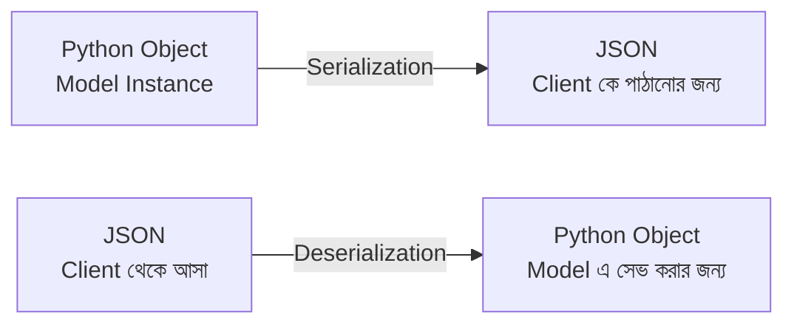
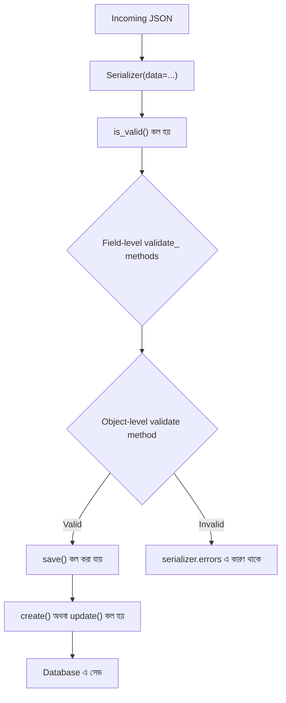

# Section 5: Serializer

আগের chapter এ আমরা `APIView` দিয়ে দেখেছি কীভাবে ম্যানুয়ালি Model এর ডেটা কে dictionary বানিয়ে JSON এ রূপান্তর করতে হয়, এবং ইনপুট ডেটা ম্যানুয়ালি validate করতে হয়। এই কাজটাই — **অনেক কম কোডে, অনেক বেশি নির্ভরযোগ্যভাবে** — করার জন্য DRF দেয় **Serializer**। এটা DRF এর সবচেয়ে গুরুত্বপূর্ণ এবং সবচেয়ে বেশি ব্যবহৃত concept গুলোর একটা।

---

## Why — কেন Serializer দরকার?

আগের chapter এ আমরা লিখেছিলাম:

```python
# ম্যানুয়াল পদ্ধতি — প্রতিটা field হাতে লিখতে হচ্ছে
data = []
for post in posts:
    data.append({
        "id": post.id,
        "title": post.title,
        "content": post.content,
        "author": post.author.username,
    })
```

Model এ যদি ২০টা field থাকে, এই কাজটা ২০ লাইনে গিয়ে দাঁড়াবে — এবং প্রতিটা view তে এই একই কাজ বারবার লিখতে হবে। Serializer এই পুরো কাজ automate করে দেয়।

---

## Serialization এবং Deserialization কী?

এই দুইটা টার্ম Serializer এর নাম থেকেই এসেছে, এবং এই দুই দিকেই এটা কাজ করে।



| টার্ম | দিক | উদাহরণ |
|---|---|---|
| **Serialization** | Python Object → JSON | Database থেকে আনা Post কে client এ পাঠানোর জন্য JSON বানানো |
| **Deserialization** | JSON → Python Object | Client এর পাঠানো JSON কে validate করে Model এ সেভ করার উপযোগী বানানো |

---

## Analogy

Serializer কে ভাবা যায় একটা **অনুবাদক (translator)** হিসেবে। Database এর ভাষা (Python object) আর বাইরের দুনিয়ার ভাষা (JSON) আলাদা — Serializer এই দুই ভাষার মধ্যে দোভাষীর কাজ করে, দুই দিকেই।

---

## দুই ধরনের Serializer: `Serializer` vs `ModelSerializer`

DRF এ দুইভাবে Serializer লেখা যায়।

### `Serializer` — সম্পূর্ণ ম্যানুয়াল

```python
from rest_framework import serializers

class PostSerializer(serializers.Serializer):
    id = serializers.IntegerField(read_only=True)
    title = serializers.CharField(max_length=255)
    content = serializers.CharField()
    author = serializers.CharField(source='author.username', read_only=True)
```

এখানে প্রতিটা field আলাদাভাবে define করতে হয় — Model এর field এর সাথে হুবহু মিলিয়ে।

### `ModelSerializer` — Model থেকে Automatic

```python
class PostSerializer(serializers.ModelSerializer):
    class Meta:
        model = Post
        fields = ['id', 'title', 'content', 'author']
```

`ModelSerializer` সরাসরি Model দেখে নিজে থেকেই field, type, এবং validation rule বের করে নেয় — অনেক কম কোডে একই কাজ হয়ে যায়।

---

## `Serializer` vs `ModelSerializer` — তুলনা

| বৈশিষ্ট্য | `Serializer` | `ModelSerializer` |
|---|---|---|
| Field define করা | ম্যানুয়ালি, প্রতিটা field আলাদা | Model থেকে automatic |
| Validation | নিজে লিখতে হয় | Model এর constraint থেকে automatic আসে |
| Boilerplate কোড | বেশি | কম |
| Flexibility | সম্পূর্ণ নিয়ন্ত্রণ (Model ছাড়াই ব্যবহার করা যায়) | Model-based হওয়ায় কিছুটা সীমাবদ্ধ, কিন্তু override করা যায় |
| কখন ব্যবহার করবে | Model নেই এমন ডেটা (যেমন শুধু login credential) | Model-ভিত্তিক প্রায় সব ক্ষেত্রে (recommended) |

::: tip
বাস্তব প্রজেক্টে ৯৫% ক্ষেত্রে `ModelSerializer` ব্যবহার করা হয় — `Serializer` মূলত তখনই দরকার হয় যখন কোনো নির্দিষ্ট Model এর সাথে সরাসরি সম্পর্কিত না এমন ডেটা নিয়ে কাজ করতে হয় (যেমন শুধু login এর জন্য username/password নেওয়া)।
:::

---

## সম্পূর্ণ Blog API Serializer

```python
# blog/serializers.py

from rest_framework import serializers
from .models import Post, Category, Tag, Comment

class CategorySerializer(serializers.ModelSerializer):
    class Meta:
        model = Category
        fields = ['id', 'name', 'slug']

class TagSerializer(serializers.ModelSerializer):
    class Meta:
        model = Tag
        fields = ['id', 'name', 'slug']

class PostSerializer(serializers.ModelSerializer):
    author = serializers.CharField(source='author.username', read_only=True)

    class Meta:
        model = Post
        fields = ['id', 'title', 'slug', 'content', 'author', 'category', 'tags', 'is_published', 'created_at']
        read_only_fields = ['slug', 'created_at']
```

### লাইন ব্যাখ্যা

- `author = serializers.CharField(source='author.username', read_only=True)` — `author` field কে override করা হয়েছে, যাতে সরাসরি `author` এর ID এর বদলে username দেখানো যায়; `source='author.username'` মানে ORM এর মাধ্যমে `author` এর `username` attribute অ্যাক্সেস করা হচ্ছে
- `read_only=True` — এই field শুধু output এ দেখানো হবে, কিন্তু client থেকে input হিসেবে গ্রহণ করা হবে না
- `Meta.fields` — কোন কোন field সিরিয়ালাইজে অন্তর্ভুক্ত হবে তার তালিকা
- `read_only_fields` — এই field গুলো output এ থাকবে, কিন্তু input এ পাঠালেও গ্রহণ হবে না (যেমন `slug` automatic ভাবে তৈরি হয়, client থেকে দেওয়ার দরকার নেই)

---

## APIView এ Serializer ব্যবহার করা

আগের chapter এর `PostListAPIView` কে এখন Serializer দিয়ে অনেক পরিষ্কার করা যায়:

```python
from rest_framework.views import APIView
from rest_framework.response import Response
from rest_framework import status
from .models import Post
from .serializers import PostSerializer

class PostListAPIView(APIView):
    def get(self, request):
        posts = Post.objects.all()
        serializer = PostSerializer(posts, many=True)
        return Response(serializer.data)

    def post(self, request):
        serializer = PostSerializer(data=request.data)
        if serializer.is_valid():
            serializer.save(author=request.user)
            return Response(serializer.data, status=status.HTTP_201_CREATED)
        return Response(serializer.errors, status=status.HTTP_400_BAD_REQUEST)
```

### লাইন ব্যাখ্যা

- `PostSerializer(posts, many=True)` — একাধিক object serialize করার সময় `many=True` অবশ্যই দিতে হবে, নাহলে DRF একটামাত্র object আশা করবে
- `serializer.data` — serialize হওয়া চূড়ান্ত dictionary/list, সরাসরি `Response` এ পাঠানো যায়
- `PostSerializer(data=request.data)` — deserialization এর জন্য, `data=` প্যারামিটার দিয়ে incoming JSON পাস করা হয়
- `serializer.is_valid()` — Model এর constraint (max_length, required, ইত্যাদি) অনুযায়ী automatic validation চালায়; `False` হলে `serializer.errors` এ কারণ পাওয়া যায়
- `serializer.save(author=request.user)` — validate হওয়া ডেটা দিয়ে database এ নতুন object তৈরি করে; `save()` এ extra argument (যেমন `author`) দিলে সেটাও object এ যুক্ত হয়ে যায়

::: warning
`serializer.is_valid()` কল না করে `serializer.save()` কল করলে error আসবে — validation ছাড়া save করা যায় না। এটা DRF এর ইচ্ছাকৃত নিরাপত্তা ব্যবস্থা।
:::

---

## Validation

### Field-level Validation

নির্দিষ্ট একটা field এর জন্য custom validation লিখতে `validate_<fieldname>` নামের method বানাতে হয়।

```python
class PostSerializer(serializers.ModelSerializer):
    class Meta:
        model = Post
        fields = ['id', 'title', 'content']

    def validate_title(self, value):
        if len(value) < 5:
            raise serializers.ValidationError("Title অন্তত ৫ অক্ষরের হতে হবে।")
        return value
```

### Object-level Validation

একাধিক field একসাথে বিবেচনা করে validation করতে `validate()` method ব্যবহার করা হয়।

```python
    def validate(self, data):
        if data['title'] == data.get('content', ''):
            raise serializers.ValidationError("Title এবং Content একই হতে পারবে না।")
        return data
```

---

## Nested Serializer

যখন একটা Serializer এর ভিতরে আরেকটা related object এর সম্পূর্ণ ডেটা দেখাতে হয় (শুধু ID না), তখন Nested Serializer ব্যবহার করা হয়।

```python
class PostSerializer(serializers.ModelSerializer):
    category = CategorySerializer(read_only=True)
    tags = TagSerializer(many=True, read_only=True)

    class Meta:
        model = Post
        fields = ['id', 'title', 'content', 'category', 'tags']
```

### Output এর পার্থক্য

```json
// Nested Serializer ছাড়া (শুধু ID):
{
    "id": 1,
    "title": "পোস্ট",
    "category": 2
}

// Nested Serializer সহ (সম্পূর্ণ object):
{
    "id": 1,
    "title": "পোস্ট",
    "category": {
        "id": 2,
        "name": "Technology",
        "slug": "technology"
    }
}
```

::: tip
Nested Serializer সাধারণত `read_only=True` দিয়ে ব্যবহার করা হয় — কারণ nested ডেটা দিয়ে সরাসরি write করা জটিল (DRF ডিফল্ট ভাবে nested write সাপোর্ট করে না, এর জন্য `create()`/`update()` override করতে হয়)।
:::

---

## SerializerMethodField

যখন কোনো field সরাসরি Model এ নেই, বরং কোনো হিসাব/লজিক থেকে আসে, তখন `SerializerMethodField` ব্যবহার করা হয়।

```python
class PostSerializer(serializers.ModelSerializer):
    comment_count = serializers.SerializerMethodField()
    like_count = serializers.SerializerMethodField()

    class Meta:
        model = Post
        fields = ['id', 'title', 'comment_count', 'like_count']

    def get_comment_count(self, obj):
        return obj.comments.count()

    def get_like_count(self, obj):
        return obj.likes.count()
```

### লাইন ব্যাখ্যা

- `comment_count = serializers.SerializerMethodField()` — এই field এর মান আসবে `get_comment_count` নামের method থেকে (নামের pattern: `get_<field_name>`)
- `obj` — যে Post instance টা serialize হচ্ছে, সেটা প্যারামিটার হিসেবে পাওয়া যায়
- এই field সবসময় **read-only** — কারণ এটা গণনা করা মান, সরাসরি database column না

---

## Read Only এবং Write Only Fields

```python
class UserRegisterSerializer(serializers.ModelSerializer):
    password = serializers.CharField(write_only=True)

    class Meta:
        model = User
        fields = ['id', 'username', 'email', 'password']
```

| Property | মানে |
|---|---|
| `read_only=True` | শুধু output (GET response) এ দেখাবে, input এ গ্রহণ করবে না |
| `write_only=True` | শুধু input এ গ্রহণ করবে (যেমন password), output এ কখনো ফেরত পাঠাবে না — নিরাপত্তার জন্য গুরুত্বপূর্ণ |

::: warning
Password field এ `write_only=True` না দিলে, API response এ hashed password ফেরত পাঠানো হয়ে যেতে পারে — এটা একটা গুরুতর security ভুল।
:::

---

## Context — Serializer এ অতিরিক্ত তথ্য পাঠানো

কখনো কখনো Serializer এর ভিতরে `request` object বা অন্য কোনো contextual তথ্য দরকার হয় — এর জন্য `context` ব্যবহার করা হয়।

```python
class PostSerializer(serializers.ModelSerializer):
    is_liked_by_me = serializers.SerializerMethodField()

    class Meta:
        model = Post
        fields = ['id', 'title', 'is_liked_by_me']

    def get_is_liked_by_me(self, obj):
        request = self.context.get('request')
        if request and request.user.is_authenticated:
            return obj.likes.filter(id=request.user.id).exists()
        return False
```

```python
# View এ context পাঠানো
serializer = PostSerializer(posts, many=True, context={'request': request})
```

এভাবে Serializer জানতে পারে **কে** এই request পাঠাচ্ছে, এবং সেই অনুযায়ী dynamic ডেটা (যেমন "আমি এই পোস্ট লাইক করেছি কিনা") রিটার্ন করতে পারে।

---

## Serializer এর Internal Flow



---

## Common Mistakes

- `many=True` দিতে ভুলে যাওয়া যখন একাধিক object serialize করা হচ্ছে
- `is_valid()` কল না করে সরাসরি `save()` কল করা
- Password এর মতো sensitive field এ `write_only=True` না দেওয়া
- Nested Serializer কে writable বানানোর চেষ্টা করা `create()`/`update()` override না করেই

---

## Best Practices

- সবসময় `ModelSerializer` ব্যবহার করো যদি না বিশেষ কারণ থাকে
- Sensitive field এ অবশ্যই `write_only=True` দাও
- Computed/derived field এর জন্য `SerializerMethodField` ব্যবহার করো
- Context এর মাধ্যমে `request` পাস করে dynamic, user-specific ডেটা দাও

---

## Interview Questions

**প্রশ্ন: Serialization আর Deserialization এর পার্থক্য কী?**
> Serialization হলো Python object কে JSON এ রূপান্তর করা (output এর জন্য)। Deserialization হলো JSON কে validate করে Python object এ রূপান্তর করা (input এর জন্য)।

**প্রশ্ন: `Serializer` আর `ModelSerializer` এর মধ্যে পার্থক্য কী?**
> `ModelSerializer` একটা Model থেকে automatic ভাবে field এবং validation বের করে নেয়, বয়লারপ্লেট কোড কমায়। `Serializer` এ প্রতিটা field ম্যানুয়ালি define করতে হয়, কিন্তু কোনো Model ছাড়াও ব্যবহার করা যায়।

**প্রশ্ন: `SerializerMethodField` কখন ব্যবহার করবে?**
> যখন কোনো field সরাসরি Model column না, বরং কোনো গণনা বা লজিক থেকে আসে (যেমন comment count, like count) — তখন এটা ব্যবহার করা হয়।

**প্রশ্ন: `write_only` আর `read_only` এর মধ্যে পার্থক্য কী?**
> `write_only` field শুধু input হিসেবে গ্রহণ হয়, output এ কখনো দেখানো হয় না (যেমন password)। `read_only` field শুধু output এ দেখানো হয়, input হিসেবে গ্রহণ করা হয় না (যেমন auto-generated id)।

---

## Summary

- **Serializer** Python object ↔ JSON এর মধ্যে দোভাষীর কাজ করে — Serialization (output) এবং Deserialization (input) দুই দিকেই
- **`ModelSerializer`** Model থেকে automatic ভাবে field/validation বের করে নেয় — বেশিরভাগ ক্ষেত্রে এটাই সঠিক পছন্দ
- **Field-level (`validate_<field>`)** এবং **Object-level (`validate`)** — দুই ধরনের custom validation করা যায়
- **Nested Serializer** দিয়ে related object এর সম্পূর্ণ ডেটা দেখানো যায়, **SerializerMethodField** দিয়ে গণনা করা field দেখানো যায়
- **`read_only`/`write_only`** field access নিয়ন্ত্রণ করে, **`context`** দিয়ে অতিরিক্ত তথ্য (যেমন `request`) Serializer এ পাঠানো যায়

পরের chapter এ আমরা যাব **Section 6: GenericAPIView** — যেখানে দেখব কীভাবে `APIView` এর repetitive কোড (`get_object`, serializer ব্যবহারের প্যাটার্ন) আরও কমিয়ে ফেলা যায়।
