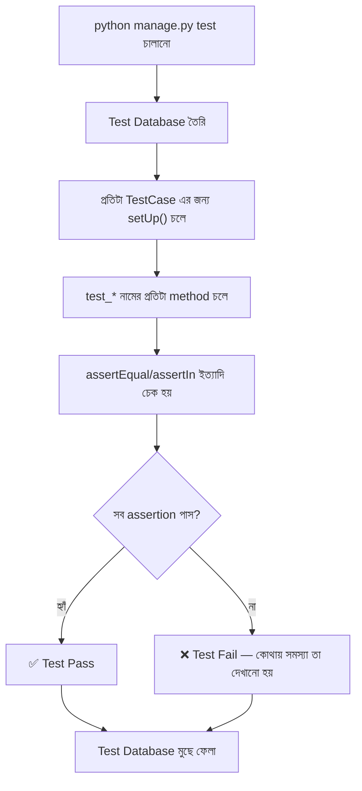

# Section 21: Testing

আমাদের Blog API তে এখন অনেক ফিচার আছে — Authentication, Permission, CRUD, Filtering। প্রতিবার নতুন কোড পরিবর্তন করার পর, সব ম্যানুয়ালি Postman দিয়ে টেস্ট করা অবাস্তব এবং ভুল-প্রবণ। এই chapter এ আমরা দেখব **automated testing** কীভাবে লিখতে হয়, যাতে code পরিবর্তনের পরও নিশ্চিত থাকা যায় সব ঠিকমতো কাজ করছে।

---

## Why — কেন Automated Testing দরকার?

```
Testing ছাড়া:                             Testing সহ:

কোড পরিবর্তন → ম্যানুয়ালি Postman            কোড পরিবর্তন → একটা কমান্ড চালানো
দিয়ে সবকিছু আবার টেস্ট করা                    (python manage.py test)
(সময়সাপেক্ষ, ভুল হওয়ার সম্ভাবনা)              → কয়েক সেকেন্ডে সব ফিচার
                                              automatic ভাবে যাচাই হয়ে যায়
```

Testing ছাড়া বড় প্রজেক্টে **regression** (নতুন পরিবর্তন এসে পুরনো ফিচার ভেঙে যাওয়া) খুবই সাধারণ সমস্যা। Automated test এই সমস্যা আগেভাগেই ধরিয়ে দেয়, deploy করার আগেই।

---

## DRF এর Test Setup

```python
# blog/tests.py

from django.contrib.auth.models import User
from django.urls import reverse
from rest_framework.test import APITestCase
from rest_framework import status
from .models import Post, Category
```

### গুরুত্বপূর্ণ Import

- `APITestCase` — DRF এর নিজস্ব TestCase class, যেটা `self.client` সহ আসে (API request পাঠানোর জন্য)
- `reverse()` — URL এর `name` থেকে actual URL path তৈরি করে, hardcoded URL এর বদলে ব্যবহার করা ভালো practice
- `status` — readable status code constant (`status.HTTP_200_OK`, ম্যাজিক নাম্বার `200` এর বদলে)

---

## প্রথম Test — Post List দেখা

```python
class PostListTestCase(APITestCase):
    def setUp(self):
        self.user = User.objects.create_user(username='rahim', password='pass1234')
        self.category = Category.objects.create(name='Technology', slug='technology')
        Post.objects.create(
            title='প্রথম পোস্ট',
            slug='first-post',
            content='কনটেন্ট',
            author=self.user,
            category=self.category
        )

    def test_get_post_list(self):
        url = reverse('post-list')
        response = self.client.get(url)

        self.assertEqual(response.status_code, status.HTTP_200_OK)
        self.assertEqual(len(response.data), 1)
```

### লাইন ব্যাখ্যা

- `setUp(self)` — প্রতিটা test method চলার **আগে** automatic কল হয়, প্রয়োজনীয় টেস্ট ডেটা তৈরি করার জন্য (একটা fresh, isolated database state দিয়ে প্রতিটা test শুরু হয়)
- `self.client.get(url)` — একটা actual HTTP GET request পাঠানো হচ্ছে (real server ছাড়াই, Django এর test client দিয়ে সিমুলেটেড)
- `assertEqual(response.status_code, status.HTTP_200_OK)` — নিশ্চিত করা status code ঠিক আছে কিনা
- `assertEqual(len(response.data), 1)` — নিশ্চিত করা ঠিক ১টা Post ফেরত এসেছে

---

## Authenticated Request Test করা

```python
class PostCreateTestCase(APITestCase):
    def setUp(self):
        self.user = User.objects.create_user(username='rahim', password='pass1234')
        self.category = Category.objects.create(name='Technology', slug='technology')

    def test_create_post_requires_authentication(self):
        url = reverse('post-list')
        data = {'title': 'নতুন পোস্ট', 'content': 'কনটেন্ট', 'category': self.category.id}
        response = self.client.post(url, data)

        self.assertEqual(response.status_code, status.HTTP_401_UNAUTHORIZED)

    def test_create_post_authenticated(self):
        self.client.force_authenticate(user=self.user)

        url = reverse('post-list')
        data = {'title': 'নতুন পোস্ট', 'content': 'কনটেন্ট', 'category': self.category.id}
        response = self.client.post(url, data)

        self.assertEqual(response.status_code, status.HTTP_201_CREATED)
        self.assertEqual(Post.objects.count(), 1)
        self.assertEqual(Post.objects.first().author, self.user)
```

### লাইন ব্যাখ্যা

- `test_create_post_requires_authentication` — যাচাই করছে, login ছাড়া Post তৈরি করার চেষ্টা করলে সঠিকভাবে `401` আসে কিনা
- `self.client.force_authenticate(user=self.user)` — টেস্ট এর জন্য একটা shortcut, যেটা সত্যিকারের JWT token তৈরি না করেই একজন user কে authenticated হিসেবে সিমুলেট করে
- `Post.objects.first().author` — শুধু response check করাই না, database এ actual object সঠিকভাবে তৈরি হয়েছে কিনা এবং সঠিক author এর সাথে যুক্ত হয়েছে কিনা যাচাই করা

---

## Permission Test করা — Object-level

```python
class PostPermissionTestCase(APITestCase):
    def setUp(self):
        self.author = User.objects.create_user(username='author', password='pass1234')
        self.other_user = User.objects.create_user(username='other', password='pass1234')
        self.category = Category.objects.create(name='Tech', slug='tech')
        self.post = Post.objects.create(
            title='পোস্ট',
            slug='post',
            content='কনটেন্ট',
            author=self.author,
            category=self.category
        )

    def test_owner_can_update_post(self):
        self.client.force_authenticate(user=self.author)
        url = reverse('post-detail', kwargs={'slug': self.post.slug})
        response = self.client.patch(url, {'title': 'আপডেটেড শিরোনাম'})

        self.assertEqual(response.status_code, status.HTTP_200_OK)

    def test_other_user_cannot_update_post(self):
        self.client.force_authenticate(user=self.other_user)
        url = reverse('post-detail', kwargs={'slug': self.post.slug})
        response = self.client.patch(url, {'title': 'অন্যের চেষ্টা'})

        self.assertEqual(response.status_code, status.HTTP_403_FORBIDDEN)
```

এই দুইটা test একসাথে যাচাই করছে আগের **Permission chapter** এ বানানো `IsAuthorOrReadOnly` ঠিকভাবে কাজ করছে কিনা — owner পারবে, অন্য কেউ পারবে না।

---

## Serializer Validation Test করা

```python
class PostSerializerTestCase(APITestCase):
    def setUp(self):
        self.user = User.objects.create_user(username='rahim', password='pass1234')
        self.category = Category.objects.create(name='Tech', slug='tech')
        self.client.force_authenticate(user=self.user)

    def test_short_title_is_rejected(self):
        url = reverse('post-list')
        data = {'title': 'কম', 'content': 'কনটেন্ট', 'category': self.category.id}
        response = self.client.post(url, data)

        self.assertEqual(response.status_code, status.HTTP_400_BAD_REQUEST)
        self.assertIn('title', response.data)
```

এটা আগের **Validation chapter** এর `validate_title` (৫ অক্ষরের কম হলে reject) সঠিকভাবে কাজ করছে কিনা যাচাই করছে।

---

## Test চালানো

```bash
python manage.py test
```

```
Creating test database for alias 'default'...
....
----------------------------------------------------------------------
Ran 6 tests in 0.842s

OK
Destroying test database for alias 'default'...
```

### লক্ষণীয় বিষয়

Django automatic ভাবে একটা **আলাদা, সাময়িক test database** তৈরি করে, test চলার পর সেটা মুছে ফেলে — তোমার আসল development database এ কোনো প্রভাব পড়ে না।

---

## নির্দিষ্ট একটা Test/App চালানো

```bash
python manage.py test blog                          # শুধু blog app এর test
python manage.py test blog.tests.PostListTestCase     # শুধু নির্দিষ্ট TestCase
python manage.py test blog.tests.PostListTestCase.test_get_post_list  # শুধু একটা মাত্র test
```

---

## Test Coverage — কতটুকু কোড টেস্ট করা হয়েছে

```bash
pip install coverage

coverage run --source='.' manage.py test
coverage report
```

```
Name                    Stmts   Miss  Cover
-------------------------------------------
blog/models.py             45      2    96%
blog/serializers.py        38      5    87%
blog/views.py               52      8    85%
-------------------------------------------
TOTAL                      135     15    89%
```

`coverage` টুল দেখায় কোড এর কত শতাংশ actual test দিয়ে "cover" হয়েছে — কম coverage মানে অনেক কোড কোনো test ছাড়াই আছে, যেটা bug লুকিয়ে থাকার ঝুঁকি বাড়ায়।

---

## Testing এর Internal Flow



---

## কী কী Test করা উচিত — একটা Checklist

| ক্ষেত্র | কী টেস্ট করবে |
|---|---|
| **CRUD Operations** | List, Create, Retrieve, Update, Delete সঠিকভাবে কাজ করছে |
| **Authentication** | Login ছাড়া protected endpoint এ `401` আসছে |
| **Permission** | Owner/non-owner এর সঠিক অনুমতি প্রয়োগ হচ্ছে |
| **Validation** | ভুল ইনপুট সঠিকভাবে reject হচ্ছে (`400`) |
| **Edge Cases** | খালি লিস্ট, না থাকা object (`404`), boundary value |

---

## Common Mistakes

- `setUp()` এ প্রতিটা test এর জন্য প্রয়োজনীয় সব ডেটা তৈরি না করে assumption করা যে আগের test এর ডেটা এখনো আছে (test গুলো একে অপরের থেকে independent হওয়া উচিত)
- শুধু "happy path" (সঠিক ইনপুট) টেস্ট করা, ভুল ইনপুট/edge case টেস্ট না করা
- `force_authenticate()` ব্যবহার করা প্রোডাকশন কোডেও ভুলবশত রেখে দেওয়া (এটা শুধু test এর জন্য)
- Test না চালিয়ে সরাসরি deploy করা

---

## Best Practices

- প্রতিটা ফিচারের জন্য অন্তত একটা "happy path" এবং একটা "failure path" test লেখো
- `setUp()` এ প্রতিটা test independent রাখার জন্য প্রয়োজনীয় সব ডেটা fresh ভাবে তৈরি করো
- CI/CD pipeline এ automatic ভাবে `python manage.py test` চালানোর ব্যবস্থা রাখো, প্রতিটা commit/PR এ
- নিয়মিত `coverage report` দেখো, কোন অংশ টেস্ট ছাড়া রয়ে গেছে তা চিহ্নিত করতে

---

## Interview Questions

**প্রশ্ন: `setUp()` method কী কাজ করে?**
> এটা প্রতিটা test method চলার আগে automatic ভাবে কল হয়, এবং প্রয়োজনীয় প্রাথমিক ডেটা (user, category, ইত্যাদি) তৈরি করে — প্রতিটা test একটা fresh, পূর্বনির্ধারিত অবস্থা থেকে শুরু হয় তা নিশ্চিত করে।

**প্রশ্ন: `force_authenticate()` কী করে, এবং কেন এটা real login থেকে আলাদা?**
> এটা টেস্ট এর জন্য একটা shortcut, যেটা সরাসরি `request.user` সেট করে দেয়, প্রকৃত JWT token তৈরি/validate করার প্রয়োজন ছাড়াই — এতে authentication logic এর বদলে বাকি business logic টেস্ট করায় ফোকাস করা যায়।

**প্রশ্ন: Test Coverage কী, এবং ১০০% coverage কি যথেষ্ট?**
> Test Coverage দেখায় কোড এর কত শতাংশ কোনো test দ্বারা "execute" হয়েছে। কিন্তু ১০০% coverage মানে এই না যে সব logic সঠিক — coverage শুধু কোড চলেছে কিনা দেখায়, সঠিক ফলাফল যাচাই করেছে কিনা (assertion এর মান) তা না। তাই coverage একটা useful metric, কিন্তু একমাত্র মানদণ্ড না।

---

## Summary

- **`APITestCase`** DRF এর টেস্ট লেখার মূল ক্লাস, `self.client` দিয়ে actual API request সিমুলেট করা যায়
- **`setUp()`** প্রতিটা test এর আগে প্রয়োজনীয় ডেটা তৈরি করে, test গুলোকে independent রাখে
- **`force_authenticate()`** দ্রুত authenticated request টেস্ট করতে সাহায্য করে
- CRUD, Authentication, Permission, Validation — সবগুলো ক্ষেত্রেই test লেখা উচিত, শুধু happy path না
- **Coverage** টুল দিয়ে বোঝা যায় কতটুকু কোড টেস্ট করা হয়েছে, কিন্তু এটাই সঠিকতার একমাত্র নিশ্চয়তা না

পরের chapter — **Section 22: Deployment Best Practices** — এ আমরা দেখব আমাদের এই Blog API কে কীভাবে production এ নিরাপদভাবে deploy করতে হয়।
