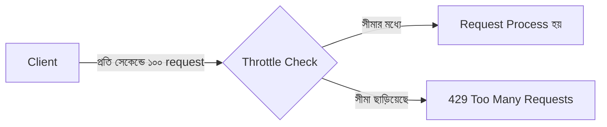
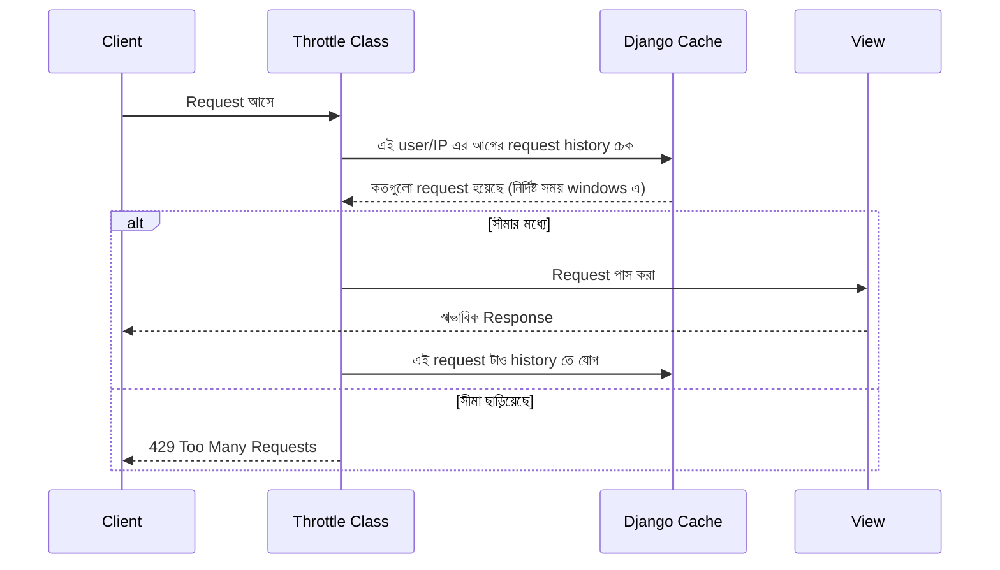

# Section 19: Throttling

আমাদের Blog API এখন Authentication, Permission সব ঠিকঠাক আছে — কিন্তু একজন authenticated user ও চাইলে প্রতি সেকেন্ডে হাজারো request পাঠিয়ে server কে overload করে ফেলতে পারে। এই chapter এ আমরা দেখব **Throttling** কীভাবে API কে এই ধরনের অতিরিক্ত ব্যবহার (abuse) থেকে সুরক্ষিত রাখে।

---

## Why — কেন Throttling দরকার?

Permission নিশ্চিত করে "কে এই কাজ করতে পারবে," কিন্তু এটা নিয়ন্ত্রণ করে না "**কতবার**" করতে পারবে। Throttling ছাড়া:

- একটা malicious script প্রতি সেকেন্ডে হাজারো request পাঠিয়ে server কে ধীর/বন্ধ করে দিতে পারে (DoS আক্রমণের মতো)
- একজন user ভুলবশত infinite loop এ আটকে গিয়ে বারবার একই request পাঠাতে পারে
- Free-tier user রা paid-tier user দের মতো সীমাহীন ব্যবহার করতে পারবে, business model নষ্ট হয়



---

## DRF এর Built-in Throttle Classes

| Class | নিয়ন্ত্রণ করে কীভাবে |
|---|---|
| `AnonRateThrottle` | Anonymous (login না করা) user দের request rate |
| `UserRateThrottle` | Login করা user দের request rate (user ID অনুযায়ী) |
| `ScopedRateThrottle` | নির্দিষ্ট View/endpoint এর জন্য আলাদা rate |

---

## Global Setup

```python
# settings.py

REST_FRAMEWORK = {
    'DEFAULT_THROTTLE_CLASSES': [
        'rest_framework.throttling.AnonRateThrottle',
        'rest_framework.throttling.UserRateThrottle',
    ],
    'DEFAULT_THROTTLE_RATES': {
        'anon': '20/minute',
        'user': '100/minute',
    }
}
```

### লাইন ব্যাখ্যা

- `'anon': '20/minute'` — Anonymous user প্রতি মিনিটে সর্বোচ্চ ২০টা request পাঠাতে পারবে
- `'user': '100/minute'` — Login করা user প্রতি মিনিটে সর্বোচ্চ ১০০টা request পাঠাতে পারবে
- Rate format: `সংখ্যা/সময়` — সময় হতে পারে `second`, `minute`, `hour`, `day`

::: tip
Login করা user দের জন্য higher rate limit দেওয়া common practice — কারণ authentication নিজেই একটা identity যাচাই, তাই তাদের বেশি বিশ্বাস করা যায় anonymous request এর তুলনায়।
:::

---

## Rate সীমা ছাড়ালে কী হয়

### Request

```
GET /api/posts/
(একই user, প্রতি মিনিটে ১০০+ বার request পাঠাচ্ছে)
```

### Response

```json
// 429 Too Many Requests
{
    "detail": "Request was throttled. Expected available in 42 seconds."
}
```

DRF automatic ভাবে `429` status code এবং কতক্ষণ পর আবার চেষ্টা করা যাবে সেই তথ্য দেয় — client কে explicit ভাবে জানিয়ে দেয়।

---

## View-Specific Throttle

সব endpoint এ একই rate না রেখে, নির্দিষ্ট View তে ভিন্ন rate সেট করা যায়।

```python
from rest_framework.throttling import UserRateThrottle

class PostCreateThrottle(UserRateThrottle):
    rate = '5/minute'

class PostViewSet(viewsets.ModelViewSet):
    queryset = Post.objects.all()
    serializer_class = PostSerializer

    def get_throttles(self):
        if self.action == 'create':
            return [PostCreateThrottle()]
        return super().get_throttles()
```

### লাইন ব্যাখ্যা

- `PostCreateThrottle` — শুধু Post তৈরি করার জন্য নির্দিষ্ট, কম rate limit (৫/মিনিট) — কারণ Create action সাধারণত Read এর চেয়ে বেশি server resource ব্যবহার করে
- `get_throttles()` override করে, শুধু `create` action এ এই কড়া throttle প্রয়োগ করা হচ্ছে, বাকি action (list, retrieve) এ ডিফল্ট throttle প্রযোজ্য

---

## ScopedRateThrottle — একাধিক নির্দিষ্ট Endpoint এর জন্য

```python
# settings.py
REST_FRAMEWORK = {
    'DEFAULT_THROTTLE_RATES': {
        'comment_create': '10/minute',
        'image_upload': '3/minute',
    }
}
```

```python
from rest_framework.throttling import ScopedRateThrottle

class CommentViewSet(viewsets.ModelViewSet):
    queryset = Comment.objects.all()
    serializer_class = CommentSerializer
    throttle_classes = [ScopedRateThrottle]
    throttle_scope = 'comment_create'
```

`throttle_scope` দিয়ে `settings.py` তে define করা নির্দিষ্ট rate কে সেই View এর সাথে যুক্ত করা হয় — একাধিক View একই scope শেয়ার করতে পারে, অথবা প্রতিটার আলাদা scope থাকতে পারে।

---

## Custom Throttle Class — নিজের Logic

```python
from rest_framework.throttling import UserRateThrottle

class PremiumUserThrottle(UserRateThrottle):
    scope = 'premium'

    def get_rate(self):
        if self.request.user.is_authenticated and hasattr(self.request.user, 'profile'):
            if self.request.user.profile.is_premium:
                return '1000/day'
        return '100/day'
```

### লাইন ব্যাখ্যা

- `get_rate()` override করে, user এর `is_premium` status অনুযায়ী dynamic ভাবে ভিন্ন rate limit প্রয়োগ করা হচ্ছে
- এভাবে business logic (যেমন premium subscription) এর সাথে throttling সংযুক্ত করা যায়

---

## Throttling এর Internal Flow



::: tip
Throttling এর history track করার জন্য DRF ডিফল্ট ভাবে Django এর **Cache framework** ব্যবহার করে। Production এ ভালো performance এর জন্য `Redis` বা `Memcached` কে cache backend হিসেবে ব্যবহার করা উচিত, ডিফল্ট local-memory cache না — কারণ multiple server instance এ local-memory cache শেয়ার হয় না।
:::

---

## Throttling vs Permission — পার্থক্য মনে রাখা

| বৈশিষ্ট্য | Permission | Throttling |
|---|---|---|
| প্রশ্ন | "তুমি কি এই কাজ করতে পারবে?" | "তুমি কতবার এই কাজ করতে পারবে?" |
| ফলাফল যখন ব্যর্থ হয় | `403 Forbidden` | `429 Too Many Requests` |
| উদ্দেশ্য | Access control | Abuse prevention, fair usage |

---

## Common Mistakes

- Production এ ডিফল্ট local-memory cache ব্যবহার করা multiple server এ, যার ফলে throttling ঠিকভাবে কাজ না করা (প্রতিটা server আলাদা count রাখে)
- সব endpoint এ একই rate limit দেওয়া, resource-heavy endpoint (যেমন image upload, search) এ আলাদা, কড়া limit না রাখা
- `429` response এ কোনো informative message/retry-after তথ্য না দেওয়া, যেটা client experience খারাপ করে
- Throttling কে Permission এর বিকল্প হিসেবে ভাবা — দুটো সম্পূর্ণ ভিন্ন উদ্দেশ্যে কাজ করে, একটা আরেকটার প্রতিস্থাপন না

---

## Best Practices

- Anonymous এবং authenticated user দের জন্য আলাদা rate limit রাখো, authenticated user দের জন্য বেশি ছাড় দাও
- Resource-heavy action (Create, Upload) এ কড়া, আলাদা throttle rate রাখো
- Production এ Redis/Memcached cache backend ব্যবহার করো, throttling সঠিকভাবে কাজ করার জন্য
- Business logic (premium/free tier) এর সাথে throttling সংযুক্ত করতে custom throttle class বানাও

---

## Interview Questions

**প্রশ্ন: Permission এবং Throttling এর মধ্যে পার্থক্য কী?**
> Permission নিয়ন্ত্রণ করে কে কী করতে পারবে (access control)। Throttling নিয়ন্ত্রণ করে কতবার/কত দ্রুত সেই কাজ করা যাবে (rate limiting, abuse prevention)। Permission ব্যর্থ হলে `403`, Throttling ব্যর্থ হলে `429` রিটার্ন হয়।

**প্রশ্ন: `AnonRateThrottle` আর `UserRateThrottle` এর মধ্যে পার্থক্য কী?**
> `AnonRateThrottle` IP address ব্যবহার করে anonymous user দের rate নিয়ন্ত্রণ করে। `UserRateThrottle` authenticated user এর ID ব্যবহার করে, তাই একজন নির্দিষ্ট user এর rate আলাদাভাবে track হয়, যতগুলো device/IP থেকেই request আসুক না কেন।

**প্রশ্ন: Production এ কেন Redis/Memcached ব্যবহার করা উচিত throttling এর জন্য?**
> ডিফল্ট local-memory cache প্রতিটা server instance এ আলাদা থাকে, তাই multiple server চললে throttling সঠিকভাবে সমন্বিত (synchronized) ভাবে কাজ করে না। Redis/Memcached একটা shared, centralized cache দেয়, যেটা সব server instance জুড়ে সঠিকভাবে rate track করতে পারে।

---

## Summary

- **Throttling** API কে অতিরিক্ত ব্যবহার (abuse) থেকে সুরক্ষিত রাখে, `429 Too Many Requests` রিটার্ন করে সীমা ছাড়ালে
- **`AnonRateThrottle`, `UserRateThrottle`, `ScopedRateThrottle`** — তিনটা built-in class, ভিন্ন ভিন্ন প্রয়োজনে
- `get_throttles()` override করে View/action-specific rate limit প্রয়োগ করা যায়
- Custom Throttle Class দিয়ে business logic (premium/free tier) এর সাথে সংযুক্ত করা যায়
- Production এ অবশ্যই Redis/Memcached cache backend ব্যবহার করতে হবে, throttling সঠিকভাবে কাজ করার জন্য

পরের chapter — **Section 20: Caching** — এ আমরা দেখব কীভাবে বারবার একই ডেটা query না করে, cache থেকে দ্রুত response দেওয়া যায়।
