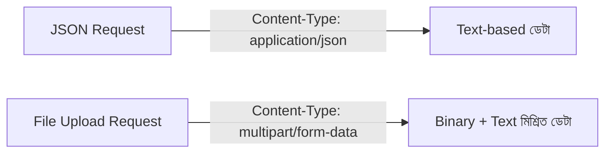
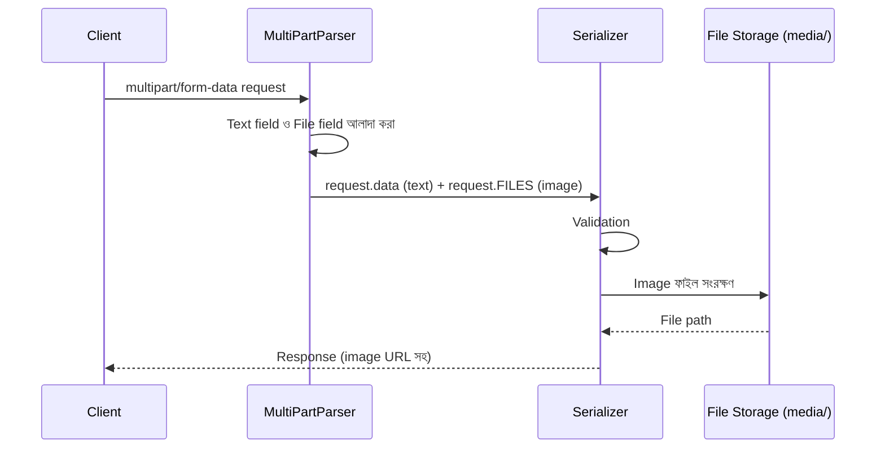

# Section 16: Upload

আমাদের Blog API তে Post এবং Profile — দুটোতেই Image field আছে (`image`, `avatar`)। এই chapter এ আমরা দেখব কীভাবে DRF তে Image/File Upload সঠিকভাবে সেটআপ এবং handle করতে হয়।

---

## Why — কেন Upload আলাদা ভাবে বোঝা দরকার?

সাধারণ JSON data (`title`, `content`) আর File data (`image`) — দুটোর transfer পদ্ধতি সম্পূর্ণ ভিন্ন। JSON টেক্সট আকারে পাঠানো যায়, কিন্তু ফাইল (binary data) পাঠাতে ভিন্ন encoding দরকার হয় — এখানেই **Multipart Form Data** এর ভূমিকা আসে।



---

## Media vs Static — পার্থক্য বোঝা

| ধরন | কী | উদাহরণ |
|---|---|---|
| **Static Files** | Developer এর তৈরি করা fixed ফাইল, কখনো user upload করে না | CSS, JS, admin panel এর ছবি |
| **Media Files** | User দ্বারা upload করা ডাইনামিক ফাইল | Post image, Profile avatar |

এই দুইটা আলাদা কনফিগারেশন এবং আলাদা folder এ রাখা হয় — কারণ এদের behavior ভিন্ন (Static সাধারণত production এ CDN/collectstatic দিয়ে সার্ভ করা হয়, Media user-generated বলে আলাদাভাবে manage করতে হয়)।

---

## Settings কনফিগারেশন

```python
# blogapi/settings.py

import os
from pathlib import Path

BASE_DIR = Path(__file__).resolve().parent.parent

MEDIA_URL = '/media/'
MEDIA_ROOT = BASE_DIR / 'media'

STATIC_URL = '/static/'
STATIC_ROOT = BASE_DIR / 'staticfiles'
```

### লাইন ব্যাখ্যা

- `MEDIA_URL` — যে URL prefix দিয়ে uploaded ফাইল অ্যাক্সেস করা যাবে (যেমন `http://localhost:8000/media/posts/image.jpg`)
- `MEDIA_ROOT` — সার্ভারের ডিস্কে ঠিক কোন folder এ ফাইলগুলো সংরক্ষিত হবে

### Development এ Media Serve করা

```python
# blogapi/urls.py

from django.conf import settings
from django.conf.urls.static import static

urlpatterns = [
    # ... তোমার সব URL
]

if settings.DEBUG:
    urlpatterns += static(settings.MEDIA_URL, document_root=settings.MEDIA_ROOT)
```

::: warning
এই `static()` লাইনটা শুধু **development** এর জন্য (`DEBUG=True` এর সময়)। Production এ media file সার্ভ করার জন্য Nginx/S3 এর মতো আলাদা, শক্তিশালী সমাধান ব্যবহার করা হয় — Django নিজে থেকে production এ file serve করা নিরাপদ বা efficient না।
:::

---

## Model এ ImageField (আগেই দেখেছি, আবার মনে করি)

```python
class Post(models.Model):
    title = models.CharField(max_length=255)
    image = models.ImageField(upload_to='posts/', blank=True, null=True)
```

- `upload_to='posts/'` — এই field এ upload হওয়া ফাইল `media/posts/` folder এ জমা হবে
- `ImageField` ব্যবহার করতে **`Pillow`** প্যাকেজ ইনস্টল থাকা বাধ্যতামূলক

```bash
pip install Pillow
```

---

## Serializer এ Image Field

```python
class PostSerializer(serializers.ModelSerializer):
    class Meta:
        model = Post
        fields = ['id', 'title', 'content', 'image']
```

`ModelSerializer` ব্যবহার করলে, `ImageField` automatic ভাবে সঠিক serializer field এ রূপান্তরিত হয় — আলাদা কিছু করার দরকার নেই।

### Output এ Image URL

```json
{
    "id": 1,
    "title": "একটা পোস্ট",
    "image": "http://localhost:8000/media/posts/example.jpg"
}
```

::: tip
`image` field এ সম্পূর্ণ URL পেতে হলে, Serializer কে `context={'request': request}` দিতে হবে (আগের chapter এ যেটা `self.get_serializer()` automatic করে দেয়)। Context ছাড়া শুধু relative path (`/media/posts/example.jpg`) আসতে পারে।
:::

---

## View এ Image Upload হ্যান্ডেল করা

`ModelViewSet` ব্যবহার করলে, Image Upload আলাদা কিছু করা ছাড়াই কাজ করে যায় — কারণ DRF automatic ভাবে `multipart/form-data` parse করতে পারে।

```python
class PostViewSet(viewsets.ModelViewSet):
    queryset = Post.objects.all()
    serializer_class = PostSerializer
    parser_classes = [MultiPartParser, FormParser]
```

### `parser_classes` কেন দরকার

```python
from rest_framework.parsers import MultiPartParser, FormParser
```

DRF এর ডিফল্ট parser (`JSONParser`) শুধু JSON বুঝতে পারে। Image ফাইল সহ request পাঠাতে হলে `MultiPartParser` (ফাইল + text field একসাথে) অথবা `FormParser` (শুধু form field) প্রয়োজন — এগুলো `parser_classes` এ যোগ করে দিতে হয়।

::: tip
Global ভাবে সব View এ multipart সাপোর্ট চাইলে `settings.py` তে:
```python
REST_FRAMEWORK = {
    'DEFAULT_PARSER_CLASSES': [
        'rest_framework.parsers.JSONParser',
        'rest_framework.parsers.MultiPartParser',
        'rest_framework.parsers.FormParser',
    ]
}
```
:::

---

## Request/Response — Image সহ Post তৈরি

### Request (Postman/curl দিয়ে multipart হিসেবে পাঠাতে হবে, JSON না)

```
POST /api/posts/
Content-Type: multipart/form-data

title: "একটা নতুন পোস্ট"
content: "কনটেন্ট এখানে"
image: [ফাইল সিলেক্ট করা — example.jpg]
```

::: warning
Postman এ Body → **form-data** সিলেক্ট করতে হবে, **raw/JSON** না — image field এর জন্য "File" টাইপ সিলেক্ট করে ফাইল আপলোড করতে হয়। JSON দিয়ে raw ফাইল পাঠানো যায় না।
:::

### Response

```json
{
    "id": 6,
    "title": "একটা নতুন পোস্ট",
    "content": "কনটেন্ট এখানে",
    "image": "http://localhost:8000/media/posts/example.jpg"
}
```

---

## Profile Avatar Upload — সম্পূর্ণ উদাহরণ

```python
class ProfileSerializer(serializers.ModelSerializer):
    class Meta:
        model = Profile
        fields = ['id', 'bio', 'avatar', 'website']


class ProfileViewSet(viewsets.ModelViewSet):
    serializer_class = ProfileSerializer
    parser_classes = [MultiPartParser, FormParser]

    def get_queryset(self):
        return Profile.objects.filter(user=self.request.user)

    def perform_update(self, serializer):
        serializer.save(user=self.request.user)
```

এখানে `get_queryset()` নিশ্চিত করছে user শুধু **নিজের** Profile ই দেখতে/এডিট করতে পারবে — যেটা আগের Permission chapter এ শেখা প্যাটার্ন।

---

## Multiple File Field বা Multiple Image (Advanced ধারণা)

Django এর সাধারণ `ImageField` একটা মাত্র ফাইল রাখতে পারে। যদি একটা Post এ একাধিক image দরকার হয় (image gallery), তাহলে একটা **আলাদা Model** বানিয়ে ForeignKey দিয়ে সংযুক্ত করতে হয়:

```python
class PostImage(models.Model):
    post = models.ForeignKey(Post, on_delete=models.CASCADE, related_name='images')
    image = models.ImageField(upload_to='post_gallery/')
```

```python
class PostImageSerializer(serializers.ModelSerializer):
    class Meta:
        model = PostImage
        fields = ['id', 'image']


class PostSerializer(serializers.ModelSerializer):
    images = PostImageSerializer(many=True, read_only=True)

    class Meta:
        model = Post
        fields = ['id', 'title', 'images']
```

এভাবে একটা Post এর সাথে একাধিক `PostImage` object যুক্ত করে, এক-এর-অধিক ছবি রাখা যায়।

---

## Upload এর Internal Flow



---

## Common Mistakes

- `Pillow` ইনস্টল না করে `ImageField` ব্যবহার করার চেষ্টা করা — এতে migration এ error আসবে
- `parser_classes` এ `MultiPartParser` যোগ না করে ভুলে যাওয়া, ফলে file upload কাজ না করা
- Postman এ Body টাইপ **raw/JSON** রেখে ফাইল পাঠানোর চেষ্টা করা (form-data হতে হবে)
- Production এ `DEBUG=True` অবস্থায় Django দিয়ে media serve করার উপর নির্ভর করা

---

## Best Practices

- Production এ media file S3/Cloudinary এর মতো external storage এ রাখো, server এর local disk এ না (scaling এবং reliability এর জন্য)
- Image size/format validation যোগ করো (যেমন সর্বোচ্চ 5MB, শুধু jpg/png)
- `context={'request': request}` নিশ্চিত করো, যাতে image URL সম্পূর্ণ (absolute) আসে, relative না

```python
def validate_image(self, value):
    if value.size > 5 * 1024 * 1024:
        raise serializers.ValidationError("Image সর্বোচ্চ 5MB এর হতে পারবে।")
    return value
```

---

## Interview Questions

**প্রশ্ন: `multipart/form-data` কেন দরকার, শুধু JSON দিয়ে ফাইল পাঠানো যায় না কেন?**
> JSON একটা টেক্সট-ভিত্তিক ফরম্যাট, binary ফাইল ডেটা সরাসরি বহন করতে পারে না। `multipart/form-data` ফাইল এবং টেক্সট field কে আলাদা "part" আকারে একসাথে পাঠাতে দেয়।

**প্রশ্ন: Static আর Media ফাইলের মধ্যে পার্থক্য কী?**
> Static file ডেভেলপারের তৈরি করা fixed ফাইল (CSS, JS)। Media file হলো user দ্বারা runtime এ upload করা ডাইনামিক ফাইল (image, document)।

**প্রশ্ন: Production এ Django কেন নিজে থেকে media file serve করা উচিত না?**
> Django এর built-in file serving development এর জন্যই ডিজাইন করা, এটা efficient বা scalable না। Production এ Nginx, AWS S3, বা Cloudinary এর মতো dedicated সমাধান ব্যবহার করা উচিত, performance ও reliability এর জন্য।

---

## Summary

- **Media** (user-uploaded) এবং **Static** (developer-created) ফাইল আলাদাভাবে কনফিগার করতে হয় (`MEDIA_URL`/`MEDIA_ROOT`, `STATIC_URL`/`STATIC_ROOT`)
- `ImageField` ব্যবহার করতে **Pillow** প্যাকেজ বাধ্যতামূলক
- File upload এর জন্য `parser_classes` এ `MultiPartParser` যোগ করতে হয়
- Multiple image এর জন্য আলাদা `PostImage` Model বানিয়ে ForeignKey সম্পর্ক তৈরি করতে হয়
- Production এ media file external storage এ রাখা এবং size/format validation করা গুরুত্বপূর্ণ best practice

পরের chapter — **Section 17: Performance** — এ আমরা দেখব `select_related`, `prefetch_related`, এবং কুখ্যাত **N+1 Query** সমস্যা কীভাবে সমাধান করতে হয়।
