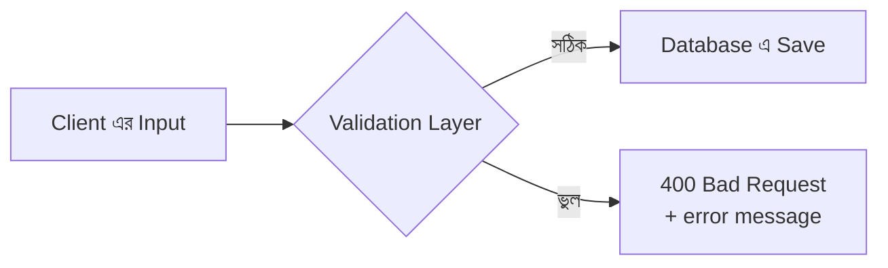
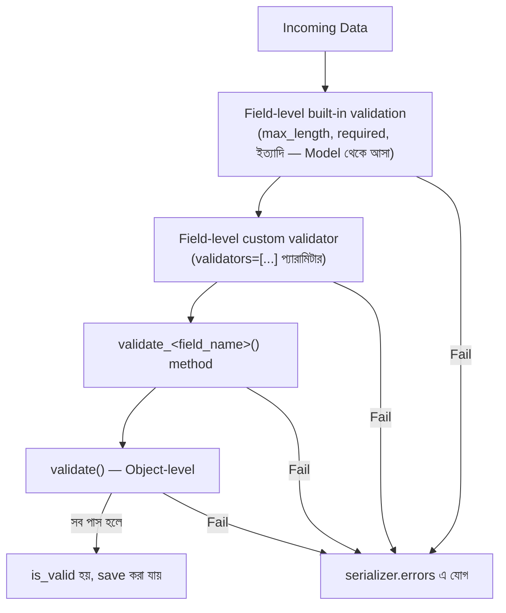

# Section 15: Validation

আগের chapter গুলোতে আমরা `validate_title`, `validate` method সংক্ষেপে ব্যবহার করেছি। এই chapter এ আমরা Validation নিয়ে গভীরে যাব — DRF এ কতভাবে validation করা যায়, কোন পদ্ধতি কখন ব্যবহার করা উচিত, এবং কীভাবে reusable Custom Validator বানানো যায়।

---

## Why — কেন Validation গুরুত্বপূর্ণ?

Validation ছাড়া, database এ ভুল, অসামঞ্জস্যপূর্ণ, বা ক্ষতিকর ডেটা ঢুকে যেতে পারে — যেমন খালি title দিয়ে Post তৈরি হওয়া, বা ভবিষ্যতের তারিখ দিয়ে "published_at" সেট হওয়া। Validation নিশ্চিত করে শুধু **সঠিক, নিয়ম-মেনে-চলা ডেটাই** database এ পৌঁছায়।



---

## Validation এর তিনটা স্তর

| স্তর | কাজ | উদাহরণ |
|---|---|---|
| **Field-level** | একটা মাত্র field validate করা | Title ৫ অক্ষরের কম না |
| **Object-level** | একাধিক field একসাথে বিবেচনা করা | Start date, End date এর আগে হতে হবে |
| **Model-level** | Database constraint (Model এই define করা) | `unique=True`, `max_length` |

---

## Field-level Validation — `validate_<field_name>`

```python
from rest_framework import serializers
from .models import Post

class PostSerializer(serializers.ModelSerializer):
    class Meta:
        model = Post
        fields = ['id', 'title', 'content']

    def validate_title(self, value):
        if len(value) < 5:
            raise serializers.ValidationError("Title অন্তত ৫ অক্ষরের হতে হবে।")
        if value.strip() == "":
            raise serializers.ValidationError("Title খালি রাখা যাবে না।")
        return value
```

### লাইন ব্যাখ্যা

- `validate_title` — নাম pattern `validate_<field_name>`, DRF automatic ভাবে এই method কল করে যখন `title` field validate করা হয়
- `value` — শুধু ঐ নির্দিষ্ট field এর মান পাওয়া যায়, বাকি field এর তথ্য না
- সবশেষে অবশ্যই `return value` করতে হবে — validate হওয়া (বা modify করা) মান ফেরত না দিলে সেই field হারিয়ে যাবে

### একই সময়ে ডেটা পরিবর্তনও করা যায়

```python
    def validate_title(self, value):
        return value.strip().capitalize()  # ফাঁকা জায়গা মুছে, প্রথম অক্ষর বড় করে
```

Field-level validator শুধু validate না, চাইলে ডেটা **normalize/clean** ও করতে পারে।

---

## Object-level Validation — `validate()`

```python
class PostSerializer(serializers.ModelSerializer):
    class Meta:
        model = Post
        fields = ['id', 'title', 'content', 'scheduled_at', 'published_at']

    def validate(self, data):
        if data.get('scheduled_at') and data.get('published_at'):
            if data['scheduled_at'] > data['published_at']:
                raise serializers.ValidationError(
                    "Scheduled তারিখ Published তারিখের পরে হতে পারবে না।"
                )
        return data
```

### কখন Field-level এর বদলে Object-level ব্যবহার করবে

যখন validation logic এর জন্য **একাধিক field** একসাথে দরকার হয় — একটা মাত্র field এর `validate_<field>` method এ অন্য field এর মান অ্যাক্সেস করা যায় না, তাই সেক্ষেত্রে পুরো `data` dictionary পাওয়া `validate()` method ব্যবহার করতে হয়।

::: warning
`validate()` method এ error attach করার সময়, নির্দিষ্ট field এর সাথে যুক্ত করে দেওয়া ভালো practice, যাতে client জানতে পারে ঠিক কোন field এ সমস্যা:
```python
raise serializers.ValidationError({
    "scheduled_at": "Scheduled তারিখ Published তারিখের পরে হতে পারবে না।"
})
```
:::

---

## Custom Validator Function — Reusable Validation

যদি একই validation logic একাধিক Serializer/field এ বারবার লাগে, তাহলে সেটাকে আলাদা একটা **function** এ বের করে আনা যায় — reusable করার জন্য।

```python
# blog/validators.py

from rest_framework import serializers
import re

def validate_no_special_characters(value):
    if re.search(r'[<>{}]', value):
        raise serializers.ValidationError("Title এ <, >, {, } অক্ষর ব্যবহার করা যাবে না।")

def validate_positive_number(value):
    if value <= 0:
        raise serializers.ValidationError("মান অবশ্যই ধনাত্মক হতে হবে।")
```

```python
from .validators import validate_no_special_characters

class PostSerializer(serializers.ModelSerializer):
    title = serializers.CharField(validators=[validate_no_special_characters])

    class Meta:
        model = Post
        fields = ['id', 'title', 'content']
```

### লাইন ব্যাখ্যা

- `validators=[validate_no_special_characters]` — `CharField` এর `validators` প্যারামিটারে একটা list দেওয়া হয়, প্রতিটা function automatic ভাবে কল হবে
- একাধিক validator একসাথে দেওয়া যায়: `validators=[validate_a, validate_b, validate_c]`

---

## Class-based Custom Validator — Configurable

Function এর বদলে Class ব্যবহার করলে validator কে **configurable** বানানো যায় (constructor এ প্যারামিটার নেওয়া যায়)।

```python
from rest_framework import serializers

class MinWordCountValidator:
    def __init__(self, min_words):
        self.min_words = min_words

    def __call__(self, value):
        word_count = len(value.split())
        if word_count < self.min_words:
            raise serializers.ValidationError(
                f"অন্তত {self.min_words}টা শব্দ থাকা আবশ্যক (বর্তমানে {word_count})।"
            )
```

```python
class PostSerializer(serializers.ModelSerializer):
    content = serializers.CharField(validators=[MinWordCountValidator(min_words=20)])

    class Meta:
        model = Post
        fields = ['id', 'title', 'content']
```

এভাবে একই `MinWordCountValidator` কে ভিন্ন ভিন্ন Serializer এ ভিন্ন `min_words` দিয়ে reuse করা যায়।

---

## Model-level Validation vs Serializer-level Validation

Django Model নিজেও কিছু validation করে (`max_length`, `unique`), কিন্তু এগুলো **automatic ভাবে DRF এর `ModelSerializer` এ প্রতিফলিত হয়** — তাই আলাদা করে আবার লেখার দরকার নেই।

```python
# models.py
class Category(models.Model):
    name = models.CharField(max_length=100, unique=True)
```

```python
# serializers.py — কিছুই আলাদা করে লিখতে হয়নি
class CategorySerializer(serializers.ModelSerializer):
    class Meta:
        model = Category
        fields = ['id', 'name']
```

Client যদি duplicate `name` দিয়ে Category তৈরি করার চেষ্টা করে, `ModelSerializer` automatic ভাবে Model এর `unique=True` constraint দেখে validation error দেবে — কোনো `validate_name` লেখারও প্রয়োজন নেই।

```json
// Response — automatic
{
    "name": ["category with this name already exists."]
}
```

---

## Validation এর সম্পূর্ণ Order (কোনটা আগে চলে)



এই ক্রম বোঝা গুরুত্বপূর্ণ — field-level validation object-level এর **আগে** চলে, তাই `validate()` method এ পৌঁছানোর আগেই প্রতিটা field স্বাধীনভাবে validate হয়ে যায়।

---

## Common Mistakes

- `validate_<field>` method এ `return value` করতে ভুলে যাওয়া, ফলে সেই field silently হারিয়ে যাওয়া
- Object-level validation এ error কে নির্দিষ্ট field এর সাথে যুক্ত না করে সাধারণভাবে raise করা, যেটা client এর জন্য কম helpful
- Model-level এ যা constraint (যেমন `unique`) আছে, সেটা আবার Serializer এ ডুপ্লিকেট করে লেখা — অপ্রয়োজনীয়
- Custom Validator function এ error raise না করে শুধু `False` রিটার্ন করা — DRF `ValidationError` exception আশা করে, boolean না

---

## Best Practices

- একটা field এর জন্য validation হলে `validate_<field>`, একাধিক field জড়িত হলে `validate()` ব্যবহার করো
- বারবার ব্যবহৃত validation logic কে আলাদা function/class এ বের করে আনো, reusability এর জন্য
- Model এ যা validation ইতিমধ্যে আছে (unique, max_length), সেটা আবার Serializer এ পুনরায় লেখার প্রয়োজন নেই
- Error message সবসময় স্পষ্ট এবং user-friendly রাখো, যাতে frontend সরাসরি সেটা দেখাতে পারে

---

## Interview Questions

**প্রশ্ন: `validate_<field>` আর `validate()` এর মধ্যে পার্থক্য কী?**
> `validate_<field>` শুধু একটা নির্দিষ্ট field validate করে, শুধু সেই field এর মান পায়। `validate()` পুরো object (সব field একসাথে) পায়, তাই একাধিক field জড়িত validation logic এর জন্য এটা ব্যবহার করা হয়।

**প্রশ্ন: Custom Validator function এ কীভাবে error raise করতে হয়?**
> `rest_framework.serializers.ValidationError` exception raise করে — `raise serializers.ValidationError("error message")`।

**প্রশ্ন: Class-based Validator এর সুবিধা কী?**
> এটা constructor এর মাধ্যমে প্যারামিটার নিতে পারে (যেমন `min_words`), ফলে একই validator ভিন্ন ভিন্ন কনফিগারেশনে reuse করা যায় — function-based validator এ এই নমনীয়তা থাকে না।

---

## Summary

- **তিন স্তরের validation**: Field-level (`validate_<field>`), Object-level (`validate()`), এবং Model-level (constraint, automatic)
- **Custom Validator function/class** দিয়ে বারবার ব্যবহৃত validation logic reusable বানানো যায়
- **Model constraint** (`unique`, `max_length`) automatic ভাবে `ModelSerializer` এ প্রতিফলিত হয় — ডুপ্লিকেট করার দরকার নেই
- Validation এর একটা নির্দিষ্ট **ক্রম** আছে — built-in field validation → custom field validators → `validate_<field>` → `validate()`
- সবসময় `return value` করতে ভুলো না field-level validator এ

পরের chapter — **Section 16: Upload** — এ আমরা দেখব Image Upload কীভাবে কাজ করে, `MEDIA_URL`/`MEDIA_ROOT` কনফিগার করা, এবং Multipart form data নিয়ে DRF তে কাজ করা।
