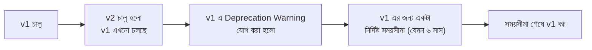

# Section 18: Versioning

আমাদের Blog API এখন ব্যবহার করছে অনেক client (mobile app, website)। কিন্তু সময়ের সাথে API তে পরিবর্তন আনতে হয় — কোনো field এর নাম বদলানো, response structure পরিবর্তন করা। এই chapter এ আমরা দেখব **API Versioning** কীভাবে পুরনো client দের ভেঙে না ফেলে নতুন পরিবর্তন আনতে সাহায্য করে।

---

## Why — কেন Versioning দরকার?

মনে করো, তোমার Blog API এর `v1` তে `Post` এর response এ `author` field একটা string (username)। এখন তুমি সিদ্ধান্ত নিলে `author` কে একটা সম্পূর্ণ object বানাবে (id, username, avatar সহ)। কিন্তু ইতিমধ্যে হাজারো mobile app user তোমার পুরনো `v1` API ব্যবহার করছে — তাদের app হঠাৎ ভেঙে যাবে যদি তুমি সরাসরি structure বদলে দাও।

```
Versioning ছাড়া:                          Versioning সহ:

সব client একই URL ব্যবহার করে              পুরনো client → /api/v1/posts/
API বদলালে → সব client ভেঙে যায়            নতুন client → /api/v2/posts/
                                            দুটোই একসাথে সচল থাকে
```

**Versioning** এই সমস্যার সমাধান দেয় — একাধিক ভার্সন একসাথে চালু রাখা যায়, পুরনো client দের বাধ্য না করেই নতুন ভার্সন চালু করা যায়।

---

## DRF এর Versioning Scheme গুলো

| Scheme | কীভাবে কাজ করে | উদাহরণ URL/Header |
|---|---|---|
| **URLPathVersioning** | URL এর অংশ হিসেবে version | `/api/v1/posts/` |
| **NamespaceVersioning** | Django URL namespace ব্যবহার করে | `/api/v1/posts/` (কিন্তু ভিন্নভাবে configure করা) |
| **AcceptHeaderVersioning** | HTTP header দিয়ে version পাস করা | `Accept: application/json; version=1.0` |
| **QueryParameterVersioning** | Query parameter দিয়ে | `/api/posts/?version=1.0` |

---

## URLPathVersioning — সবচেয়ে জনপ্রিয় এবং সহজবোধ্য

### Setup

```python
# settings.py
REST_FRAMEWORK = {
    'DEFAULT_VERSIONING_CLASS': 'rest_framework.versioning.URLPathVersioning',
    'DEFAULT_VERSION': 'v1',
    'ALLOWED_VERSIONS': ['v1', 'v2'],
}
```

### URL Configuration

```python
# blogapi/urls.py
urlpatterns = [
    path('api/<str:version>/', include('blog.urls')),
]
```

### View এ Version অনুযায়ী Logic

```python
class PostViewSet(viewsets.ModelViewSet):
    queryset = Post.objects.all()

    def get_serializer_class(self):
        if self.request.version == 'v2':
            return PostSerializerV2
        return PostSerializerV1
```

### লাইন ব্যাখ্যা

- `self.request.version` — DRF automatic ভাবে URL থেকে version বের করে `request.version` এ বসিয়ে দেয়
- `get_serializer_class()` এ version অনুযায়ী ভিন্ন ভিন্ন Serializer বেছে নেওয়া হচ্ছে — ঠিক যেমন আগের chapter এ HTTP method অনুযায়ী বেছে নিয়েছিলাম

---

## দুইটা ভার্সনের Serializer পাশাপাশি রাখা

```python
# blog/serializers.py

class PostSerializerV1(serializers.ModelSerializer):
    author = serializers.CharField(source='author.username', read_only=True)

    class Meta:
        model = Post
        fields = ['id', 'title', 'content', 'author']


class PostSerializerV2(serializers.ModelSerializer):
    author = serializers.SerializerMethodField()

    class Meta:
        model = Post
        fields = ['id', 'title', 'content', 'author']

    def get_author(self, obj):
        return {
            'id': obj.author.id,
            'username': obj.author.username,
        }
```

### Response তুলনা

```json
// GET /api/v1/posts/
{"id": 1, "title": "পোস্ট", "author": "rahim"}

// GET /api/v2/posts/
{"id": 1, "title": "পোস্ট", "author": {"id": 5, "username": "rahim"}}
```

দুটো ভার্সনই একসাথে সচল — `v1` ব্যবহারকারী client ভাঙছে না, আবার নতুন `v2` client উন্নত response পাচ্ছে।

---

## AcceptHeaderVersioning — URL পরিষ্কার রাখার জন্য

কিছু টিম URL এ version রাখতে চায় না (যেমন `/api/posts/` সবসময় একই থাকবে), বরং header দিয়ে version নির্দিষ্ট করে।

```python
REST_FRAMEWORK = {
    'DEFAULT_VERSIONING_CLASS': 'rest_framework.versioning.AcceptHeaderVersioning',
}
```

### Request

```
GET /api/posts/
Accept: application/json; version=2.0
```

```python
class PostViewSet(viewsets.ModelViewSet):
    def get_serializer_class(self):
        if self.request.version == '2.0':
            return PostSerializerV2
        return PostSerializerV1
```

---

## URLPathVersioning vs AcceptHeaderVersioning

| বৈশিষ্ট্য | URLPathVersioning | AcceptHeaderVersioning |
|---|---|---|
| URL পরিষ্কার থাকে? | না (URL এ version দেখা যায়) | হ্যাঁ (URL অপরিবর্তিত) |
| Browser এ সরাসরি টেস্ট করা | সহজ (URL এ ক্লিক করলেই হয়) | কঠিন (header set করতে হয়) |
| জনপ্রিয়তা | বেশি (industry standard) | কম, কিন্তু "খাঁটি" REST দর্শনের কাছাকাছি |
| Caching (URL-based) | সহজ | তুলনামূলক জটিল |

::: tip
বেশিরভাগ বাস্তব প্রজেক্টে **URLPathVersioning** ব্যবহার করা হয় — এটা বোঝা সহজ, ব্রাউজারে সরাসরি টেস্ট করা যায়, এবং documentation এ স্পষ্টভাবে দেখানো যায়।
:::

---

## Model Level এ Version Handling — কখন দরকার

কখনো কখনো শুধু Serializer না, পুরো business logic ই version অনুযায়ী ভিন্ন হতে পারে।

```python
class PostViewSet(viewsets.ModelViewSet):
    def get_queryset(self):
        queryset = Post.objects.all()
        if self.request.version == 'v1':
            return queryset.filter(is_published=True)  # v1 এ শুধু published
        return queryset  # v2 এ সব (draft সহ)
```

---

## Versioning এর Best Practice — Deprecation Strategy

শুধু নতুন ভার্সন চালু করলেই হয় না — পুরনো ভার্সন কখন বন্ধ হবে সেটাও পরিকল্পনা করা দরকার।



```python
class PostViewSet(viewsets.ModelViewSet):
    def list(self, request, *args, **kwargs):
        response = super().list(request, *args, **kwargs)
        if request.version == 'v1':
            response['Warning'] = '299 - "v1 deprecated, please migrate to v2 by 2026-12-31"'
        return response
```

এখানে response এ একটা custom `Warning` header যোগ করা হচ্ছে, যাতে যেসব client এখনো `v1` ব্যবহার করছে, তারা জানতে পারে migration করার সময়সীমা।

---

## Common Mistakes

- `ALLOWED_VERSIONS` এ নতুন ভার্সন যোগ করতে ভুলে যাওয়া, ফলে `404` error আসা
- Version-specific logic সব জায়গায় ছড়িয়ে-ছিটিয়ে রাখা, একটা কেন্দ্রীভূত জায়গায় না রাখা
- পুরনো ভার্সন বন্ধ করার কোনো পরিকল্পনা/সময়সীমা না রাখা — চিরকাল একাধিক ভার্সন maintain করার বোঝা বয়ে বেড়ানো
- Breaking change (যেমন field মুছে ফেলা) নতুন ভার্সন ছাড়াই সরাসরি প্রয়োগ করা

---

## Best Practices

- Breaking change (structure বদল, field মুছে ফেলা) হলে অবশ্যই নতুন ভার্সন বানাও, বিদ্যমান ভার্সন অপরিবর্তিত রাখো
- ছোট, non-breaking change (নতুন optional field যোগ করা) এর জন্য নতুন ভার্সনের প্রয়োজন নেই
- প্রতিটা ভার্সনের জন্য deprecation timeline স্পষ্টভাবে documentation এ উল্লেখ করো
- URLPathVersioning ব্যবহার করো, যদি না বিশেষ কারণে Header-based versioning প্রয়োজন হয়

---

## Interview Questions

**প্রশ্ন: কখন নতুন API ভার্সন বানানো উচিত?**
> যখন কোনো **breaking change** আনা হচ্ছে — অর্থাৎ, বিদ্যমান client এর কোড ভেঙে যাবে এমন পরিবর্তন (field এর নাম/টাইপ বদলানো, field মুছে ফেলা, response structure বদলানো)। নতুন optional field যোগ করার মতো non-breaking change এ নতুন ভার্সনের প্রয়োজন নেই।

**প্রশ্ন: `URLPathVersioning` কেন সবচেয়ে বেশি ব্যবহৃত হয়?**
> এটা সহজবোধ্য, ব্রাউজারে সরাসরি URL দিয়ে টেস্ট করা যায়, documentation এ স্পষ্টভাবে দেখানো যায়, এবং URL-based caching এর সাথে ভালোভাবে কাজ করে।

**প্রশ্ন: Versioning ছাড়া API তে পরিবর্তন আনলে কী সমস্যা হতে পারে?**
> বিদ্যমান client (mobile app, third-party integration) হঠাৎ ভেঙে যেতে পারে, কারণ তারা পুরনো response structure আশা করছে কিন্তু নতুন structure পাচ্ছে — এটা user experience এবং trust নষ্ট করে।

---

## Summary

- **Versioning** পুরনো client দের না ভেঙে API তে নতুন পরিবর্তন আনতে সাহায্য করে
- **URLPathVersioning** (`/api/v1/`) সবচেয়ে জনপ্রিয় এবং সহজবোধ্য পদ্ধতি
- `request.version` দিয়ে View এর ভিতরে version অনুযায়ী ভিন্ন Serializer/logic বেছে নেওয়া যায়
- **Breaking change** এ নতুন ভার্সন বাধ্যতামূলক, non-breaking change এ না
- পুরনো ভার্সনের জন্য একটা **deprecation strategy** থাকা জরুরি, চিরকাল সব ভার্সন maintain করা টেকসই না

পরের chapter — **Section 19: Throttling** — এ আমরা দেখব কীভাবে API কে অতিরিক্ত request (abuse) থেকে সুরক্ষিত রাখা যায়।
