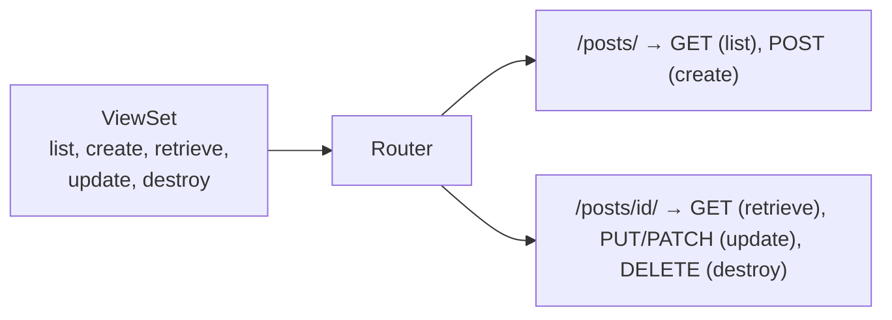
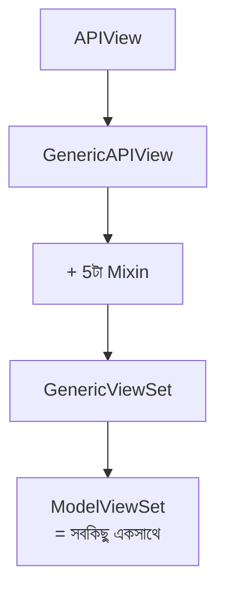

# Section 9: ViewSets — DRF এর সবচেয়ে বেশি ব্যবহৃত টুল

এতদিন আমরা ধাপে ধাপে দেখেছি — `APIView` → `Serializer` → `GenericAPIView` → `Mixins` → `Generic Views`। এই chapter এ আমরা সেই সবকিছুর চূড়ান্ত রূপ **`ViewSet`** এবং **`ModelViewSet`** দেখব — যেটা বাস্তব প্রজেক্টে সবচেয়ে বেশি ব্যবহৃত হয়, এবং যেখানে **URL ও automatic ভাবে তৈরি হয়ে যায়** `Router` দিয়ে।

---

## Why — কেন ViewSet দরকার?

আগের chapter এ আমরা List/Create এর জন্য একটা URL, Detail (Retrieve/Update/Destroy) এর জন্য আরেকটা URL — এভাবে **দুইটা আলাদা View class** এবং **দুইটা আলাদা URL pattern** লিখেছি:

```python
# আগের পদ্ধতি — দুইটা আলাদা View
class PostListCreateView(ListCreateAPIView): ...
class PostDetailView(RetrieveUpdateDestroyAPIView): ...

# urls.py
path('posts/', PostListCreateView.as_view()),
path('posts/<slug:slug>/', PostDetailView.as_view()),
```

কিন্তু লক্ষ্য করলে দেখা যায় — এই দুইটা View আসলে **একই Model, একই Serializer** নিয়েই কাজ করছে, শুধু আলাদা আলাদা URL এ। **ViewSet** এই দুইটাকে একটা মাত্র class এ একত্র করে দেয়, এবং **Router** URL পর্যন্ত automatic বানিয়ে দেয়।

```
আগে: ২টা View class + ২টা URL ম্যানুয়াল লেখা

এখন: ১টা ViewSet class + Router (URL automatic)
```

---

## ViewSet — মূল ধারণা

**ViewSet** হলো এমন একটা class, যেখানে `get`/`post`/`put`/`delete` এর বদলে **action-based method** (`list`, `create`, `retrieve`, `update`, `destroy`) লেখা হয় — এবং `Router` এই action গুলো থেকে নিজে থেকেই সঠিক URL এবং HTTP Method ম্যাপ করে দেয়।



---

## `ViewSet` (সম্পূর্ণ ম্যানুয়াল)

সবচেয়ে basic ViewSet, যেখানে প্রতিটা action নিজে লিখতে হয়:

```python
from rest_framework import viewsets
from rest_framework.response import Response
from .models import Post
from .serializers import PostSerializer

class PostViewSet(viewsets.ViewSet):
    def list(self, request):
        posts = Post.objects.all()
        serializer = PostSerializer(posts, many=True)
        return Response(serializer.data)

    def retrieve(self, request, pk=None):
        post = Post.objects.get(pk=pk)
        serializer = PostSerializer(post)
        return Response(serializer.data)

    def create(self, request):
        serializer = PostSerializer(data=request.data)
        serializer.is_valid(raise_exception=True)
        serializer.save(author=request.user)
        return Response(serializer.data, status=201)
```

এটা `APIView` এর মতোই সব কিছু ম্যানুয়ালি করতে হয়, শুধু method এর নাম `get`/`post` এর বদলে `list`/`create`/`retrieve` — যেটা `Router` চিনতে পারে।

---

## `GenericViewSet` — GenericAPIView এর সুবিধা সহ

```python
from rest_framework import viewsets, mixins

class PostViewSet(mixins.ListModelMixin,
                   mixins.CreateModelMixin,
                   mixins.RetrieveModelMixin,
                   viewsets.GenericViewSet):
    queryset = Post.objects.all()
    serializer_class = PostSerializer
```

`GenericViewSet` হলো `GenericAPIView` এর ViewSet ভার্সন — `queryset`, `serializer_class`, `get_object()` এর সুবিধা পাওয়া যায়, এবং Mixin মিলিয়ে প্রয়োজনীয় action যোগ করা যায় — ঠিক যেমন আগের chapter এ `GenericAPIView` + Mixins করেছিলাম।

---

## `ModelViewSet` — সবচেয়ে বেশি ব্যবহৃত (সব একসাথে)

```python
from rest_framework import viewsets
from .models import Post
from .serializers import PostSerializer

class PostViewSet(viewsets.ModelViewSet):
    queryset = Post.objects.all()
    serializer_class = PostSerializer

    def perform_create(self, serializer):
        serializer.save(author=self.request.user)
```

### এই মাত্র ৬ লাইনে যা যা পাওয়া যাচ্ছে

| Action | HTTP Method | URL Pattern |
|---|---|---|
| `list` | GET | `/posts/` |
| `create` | POST | `/posts/` |
| `retrieve` | GET | `/posts/{id}/` |
| `update` | PUT | `/posts/{id}/` |
| `partial_update` | PATCH | `/posts/{id}/` |
| `destroy` | DELETE | `/posts/{id}/` |

**`ModelViewSet`** আসলে ভিতরে ভিতরে **সবগুলো Mixin** (`List`, `Create`, `Retrieve`, `Update`, `Destroy`) + `GenericAPIView` কে একসাথে combine করে বানানো — এটাই আগের chapter গুলোতে ধাপে ধাপে যা শিখেছি, তার চূড়ান্ত, সম্পূর্ণ প্যাকেজ।



---

## `ReadOnlyModelViewSet` — শুধু পড়ার জন্য

```python
class CategoryViewSet(viewsets.ReadOnlyModelViewSet):
    queryset = Category.objects.all()
    serializer_class = CategorySerializer
```

এটা শুধু `list` এবং `retrieve` action দেয় — Create/Update/Delete কিছুই নেই। এমন resource এর জন্য উপযুক্ত, যেটা শুধু দেখার জন্য, edit করার জন্য না (যেমন public-facing Category লিস্ট, যেটা শুধু admin panel থেকে পরিবর্তন হবে)।

---

## Router — URL Automatic তৈরি করা

Router হলো সেই মেকানিজম, যেটা একটা ViewSet দেখে নিজে থেকেই সঠিক URL pattern তৈরি করে দেয়।

### `DefaultRouter`

```python
# blog/urls.py
from rest_framework.routers import DefaultRouter
from .views import PostViewSet, CategoryViewSet

router = DefaultRouter()
router.register('posts', PostViewSet, basename='post')
router.register('categories', CategoryViewSet, basename='category')

urlpatterns = router.urls
```

### `router.register()` কী করছে

- প্রথম argument (`'posts'`) — URL prefix
- দ্বিতীয় argument (`PostViewSet`) — কোন ViewSet ব্যবহার হবে
- `basename` — URL এর নাম তৈরির জন্য (যেমন `post-list`, `post-detail`) — সাধারণত `queryset` থেকেই automatic বের করা যায়, কিন্তু explicit দেওয়া ভালো practice

### Automatic ভাবে তৈরি হওয়া URL

```
GET    /posts/          → PostViewSet.list
POST   /posts/           → PostViewSet.create
GET    /posts/{id}/       → PostViewSet.retrieve
PUT    /posts/{id}/       → PostViewSet.update
PATCH  /posts/{id}/       → PostViewSet.partial_update
DELETE /posts/{id}/       → PostViewSet.destroy
```

এই ৬টা URL pattern **এক লাইনেও লিখতে হয়নি** — `router.register()` কল করাতেই সব তৈরি হয়ে গেছে।

---

## `DefaultRouter` vs `SimpleRouter`

| বৈশিষ্ট্য | `DefaultRouter` | `SimpleRouter` |
|---|---|---|
| Root API view | দেয় (একটা landing page, যেখানে সব registered endpoint এর লিস্ট দেখা যায়) | দেয় না |
| `.json` suffix সাপোর্ট | আছে (যেমন `/posts.json`) | নেই |
| কখন ব্যবহার করবে | Development/general ব্যবহার — বেশিরভাগ ক্ষেত্রে | যখন root view প্রয়োজন নেই, minimal রাখতে চাইলে |

```python
from rest_framework.routers import SimpleRouter

router = SimpleRouter()
router.register('posts', PostViewSet, basename='post')
```

::: tip
বেশিরভাগ প্রজেক্টে `DefaultRouter` ব্যবহার করা হয় — API root এ গিয়ে সব endpoint এর একটা browsable তালিকা দেখা যায়, যেটা development এবং documentation এর জন্য সুবিধাজনক।
:::

---

## একাধিক ViewSet একসাথে Register করা

```python
from rest_framework.routers import DefaultRouter
from .views import PostViewSet, CategoryViewSet, TagViewSet, CommentViewSet

router = DefaultRouter()
router.register('posts', PostViewSet, basename='post')
router.register('categories', CategoryViewSet, basename='category')
router.register('tags', TagViewSet, basename='tag')
router.register('comments', CommentViewSet, basename='comment')

urlpatterns = router.urls
```

চারটা Model এর জন্য সম্পূর্ণ CRUD API — মোট **২৪টা URL endpoint** (৬টা করে × ৪টা resource) — মাত্র ৪ লাইনে register হয়ে গেল।

---

## Custom Action যোগ করা — `@action` Decorator

মাঝে মাঝে standard CRUD এর বাইরেও কিছু কাজ দরকার হয় — যেমন একটা Post "like" করা। এর জন্য `@action` decorator ব্যবহার করা হয়।

```python
from rest_framework.decorators import action
from rest_framework.response import Response

class PostViewSet(viewsets.ModelViewSet):
    queryset = Post.objects.all()
    serializer_class = PostSerializer

    @action(detail=True, methods=['post'])
    def like(self, request, pk=None):
        post = self.get_object()
        post.likes.add(request.user)
        return Response({'message': 'পোস্টটি লাইক করা হয়েছে।'})

    @action(detail=False, methods=['get'])
    def published(self, request):
        published_posts = self.get_queryset().filter(is_published=True)
        serializer = self.get_serializer(published_posts, many=True)
        return Response(serializer.data)
```

### লাইন ব্যাখ্যা

- `detail=True` — এই action একটা নির্দিষ্ট object এর জন্য (URL এ `pk` লাগবে) → `/posts/{id}/like/`
- `detail=False` — এই action পুরো collection এর জন্য (URL এ `pk` লাগবে না) → `/posts/published/`
- `methods=['post']` — এই action কোন HTTP Method এ সাড়া দেবে

Router এই `@action` decorated method গুলোও automatic ভাবে চিনে নেয় এবং সঠিক URL তৈরি করে দেয় — এর জন্য আলাদা কিছু করতে হয় না।

---

## ViewSets এর সব Type — এক নজরে তুলনা

| Type | কী দেয় | কখন ব্যবহার করবে |
|---|---|---|
| `ViewSet` | কিছুই না, ম্যানুয়ালি সব লিখতে হয় | খুব কাস্টম logic দরকার হলে |
| `GenericViewSet` | `GenericAPIView` এর সুবিধা, Mixin দিয়ে action যোগ করতে হয় | নির্দিষ্ট কিছু action দরকার হলে (যেমন শুধু List+Retrieve) |
| `ModelViewSet` | সব ৬টা action, পূর্ণ CRUD | **সবচেয়ে বেশি ব্যবহৃত — standard CRUD API** |
| `ReadOnlyModelViewSet` | শুধু List+Retrieve | শুধু পড়ার জন্য resource |

---

## APIView vs ViewSet — চূড়ান্ত তুলনা

| বৈশিষ্ট্য | `APIView` | `ViewSet` |
|---|---|---|
| URL Routing | ম্যানুয়ালি লিখতে হয় | `Router` automatic করে দেয় |
| একাধিক resource এর জন্য কোড | প্রতিটার জন্য আলাদা View + URL | `router.register()` দিয়ে এক লাইনে |
| Custom logic এর জন্য নমনীয়তা | সম্পূর্ণ নিয়ন্ত্রণ | `@action` দিয়েও করা যায়, কিন্তু কনভেনশন মেনে |
| শেখার/ডিবাগ করার সহজতা | সহজ (সব explicit) | প্রথমে একটু magic মনে হতে পারে |

---

## Common Mistakes

- `router.register()` এ `basename` না দেওয়া যখন `queryset` নেই (dynamic queryset ব্যবহার করলে `basename` বাধ্যতামূলক)
- `@action` এ `detail=True/False` ভুল দেওয়া — এতে URL pattern ভুল তৈরি হয় (pk আশা করলেও না থাকা, বা উল্টো)
- `ModelViewSet` ব্যবহার করে শুধু Read-only দরকার এমন resource এ পূর্ণ CRUD খুলে রাখা — নিরাপত্তা ঝুঁকি
- `urlpatterns = router.urls` লিখতে ভুলে যাওয়া, ফলে কোনো URL কাজ না করা

---

## Best Practices

- Standard CRUD এর জন্য সবসময় `ModelViewSet` + `Router` ব্যবহার করো — এটাই DRF এর idiomatic উপায়
- শুধু-পড়ার resource এ `ReadOnlyModelViewSet` ব্যবহার করে অতিরিক্ত write endpoint বন্ধ রাখো
- Custom business logic (like, bookmark, publish) এর জন্য `@action` ব্যবহার করো, আলাদা View না বানিয়ে
- Permission নিয়ন্ত্রণ ViewSet লেভেলে করো (পরের chapter এ বিস্তারিত)

---

## Interview Questions

**প্রশ্ন: `ViewSet` আর `APIView` এর মূল পার্থক্য কী?**
> `APIView` এ HTTP method (`get`, `post`) সরাসরি define করতে হয় এবং URL ম্যানুয়ালি লিখতে হয়। `ViewSet` এ action (`list`, `create`, `retrieve`) define করা হয়, এবং `Router` স্বয়ংক্রিয়ভাবে সেগুলো থেকে URL এবং HTTP method তৈরি করে দেয়।

**প্রশ্ন: `ModelViewSet` এর ভিতরে আসলে কী আছে?**
> এটা `GenericAPIView` এর সাথে ৫টা Mixin (`List`, `Create`, `Retrieve`, `Update`, `Destroy`) এবং `GenericViewSet` এর কার্যকারিতা একসাথে combine করে বানানো — সম্পূর্ণ CRUD এর জন্য একটা pre-packaged সমাধান।

**প্রশ্ন: `@action` decorator এ `detail=True` আর `detail=False` এর পার্থক্য কী?**
> `detail=True` মানে এই action একটা নির্দিষ্ট object এর জন্য, URL এ `pk` থাকবে (`/posts/5/like/`)। `detail=False` মানে এটা পুরো collection এর জন্য, `pk` ছাড়াই (`/posts/published/`)।

**প্রশ্ন: `DefaultRouter` আর `SimpleRouter` এর মধ্যে পার্থক্য কী?**
> `DefaultRouter` একটা browsable API root view দেয় এবং `.json` suffix সাপোর্ট করে। `SimpleRouter` এই অতিরিক্ত ফিচার ছাড়া শুধু মূল URL pattern গুলো তৈরি করে।

---

## Summary

- **ViewSet** action-based method (`list`, `create`, `retrieve`, ইত্যাদি) ব্যবহার করে, যেগুলো `Router` স্বয়ংক্রিয়ভাবে সঠিক URL এবং HTTP Method এ ম্যাপ করে দেয়
- **`ModelViewSet`** — সবচেয়ে বেশি ব্যবহৃত, সম্পূর্ণ CRUD একটা class এ, মাত্র কয়েক লাইনে
- **`ReadOnlyModelViewSet`** — শুধু List+Retrieve, write operation ছাড়া
- **`Router`** (`DefaultRouter`/`SimpleRouter`) দিয়ে `router.register()` কল করলেই সব URL automatic তৈরি হয়ে যায়
- **`@action`** decorator দিয়ে standard CRUD এর বাইরের custom business logic (like, publish) যোগ করা যায়
- এই chapter এ যা শিখলাম, এটাই বাস্তব প্রজেক্টে ৮০-৯০% ক্ষেত্রে ব্যবহৃত হওয়া মূল প্যাটার্ন — বাকি সব আগের chapter (APIView, Serializer, Mixins) আসলে এই `ModelViewSet` এর ভিতরে কী ঘটছে, সেটা বোঝার ভিত্তি তৈরি করেছে

পরের chapter — **Section 10: Authentication** — এ আমরা দেখব কীভাবে JWT দিয়ে আমাদের এই ViewSet গুলোকে secure করা যায়।
