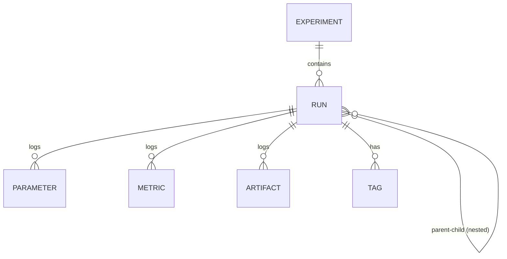
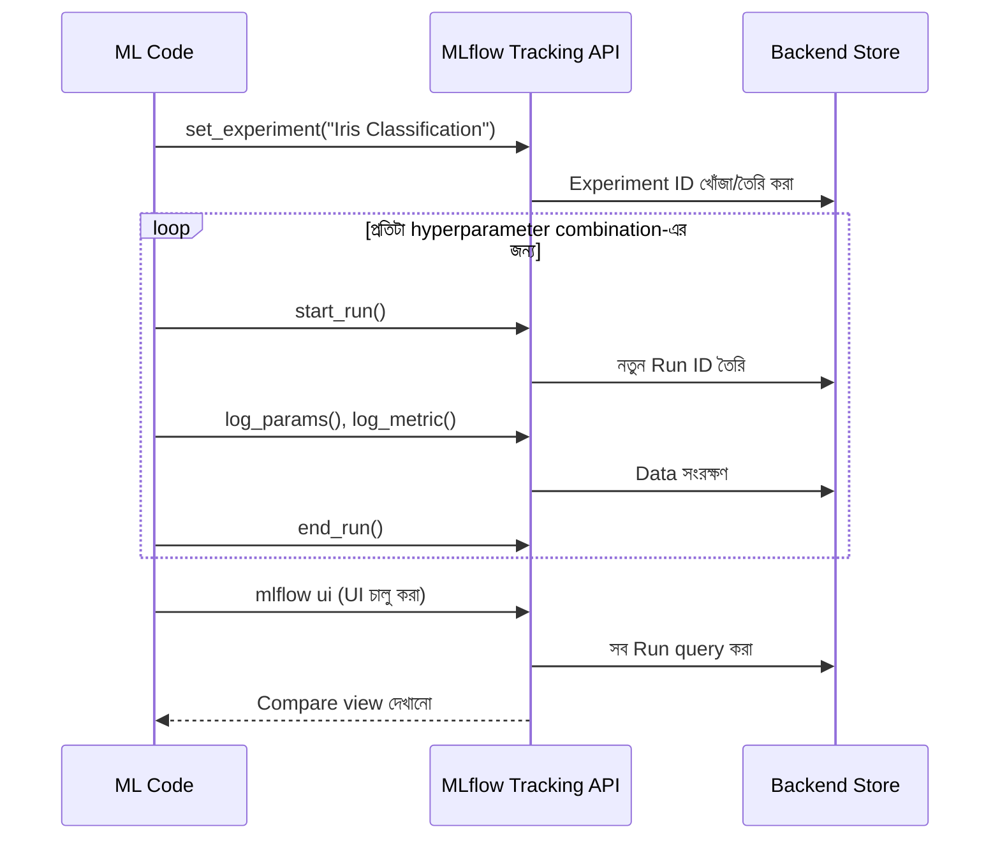

# Experiment Tracking

## What — Experiment Tracking কী?

**Experiment Tracking** হলো MLflow-এর সেই core feature, যার মাধ্যমে আপনি একটা ML project-এর একাধিক **Run**-কে সংগঠিতভাবে গ্রুপ করে রাখতে, তুলনা করতে, এবং query করতে পারেন। আগের module-এ আমরা একটা single Run তৈরি করেছিলাম; এই module-এ আমরা দেখব কীভাবে **Experiment** নামক একটা logical container-এর মধ্যে একাধিক Run পরিচালনা করা যায়, এবং কীভাবে তাদের মধ্যে তুলনা করে সবচেয়ে ভালো model খুঁজে বের করা যায়।

মনে রাখবেন: একটা **Experiment** হলো Run-গুলোর একটা group (যেমন "Iris Classification"), এবং প্রতিটা **Run** হলো সেই experiment-এর একটা single execution/attempt।

## Why — কেন দরকার?

একটা মডেল বানানোর সময় সাধারণত এক-দুইবার train করেই থেমে থাকা হয় না — বরং বিভিন্ন algorithm, বিভিন্ন hyperparameter, বিভিন্ন preprocessing পদ্ধতি নিয়ে বহুবার experiment চালাতে হয়।

### Before (Experiment Tracking ছাড়া)

- ধরুন আপনি Logistic Regression-এ ৫টা different `C` value try করলেন — প্রতিটার accuracy আলাদা আলাদা করে notebook-এর output cell-এ scroll করে খুঁজতে হয়
- একই দিনে যদি Random Forest-ও try করেন, সেই result গুলো আগের result-এর সাথে গুলিয়ে যায়
- কে কবে কোন experiment চালিয়েছিল, তা মনে রাখা কঠিন
- "সবচেয়ে ভালো model কোনটা ছিল?" — এই প্রশ্নের উত্তর দিতে গেলে পুরো notebook history আবার scroll করতে হয়

### After (Experiment Tracking দিয়ে)

- সব Run একটা নির্দিষ্ট Experiment-এর অধীনে সংগঠিতভাবে থাকে
- MLflow UI-তে একসাথে ১০-২০টা Run পাশাপাশি sort/filter করে দেখা যায় (যেমন accuracy অনুযায়ী descending order)
- Tag ব্যবহার করে Run-গুলোকে categorize করা যায় (যেমন `model_type: random_forest`)
- Parallel coordinates plot বা scatter plot দিয়ে visually hyperparameter আর metric-এর সম্পর্ক দেখা যায়

## Analogy — বাস্তব জীবনের উপমা

Experiment Tracking-কে একটা **রেস্টুরেন্টের রেসিপি টেস্টিং প্রক্রিয়া** হিসেবে চিন্তা করুন। একজন শেফ যখন একটা নতুন dish বানানোর চেষ্টা করেন, তিনি "Chicken Curry Recipe" নামে একটা ফোল্ডার (Experiment) রাখেন। এর ভেতরে প্রতিটা try (Run)-এর জন্য আলাদা নোট রাখেন — কতটুকু মসলা (parameters), স্বাদ কেমন হলো (metrics), এবং ছবি বা sample (artifacts)। মাস শেষে তিনি সব try পাশাপাশি রেখে দেখতে পারেন কোন combination-এ সবচেয়ে ভালো স্বাদ পাওয়া গিয়েছিল — ঠিক যেমন MLflow UI-তে Run compare করা হয়।

## Internal Working — ভিতরে ভিতরে কী ঘটছে

1. আপনি যখন `mlflow.set_experiment("Iris Classification")` কল করেন, MLflow প্রথমে চেক করে এই নামের একটা Experiment আছে কিনা। না থাকলে একটা নতুন **Experiment ID** সহ তৈরি করে ফেলে
2. এরপর যতগুলো `mlflow.start_run()` কল হবে, সবগুলো এই Experiment ID-এর অধীনে সংরক্ষিত হবে
3. প্রতিটা Run-এর জন্য একটা unique **Run ID** (UUID) তৈরি হয়, এবং সেই Run-এর সব parameter/metric/tag একটা মেটাডেটা ফাইলে (backend store-এ) লেখা হয়
4. MLflow UI যখন এই data পড়ে, তখন এটা Experiment ID অনুযায়ী Run-গুলোকে group করে টেবিল আকারে দেখায়, এবং আপনি column sort, filter expression (যেমন `metrics.accuracy > 0.9`), বা chart view ব্যবহার করতে পারেন
5. **Nested Run** এর ক্ষেত্রে, একটা parent Run-এর ভেতরে child Run তৈরি হলে, MLflow একটা `mlflow.parentRunId` tag automatically সেট করে দেয়, যা দিয়ে UI-তে hierarchy (tree view) দেখানো হয়

### Diagram — Experiment ও Run-এর সম্পর্ক





## Code Example — সম্পূর্ণ, চালানোর উপযোগী কোড

আমরা আগের module-এর Iris dataset-ই continue করব, কিন্তু এখন একটা loop-এ একাধিক hyperparameter combination try করে একই Experiment-এর অধীনে একাধিক Run log করব।

```python
import mlflow
import mlflow.sklearn
from sklearn.datasets import load_iris
from sklearn.model_selection import train_test_split
from sklearn.linear_model import LogisticRegression
from sklearn.ensemble import RandomForestClassifier
from sklearn.metrics import accuracy_score, f1_score

# একই Iris dataset — পুরো series-এ ধারাবাহিক থাকবে
iris = load_iris()
X, y = iris.data, iris.target
X_train, X_test, y_train, y_test = train_test_split(
    X, y, test_size=0.2, random_state=42
)

# একটা নির্দিষ্ট Experiment সেট করা হচ্ছে — এটার অধীনে সব Run গ্রুপ হবে
# Experiment না থাকলে MLflow automatically তৈরি করে নেবে
mlflow.set_experiment("Iris Classification")

# একাধিক hyperparameter combination টেস্ট করার জন্য একটা list
c_values = [0.1, 1.0, 10.0]

for c in c_values:
    # run_name-এ hyperparameter value যুক্ত করা হচ্ছে, যাতে UI-তে সহজে চেনা যায়
    with mlflow.start_run(run_name=f"logreg_C_{c}"):
        model = LogisticRegression(C=c, max_iter=200)
        model.fit(X_train, y_train)

        y_pred = model.predict(X_test)
        accuracy = accuracy_score(y_test, y_pred)
        f1 = f1_score(y_test, y_pred, average="weighted")

        # Tag ব্যবহার করে Run-কে categorize করা হচ্ছে
        mlflow.set_tag("model_type", "logistic_regression")
        mlflow.set_tag("developer", "data_science_team")

        mlflow.log_param("C", c)
        mlflow.log_metric("accuracy", accuracy)
        mlflow.log_metric("f1_score", f1)
        mlflow.sklearn.log_model(model, artifact_path="model")

# এখন একটা ভিন্ন algorithm — Random Forest — একই Experiment-এর অধীনে
# nested run হিসেবে, একটা parent run-এর ভেতরে একাধিক child run
with mlflow.start_run(run_name="random_forest_parent") as parent_run:
    mlflow.set_tag("model_type", "random_forest")

    for n_estimators in [50, 100]:
        # nested=True দিয়ে বোঝানো হচ্ছে এটা parent run-এর child
        with mlflow.start_run(run_name=f"rf_n_{n_estimators}", nested=True):
            rf_model = RandomForestClassifier(
                n_estimators=n_estimators, random_state=42
            )
            rf_model.fit(X_train, y_train)

            y_pred = rf_model.predict(X_test)
            accuracy = accuracy_score(y_test, y_pred)

            mlflow.log_param("n_estimators", n_estimators)
            mlflow.log_metric("accuracy", accuracy)
            mlflow.sklearn.log_model(rf_model, artifact_path="model")

print("সব experiment run সম্পন্ন হয়েছে। 'mlflow ui' চালিয়ে দেখুন।")
```

**কোড ব্যাখ্যা:**

- `mlflow.set_experiment("Iris Classification")` — এই লাইনের পর থেকে যতগুলো `start_run()` কল হবে, সব এই Experiment-এর অধীনে যাবে। Experiment না থাকলে নতুন তৈরি হয়, থাকলে সেটাই reuse হয়।
- `for c in c_values:` loop — প্রতিটা iteration-এ একটা নতুন independent Run তৈরি হচ্ছে, যাতে প্রতিটা hyperparameter combination আলাদাভাবে track হয়।
- `mlflow.set_tag()` — Parameter আর Metric numeric/measurable জিনিসের জন্য, কিন্তু Tag হলো metadata/label-এর জন্য (যেমন কে চালিয়েছে, কোন model family)। Tag দিয়ে UI-তে filter করা যায়।
- `with mlflow.start_run(...) as parent_run:` — একটা parent Run শুরু হচ্ছে, যার ভেতরে
- `nested=True` — এই parameter দিয়ে MLflow-কে বলা হচ্ছে যে এই নতুন Run, বর্তমান active Run-এর child। এতে UI-তে hierarchy (tree structure) দেখা যায়, যা group-related experiments-এর জন্য উপকারী।

## Request/Output উদাহরণ

`mlflow ui` চালানোর পর UI-তে Experiment "Iris Classification"-এ ক্লিক করলে নিচের মতো একটা তালিকা দেখা যাবে (sort করা accuracy অনুযায়ী):

| Run Name | model_type | accuracy | f1_score | C | n_estimators |
|---|---|---|---|---|---|
| logreg_C_10.0 | logistic_regression | 1.0000 | 1.0000 | 10.0 | - |
| rf_n_100 (nested) | random_forest | 0.9667 | - | - | 100 |
| logreg_C_1.0 | logistic_regression | 0.9667 | 0.9666 | 1.0 | - |
| rf_n_50 (nested) | random_forest | 0.9667 | - | - | 50 |
| logreg_C_0.1 | logistic_regression | 0.9333 | 0.9332 | 0.1 | - |

UI-তে "random_forest_parent" Run-এর নিচে একটা expand আইকন দেখা যাবে, যেখানে ক্লিক করলে `rf_n_50` এবং `rf_n_100` — এই দুটো child Run দেখা যাবে।

## Comparison Table — Parameter বনাম Metric বনাম Tag

| বিষয় | Parameter | Metric | Tag |
|---|---|---|---|
| উদ্দেশ্য | Input configuration (hyperparameter) | Output measurement (performance) | Metadata/label |
| Data Type | String/Number (fixed per run) | Number (time-series সাপোর্ট করে) | String |
| একই key-তে multiple বার log | না, শুধু শেষ value থাকে | হ্যাঁ, step অনুযায়ী history রাখে | না |
| উদাহরণ | `learning_rate=0.01`, `n_estimators=100` | `accuracy=0.95`, `loss=0.23` | `team=data_science`, `dataset_version=v2` |
| UI-তে filter করা যায়? | হ্যাঁ | হ্যাঁ | হ্যাঁ |

## Common Mistakes — নতুনরা যেসব ভুল করে

- **সব experiment-কে default Experiment-এর অধীনে রেখে দেওয়া** — `set_experiment()` কল না করলে সব Run "Default" নামক একটা experiment-এর অধীনে জমা হতে থাকে, যা সময়ের সাথে বিশৃঙ্খল হয়ে পড়ে
- **Nested run ব্যবহার করার সময় `nested=True` দিতে ভুলে যাওয়া** — এতে MLflow error দেয় (ইতিমধ্যে একটা active run থাকা অবস্থায় নতুন run শুরু করার চেষ্টা), কারণ MLflow ভাবে আপনি ভুলবশত run overlap করছেন
- **Metric আর Parameter-এর ভূমিকা গুলিয়ে ফেলা** — যেমন `accuracy`-কে parameter হিসেবে log করা, যেখানে এটা আসলে output measurement, parameter নয়
- **প্রতিটা loop iteration-এ পুরোনো Run বন্ধ না করে নতুন শুরু করা** — `with` context manager ব্যবহার না করলে run manually `end_run()` করতে ভুলে যাওয়ার সম্ভাবনা থাকে, যাতে data ভুল Run-এ চলে যেতে পারে

## Best Practices

- সবসময় project শুরুতেই একটা নির্দিষ্ট `mlflow.set_experiment()` কল করুন, "Default" experiment-এর উপর নির্ভর করবেন না
- Hyperparameter sweep/loop-এর সময় সবসময় `with mlflow.start_run():` context manager ব্যবহার করুন, যাতে run automatically সঠিকভাবে বন্ধ হয়
- Tag ব্যবহার করুন সেই সব তথ্যের জন্য যা filter/search করার জন্য প্রয়োজন কিন্তু numeric নয় (যেমন model family, developer name, dataset version)
- Related sub-experiments group করার জন্য nested run ব্যবহার করুন (যেমন একটা algorithm-এর একাধিক hyperparameter variant)
- UI-তে filter expression ব্যবহার করে regularly best-performing run খুঁজে বের করার অভ্যাস করুন (যেমন `metrics.accuracy > 0.95`)

## Interview Questions

**প্রশ্ন ১: Experiment এবং Run-এর মধ্যে সম্পর্ক ব্যাখ্যা করুন।**
উত্তর: একটা Experiment হলো একাধিক Run-এর একটা logical grouping — যেমন একটা নির্দিষ্ট project বা problem statement। প্রতিটা Run হলো সেই Experiment-এর একটা single execution, যার নিজস্ব parameters, metrics, tags, এবং artifacts থাকে। এক Experiment-এর অধীনে হাজারো Run থাকতে পারে।

**প্রশ্ন ২: Nested Run কী, এবং কখন এটা ব্যবহার করা উচিত?**
উত্তর: Nested Run হলো একটা parent Run-এর ভেতরে থাকা child Run, যা `nested=True` parameter দিয়ে তৈরি করা হয়। এটা ব্যবহার করা হয় যখন একটা বড় experiment-এর ভেতরে একাধিক sub-experiment থাকে — যেমন cross-validation-এর প্রতিটা fold, বা hyperparameter search-এর প্রতিটা trial — এবং এদের একটা logical hierarchy-তে group করে রাখতে চাওয়া হয়।

**প্রশ্ন ৩: MLflow-এ Parameter, Metric, এবং Tag-এর মধ্যে পার্থক্য কী?**
উত্তর: Parameter হলো input configuration (যেমন learning rate), যা per-run একবারই সেট থাকে। Metric হলো output measurement (যেমন accuracy), যা time-series হিসেবে (step-by-step) একাধিকবার log করা যায়। Tag হলো arbitrary metadata/label (যেমন developer নাম), যা categorization ও filtering-এর জন্য ব্যবহৃত হয়।

**প্রশ্ন ৪: `mlflow.set_experiment()` কল না করলে কী হয়?**
উত্তর: MLflow automatically একটা "Default" নামক experiment (Experiment ID 0) ব্যবহার করে, এবং তৈরি হওয়া সব Run সেই একই Default experiment-এর অধীনে জমা হতে থাকে, যা বড় প্রজেক্টে সংগঠন সমস্যা তৈরি করে।

## Summary

- Experiment হলো Run-গুলোর logical container; Run হলো একটা single execution attempt
- `mlflow.set_experiment()` দিয়ে একটা নির্দিষ্ট Experiment-এর অধীনে Run গুলো organize করা হয়
- Tag ব্যবহার করে non-numeric metadata log করা হয়, যা filtering/categorization-এ সাহায্য করে
- Nested Run দিয়ে related sub-experiments-কে hierarchically group করা যায়
- MLflow UI-তে একাধিক Run পাশাপাশি sort/filter/compare করা যায়, যা সবচেয়ে ভালো model খুঁজে পেতে সাহায্য করে
- আমাদের ধারাবাহিক Iris classification project-এ এখন আমরা Logistic Regression এবং Random Forest — দুই ধরনের model-এর একাধিক Run compare করেছি

## পরবর্তী ধাপ

এই module-এ আমরা একাধিক Run কীভাবে সংগঠিত ও তুলনা করা যায়, তা শিখলাম। পরের module-এ আমরা যাব **Model Registry**-তে — যেখানে আমরা দেখব কীভাবে আমাদের সবচেয়ে ভালো performing model (যেমন `logreg_C_10.0`)-কে registry-তে register করে version control করা যায়, এবং Staging থেকে Production-এ stage transition করা যায়।

---

আপনি কি পরের topic **"Model Registry"** এর জন্য প্রস্তুত?
