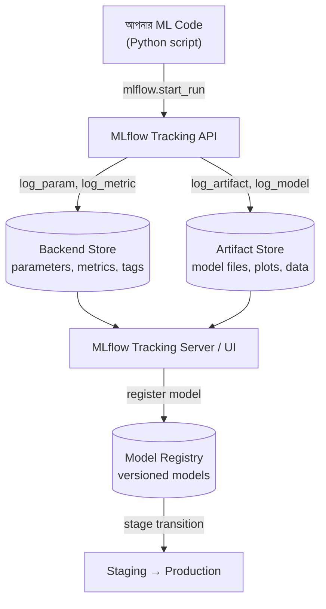

# MLflow Fundamentals

## What — MLflow কী?

**MLflow** হলো একটা **open-source platform**, যেটা machine learning (ML) এর পুরো lifecycle — experimentation, reproducibility, deployment এবং একটা central model registry — ম্যানেজ করার জন্য বানানো হয়েছে। সহজভাবে বললে, MLflow আপনাকে সাহায্য করে আপনার ML experiment গুলো track করতে, model versions সংরক্ষণ করতে, এবং সেই model গুলো production-এ deploy করতে।

MLflow-এর মূলত ৪টা component আছে:

1. **MLflow Tracking** — experiments log এবং query করার জন্য (parameters, metrics, artifacts)
2. **MLflow Projects** — reproducible ML code packaging করার format
3. **MLflow Models** — model কে বিভিন্ন environment-এ deploy করার জন্য একটা standard format
4. **MLflow Model Registry** — model versions centrally store এবং manage করার জন্য একটা repository

এই পুরো documentation series-এ আমরা এই ৪টা component নিয়েই ধারাবাহিকভাবে কাজ করব।

:::tip
MLflow যেকোনো ML library (scikit-learn, PyTorch, TensorFlow, XGBoost ইত্যাদি) এর সাথে কাজ করে — এটা library-agnostic।
:::

## Why — কেন দরকার?

একজন Data Scientist বা ML Engineer যখন একটা model বানায়, তখন সে সাধারণত একই সমস্যার জন্য বারবার different **hyperparameters**, **algorithms**, বা **data preprocessing** পদ্ধতি try করে। MLflow ছাড়া এই কাজ করলে যেসব সমস্যা হয়:

### Before (MLflow ছাড়া)

- প্রতিটা experiment-এর result Excel sheet-এ বা notebook-এর comment-এ হাতে লিখে রাখতে হয়
- কোন model কোন hyperparameter-এ train হয়েছিল, সেটা মনে রাখা কঠিন হয়ে যায়
- Model file গুলো এলোমেলোভাবে ফোল্ডারে পড়ে থাকে (`model_v1_final_ACTUAL.pkl` জাতীয় নাম!)
- Team-এর অন্য সদস্যরা আপনার experiment reproduce করতে পারে না
- Production-এ কোন model version আছে, তা track করার কোনো systematic উপায় থাকে না

### After (MLflow দিয়ে)

- প্রতিটা run-এর parameter, metric, এবং artifact automatically log হয়ে যায়
- একটা UI-তে সব experiment side-by-side compare করা যায়
- Model versioning এবং stage transition (Staging → Production) systematically হয়
- Team-এর সবাই একই central tracking server থেকে experiment দেখতে পারে
- Reproducibility নিশ্চিত হয় — কোন code, কোন data, কোন environment দিয়ে model বানানো হয়েছিল, সব থেকে যায়

## Analogy — বাস্তব জীবনের উপমা

MLflow কে একটা **ল্যাব নোটবুক এবং গুদামঘরের ম্যানেজার** হিসেবে চিন্তা করুন।

একজন গবেষক (Data Scientist) যখন কোনো experiment করেন, তিনি একটা ল্যাব নোটবুকে লিখে রাখেন — কী কী ingredient (parameters) ব্যবহার করেছেন, কী result (metrics) পেয়েছেন, এবং কোনো sample (artifact) থাকলে সেটা সংরক্ষণ করেন। MLflow Tracking ঠিক এই নোটবুকের কাজটাই করে, কিন্তু automatically এবং searchable ফরম্যাটে।

আর যখন কোনো একটা "সফল formula" (model) পাওয়া যায়, সেটাকে গুদামে (Model Registry) সংরক্ষণ করা হয়, একটা version number দিয়ে ট্যাগ করা হয়, এবং প্রয়োজনমতো "প্রোডাকশন লাইনে" (deployment) পাঠানো হয়।

## Internal Working — ভিতরে ভিতরে কী ঘটছে

MLflow যখন আপনার কোডে চলে, তখন নিচের ধাপগুলো ঘটে:

1. আপনি `mlflow.start_run()` কল করলে MLflow একটা নতুন **Run** তৈরি করে, যেটার একটা unique **Run ID** থাকে
2. এই Run-এর ভেতরে আপনি `log_param()`, `log_metric()`, `log_artifact()` কল করলে সেই data একটা **backend store**-এ (default-এ local ফোল্ডার, অথবা database/server) সংরক্ষিত হয়
3. প্রতিটা Run একটা **Experiment**-এর অধীনে থাকে (Experiment হলো Run-গুলোর একটা logical grouping)
4. আপনি যদি model save করেন (`mlflow.sklearn.log_model()` জাতীয় ফাংশন দিয়ে), তখন সেই model একটা standard directory structure-এ (MLmodel file সহ) **artifact store**-এ চলে যায়
5. পরে MLflow UI (Tracking Server) এই backend store এবং artifact store থেকে data পড়ে একটা visual dashboard দেখায়

### Architecture Diagram



:::warning
Default configuration-এ MLflow সব data আপনার local ফোল্ডারে (`./mlruns`) সংরক্ষণ করে। Team collaboration-এর জন্য আপনার একটা central Tracking Server (database backend + cloud artifact storage) সেটআপ করা উচিত — এটা আমরা পরের module-এ বিস্তারিত দেখব।
:::

## Code Example — সম্পূর্ণ, চালানোর উপযোগী কোড

এই পুরো documentation series-এ আমরা একটা consistent example ব্যবহার করব: **Iris flower classification** — scikit-learn দিয়ে একটা Logistic Regression model train করা। এই একই project পরের সব module-এ (Experiment Tracking, Model Registry, Autologging, Serving, Evaluation) ব্যবহার করা হবে।

প্রথমে প্রয়োজনীয় library install করুন:

```bash
pip install mlflow scikit-learn pandas
```

এখন একটা সম্পূর্ণ script দেখুন যেখানে MLflow দিয়ে প্রথম experiment run করা হচ্ছে:

```python
import mlflow
import mlflow.sklearn
from sklearn.datasets import load_iris
from sklearn.model_selection import train_test_split
from sklearn.linear_model import LogisticRegression
from sklearn.metrics import accuracy_score, f1_score

# Iris dataset লোড করা হচ্ছে — এই dataset পুরো series-এ ব্যবহৃত হবে
iris = load_iris()
X, y = iris.data, iris.target

# Train এবং test set-এ ভাগ করা হচ্ছে
X_train, X_test, y_train, y_test = train_test_split(
    X, y, test_size=0.2, random_state=42
)

# Hyperparameter গুলো একটা variable-এ রাখা হচ্ছে, যাতে log করা সহজ হয়
params = {
    "C": 1.0,
    "max_iter": 200,
    "solver": "lbfgs"
}

# MLflow Run শুরু করা হচ্ছে — এই "with" ব্লকের ভেতরে যা কিছু হবে
# সবই এই একটা নির্দিষ্ট Run-এর সাথে যুক্ত হয়ে যাবে
with mlflow.start_run(run_name="logistic_regression_baseline"):

    # Model তৈরি এবং train করা হচ্ছে
    model = LogisticRegression(**params)
    model.fit(X_train, y_train)

    # Prediction এবং evaluation
    y_pred = model.predict(X_test)
    accuracy = accuracy_score(y_test, y_pred)
    f1 = f1_score(y_test, y_pred, average="weighted")

    # --- এখান থেকেই MLflow-এর মূল কাজ শুরু ---

    # Hyperparameters log করা হচ্ছে — পরে UI-তে এগুলো compare করা যাবে
    mlflow.log_params(params)

    # Metrics log করা হচ্ছে
    mlflow.log_metric("accuracy", accuracy)
    mlflow.log_metric("f1_score", f1)

    # সম্পূর্ণ model artifact হিসেবে সংরক্ষণ করা হচ্ছে
    mlflow.sklearn.log_model(model, artifact_path="iris_model")

    print(f"Run সম্পন্ন হয়েছে — Accuracy: {accuracy:.4f}, F1 Score: {f1:.4f}")
```

**কোড ব্যাখ্যা:**

- `load_iris()` — scikit-learn-এর built-in Iris dataset, ৩ প্রজাতির ফুলের ১৫০টা sample নিয়ে গঠিত। এটাই আমাদের ধারাবাহিক project-এর dataset।
- `mlflow.start_run(run_name=...)` — একটা নতুন Run শুরু করে; `run_name` দিয়ে human-readable নাম দেওয়া যায়, না দিলে MLflow randomly একটা নাম generate করে দেয়।
- `mlflow.log_params(params)` — dictionary আকারে একসাথে একাধিক parameter log করার shortcut; আলাদাভাবে `log_param()` ও কল করা যায়।
- `mlflow.log_metric()` — একটা single numeric metric log করে; একই key দিয়ে বারবার কল করলে (যেমন training loop-এ প্রতি epoch-এ) সেটা একটা time-series হিসেবে সংরক্ষিত হয়।
- `mlflow.sklearn.log_model()` — scikit-learn model-এর জন্য একটা flavor-specific logging function, যা model-কে MLflow-এর standard format-এ (MLmodel metadata সহ) সংরক্ষণ করে।

## Request/Output উদাহরণ

Script রান করার পর টার্মিনালে output দেখতে এরকম হবে:

```
Run সম্পন্ন হয়েছে — Accuracy: 1.0000, F1 Score: 1.0000
```

এবং একটা `mlruns/` ফোল্ডার তৈরি হয়ে যাবে আপনার working directory-তে। MLflow UI দেখতে চাইলে:

```bash
mlflow ui
```

এই কমান্ড চালানোর পর ব্রাউজারে `http://localhost:5000` এ গেলে আপনি দেখবেন:

| Run Name                     | accuracy | f1_score | C   | max_iter | solver |
| ---------------------------- | -------- | -------- | --- | -------- | ------ |
| logistic_regression_baseline | 1.0000   | 1.0000   | 1.0 | 200      | lbfgs  |

## Comparison Table — MLflow বনাম অন্যান্য টুল

| বিষয়         | MLflow                                                      | Weights & Biases (W&B)                           | TensorBoard                                    |
| ------------------ | ----------------------------------------------------------- | ------------------------------------------------ | ---------------------------------------------- |
| Open Source        | হ্যাঁ, সম্পূর্ণ free                           | Free tier আছে, তবে enterprise feature paid | হ্যাঁ, সম্পূর্ণ free              |
| Library Support    | Framework-agnostic (কোনো library-তে lock হয় না) | Framework-agnostic                               | মূলত TensorFlow/PyTorch-কেন্দ্রিক |
| Model Registry     | Built-in আছে                                             | আছে (paid tier-এ বেশি feature)           | নেই (আলাদা টুল লাগে)            |
| Deployment Support | Built-in (mlflow models serve)                              | সীমিত, integration লাগে                 | নেই                                         |
| Self-hosting       | সহজ, নিজের infrastructure-এ চালানো যায়  | সীমিত (মূলত cloud-based)                | সহজ                                         |
| Setup জটিলতা | কম                                                        | কম                                             | কম                                           |

## Common Mistakes — নতুনরা যেসব ভুল করে

- **`mlflow.start_run()` না ব্যবহার করে সরাসরি `log_param()`/`log_metric()` কল করা** — এতে MLflow automatically একটা default run-এ log করে, যা পরে বিভ্রান্তি তৈরি করে। সবসময় explicit `with mlflow.start_run():` ব্যবহার করা উচিত।
- **`mlruns` ফোল্ডার git repository-তে commit করে ফেলা** — এই ফোল্ডার বড় হয়ে যায় এবং team-এর জন্য conflict তৈরি করে। `.gitignore`-এ `mlruns/` যুক্ত করা জরুরি।
- **Model log করার সময় সঠিক flavor function না ব্যবহার করা** — যেমন scikit-learn model-এর জন্য `mlflow.sklearn.log_model()` না ব্যবহার করে generic `mlflow.log_artifact()` দিয়ে pickle file save করা। এতে model versioning, signature, dependency tracking-এর সুবিধাগুলো হারিয়ে যায়।
- **Metric log করার সময় step parameter ভুলে যাওয়া** — training loop-এ প্রতি epoch-এর metric log করার সময় `step` parameter না দিলে graph-এ সঠিক progression দেখা যায় না।

## Best Practices

- প্রতিটা experiment-এর জন্য একটা meaningful `run_name` দিন, যাতে পরে UI-তে খুঁজে পাওয়া সহজ হয়
- Related runs-গুলোকে একটা common `mlflow.set_experiment("experiment_name")` এর অধীনে group করুন
- Model log করার সময় সবসময় library-specific flavor function ব্যবহার করুন (`mlflow.sklearn`, `mlflow.pytorch`, ইত্যাদি)
- Hyperparameter, metric, এবং model — এই তিনটাই একসাথে প্রতিটা run-এ log করুন, যাতে পুরো context ধরা থাকে
- Production environment-এর জন্য local file-based tracking (`./mlruns`) এর বদলে একটা proper Tracking Server (database + object storage backend) সেটআপ করুন

## Interview Questions

**প্রশ্ন ১: MLflow-এর চারটা মূল component কী কী?**
উত্তর: MLflow Tracking (experiment logging), MLflow Projects (reproducible packaging), MLflow Models (standard deployment format), এবং MLflow Model Registry (centralized model versioning ও lifecycle management)।

**প্রশ্ন ২: MLflow Run এবং Experiment-এর মধ্যে পার্থক্য কী?**
উত্তর: একটা Experiment হলো Run-গুলোর একটা logical container/group (যেমন "Iris Classification Project")। একটা Run হলো সেই experiment-এর ভেতরে একটা single execution, যার নিজস্ব parameters, metrics, এবং artifacts থাকে।

**প্রশ্ন ৩: `mlflow.log_artifact()` এবং `mlflow.sklearn.log_model()` — এই দুটোর মধ্যে পার্থক্য কী?**
উত্তর: `log_artifact()` হলো একটা generic function যা যেকোনো ফাইল (image, csv, ইত্যাদি) artifact store-এ সংরক্ষণ করে, কিন্তু এটা model-এর metadata (framework version, input/output signature) বোঝে না। `log_model()` (flavor-specific) model-কে একটা standard MLmodel format-এ সংরক্ষণ করে, যাতে পরে সহজে load এবং deploy করা যায়।

**প্রশ্ন ৪: ডিফল্টভাবে MLflow experiment data কোথায় সংরক্ষিত হয়?**
উত্তর: ডিফল্টভাবে, কোনো Tracking URI configure না করলে, MLflow current working directory-তে একটা `mlruns/` ফোল্ডারে সব data (parameters, metrics, artifacts) সংরক্ষণ করে।

## Summary

- MLflow একটা open-source platform যা ML lifecycle-এর ৪টা মূল অংশ — Tracking, Projects, Models, এবং Model Registry — ম্যানেজ করে
- এটা experiment reproducibility, team collaboration, এবং systematic model management-এর সমস্যা সমাধান করে
- `mlflow.start_run()` দিয়ে একটা Run শুরু হয়, যার ভেতরে parameters, metrics, এবং model artifacts log করা যায়
- Default configuration local `mlruns/` ফোল্ডার ব্যবহার করে, কিন্তু production-এ central Tracking Server প্রয়োজন
- আমাদের ধারাবাহিক example project: scikit-learn দিয়ে Iris classification (Logistic Regression)

## পরবর্তী ধাপ

এই module-এ আমরা MLflow-এর ভিত্তি এবং একটা প্রাথমিক Run বুঝলাম। পরের module-এ আমরা গভীরভাবে **Experiment Tracking**-এ যাব — কীভাবে multiple runs compare করা যায়, nested runs, tags, autologging-এর প্রাথমিক ধারণা, এবং Tracking Server-এর configuration নিয়ে বিস্তারিত আলোচনা করব।

---

আপনি কি পরের topic **"Experiment Tracking"** এর জন্য প্রস্তুত? বললে আমি সেটার জন্য file name suggest করে content লেখা শুরু করব।
