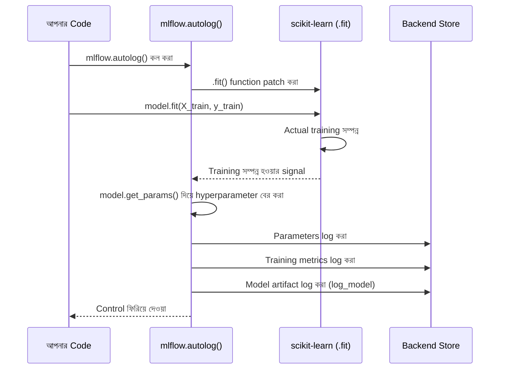

# MLflow Autologging

## What — Autologging কী?

**MLflow Autologging** হলো এমন একটা feature, যেখানে আপনাকে ম্যানুয়ালি প্রতিটা `log_param()`, `log_metric()`, বা `log_model()` কল না করেই, শুধুমাত্র একটা লাইন — `mlflow.autolog()` — লিখলেই MLflow automatically আপনার training code থেকে relevant parameters, metrics, model, এবং কিছু ক্ষেত্রে artifacts (যেমন confusion matrix) নিজে থেকে detect করে log করে ফেলে।

আগের দুই module-এ আমরা `mlflow.log_params()`, `mlflow.log_metric()` ইত্যাদি হাতে কল করেছিলাম — এটাকে বলা হয় **manual logging**। এই module-এ আমরা দেখব একই কাজ কীভাবে autologging দিয়ে অনেক কম কোডে করা যায়।

## Why — কেন দরকার?

Manual logging কাজ করে, কিন্তু এর কিছু বাস্তব সমস্যা আছে যা autologging সমাধান করে।

### Before (Manual Logging দিয়ে)

- প্রতিটা নতুন hyperparameter model-এ যোগ করলে, সেটাকে আলাদা করে `log_param()` দিয়ে log করতে মনে রাখতে হয় — ভুলে গেলে সেই তথ্য হারিয়ে যায়
- যদি model-এর ২০টা hyperparameter থাকে (যেমন Random Forest-এ), সবগুলো হাতে লেখা tedious এবং error-prone
- Framework-specific metric (যেমন scikit-learn-এর training score, বা XGBoost-এর built-in evaluation metric) হাতে বের করে log করতে অতিরিক্ত কোড লিখতে হয়
- কোনো একটা parameter log করতে ভুলে গেলে, পরে সেই experiment reproduce করার সময় সমস্যা হয়

### After (Autologging দিয়ে)

- মাত্র একটা লাইন — `mlflow.autolog()` — এবং MLflow automatically model-এর সব hyperparameter, training/validation metric, এবং model artifact log করে ফেলে
- Framework-নির্দিষ্ট বিস্তারিত তথ্য (যেমন feature importance, learning curve) automatically capture হয়
- Human error কমে যায় — কিছু log করতে "ভুলে যাওয়া"র সম্ভাবনা থাকে না
- নতুন কোনো hyperparameter model-এ যোগ করলে, আলাদা করে কোনো log statement লেখার প্রয়োজন হয় না

:::warning
Autologging সব কিছু automatically করলেও, custom/business-specific metric (যেমন "revenue impact score") বা custom tag এখনো manually log করতে হবে — autologging শুধু framework-standard তথ্যগুলো ধরতে পারে।
:::

## Analogy — বাস্তব জীবনের উপমা

Manual logging-কে চিন্তা করুন একজন গাড়ির ড্রাইভার হিসেবে, যাকে প্রতিটা যাত্রার পর নিজে হাতে একটা লগবুকে fuel level, distance, এবং speed লিখে রাখতে হয়। Autologging হলো একটা modern car-এর **built-in trip computer** — গাড়ি নিজেই automatically fuel consumption, distance, average speed track করে ফেলে, ড্রাইভারকে কিছু লিখতে হয় না। ড্রাইভার শুধু চাইলে অতিরিক্ত কোনো নোট (custom tag) যোগ করতে পারেন, যেমন "আজকে বৃষ্টির মধ্যে ড্রাইভ করেছি" — যেটা car নিজে থেকে জানতে পারবে না।

## Internal Working — ভিতরে ভিতরে কী ঘটছে

1. `mlflow.autolog()` কল করলে, MLflow ইনস্টল থাকা সব supported library (scikit-learn, XGBoost, PyTorch, TensorFlow, LightGBM ইত্যাদি)-এর জন্য automatically **monkey-patching** সেট করে দেয় — অর্থাৎ সেই library-র নির্দিষ্ট function (যেমন scikit-learn-এর `.fit()`) কে internally wrap করে দেয়
2. যখন আপনি `model.fit(X_train, y_train)` কল করেন, MLflow-এর wrapped ভার্সন প্রথমে original `.fit()` execute করে, তারপর automatically model object থেকে সব hyperparameter (`get_params()` দিয়ে) বের করে log করে
3. Training শেষ হলে, MLflow model object-কে `log_model()` দিয়ে automatically artifact হিসেবে সংরক্ষণ করে
4. যদি `X_test`/`y_test` দেওয়া থাকে (framework-নির্ভর করে), MLflow automatically evaluation metric-ও (accuracy, R², ইত্যাদি) হিসেব করে log করে
5. এই পুরো প্রক্রিয়া একটা active Run-এর ভেতরে ঘটে — যদি `start_run()` explicitly কল না করা থাকে, MLflow autolog নিজে থেকেই একটা Run শুরু করে দেয়

### Diagram



## Code Example — সম্পূর্ণ, চালানোর উপযোগী কোড

আমরা একই Iris dataset ব্যবহার করব, কিন্তু এবার manual logging-এর বদলে autologging দিয়ে — এবং দেখব কোডের পরিমাণ কতটা কমে যায়।

```python
import mlflow
from sklearn.datasets import load_iris
from sklearn.model_selection import train_test_split
from sklearn.ensemble import RandomForestClassifier

# একই Iris dataset — পুরো series-এ ধারাবাহিক
iris = load_iris()
X, y = iris.data, iris.target
X_train, X_test, y_train, y_test = train_test_split(
    X, y, test_size=0.2, random_state=42
)

mlflow.set_experiment("Iris Classification")

# --- এখানেই মূল পার্থক্য: শুধু একটা লাইন ---
# log_models=True দিয়ে model automatically artifact হিসেবে save হবে
# log_input_examples=True দিয়ে একটা sample input example save হবে (deployment-এ উপকারী)
mlflow.autolog(
    log_models=True,
    log_input_examples=True,
    log_model_signatures=True
)

with mlflow.start_run(run_name="autolog_random_forest"):
    # লক্ষ্য করুন: এখানে কোনো log_param(), log_metric(), বা log_model()
    # আলাদাভাবে কল করা হয়নি — সবকিছু automatically ঘটবে
    model = RandomForestClassifier(
        n_estimators=150,
        max_depth=5,
        random_state=42
    )
    model.fit(X_train, y_train)

    # শুধু prediction accuracy দেখার জন্য (এটা autolog আলাদাভাবেও log করবে)
    test_accuracy = model.score(X_test, y_test)
    print(f"Test accuracy: {test_accuracy:.4f}")

    # Autolog শুধু standard জিনিস log করে; custom/business metric
    # এখনো manually log করতে হয়
    mlflow.log_metric("custom_business_score", test_accuracy * 0.95)

print("Autologging সম্পন্ন — MLflow UI-তে গিয়ে দেখুন সব parameter/metric automatically log হয়েছে।")
```

**কোড ব্যাখ্যা:**

- `mlflow.autolog(...)` — এই একটা কল সব supported framework-এর জন্য automatic logging চালু করে দেয়। এটা script-এর শুরুতে, model train করার আগে কল করতে হবে।
- `log_models=True` — নিশ্চিত করে যে trained model automatically artifact হিসেবে save হবে (ডিফল্টও `True`, কিন্তু explicit রাখা ভালো অভ্যাস)।
- `log_input_examples=True` — training data থেকে একটা ছোট sample input example সংরক্ষণ করে, যা পরে model serving-এর সময় input format বুঝতে সাহায্য করে।
- `log_model_signatures=True` — model-এর input/output schema (কী ধরনের column/data type আশা করা হয়) automatically capture করে, যা deployment-এর সময় খুবই গুরুত্বপূর্ণ।
- `model.fit(X_train, y_train)` — এই একটা লাইনই যথেষ্ট; কোনো explicit `log_param()` কল ছাড়াই MLflow `n_estimators=150`, `max_depth=5`, `random_state=42` সহ RandomForestClassifier-এর সব default parameter automatically log করে ফেলবে (৩০+টা parameter!)।
- `mlflow.log_metric("custom_business_score", ...)` — এখানে দেখানো হচ্ছে যে autolog চালু থাকা অবস্থাতেও, প্রয়োজনে আপনি নিজের custom metric আলাদাভাবে log করতে পারেন — autolog এবং manual logging একসাথে ব্যবহার করা যায়।

## Request/Output উদাহরণ

Script চালানোর আউটপুট:

```
Test accuracy: 0.9667
Autologging সম্পন্ন — MLflow UI-তে গিয়ে দেখুন সব parameter/metric automatically log হয়েছে।
```

MLflow UI-তে গিয়ে এই Run-এর Parameters সেকশনে দেখা যাবে, RandomForestClassifier-এর প্রায় সব default parameter automatically log হয়ে গেছে — যা আমরা কখনো ম্যানুয়ালি লিখিনি:

| Parameter | Value |
|---|---|
| n_estimators | 150 |
| max_depth | 5 |
| random_state | 42 |
| criterion | gini |
| min_samples_split | 2 |
| min_samples_leaf | 1 |
| bootstrap | True |
| ... | (আরও অনেক default parameter) |

Metrics সেকশনে দেখা যাবে:

| Metric | Value |
|---|---|
| training_accuracy | 1.0000 |
| training_precision_score | 1.0000 |
| training_recall_score | 1.0000 |
| custom_business_score | 0.9184 |

## Comparison Table — Manual Logging বনাম Autologging

| বিষয় | Manual Logging | Autologging |
|---|---|---|
| কোডের পরিমাণ | বেশি — প্রতিটা log statement আলাদা করে লিখতে হয় | কম — একটা `mlflow.autolog()` লাইন যথেষ্ট |
| Control | সম্পূর্ণ control — শুধু যা চান তাই log হবে | সীমিত control — framework যা default বুঝে সবই log হয় |
| Custom Metric | সহজে যোগ করা যায় | Custom metric-এর জন্য এখনো manual log প্রয়োজন |
| Human Error Risk | বেশি (log করতে ভুলে যাওয়ার সম্ভাবনা) | কম (automatic) |
| Framework Support | সব library-তে কাজ করে (framework-agnostic) | শুধু supported library-তে কাজ করে (scikit-learn, XGBoost, PyTorch, ইত্যাদি) |
| উপযুক্ত ক্ষেত্র | Fine-grained control প্রয়োজন এমন production pipeline | দ্রুত experimentation, prototyping |

## Common Mistakes — নতুনরা যেসব ভুল করে

- **`mlflow.autolog()` কে `model.fit()` কল করার পরে বসানো** — autolog অবশ্যই training শুরু হওয়ার আগে কল করতে হবে, কারণ এটা function patch করে কাজ করে; পরে কল করলে সেই Run-এর জন্য কিছুই automatically log হবে না
- **সব সময় autolog-এর উপর সম্পূর্ণ নির্ভর করা** — কিছু business-specific বা domain-specific metric autolog ধরতে পারে না; সেগুলো এখনো manually log করতে হয়
- **Multiple framework একসাথে ব্যবহার করার সময় conflict হতে পারে ভেবে confused হওয়া** — বাস্তবে `mlflow.autolog()` একই সাথে একাধিক supported library-এর জন্য কাজ করতে পারে, কোনো conflict হয় না
- **Autolog চালু রাখা অবস্থায় production pipeline-এ unexpected extra logging overhead না বোঝা** — বড় dataset বা বড় model-এর ক্ষেত্রে autolog কিছুটা extra time/storage নিতে পারে (input example, signature ইত্যাদির জন্য)

## Best Practices

- Script/notebook-এর একদম শুরুতে, যেকোনো model training-এর আগে `mlflow.autolog()` কল করুন
- Development/experimentation phase-এ autolog ব্যবহার করুন দ্রুত iteration-এর জন্য; production pipeline-এ প্রয়োজনে নির্দিষ্ট framework-এর autolog function (যেমন `mlflow.sklearn.autolog()`) ব্যবহার করে scope সীমিত রাখুন
- Autolog এর পাশাপাশি প্রয়োজনীয় custom/business metric গুলো আলাদাভাবে `log_metric()` দিয়ে যোগ করুন
- `log_input_examples=True` এবং `log_model_signatures=True` সবসময় চালু রাখুন — এগুলো পরবর্তী Model Serving module-এ কাজে লাগবে
- একাধিক framework ব্যবহার করলে, প্রয়োজনে specific autolog function (`mlflow.sklearn.autolog()`, `mlflow.xgboost.autolog()`) ব্যবহার করে unrelated framework-এর logging বন্ধ রাখুন

## Interview Questions

**প্রশ্ন ১: `mlflow.autolog()` internally কীভাবে কাজ করে?**
উত্তর: এটা supported ML library-গুলোর নির্দিষ্ট training function (যেমন scikit-learন-এর `.fit()`)-কে monkey-patching-এর মাধ্যমে wrap করে। যখন সেই function কল হয়, MLflow-এর wrapped ভার্সন আগে original function execute করে, তারপর model object থেকে hyperparameter এবং metric automatically বের করে backend store-এ log করে।

**প্রশ্ন ২: Autologging কি সব custom metric নিজে থেকে ধরতে পারে?**
উত্তর: না। Autologging শুধু framework-standard জিনিসগুলো (hyperparameter, standard training/validation metric, model artifact) automatically log করে। যেকোনো business-specific বা custom metric (যেমন "revenue impact score") এখনো `mlflow.log_metric()` দিয়ে manually log করতে হয়।

**প্রশ্ন ৩: Global `mlflow.autolog()` এবং framework-specific `mlflow.sklearn.autolog()`-এর মধ্যে পার্থক্য কী?**
উত্তর: `mlflow.autolog()` ইনস্টল থাকা সব supported library-র জন্য autologging চালু করে দেয় (universal)। `mlflow.sklearn.autolog()` শুধু scikit-learn-এর জন্য নির্দিষ্টভাবে autologging চালু করে, অন্য library-তে কোনো প্রভাব ফেলে না — এটা বেশি granular control দেয়।

**প্রশ্ন ৪: Autologging কেন সবসময় `model.fit()` কল করার আগে সেট করতে হয়?**
উত্তর: কারণ autologging monkey-patching পদ্ধতিতে কাজ করে — এটা training function-কে "wrap" করে দেয় যাতে সেই function কল হওয়ার সময় extra logging code চালানো যায়। যদি `.fit()` ইতিমধ্যে কল হয়ে যাওয়ার পর `autolog()` চালু করা হয়, তাহলে সেই নির্দিষ্ট training call-টা আর patched অবস্থায় ছিল না, ফলে কিছুই log হবে না।

## Summary

- Autologging একটা মাত্র লাইন (`mlflow.autolog()`) দিয়ে hyperparameter, metric, এবং model automatically log করে
- এটা কাজ করে monkey-patching পদ্ধতিতে — supported library-র training function internally wrap করে
- Autolog অবশ্যই `model.fit()` কল করার আগে সেট করতে হবে
- Custom/business-specific metric autolog দিয়ে ধরা যায় না — সেগুলো এখনো manually log করতে হয়
- `log_input_examples` এবং `log_model_signatures` deployment-এর জন্য গুরুত্বপূর্ণ metadata capture করে
- আমাদের Iris project-এ এখন আমরা RandomForestClassifier-এর ৩০+ parameter এক লাইনের কোডেই log করে ফেলেছি

## পরবর্তী ধাপ

এই module-এ আমরা automatic logging-এর সুবিধা এবং সীমাবদ্ধতা শিখলাম। পরের module-এ আমরা যাব **Serving an ML Model from MLflow Model Registry with FastAPI**-তে — যেখানে আমরা দেখব কীভাবে Registry-তে থাকা Production model-কে একটা FastAPI application দিয়ে একটা REST API হিসেবে serve করা যায়, যাতে real-world client থেকে prediction request পাঠানো যায়।

---

আপনি কি পরের topic **"Serving an ML Model from MLflow Model Registry with FastAPI"** এর জন্য প্রস্তুত?
