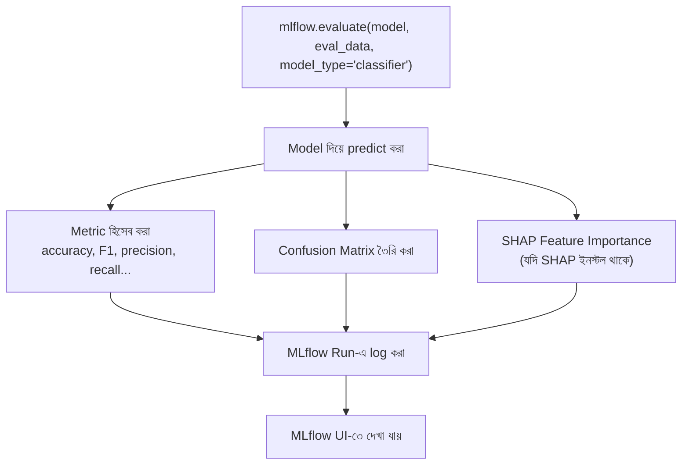

# MLflow Model Evaluation

## What — Model Evaluation কী?

**MLflow Model Evaluation** হলো `mlflow.evaluate()` নামক একটা built-in API, যা একটা registered বা loaded model-কে একটা নির্দিষ্ট dataset-এর বিপরীতে চালিয়ে, স্বয়ংক্রিয়ভাবে বিভিন্ন performance metric (accuracy, precision, recall, F1), visualization (confusion matrix, ROC curve), এবং explainability artifact (feature importance) হিসেব করে সবকিছু MLflow-এ log করে দেয়।

আগের module-এ আমরা model-কে একটা API হিসেবে serve করেছিলাম। এই module-এ আমরা এক ধাপ পিছিয়ে গিয়ে দেখব — production-এ পাঠানোর আগে বা পরে, কীভাবে একটা model-কে systematically এবং গভীরভাবে মূল্যায়ন করা যায়, শুধু একটা single accuracy number-এর বাইরে গিয়ে।

## Why — কেন দরকার?

Module ১-এ আমরা manually `accuracy_score()` এবং `f1_score()` হিসেব করেছিলাম। কিন্তু বাস্তব evaluation-এ এর চেয়ে অনেক বেশি প্রয়োজন হয়।

### Before (Manual, সীমিত Metric)

- শুধু accuracy দেখে model-কে "ভালো" বলে ধরে নেওয়া হয়, কিন্তু class imbalance থাকলে accuracy বিভ্রান্তিকর হতে পারে
- Confusion matrix, per-class metric, বা feature importance দেখতে হলে আলাদা করে matplotlib/seaborn কোড লিখতে হয়
- প্রতিটা নতুন evaluation metric-এর জন্য নতুন কোড লেখা এবং সেটা manually log করা tedious
- Model বায়াস বা কোন feature সবচেয়ে বেশি প্রভাব ফেলছে, তা বোঝার কোনো systematic উপায় থাকে না

### After (`mlflow.evaluate()` দিয়ে)

- একটা মাত্র function call-এ classification-এর জন্য প্রায় ১৫-২০টা metric (accuracy, precision, recall, F1, log loss, ROC AUC ইত্যাদি) automatically হিসেব হয়ে যায়
- Confusion matrix, ROC curve, precision-recall curve automatically generate ও artifact হিসেবে log হয়
- SHAP-ভিত্তিক feature importance automatically তৈরি হয়, যা বোঝায় কোন feature prediction-এ সবচেয়ে বেশি প্রভাব ফেলছে
- সবকিছু automatically একটা MLflow Run-এর সাথে সংরক্ষিত থাকে, ফলে সময়ের সাথে model performance-এর ইতিহাস track করা যায়

## Analogy — বাস্তব জীবনের উপমা

Model Evaluation-কে একটা **মেডিকেল চেকআপ**-এর সাথে তুলনা করা যায়। শুধু একজন রোগীর ওজন (accuracy-এর মতো একটা single number) দেখে সিদ্ধান্ত নেওয়ার বদলে, একজন ডাক্তার রক্তচাপ, হৃদস্পন্দন, রক্ত পরীক্ষা, এবং X-ray — একাধিক দিক থেকে সম্পূর্ণ স্বাস্থ্য পরীক্ষা করেন। `mlflow.evaluate()` ঠিক এই "সম্পূর্ণ চেকআপ"-এর কাজ করে — একটা model-কে বহুমুখী metric ও visualization দিয়ে যাচাই করে, শুধু একটা সংখ্যায় সন্তুষ্ট না থেকে।

## Internal Working — ভিতরে ভিতরে কী ঘটছে

1. `mlflow.evaluate()` কল করার সময় আপনি একটা model URI (যেমন `models:/iris-classifier/Production` অথবা একটা loaded model object), evaluation dataset, এবং `model_type` (`"classifier"`, `"regressor"` ইত্যাদি) দেন
2. MLflow প্রথমে দেওয়া dataset-এর উপর model-এর `predict()` কল করে সব prediction generate করে
3. `model_type` অনুযায়ী MLflow একটা built-in metric set নির্ধারণ করে (classification-এর জন্য accuracy, F1, precision, recall, ইত্যাদি) এবং প্রতিটা metric হিসেব করে
4. Classification-এর ক্ষেত্রে, MLflow automatically confusion matrix generate করে এবং সেটাকে একটা image artifact হিসেবে save করে
5. যদি SHAP library ইনস্টল থাকে, MLflow automatically feature importance/explanation plot তৈরি করে
6. সবকিছু — metrics, plots, এবং একটা structured evaluation table — একটা active MLflow Run-এর সাথে log হয়ে যায়, যা পরে UI-তে দেখা যায়

### Diagram



## Code Example — সম্পূর্ণ, চালানোর উপযোগী কোড

আমরা আমাদের Production stage-এ থাকা `iris-classifier` model-কে test data দিয়ে সম্পূর্ণরূপে evaluate করব।

```python
import mlflow
import pandas as pd
from sklearn.datasets import load_iris
from sklearn.model_selection import train_test_split

# একই Iris dataset — পুরো series জুড়ে ধারাবাহিক
iris = load_iris()
X, y = iris.data, iris.target

# mlflow.evaluate()-এর জন্য একটা pandas DataFrame প্রয়োজন, যেখানে
# feature column এবং target column একসাথে থাকবে
feature_names = iris.feature_names
df = pd.DataFrame(X, columns=feature_names)
df["target"] = y

_, eval_df = train_test_split(df, test_size=0.2, random_state=42)

mlflow.set_experiment("Iris Classification")

with mlflow.start_run(run_name="production_model_evaluation"):
    # আগের module-এ register করা Production model-কে সরাসরি ব্যবহার করা হচ্ছে
    model_uri = "models:/iris-classifier/Production"

    # --- মূল evaluation call ---
    result = mlflow.evaluate(
        model=model_uri,
        data=eval_df,
        targets="target",
        model_type="classifier",
        evaluators=["default"]
    )

    print("=== Evaluation সম্পন্ন ===")
    print(f"মোট {len(result.metrics)} টা metric automatically হিসেব হয়েছে")

    # গুরুত্বপূর্ণ metric গুলো print করা হচ্ছে
    for metric_name in ["accuracy_score", "f1_score", "precision_score", "recall_score"]:
        if metric_name in result.metrics:
            print(f"{metric_name}: {result.metrics[metric_name]:.4f}")

    # কোন artifact গুলো (যেমন confusion matrix) automatically তৈরি হয়েছে তা দেখা
    print("\nAutomatically তৈরি হওয়া artifacts:")
    for artifact_name, artifact_path in result.artifacts.items():
        print(f"  - {artifact_name}")
```

**কোড ব্যাখ্যা:**

- `pd.DataFrame(X, columns=feature_names)` — `mlflow.evaluate()` একটা structured DataFrame আশা করে, যেখানে feature এবং target column একসাথে থাকে; আলাদা `X_test`/`y_test` array পাস করা যায় না সরাসরি এই function-এ।
- `model=model_uri` — এখানে সরাসরি Registry URI পাস করা হয়েছে, যার মানে MLflow নিজে থেকে Registry থেকে Production model load করে নেবে — আলাদা করে `load_model()` কল করার প্রয়োজন নেই।
- `targets="target"` — DataFrame-এর কোন column-টা ground truth label, তা নির্দিষ্ট করে দেওয়া হচ্ছে।
- `model_type="classifier"` — এই parameter অনুযায়ী MLflow ঠিক করে কোন metric set (classification-নির্দিষ্ট) হিসেব করতে হবে; regression-এর জন্য `"regressor"` ব্যবহার হয়।
- `evaluators=["default"]` — MLflow-এর built-in default evaluator ব্যবহার করা হচ্ছে, যা standard metric এবং visualization তৈরি করে।
- `result.metrics` — একটা dictionary, যেখানে সব হিসেব করা metric (key-value আকারে) পাওয়া যায়।
- `result.artifacts` — confusion matrix, curve plot ইত্যাদি artifact-এর reference থাকে, যেগুলো একই সাথে MLflow Run-এ log হয়ে গেছে।

## Request/Output উদাহরণ

Script রান করার আউটপুট:

```
=== Evaluation সম্পন্ন ===
মোট 18 টা metric automatically হিসেব হয়েছে
accuracy_score: 0.9667
f1_score: 0.9666
precision_score: 0.9694
recall_score: 0.9667

Automatically তৈরি হওয়া artifacts:
  - confusion_matrix
  - shap_beeswarm_plot
  - shap_feature_importance_plot
  - shap_summary_plot
```

MLflow UI-তে এই Run-এর Artifacts সেকশনে গেলে দেখা যাবে একটা confusion matrix image, যা visually দেখায় কোন class-এর prediction-এ কতটুকু ভুল হয়েছে:

| Actual \ Predicted | setosa | versicolor | virginica |
|---|---|---|---|
| setosa | 10 | 0 | 0 |
| versicolor | 0 | 9 | 1 |
| virginica | 0 | 0 | 10 |

## Comparison Table — Manual Metric Calculation বনাম `mlflow.evaluate()`

| বিষয় | Manual Calculation | `mlflow.evaluate()` |
|---|---|---|
| Metric সংখ্যা | যতগুলো নিজে হাতে লিখবেন | Classification-এর জন্য ১৫-২০টা automatically |
| Confusion Matrix | নিজে matplotlib দিয়ে বানাতে হয় | Automatically generate ও log হয় |
| Feature Importance (SHAP) | আলাদা SHAP কোড লিখতে হয় | Automatically তৈরি হয় (SHAP ইনস্টল থাকলে) |
| MLflow Run-এ log করা | প্রতিটা আলাদা করে `log_metric()` করতে হয় | Automatically সব log হয়ে যায় |
| Custom Metric যোগ করা | সহজ, নিজের ইচ্ছামতো | `extra_metrics` parameter দিয়ে যোগ করা যায় |
| Setup সময় | বেশি | কম, একটা function call |

## Common Mistakes — নতুনরা যেসব ভুল করে

- **`mlflow.evaluate()`-এ raw NumPy array পাঠানোর চেষ্টা করা** — এই function একটা pandas DataFrame আশা করে (feature + target column সহ), array সরাসরি পাস করলে error হবে
- **`model_type` ভুলভাবে সেট করা** — classification model-এর জন্য `model_type="regressor"` দিলে ভুল metric set (MSE, RMSE ইত্যাদি) হিসেব হবে, যা classification-এর জন্য অর্থহীন
- **Evaluation-কে training-এর সময়েই সীমাবদ্ধ রাখা** — বাস্তবে model production-এ যাওয়ার পরেও নিয়মিত নতুন data দিয়ে re-evaluate করা উচিত, যাতে **model drift** (সময়ের সাথে performance কমে যাওয়া) দ্রুত ধরা পড়ে
- **SHAP-related artifact তৈরি না হওয়ার কারণ না বোঝা** — SHAP library ইনস্টল না থাকলে feature importance plot তৈরি হবে না; `pip install shap` করতে হবে

## Best Practices

- Model production-এ deploy করার আগে সবসময় একটা হোল্ড-আউট (held-out) test set দিয়ে `mlflow.evaluate()` চালান
- শুধু accuracy-তে সন্তুষ্ট না থেকে, confusion matrix এবং per-class metric পরীক্ষা করে দেখুন কোনো নির্দিষ্ট class-এ model দুর্বল কিনা
- Production-এ থাকা model-কে নিয়মিত (যেমন সাপ্তাহিক/মাসিক) নতুন real-world data দিয়ে re-evaluate করুন, যাতে model drift দ্রুত ধরা পড়ে
- Feature importance plot দেখে বুঝুন model কোন feature-এর উপর সবচেয়ে বেশি নির্ভর করছে — এটা business stakeholder-দের কাছে model-এর সিদ্ধান্ত ব্যাখ্যা করতে সাহায্য করে
- Evaluation result-কে একটা নতুন Run হিসেবে log করুন (training Run থেকে আলাদা), যাতে সময়ের সাথে multiple evaluation-এর ইতিহাস তুলনা করা যায়

## Interview Questions

**প্রশ্ন ১: `mlflow.evaluate()` classification model-এর জন্য কী কী automatically তৈরি করে?**
উত্তর: এটা automatically ১৫-২০টা metric (accuracy, precision, recall, F1, log loss, ROC AUC ইত্যাদি), একটা confusion matrix visualization, এবং (SHAP ইনস্টল থাকলে) feature importance/explanation plot তৈরি করে — সবকিছু automatically MLflow Run-এ log হয়ে যায়।

**প্রশ্ন ২: `mlflow.evaluate()` কেন raw NumPy array-এর বদলে pandas DataFrame আশা করে?**
উত্তর: কারণ evaluation-এর জন্য feature এবং target — দুটোই একসাথে একটা structured format-এ প্রয়োজন হয়, এবং column নাম দিয়ে feature importance এবং SHAP explanation-কে human-readable রাখা সহজ হয়, যা raw array দিয়ে সম্ভব নয়।

**প্রশ্ন ৩: শুধুমাত্র accuracy দেখে model evaluate করা কেন যথেষ্ট নয়?**
উত্তর: Class imbalance থাকলে (যেমন একটা class-এর sample সংখ্যা অনেক কম), শুধু majority class predict করেও উচ্চ accuracy পাওয়া সম্ভব, যদিও model বাস্তবে দুর্বল। Precision, recall, F1, এবং per-class confusion matrix দেখলে model-এর প্রকৃত শক্তি-দুর্বলতা বোঝা যায়।

**প্রশ্ন ৪: Model drift কী, এবং এটা ধরতে regular evaluation কীভাবে সাহায্য করে?**
উত্তর: Model drift হলো সময়ের সাথে সাথে real-world data-এর pattern পরিবর্তন হওয়ার কারণে model-এর performance ধীরে ধীরে কমে যাওয়া। Production-এ থাকা model-কে নিয়মিতভাবে নতুন real-world data দিয়ে `mlflow.evaluate()` করলে, metric-এর পতন সহজে ধরা যায়, যা সময়মতো model retrain করার সিদ্ধান্ত নিতে সাহায্য করে।

## Summary

- `mlflow.evaluate()` একটা মাত্র function call-এ ব্যাপক metric, confusion matrix, এবং feature importance তৈরি করে
- এটা একটা pandas DataFrame (feature + target column একসাথে) এবং `model_type` প্রয়োজন করে
- Registry URI সরাসরি `model` parameter-এ পাস করা যায়, যা Production model-কে সরাসরি evaluate করতে দেয়
- শুধু accuracy নয়, বহুমুখী metric ও visualization দেখে model-এর প্রকৃত performance বোঝা উচিত
- Production model-কে নিয়মিত re-evaluate করা model drift ধরার জন্য গুরুত্বপূর্ণ
- আমাদের Iris classification project-এর সম্পূর্ণ যাত্রা — Fundamentals থেকে শুরু করে Tracking, Registry, Autologging, FastAPI Serving, এবং এখন Evaluation পর্যন্ত — একটা end-to-end MLOps workflow সম্পূর্ণ করেছে

## পরবর্তী ধাপ

এই ছয়টা module মিলিয়ে আমরা MLflow-এর একটা সম্পূর্ণ end-to-end workflow কভার করেছি — একটা model তৈরি থেকে শুরু করে track, register, serve, এবং evaluate করা পর্যন্ত। আপনি যদি আরও নতুন কোনো topic (যেমন MLflow Projects, Multi-model deployment, বা CI/CD integration) নিয়ে documentation লিখতে চান, পরবর্তী topic-এর নাম বলুন।

---

পরবর্তী কোন topic নিয়ে এগোতে চান?
