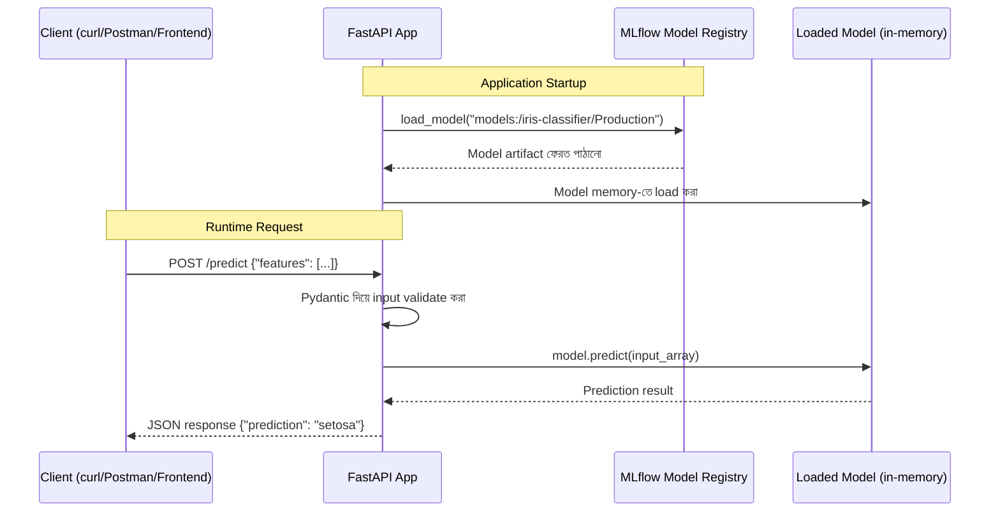

# Serving an ML Model from MLflow Model Registry with FastAPI

## What — এই Module-এ কী শিখব?

আগের module-এ আমরা আমাদের `iris-classifier` model-কে Registry-তে **Production** stage-এ নিয়ে গিয়েছিলাম। কিন্তু একটা model শুধু Registry-তে থাকলেই সেটা real-world-এ কাজে লাগে না — একে একটা **REST API**-তে রূপান্তর করতে হয়, যাতে যেকোনো client (web app, mobile app, অন্য কোনো service) HTTP request পাঠিয়ে prediction পেতে পারে।

এই module-এ আমরা **FastAPI** (একটা modern, দ্রুত Python web framework) ব্যবহার করে MLflow Model Registry থেকে সরাসরি Production model load করে একটা prediction API বানাব।

## Why — কেন FastAPI দিয়ে serve করব?

MLflow-এর নিজস্ব একটা built-in serving command আছে (`mlflow models serve`), কিন্তু বাস্তব production সিস্টেমে প্রায়ই একটা custom API layer প্রয়োজন হয়।

### Before (শুধু `mlflow models serve` দিয়ে)

- এটা quick prototyping-এর জন্য ভালো, কিন্তু custom business logic (যেমন authentication, input validation, logging, rate limiting) যোগ করা কঠিন
- একাধিক model বা অতিরিক্ত endpoint (যেমন health check, model info) সহজে যোগ করা যায় না
- Response format customize করা সীমিত

### After (FastAPI দিয়ে custom serving)

- Authentication, custom validation (Pydantic দিয়ে), logging, error handling — সব custom logic যোগ করা যায়
- একই application-এ একাধিক endpoint রাখা যায় (`/predict`, `/health`, `/model-info`)
- Automatic interactive API documentation (Swagger UI) পাওয়া যায়, যা testing এবং client integration সহজ করে
- Production-grade deployment (Docker, load balancer-এর পেছনে) করার জন্য flexible architecture পাওয়া যায়

:::tip
`mlflow models serve` ছোট প্রজেক্ট বা দ্রুত demo-এর জন্য চমৎকার একটা উপায়। কিন্তু যখন custom validation, authentication, বা multiple model integration দরকার হয়, তখন FastAPI-এর মতো একটা dedicated framework ব্যবহার করা বেশি practical।
:::

## Analogy — বাস্তব জীবনের উপমা

Model Registry-তে থাকা Production model-টাকে চিন্তা করুন একটা **রান্নাঘরে থাকা একজন দক্ষ শেফ** হিসেবে, যিনি জানেন কীভাবে রান্না করতে হয়। কিন্তু একজন সাধারণ গ্রাহক সরাসরি রান্নাঘরে গিয়ে শেফের সাথে কথা বলতে পারে না — তাদের প্রয়োজন একজন **ওয়েটার** (FastAPI application), যে গ্রাহকের অর্ডার (HTTP request) নেয়, সেটা সঠিকভাবে বুঝে শেফের কাছে পাঠায় (model.predict()), এবং শেফের বানানো খাবার (prediction result) গ্রাহকের কাছে সুন্দরভাবে পরিবেশন করে (JSON response)।

## Internal Working — ভিতরে ভিতরে কী ঘটছে

1. FastAPI application startup-এর সময়, MLflow-এর `models:/iris-classifier/Production` URI ব্যবহার করে Registry থেকে সরাসরি Production model load করা হয় — এই load একবারই হয়, প্রতিটা request-এ নয় (performance-এর জন্য গুরুত্বপূর্ণ)
2. Client যখন `/predict` endpoint-এ একটা POST request পাঠায়, FastAPI প্রথমে **Pydantic model** ব্যবহার করে input data validate করে (যেমন data type সঠিক কিনা, required field আছে কিনা)
3. Validation পাস হলে, সেই input data একটা NumPy array/DataFrame-এ রূপান্তরিত হয়ে, আগে থেকে load করা model-এর `.predict()` method-এ পাঠানো হয়
4. Model prediction return করে, যা একটা human-readable label-এ (যেমন `0` → `"setosa"`) রূপান্তরিত হয়ে JSON response আকারে client-কে ফেরত পাঠানো হয়
5. যদি Registry-তে model version পরিবর্তন হয় (নতুন version Production-এ transition হয়), application restart করলে নতুন version automatically load হবে — কারণ `models:/name/Production` URI সবসময় "current Production version" point করে

### Diagram



## Code Example — সম্পূর্ণ, চালানোর উপযোগী কোড

প্রথমে প্রয়োজনীয় library install করুন:

```bash
pip install fastapi uvicorn mlflow scikit-learn pydantic
```

এখন `main.py` নামে একটা FastAPI application তৈরি করি, যা আমাদের `iris-classifier` Production model serve করবে:

```python
import mlflow
import numpy as np
from fastapi import FastAPI, HTTPException
from pydantic import BaseModel, Field
from contextlib import asynccontextmanager

# Iris dataset-এর target label mapping — training-এর সময় যে order ছিল, সেটাই
IRIS_CLASS_NAMES = ["setosa", "versicolor", "virginica"]

# একটা global variable, যেখানে loaded model রাখা হবে
ml_models = {}


@asynccontextmanager
async def lifespan(app: FastAPI):
    # Application startup-এর সময় একবারই model load করা হচ্ছে
    # এটা প্রতিটা request-এ model reload করার চেয়ে অনেক বেশি efficient
    model_uri = "models:/iris-classifier/Production"
    ml_models["iris_classifier"] = mlflow.sklearn.load_model(model_uri)
    print("Production model সফলভাবে load হয়েছে।")

    yield  # এখানে application চলতে থাকে

    # Application shutdown-এর সময় cleanup (প্রয়োজনে)
    ml_models.clear()


app = FastAPI(
    title="Iris Classifier API",
    description="MLflow Model Registry থেকে serve করা Iris classification model",
    version="1.0.0",
    lifespan=lifespan
)


# Pydantic দিয়ে input schema define করা হচ্ছে — এটা automatic validation করবে
class IrisFeatures(BaseModel):
    sepal_length: float = Field(..., gt=0, description="Sepal length (cm)")
    sepal_width: float = Field(..., gt=0, description="Sepal width (cm)")
    petal_length: float = Field(..., gt=0, description="Petal length (cm)")
    petal_width: float = Field(..., gt=0, description="Petal width (cm)")

    class Config:
        json_schema_extra = {
            "example": {
                "sepal_length": 5.1,
                "sepal_width": 3.5,
                "petal_length": 1.4,
                "petal_width": 0.2
            }
        }


class PredictionResponse(BaseModel):
    predicted_class: str
    predicted_class_index: int
    model_version: str = "Production"


@app.get("/health")
def health_check():
    """Application এবং model সঠিকভাবে load হয়েছে কিনা যাচাই করার জন্য"""
    is_ready = "iris_classifier" in ml_models
    return {"status": "healthy" if is_ready else "model not loaded"}


@app.post("/predict", response_model=PredictionResponse)
def predict(features: IrisFeatures):
    """একটা flower measurement দিয়ে species predict করা"""
    if "iris_classifier" not in ml_models:
        raise HTTPException(status_code=503, detail="Model এখনো load হয়নি")

    # Pydantic object থেকে NumPy array-তে রূপান্তর — model.predict()-এর জন্য প্রয়োজনীয় format
    input_array = np.array([[
        features.sepal_length,
        features.sepal_width,
        features.petal_length,
        features.petal_width
    ]])

    model = ml_models["iris_classifier"]
    prediction_index = int(model.predict(input_array)[0])
    predicted_class = IRIS_CLASS_NAMES[prediction_index]

    return PredictionResponse(
        predicted_class=predicted_class,
        predicted_class_index=prediction_index
    )
```

Application চালু করার জন্য:

```bash
uvicorn main:app --host 0.0.0.0 --port 8000
```

**কোড ব্যাখ্যা:**

- `lifespan` context manager — FastAPI-এর আধুনিক পদ্ধতি startup/shutdown event handle করার জন্য; model load এখানে একবারই হয়, প্রতিটা `/predict` call-এ নয়।
- `mlflow.sklearn.load_model("models:/iris-classifier/Production")` — Registry থেকে সরাসরি বর্তমান Production version load করা হচ্ছে; আগের module-এ যা register করা হয়েছিল, তা এখানে ব্যবহার হচ্ছে।
- `class IrisFeatures(BaseModel)` — Pydantic দিয়ে input schema define করা হয়েছে; `Field(..., gt=0)` দিয়ে বলা হচ্ছে প্রতিটা measurement অবশ্যই একটা positive number হতে হবে, নাহলে FastAPI automatically একটা validation error (HTTP 422) return করবে।
- `@app.post("/predict", response_model=PredictionResponse)` — `response_model` দেওয়ার ফলে FastAPI automatically output schema-ও validate ও document করবে।
- `IRIS_CLASS_NAMES[prediction_index]` — Model যে numeric class (0, 1, 2) predict করে, সেটাকে human-readable label-এ রূপান্তর করা হচ্ছে, যাতে client সহজে বুঝতে পারে।

## Request/Output উদাহরণ

`curl` দিয়ে API test করা:

```bash
curl -X POST "http://localhost:8000/predict" \
  -H "Content-Type: application/json" \
  -d '{
    "sepal_length": 5.1,
    "sepal_width": 3.5,
    "petal_length": 1.4,
    "petal_width": 0.2
  }'
```

Response:

```json
{
  "predicted_class": "setosa",
  "predicted_class_index": 0,
  "model_version": "Production"
}
```

ভুল input পাঠালে (negative value):

```bash
curl -X POST "http://localhost:8000/predict" \
  -H "Content-Type: application/json" \
  -d '{"sepal_length": -1.0, "sepal_width": 3.5, "petal_length": 1.4, "petal_width": 0.2}'
```

Response (HTTP 422 — automatic Pydantic validation error):

```json
{
  "detail": [
    {
      "loc": ["body", "sepal_length"],
      "msg": "ensure this value is greater than 0",
      "type": "value_error.number.not_gt"
    }
  ]
}
```

:::tip
`http://localhost:8000/docs`-এ গেলে FastAPI automatically একটা interactive Swagger UI দেখাবে, যেখানে আপনি ব্রাউজার থেকেই সরাসরি API test করতে পারবেন।
:::

## Comparison Table — `mlflow models serve` বনাম Custom FastAPI

| বিষয় | `mlflow models serve` | Custom FastAPI |
|---|---|---|
| Setup সময় | খুব দ্রুত, এক কমান্ডেই চালু | কিছুটা বেশি কোড লিখতে হয় |
| Custom Validation | সীমিত | পূর্ণ control (Pydantic দিয়ে) |
| Authentication যোগ করা | কঠিন/সম্ভব না সরাসরি | সহজে যোগ করা যায় |
| Multiple Endpoint | না, শুধু predict-related endpoint | হ্যাঁ, যেকোনো custom endpoint যোগ করা যায় |
| Interactive Docs | সীমিত | স্বয়ংক্রিয় Swagger UI |
| উপযুক্ত ক্ষেত্র | Quick testing, prototyping, demo | Production-grade deployment |

## Common Mistakes — নতুনরা যেসব ভুল করে

- **প্রতিটা request-এ model reload করা** — এটা মারাত্মক performance সমস্যা তৈরি করে; model শুধু application startup-এ একবার load করা উচিত (আমাদের `lifespan` উদাহরণে যেমন দেখানো হয়েছে)
- **Input validation না করা** — raw dictionary দিয়ে সরাসরি model-এ data পাঠালে, ভুল data type বা missing field থাকলে runtime error হয়ে API crash করতে পারে; Pydantic ব্যবহার করে এটা এড়ানো উচিত
- **`models:/name/Production` এর বদলে hardcoded local file path ব্যবহার করা** — এতে Registry-এর version management-এর সুবিধা হারিয়ে যায়, নতুন model deploy করতে হলে code পরিবর্তন করতে হয়
- **Health check endpoint না রাখা** — production environment-এ load balancer বা container orchestrator (যেমন Kubernetes)-এর জন্য `/health` endpoint না থাকলে application-এর অবস্থা monitor করা কঠিন হয়ে যায়

## Best Practices

- Model শুধু application startup-এ একবার load করুন, প্রতিটা request-এ নয়
- সবসময় Pydantic দিয়ে input schema define করুন, validation error গুলো client-এর জন্য readable রাখুন
- `/health` endpoint রাখুন, যাতে deployment infrastructure application-এর অবস্থা বুঝতে পারে
- Deployment-এ সবসময় `models:/name/Production` জাতীয় dynamic URI ব্যবহার করুন, যাতে নতুন model version deploy করতে code change লাগে না
- Response-এ শুধু prediction নয়, model version/metadata-ও অন্তর্ভুক্ত করুন, যাতে debugging সহজ হয়

## Interview Questions

**প্রশ্ন ১: Model-কে application startup-এ load করা এবং প্রতিটা request-এ load করার মধ্যে পার্থক্য কী প্রভাব ফেলে?**
উত্তর: প্রতিটা request-এ model load করলে প্রতিটা call-এ disk I/O এবং deserialization overhead যোগ হয়, যা response time বহুগুণ বাড়িয়ে দেয়। Startup-এ একবার load করে memory-তে রাখলে, প্রতিটা request শুধু ইতিমধ্যে loaded model ব্যবহার করে prediction করে, যা অনেক দ্রুত।

**প্রশ্ন ২: `models:/iris-classifier/Production` URI ব্যবহারের সুবিধা কী?**
উত্তর: এই URI dynamic — এটা সবসময় Registry-তে যে version বর্তমানে "Production" stage-এ আছে, সেটাকে point করে। ফলে নতুন model version Production-এ transition হলে, শুধু application restart করলেই নতুন model load হয়ে যায়, কোনো deployment code পরিবর্তনের প্রয়োজন হয় না।

**প্রশ্ন ৩: Pydantic দিয়ে input validation করার সুবিধা কী?**
উত্তর: Pydantic automatically data type, required field, এবং custom constraint (যেমন `gt=0`) validate করে, এবং invalid input পেলে একটা structured error response (HTTP 422) generate করে। এতে model-কে সরাসরি ভুল বা malformed data পাঠানো থেকে রক্ষা পাওয়া যায়, যা runtime crash প্রতিরোধ করে।

**প্রশ্ন ৪: `mlflow models serve` এর বদলে কখন custom FastAPI application লেখা উচিত?**
উত্তর: যখন authentication, custom input validation, একাধিক endpoint (health check, model info), বা complex business logic প্রয়োজন হয়, তখন FastAPI-এর মতো একটা dedicated framework ব্যবহার করা উচিত, কারণ `mlflow models serve` এই ধরনের customization সীমিতভাবে সাপোর্ট করে।

## Summary

- FastAPI দিয়ে MLflow Model Registry-এর Production model-কে একটা REST API-তে রূপান্তর করা যায়
- Model application startup-এ একবার load করা হয়, প্রতিটা request-এ নয় — এটা performance-এর জন্য অত্যন্ত গুরুত্বপূর্ণ
- Pydantic দিয়ে input schema validate করা হয়, যা invalid data থেকে model-কে রক্ষা করে
- `models:/name/Production` dynamic URI ব্যবহার করে, নতুন model version deploy করার সময় code পরিবর্তনের প্রয়োজন হয় না
- আমাদের Iris classification project এখন একটা কার্যকর `/predict` REST endpoint-এর মাধ্যমে বাস্তব client request handle করতে সক্ষম

## পরবর্তী ধাপ

এই module-এ আমরা model-কে একটা usable API-তে রূপান্তর করলাম। পরের module-এ আমরা যাব **MLflow Model Evaluation**-এ — যেখানে দেখব কীভাবে `mlflow.evaluate()` ব্যবহার করে model-এর performance আরও গভীরভাবে বিশ্লেষণ করা যায় (confusion matrix, feature importance, bias detection), যা একটা model production-এ পাঠানোর আগে বা পরে নিয়মিত মূল্যায়নের জন্য গুরুত্বপূর্ণ।

---

আপনি কি পরের topic **"MLflow Model Evaluation"** এর জন্য প্রস্তুত?
