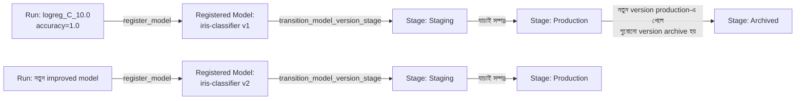
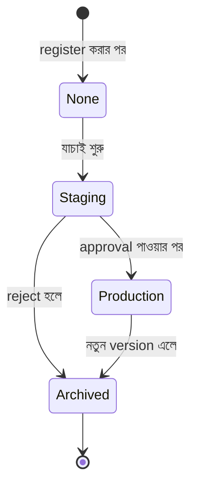

# Model Registry

## What — Model Registry কী?

**MLflow Model Registry** হলো একটা centralized model store, API set, এবং UI, যা কোনো model-এর পুরো lifecycle — **registration**, **versioning**, **stage transition** (যেমন Staging → Production → Archived), এবং **annotation** (description, comment) — manage করার সুযোগ দেয়।

আগের module-এ আমরা একাধিক Run থেকে সবচেয়ে ভালো model (`logreg_C_10.0`, accuracy 1.0000) খুঁজে বের করেছিলাম। এই module-এ আমরা সেই model-কে Registry-তে **register** করব, একটা version number পাবে, এবং এটাকে **Staging**, তারপর **Production** stage-এ নিয়ে যাব।

## Why — কেন দরকার?

Experiment Tracking আমাদের বলে দেয় "কোন Run সবচেয়ে ভালো ছিল", কিন্তু এটা বলে না "কোন model বর্তমানে production-এ চলছে" বা "এই model-টার আগের version কোনটা ছিল"।

### Before (Model Registry ছাড়া)

- Production-এ যে model চলছে, সেটা কোন Run থেকে এসেছিল তা track করা কঠিন
- একাধিক টিম member যদি আলাদা আলাদা model file manually deploy করে, তাহলে version conflict হয়
- একটা নতুন model deploy করার আগে approval/review প্রক্রিয়ার কোনো systematic উপায় থাকে না
- নতুন model-এ সমস্যা দেখা গেলে আগের version-এ ফিরে যাওয়া (rollback) কঠিন হয়ে পড়ে, কারণ কোনো centralized history নেই

### After (Model Registry দিয়ে)

- প্রতিটা registered model-এর একটা নির্দিষ্ট নাম থাকে (যেমন `iris-classifier`), এবং প্রতিবার নতুন version register করলে automatically version number (v1, v2, v3...) বাড়তে থাকে
- প্রতিটা version-এর একটা **stage** থাকে: `None` → `Staging` → `Production` → `Archived`
- Model-এর সাথে description, approval comment যুক্ত করা যায়
- Production stage-এ থাকা model-কে API দিয়ে সরাসরি load করা যায়, code পরিবর্তন ছাড়াই নতুন version deploy করা সম্ভব হয়

## Analogy — বাস্তব জীবনের উপমা

Model Registry-কে একটা **সফটওয়্যার কোম্পানির App Release process** হিসেবে চিন্তা করুন। একটা app-এর নতুন feature build হলে সেটা প্রথমে **Beta/Internal Testing** (Staging)-এ যায়, টিম সেটা যাচাই করে। যাচাই সফল হলে সেটা **Public Release** (Production)-এ যায়, যা end user ব্যবহার করে। পুরোনো version-গুলো **Archived** হয়ে থাকে, প্রয়োজনে যেকোনো সময় ফিরে দেখা যায় বা rollback করা যায়। প্রতিটা release-এর একটা version number (v1.0, v2.0) থাকে, ঠিক যেমন MLflow Model Registry-তে প্রতিটা model version-এর number থাকে।

## Internal Working — ভিতরে ভিতরে কী ঘটছে

1. যখন আপনি একটা model-কে Registry-তে register করেন (`mlflow.register_model()` অথবা UI থেকে "Register Model" বাটনে ক্লিক করে), MLflow প্রথমে চেক করে সেই নামের **Registered Model** আগে থেকে আছে কিনা
2. না থাকলে একটা নতুন Registered Model entry তৈরি হয়; থাকলে একটা নতুন **Model Version** যুক্ত হয় (version number automatically increment হয়)
3. প্রতিটা Model Version আসলে একটা নির্দিষ্ট Run-এর artifact-এর সাথে link করা থাকে — অর্থাৎ Registry কোনো নতুন model copy করে না, বরং existing artifact-কে reference করে version হিসেবে ট্র্যাক করে
4. Stage transition (`Staging`, `Production`, `Archived`) একটা metadata field মাত্র, যা Registry-তে সংরক্ষিত থাকে এবং API/UI দিয়ে পরিবর্তন করা যায়
5. একটা model version-এর জন্য stage change হলে MLflow automatically একটা timestamp এবং (optionally) transition comment log করে রাখে

### Diagram





:::tip
MLflow-এর নতুন versions-এ **Model Aliases** (যেমন `@champion`, `@challenger`) নামে একটা আরও flexible পদ্ধতি চালু হয়েছে, যা traditional stage-based পদ্ধতির পরিবর্তে ব্যবহার করা যায়। তবে এই module-এ আমরা classic stage-based approach-ই শিখব, কারণ এটা এখনো ব্যাপকভাবে ব্যবহৃত হয় এবং concept বোঝার জন্য সহজ।
:::

## Code Example — সম্পূর্ণ, চালানোর উপযোগী কোড

আগের module-এ আমরা `logreg_C_10.0` নামে সবচেয়ে ভালো Run পেয়েছিলাম। এখন আমরা সেই model-কে খুঁজে বের করে Registry-তে register করব।

```python
import mlflow
from mlflow import MlflowClient
from mlflow.entities import ViewType

# MLflow Client — Registry-এর সাথে interact করার জন্য প্রধান API
client = MlflowClient()

# ধাপ ১: "Iris Classification" experiment থেকে সবচেয়ে ভালো Run খুঁজে বের করা
experiment = client.get_experiment_by_name("Iris Classification")

best_run = client.search_runs(
    experiment_ids=[experiment.experiment_id],
    filter_string="tags.model_type = 'logistic_regression'",
    run_view_type=ViewType.ACTIVE_ONLY,
    order_by=["metrics.accuracy DESC"],
    max_results=1
)[0]

print(f"সবচেয়ে ভালো Run পাওয়া গেছে: {best_run.info.run_id}")
print(f"Accuracy: {best_run.data.metrics['accuracy']}")

# ধাপ ২: এই Run-এর model-কে Registry-তে register করা
model_uri = f"runs:/{best_run.info.run_id}/model"
model_name = "iris-classifier"

registered_model = mlflow.register_model(
    model_uri=model_uri,
    name=model_name
)

print(f"Model registered — নাম: {registered_model.name}, version: {registered_model.version}")

# ধাপ ৩: Registered model version-এ একটা description যুক্ত করা
client.update_model_version(
    name=model_name,
    version=registered_model.version,
    description="Logistic Regression (C=10.0), Iris dataset-এ 100% test accuracy। "
                "প্রথম production candidate।"
)

# ধাপ ৪: এই version-কে "Staging" stage-এ নিয়ে যাওয়া, যাচাইয়ের জন্য
client.transition_model_version_stage(
    name=model_name,
    version=registered_model.version,
    stage="Staging",
    archive_existing_versions=False
)
print(f"Version {registered_model.version} এখন 'Staging' stage-এ আছে।")

# ধাপ ৫: ধরুন যাচাই সফল হয়েছে — এখন Production-এ transition করা
# archive_existing_versions=True দিলে আগের Production version গুলো automatically Archived হয়ে যাবে
client.transition_model_version_stage(
    name=model_name,
    version=registered_model.version,
    stage="Production",
    archive_existing_versions=True
)
print(f"Version {registered_model.version} এখন 'Production' stage-এ আছে।")

# ধাপ ৬: Production stage থেকে সরাসরি model load করা (deployment code-এ এভাবে ব্যবহার হবে)
production_model = mlflow.sklearn.load_model(
    model_uri=f"models:/{model_name}/Production"
)
print("Production model সফলভাবে load হয়েছে, prediction-এর জন্য প্রস্তুত।")
```

**কোড ব্যাখ্যা:**

- `MlflowClient()` — Model Registry এবং Tracking Server-এর সাথে low-level interaction-এর জন্য প্রধান client object; `mlflow.log_*()` জাতীয় high-level function-এর তুলনায় এটা বেশি control দেয়।
- `client.search_runs(...)` — একটা programmatic উপায়ে Run খুঁজে বের করার জন্য; `filter_string` দিয়ে SQL-এর মতো condition, `order_by` দিয়ে sorting করা যায়।
- `mlflow.register_model(model_uri, name)` — একটা নির্দিষ্ট Run-এর model artifact-কে Registry-তে register করে; একই নামে বারবার কল করলে version number automatically বাড়তে থাকে (v1, v2, v3...)।
- `client.update_model_version(...)` — registered version-এ human-readable description যুক্ত করে, যা team member-দের জন্য context দেয়।
- `client.transition_model_version_stage(...)` — একটা version-এর stage পরিবর্তন করে। `archive_existing_versions=True` দিলে, একই stage-এ থাকা আগের version গুলো automatically "Archived" stage-এ চলে যায় — এতে একই সময়ে একাধিক Production version conflict হওয়া থেকে বাঁচা যায়।
- `mlflow.sklearn.load_model(model_uri="models:/iris-classifier/Production")` — এই `models:/` URI scheme-টা গুরুত্বপূর্ণ: এটা একটা নির্দিষ্ট Run-এর বদলে Registry-তে যা "বর্তমানে Production" আছে, সেটাকে load করে। এর মানে, নতুন version Production-এ transition করলে deployment code পরিবর্তন করার প্রয়োজন হয় না।

## Request/Output উদাহরণ

Script রান করার আউটপুট:

```
সবচেয়ে ভালো Run পাওয়া গেছে: a1b2c3d4e5f6...
Accuracy: 1.0
Model registered — নাম: iris-classifier, version: 1
Version 1 এখন 'Staging' stage-এ আছে।
Version 1 এখন 'Production' stage-এ আছে।
Production model সফলভাবে load হয়েছে, prediction-এর জন্য প্রস্তুত।
```

MLflow UI-তে "Models" ট্যাবে গেলে `iris-classifier` নামে একটা entry দেখা যাবে:

| Version | Stage | Registered Run | Description |
|---|---|---|---|
| Version 1 | Production | logreg_C_10.0 | Logistic Regression (C=10.0), 100% accuracy... |

## Comparison Table — Stage-Based বনাম Alias-Based Model Management

| বিষয় | Stage-Based (Classic) | Alias-Based (নতুন) |
|---|---|---|
| Terminology | Staging, Production, Archived | Custom alias (যেমন `champion`, `challenger`) |
| Flexibility | সীমিত, fixed ৩টা stage | Flexible, নিজের মতো নাম দেওয়া যায় |
| একাধিক model একই সময়ে | একই stage-এ একটাই version রাখা যায় (best practice অনুযায়ী) | একাধিক alias একসাথে ব্যবহার করা যায় (A/B testing-এর জন্য উপযোগী) |
| MLflow Version Support | সব version-এ আছে | নতুন version-গুলোতে recommended |
| শেখার জটিলতা | সহজ, intuitive | সামান্য বেশি concept প্রয়োজন |

## Common Mistakes — নতুনরা যেসব ভুল করে

- **`archive_existing_versions=True` ব্যবহার না করা** — এতে একাধিক model version একই সময়ে "Production" stage-এ থেকে যেতে পারে, যা deployment-এ বিভ্রান্তি তৈরি করে (কোনটা আসল production model?)
- **Model registration না করেই সরাসরি Run artifact path দিয়ে production-এ deploy করা** — এতে version history, stage tracking, এবং rollback সুবিধা হারিয়ে যায়
- **Description/documentation যুক্ত না করা** — কয়েক মাস পর টিমের কেউ বুঝতে পারে না কেন একটা নির্দিষ্ট version register করা হয়েছিল বা এর বৈশিষ্ট্য কী
- **`models:/name/version_number` এবং `models:/name/Production` গুলিয়ে ফেলা** — প্রথমটা একটা fixed version-কে point করে (কখনো পরিবর্তন হবে না), দ্বিতীয়টা dynamic (Production-এ যেটা আছে সেটাই load হবে, version পরিবর্তন হলেও)

## Best Practices

- Production-এ deploy করার আগে সবসময় Staging stage-এ যাচাই-বাছাই করুন
- `archive_existing_versions=True` ব্যবহার করুন, যাতে একই সময়ে একাধিক Production version না থাকে
- প্রতিটা registered version-এ meaningful description যুক্ত করুন — কোন data দিয়ে train হয়েছে, কী পরিবর্তন হয়েছে আগের version থেকে
- Deployment/serving code-এ সবসময় `models:/name/Production` জাতীয় stage-based URI ব্যবহার করুন, নির্দিষ্ট version number নয় — এতে নতুন version deploy করা সহজ হয়ে যায়
- Model registration-এর আগে একটা approval/review workflow (এমনকি manual হলেও) নিশ্চিত করুন

## Interview Questions

**প্রশ্ন ১: Model Registry কীভাবে Experiment Tracking থেকে আলাদা?**
উত্তর: Experiment Tracking মূলত "কোন Run কী parameter/metric নিয়ে চলেছিল" তা log করে — এটা experimentation-কেন্দ্রিক। Model Registry এক ধাপ এগিয়ে — এটা একটা নির্দিষ্ট model-কে production-ready হিসেবে চিহ্নিত করে, version control এবং lifecycle stage (Staging, Production, Archived) manage করে, যা deployment-কেন্দ্রিক।

**প্রশ্ন ২: `archive_existing_versions=True` parameter-টার কাজ কী?**
উত্তর: যখন কোনো model version-কে একটা নির্দিষ্ট stage-এ (যেমন Production) transition করা হয়, তখন এই parameter `True` থাকলে, একই stage-এ আগে থেকে থাকা অন্য version গুলো automatically "Archived" stage-এ চলে যায়। এটা নিশ্চিত করে যে একটা সময়ে একটা নির্দিষ্ট stage-এ শুধু একটাই "current" version থাকে।

**প্রশ্ন ৩: `models:/iris-classifier/3` এবং `models:/iris-classifier/Production` — এই দুই URI-এর মধ্যে পার্থক্য কী?**
উত্তর: প্রথমটা একটা fixed, নির্দিষ্ট version (version 3)-কে point করে — এটা কখনো পরিবর্তিত হবে না। দ্বিতীয়টা dynamic — এটা যেকোনো সময় Production stage-এ যে version আছে, সেটাকে point করে; নতুন version Production-এ transition হলে এই URI স্বয়ংক্রিয়ভাবে নতুন version-কে refer করবে।

**প্রশ্ন ৪: Model Registry-তে register করার আগে model-টার কোথায় থাকা প্রয়োজন?**
উত্তর: Registry-তে register করার আগে model-টাকে অবশ্যই একটা MLflow Run-এর artifact হিসেবে ইতিমধ্যে log করা থাকতে হবে (যেমন `mlflow.sklearn.log_model()` দিয়ে), কারণ `mlflow.register_model()` একটা `runs:/<run_id>/<artifact_path>` URI ব্যবহার করে সেই existing artifact-কে reference করে Registry-তে নিয়ে আসে।

## Summary

- Model Registry হলো একটা centralized system, যা model-এর version, stage, এবং lifecycle manage করে
- প্রতিটা registered model-এর নাম থাকে, এবং প্রতিটা register-এ automatically version number বাড়ে (v1, v2, v3...)
- Stage transition (`None` → `Staging` → `Production` → `Archived`) দিয়ে model-এর deployment readiness track করা হয়
- `models:/name/Production` জাতীয় dynamic URI ব্যবহার করলে deployment code পরিবর্তন ছাড়াই নতুন version রোল-আউট করা সম্ভব হয়
- আমাদের Iris classification project-এর `logreg_C_10.0` Run-টাকে আমরা `iris-classifier` নামে register করে Production stage-এ নিয়ে গেছি

## পরবর্তী ধাপ

এই module-এ আমরা model versioning এবং stage management শিখলাম। পরের module-এ আমরা যাব **MLflow Autologging**-এ — যেখানে দেখব কীভাবে `mlflow.autolog()` ব্যবহার করে ম্যানুয়ালি প্রতিটা parameter/metric log না করেই automatically সব কিছু track করা যায়, এবং এটা কীভাবে ভিতরে ভিতরে কাজ করে।

---

আপনি কি পরের topic **"MLflow Autologging"** এর জন্য প্রস্তুত?
