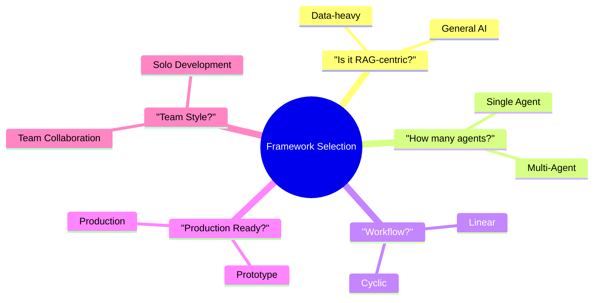
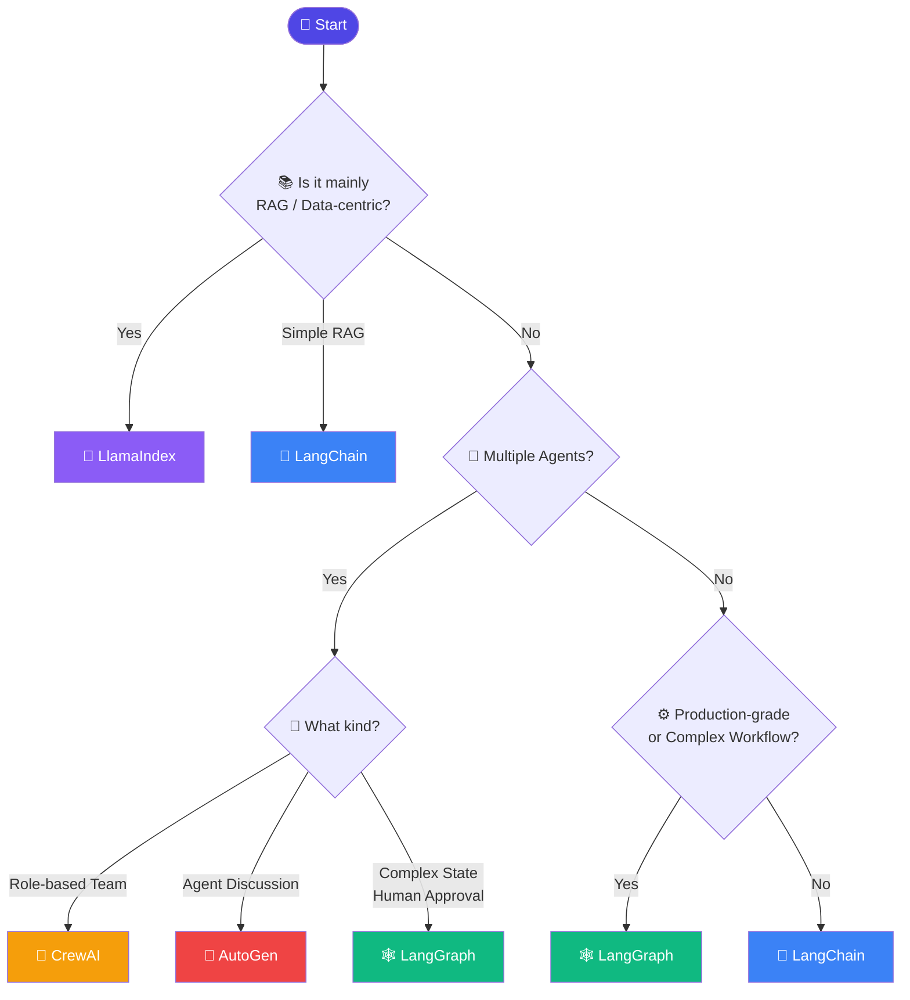
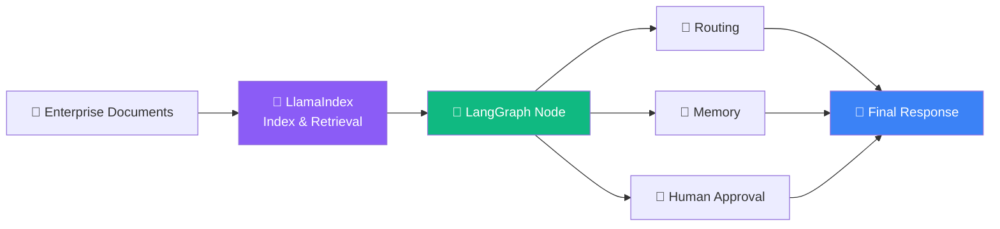

# সঠিক Orchestration Framework বেছে নেওয়া

আগের পেজে আমরা পাঁচটা framework (LangChain, LlamaIndex, LangGraph, CrewAI, AutoGen) এর পরিচিতি দেখেছি। এই পেজে আমরা আরও গভীরভাবে দেখব — বাস্তব প্রজেক্টের প্রয়োজন অনুযায়ী কীভাবে সঠিক framework বেছে নিতে হয়, কোন প্রশ্নগুলো নিজেকে জিজ্ঞাসা করা উচিত, এবং common ভুল সিদ্ধান্ত কী কী।

---

## সঠিক প্রশ্ন জিজ্ঞাসা করা — Decision Framework

Framework বেছে নেওয়ার আগে নিজেকে এই প্রশ্নগুলো জিজ্ঞাসা করা উচিত:

---

## পরিস্থিতি অনুযায়ী সুপারিশ

### পরিস্থিতি ১: "আমার একটা কোম্পানির ডকুমেন্টেশন নিয়ে প্রশ্ন-উত্তর সিস্টেম দরকার"

**সুপারিশ: LlamaIndex** (অথবা সাধারণ ক্ষেত্রে LangChain ও যথেষ্ট)

এটা একটা শুদ্ধ RAG সমস্যা — এখানে জটিল agent logic দরকার নেই, দরকার শক্তিশালী ডেটা indexing এবং retrieval। যদি ডেটাসেট ছোট/মাঝারি হয় এবং সহজ pipeline যথেষ্ট হয়, LangChain দিয়েও চমৎকার কাজ চলবে। কিন্তু ডেটাসেট বড়, বিভিন্ন ধরনের document (PDF, database, API — মিশ্রিত), এবং advanced query routing দরকার হলে LlamaIndex এর বিশেষায়িত টুলিং বেশি উপযোগী।

### পরিস্থিতি ২: "আমার একটা customer support bot দরকার, যেটা প্রশ্ন বুঝে বিভিন্ন department এ route করবে"

**সুপারিশ: LangGraph**

এখানে conditional routing (bot কে সিদ্ধান্ত নিতে হবে কোন department এ পাঠাবে), সম্ভবত human escalation (জটিল সমস্যায় মানুষের কাছে হস্তান্তর), এবং conversation state ধরে রাখা — এসব দরকার। এই ধরনের branching, stateful workflow এর জন্য LangGraph সবচেয়ে নির্ভরযোগ্য পছন্দ।

### পরিস্থিতি ৩: "আমার একটা কন্টেন্ট বানানোর পাইপলাইন দরকার — Researcher agent তথ্য জোগাড় করবে, Writer agent draft লিখবে, Editor agent সংশোধন করবে"

**সুপারিশ: CrewAI**

এটা স্পষ্টভাবে role-based multi-agent সমস্যা — প্রতিটা agent এর একটা নির্দিষ্ট, আলাদা দায়িত্ব আছে, এবং তারা একটা নির্দিষ্ট ক্রমে (pipeline আকারে) কাজ করে। CrewAI ঠিক এই ধরনের "টিম-স্টাইল" কাজের জন্যই ডিজাইন করা, এবং দ্রুত সেটআপ করা যায়।

### পরিস্থিতি ৪: "আমি experiment করছি — দুইটা agent কে একে অপরের সাথে 'কথা বলিয়ে' একটা কোড সমস্যা সমাধান করাতে চাই"

**সুপারিশ: AutoGen**

Agent-to-agent conversational সমস্যা সমাধান — যেখানে একটা agent প্রস্তাব দেয়, আরেকটা সমালোচনা/review করে, এবং এই আলোচনা চলতেই থাকে যতক্ষণ না সমাধান পাওয়া যায় — এই প্যাটার্নে AutoGen সবচেয়ে স্বাভাবিক fit।

### পরিস্থিতি ৫: "আমি নতুন শিখছি, একটা সাধারণ RAG chatbot বানিয়ে LangChain এর concept গুলো practice করতে চাই"

**সুপারিশ: LangChain**

শেখার জন্য LangChain সবচেয়ে ভালো শুরুর জায়গা — ecosystem সবচেয়ে বড়, টিউটোরিয়াল/community support সবচেয়ে বেশি, এবং এখানে শেখা concept (Runnable, Chain, Retriever) পরবর্তীতে LangGraph, LlamaIndex শেখাকেও সহজ করে দেয়।

---

## সিদ্ধান্ত নেওয়ার Flowchart

---

## সাধারণ ভুল সিদ্ধান্ত (Common Mistakes)

| ভুল                                                                                                                     | কেন সমস্যা                                                                                                                                                                 | সঠিক পদ্ধতি                                                                                          |
| -------------------------------------------------------------------------------------------------------------------------- | ----------------------------------------------------------------------------------------------------------------------------------------------------------------------------------- | -------------------------------------------------------------------------------------------------------------- |
| ছোট, সরল chatbot এর জন্য শুরুতেই LangGraph ব্যবহার করা                                        | অপ্রয়োজনীয় জটিলতা, বেশি boilerplate কোড                                                                                                                  | সরল কাজে LangChain দিয়ে শুরু করা, দরকার পড়লে পরে LangGraph এ migrate করা |
| জটিল multi-agent production system এ শুধু LangChain এর সাধারণ Agent ব্যবহার করা                 | State management দুর্বল, debugging কঠিন, scale করা কঠিন                                                                                                            | LangGraph ব্যবহার করা, যেটা এই জন্যই বিশেষভাবে ডিজাইন করা               |
| RAG-heavy application এ LlamaIndex উপেক্ষা করে সব কিছু LangChain দিয়ে করার চেষ্টা করা  | Advanced retrieval কৌশল (query routing, ইত্যাদি) কম সুবিধাজনক হয়ে যায়                                                                               | ডেটা-কেন্দ্রিক অংশে LlamaIndex এর specialized tooling ব্যবহার করা                 |
| একাধিক framework মেশানোর ভয়ে একটা framework দিয়ে সবকিছু করার জোরাজুরি করা | প্রতিটা framework এর নিজস্ব শক্তির জায়গা আছে, সব জায়গায় একটাই framework সবচেয়ে ভালো ফলাফল নাও দিতে পারে | প্রয়োজন অনুযায়ী framework মিশ্রিত করা (যেমন LlamaIndex + LangGraph)            |

---

## Framework মিশ্রিত করে ব্যবহার করা

বাস্তব production system এ প্রায়ই একাধিক framework একসাথে ব্যবহার করা হয় — এটা কোনো ব্যতিক্রম না, বরং একটা সাধারণ ও কার্যকর প্যাটার্ন।

এভাবে প্রতিটা framework এর সবচেয়ে শক্তিশালী দিকটা ব্যবহার করা যায় — LlamaIndex এর ডেটা-হ্যান্ডলিং ক্ষমতা, আর LangGraph এর workflow orchestration ক্ষমতা।

---

## সংক্ষেপে

- সঠিক framework বেছে নেওয়ার আগে নিজের কাজের ধরন বুঝে নাও: RAG-centric নাকি general-purpose, single-agent নাকি multi-agent, linear নাকি cyclic
- **শেখা শুরু করতে** → LangChain
- **ডেটা-কেন্দ্রিক, advanced RAG** → LlamaIndex
- **Production-grade, জটিল, cyclic agent workflow** → LangGraph
- **দ্রুত role-based multi-agent টিম** → CrewAI
- **Agent-to-agent conversational সমস্যা সমাধান** → AutoGen
- একাধিক framework মিশিয়ে ব্যবহার করা সম্পূর্ণ স্বাভাবিক এবং প্রায়ই সবচেয়ে কার্যকর সমাধান
