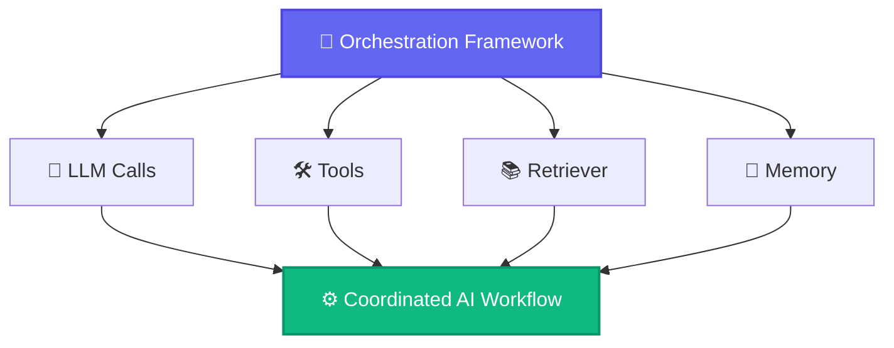
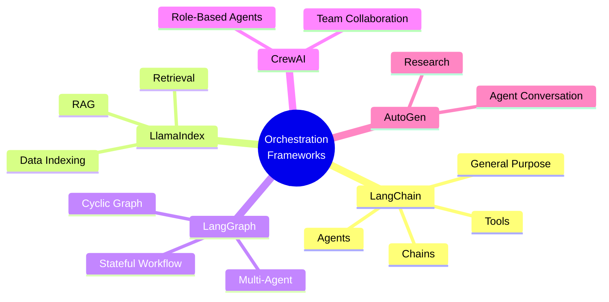
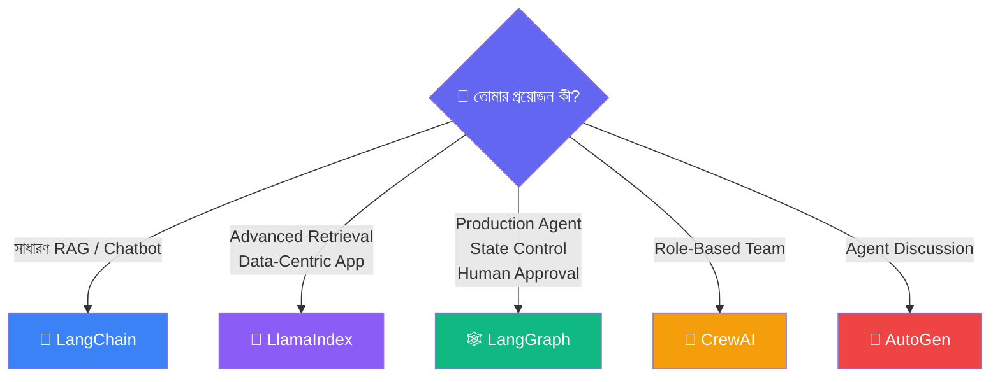
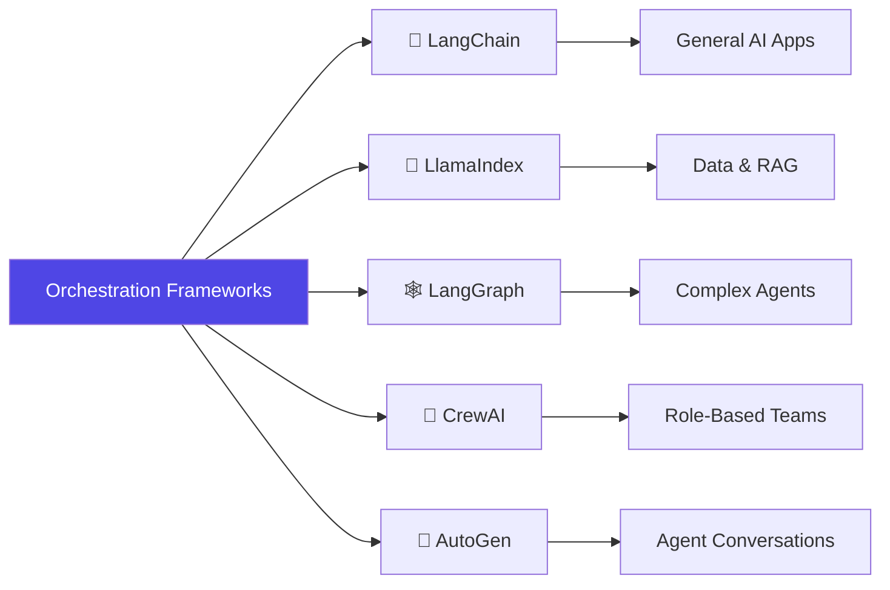

# Orchestration Frameworks — পরিচিতি

---

## Orchestration Framework কী?

**Orchestration Framework** হলো এমন একটা টুল/লাইব্রেরি, যেটা একাধিক LLM call, Tool, এবং ডেটা সোর্স কে একসাথে সাজিয়ে একটা সুসংগঠিত (coordinated) workflow এ পরিণত করে — অনেকটা একজন **conductor** এর মতো, যে একটা অর্কেস্ট্রার (orchestra) প্রতিটা বাদ্যযন্ত্রীকে সঠিক সময়ে, সঠিকভাবে বাজানোর নির্দেশনা দেয়।

---

## কেন Orchestration Framework দরকার?

- **জটিলতা ব্যবস্থাপনা** — একাধিক ধাপ (retrieval → reasoning → tool call → generation) নিজে থেকে সমন্বয় করা কঠিন এবং error-prone
- **State রাখা** — Multi-turn conversation, agent এর memory, বা multi-step task এ কোন ধাপে কী হয়েছে তা track রাখা দরকার
- **Reusability** — Prompt, retriever, tool — এগুলো বারবার নতুন করে না লিখে reusable component হিসেবে ব্যবহার করা
- **Reliability** — Retry logic, error handling, validation — এসব বারবার নিজে লেখার বদলে framework এ built-in পাওয়া

---

## Orchestration Framework এর ধরন (Types)

বাজারে বর্তমানে সবচেয়ে জনপ্রিয় কয়েকটা orchestration framework আছে, প্রতিটার নিজস্ব শক্তি ও ব্যবহারক্ষেত্র রয়েছে।

---

### ১. LangChain

**LangChain** সবচেয়ে বহুমুখী (general-purpose) orchestration framework — এটা Prompt, Model, Chain, Retriever, Tool, Memory, Agent — সবকিছুর জন্যই standardized building block দেয়।

**সবচেয়ে ভালো যেখানে:**

- সাধারণ RAG pipeline বানানো
- সহজ থেকে মাঝারি জটিলতার agent বানানো
- দ্রুত prototype তৈরি করা — কারণ ecosystem সবচেয়ে বড়, প্রায় সব provider/tool এর জন্য ready integration আছে

**সীমাবদ্ধতা:**

- খুব জটিল, বারবার একে অপরকে call করা (cyclic) multi-agent workflow এ কিছুটা সীমাবদ্ধ

---

### ২. LlamaIndex

**LlamaIndex** মূলত **data-centric** — এটা বিশেষভাবে ডিজাইন করা RAG এবং ডেটা indexing এর কাজের জন্য। যেসব application এর কেন্দ্রে "নিজের ডেটার সাথে LLM কে সংযুক্ত করা" — সেখানে LlamaIndex এর tooling অনেক বেশি পরিশীলিত (sophisticated)।

**সবচেয়ে ভালো যেখানে:**

- বড়, জটিল ডেটাসেট নিয়ে কাজ করা (একাধিক document type, বিভিন্ন indexing কৌশল)
- Advanced retrieval কৌশল (query routing, sub-question decomposition) দরকার হলে
- ডেটা-কেন্দ্রিক application যেখানে RAG-ই মূল ফোকাস

**সীমাবদ্ধতা:**

- General-purpose agent/chain বানানোর জন্য LangChain এর মতো ততটা বহুমুখী না

---

### ৩. LangGraph

**LangGraph** — LangChain টিমেরই তৈরি, কিন্তু এটা বিশেষভাবে ডিজাইন করা **জটিল, cyclic (চক্রাকার) workflow** এর জন্য — যেখানে agent বারবার একটা loop এ চলতে পারে, নিজেকে বা অন্য agent কে call করতে পারে, এবং state precisely নিয়ন্ত্রণ করা দরকার।

**সবচেয়ে ভালো যেখানে:**

- Production-grade, scalable AI Agent বানানো
- Multi-agent system যেখানে agent রা বারবার একে অপরের সাথে interact করে
- Human-in-the-loop workflow (মাঝপথে মানুষের অনুমোদন দরকার হলে)
- জটিল state management এবং error recovery প্রয়োজন হলে

**সীমাবদ্ধতা:**

- সরল, একরৈখিক (linear) কাজের জন্য LangChain এর সাধারণ chain এর চেয়ে বেশি জটিল/boilerplate লাগতে পারে

---

### ৪. CrewAI

**CrewAI** হলো একটা **role-based multi-agent framework** — এখানে একাধিক AI agent কে নির্দিষ্ট "role" (যেমন Researcher, Writer, Reviewer) দিয়ে একটা "crew" (দল) হিসেবে একসাথে কাজ করানো হয়, ঠিক যেমন একটা বাস্তব টিমে বিভিন্ন সদস্যের ভিন্ন ভিন্ন দায়িত্ব থাকে।

**সবচেয়ে ভালো যেখানে:**

- দ্রুত role-based multi-agent system প্রোটোটাইপ করা
- এমন কাজ যেখানে স্পষ্ট division of labor (কাজ ভাগ করা) দরকার — যেমন research → writing → editing pipeline

**সীমাবদ্ধতা:**

- LangGraph এর তুলনায় কম fine-grained control — জটিল, custom state logic এর জন্য কম উপযোগী

---

### ৫. AutoGen

**AutoGen** (Microsoft এর তৈরি) — এটাও multi-agent framework, যেখানে একাধিক agent একে অপরের সাথে "কথোপকথন" এর মাধ্যমে একটা সমস্যা সমাধান করে। এটা conversational, agent-to-agent interaction এর উপর বেশি ফোকাস করে।

**সবচেয়ে ভালো যেখানে:**

- Agent-দের মধ্যে iterative আলোচনার মাধ্যমে সমস্যা সমাধান করানো (যেমন code review loop — একটা agent code লেখে, আরেকটা review করে)
- গবেষণা-ধর্মী বা experimental multi-agent সিস্টেম

**সীমাবদ্ধতা:**

- Production deployment এর জন্য LangGraph এর তুলনায় ইকোসিস্টেম এখনো ততটা পরিপক্ব না

---

## পাঁচটার তুলনা — এক নজরে

| Framework            | মূল ফোকাস          | সবচেয়ে ভালো ব্যবহার                              |
| -------------------- | -------------------------- | ------------------------------------------------------------------- |
| **LangChain**  | General-purpose            | RAG, সাধারণ agent, দ্রুত prototype                       |
| **LlamaIndex** | Data-centric               | জটিল ডেটাসেট, advanced retrieval                         |
| **LangGraph**  | Cyclic workflow            | Production agent, multi-agent, human-in-the-loop                    |
| **CrewAI**     | Role-based multi-agent     | দ্রুত role-based team প্রোটোটাইপ                     |
| **AutoGen**    | Conversational multi-agent | Agent-to-agent আলোচনাভিত্তিক সমস্যা সমাধান |

---

## কোনটা কখন বেছে নেবে

::: tip
এই framework গুলো একে অপরের সম্পূর্ণ বিকল্প না — অনেক production system এ একাধিক framework একসাথে ব্যবহার করা হয়। যেমন, LlamaIndex দিয়ে ডেটা indexing করে, সেটাকে LangGraph এর একটা node হিসেবে ব্যবহার করা একটা সাধারণ প্যাটার্ন।
:::

---

## Framework Landscape

## সংক্ষেপে

- **Orchestration Framework** একাধিক LLM call, Tool, ডেটা সোর্স কে সংগঠিত workflow এ পরিণত করে
- **LangChain** — general-purpose, সবচেয়ে বড় ecosystem
- **LlamaIndex** — data-centric, advanced RAG এর জন্য বিশেষায়িত
- **LangGraph** — জটিল, cyclic, production-grade agent workflow এর জন্য
- **CrewAI** — role-based multi-agent, দ্রুত টিম-স্টাইল প্রোটোটাইপ
- **AutoGen** — conversational multi-agent, agent-to-agent আলোচনাভিত্তিক সমাধান
- এই ডকুমেন্টেশনের পরবর্তী পেজগুলোতে আমরা **LangChain**, **LlamaIndex**, এবং **LangGraph** — এই তিনটা নিয়ে বিস্তারিতভাবে গভীরে যাব
