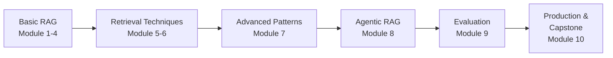
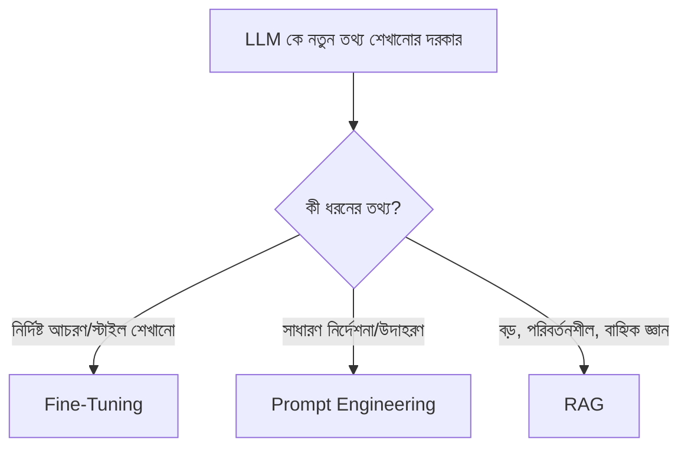
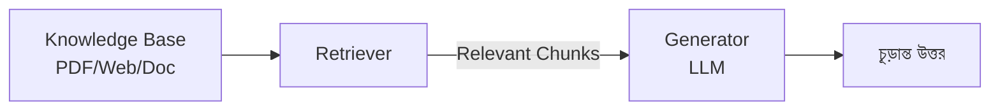

# Advanced RAG — সম্পূর্ণ কোর্স

এই কোর্সটা RAG (Retrieval-Augmented Generation) কে একদম ভিত্তি থেকে শুরু করে production-grade, agentic, multimodal সিস্টেম পর্যন্ত কভার করে। প্রতিটা Module ধাপে ধাপে আগের Module এর উপর ভিত্তি করে তৈরি — তাই ক্রম অনুযায়ী পড়াই সবচেয়ে ভালো ফলাফল দেবে।

---

## Prerequisite — শুরু করার আগে

এই কোর্স শুরু করার আগে নিচের দুইটা বিষয়ে basic ধারণা থাকা আবশ্যক:

- **LangChain Basics** — Models, Prompts, Chains, Runnables, Retrievers
- **LangGraph Basics** — State, Node, Edge, Graph-based workflow

::: tip
যদি এই দুইটা বিষয়ে এখনো comfortable না হও, আগে আমাদের **LangChain** এবং **LangGraph** সেকশন সম্পূর্ণ করে আসা উচিত — এই RAG কোর্স ধরে নেবে তুমি ইতিমধ্যে `Runnable`, `Retriever`, `StateGraph` এর মতো concept এর সাথে পরিচিত।
:::

---

## এই কোর্স কেন গুরুত্বপূর্ণ?

সাধারণ একটা "RAG chatbot" বানানো তুলনামূলক সহজ — কিন্তু সেই সিস্টেম **production এ নির্ভরযোগ্যভাবে** চালানো, ভুল উত্তর কমানো, খরচ নিয়ন্ত্রণে রাখা, এবং scale করা — এটাই আসল challenge। এই কোর্স ঠিক এই gap টা পূরণ করে — বেসিক RAG থেকে শুরু করে industry-level সমস্যা এবং সমাধান পর্যন্ত।

---

## কোর্সের সম্পূর্ণ Roadmap

| Module | বিষয় | মূল ফোকাস |
|---|---|---|
| **1** | RAG Fundamentals and Architecture | RAG কী, কেন দরকার, RAG vs Fine-tuning vs Prompt Engineering |
| **2** | Document Processing and Chunking | Document Loader, Text Splitter, Chunking strategy |
| **3** | Embeddings and Vector Representations | Embedding কীভাবে কাজ করে, কোন model বেছে নেবে |
| **4** | Vector Stores | Indexing (IVF, HNSW), CRUD operations |
| **5** | Basic Retrieval Techniques | Similarity Search, MMR, Hybrid Search |
| **6** | Advanced Retrieval Techniques | Contextual Compression, Parent Document, Self-Query, Multi-Query |
| **7** | Advanced RAG Patterns | RAG Fusion, HyDE, CRAG, Self-RAG, Graph RAG, Multimodal RAG |
| **8** | Agentic RAG with LangGraph | RAG কে Tool হিসেবে ব্যবহার, ReAct/Plan-Execute pattern |
| **9** | RAG Evaluation through RAGAS | Faithfulness, Relevance, Retrieval Quality metric |
| **10** | Capstone Project with Deployment | সম্পূর্ণ production-ready RAG সিস্টেম বানানো |
| — | Production RAG | Optimization, Caching, Cost, Monitoring, Security |

---

## RAG vs Fine-Tuning vs Prompt Engineering — কেন RAG?

কোর্স শুরু করার আগে এই মৌলিক প্রশ্নটার উত্তর জানা জরুরি — LLM কে নতুন জ্ঞান দেওয়ার তিনটা প্রধান উপায় আছে, এবং প্রতিটার আলাদা ব্যবহারক্ষেত্র।

| পদ্ধতি | কী করে | সীমাবদ্ধতা | কখন ব্যবহার করবে |
|---|---|---|---|
| **Fine-Tuning** | Model এর নিজের weight পরিবর্তন করে নতুন প্যাটার্ন/স্টাইল শেখানো | ব্যয়বহুল, ধীর, নতুন তথ্য যোগ করতে আবার training লাগে | নির্দিষ্ট tone/format/domain-specific আচরণ দরকার হলে |
| **Prompt Engineering** | Prompt এ instruction/example দিয়ে output নিয়ন্ত্রণ করা | Context window সীমিত, বড় knowledge base রাখা যায় না | ছোট, static context যথেষ্ট হলে |
| **RAG** | External knowledge base থেকে relevant তথ্য এনে prompt এ যুক্ত করা | Retrieval quality এর উপর নির্ভরশীল | বড়, dynamic, ঘন ঘন পরিবর্তনশীল knowledge base থাকলে |

::: tip
বাস্তব production system এ প্রায়ই এই তিনটা **একসাথে** ব্যবহার করা হয় — যেমন একটা fine-tuned model, RAG দিয়ে সাম্প্রতিক তথ্যের সাথে সংযুক্ত, এবং prompt engineering দিয়ে output format নিয়ন্ত্রিত। এগুলো একে অপরের প্রতিদ্বন্দ্বী না, বরং complementary টুল।
:::

---

## RAG এর Core Data Flow — সংক্ষিপ্ত প্রিভিউ

এই তিনটা ধাপ — **Knowledge Base → Retriever → Generator** — এটাই RAG এর হৃদয়, যেটা Module 1 এ বিস্তারিত আলোচনা করা হবে।

---

## কীভাবে এই কোর্স পড়বে

- **ক্রম অনুযায়ী পড়ো** — প্রতিটা Module আগেরটার উপর নির্ভর করে
- **কোড নিজে চালাও** — শুধু পড়ে বুঝে গেলাম ভাবার বদলে, প্রতিটা code snippet নিজে টাইপ করে চালাও
- **Capstone এ প্রয়োগ করো** — Module 10 এ যা শিখেছ সব একসাথে একটা বাস্তব প্রজেক্টে প্রয়োগ করবে

## পরবর্তী ধাপ

শুরু করো **Module 1: RAG Fundamentals and Architecture** দিয়ে — যেখানে আমরা দেখব LLM কেন hallucinate করে, এবং RAG এই সমস্যার সমাধান কীভাবে দেয়।
