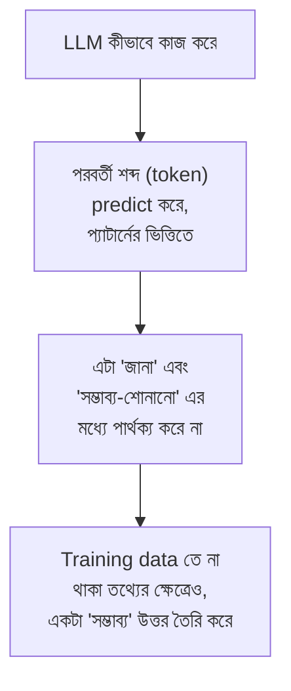
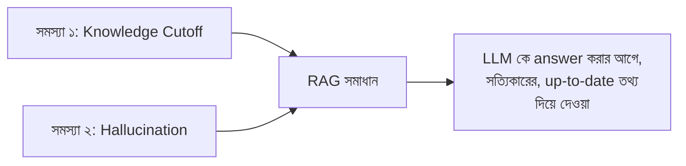
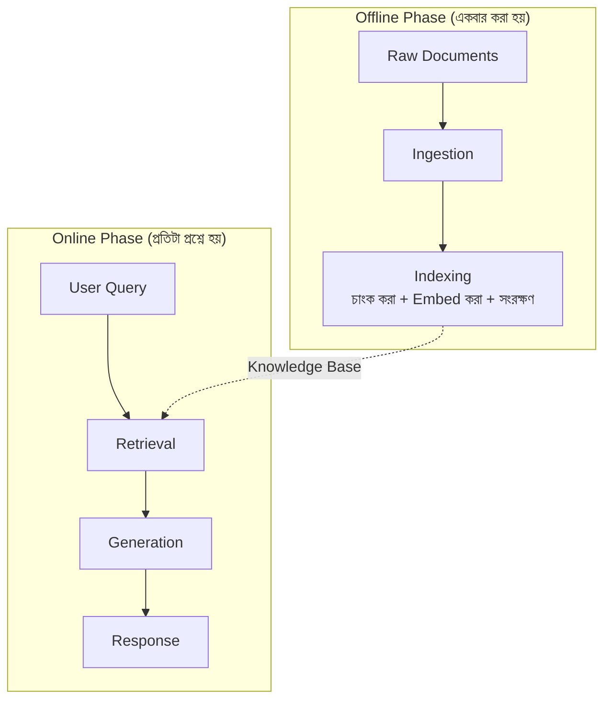

# Module 1: RAG Fundamentals and Architecture

এই Module এ আমরা RAG এর একদম ভিত্তি বুঝব — LLM কেন ভুল তথ্য বলে (hallucinate করে), কেন এর জ্ঞান সীমাবদ্ধ (knowledge cutoff), এবং RAG কীভাবে এই সমস্যাগুলোর একটা কার্যকর সমাধান দেয়। এই ভিত্তি বুঝলে বাকি পুরো কোর্সের প্রতিটা advanced technique এর "কেন" পরিষ্কার হয়ে যাবে।

---

## Why LLMs Hallucinate — LLM কেন ভুল তথ্য বলে?

### Hallucination কী?

**Hallucination** হলো, যখন একটা LLM আত্মবিশ্বাসের সাথে এমন তথ্য তৈরি করে যেটা আসলে সত্য না, বা model এর প্রশিক্ষণ তথ্যের (training data) সাথে মেলে না — কিন্তু ভাষাগতভাবে সেটা সম্পূর্ণ স্বাভাবিক, বিশ্বাসযোগ্য শোনায়।

```
প্রশ্ন: "XYZ কোম্পানির ২০২৬ সালের Q3 রেভিনিউ কত ছিল?"

LLM এর সম্ভাব্য উত্তর (hallucinated):
"XYZ কোম্পানির ২০২৬ সালের Q3 রেভিনিউ ছিল ৪৫০ মিলিয়ন ডলার।"

সমস্যা: এই সংখ্যাটা সম্পূর্ণ বানানো — LLM এর কাছে
আসলে এই তথ্য কখনোই ছিল না, কিন্তু এটা এমনভাবে উত্তর দিচ্ছে
যেন এটা সত্যি জানে
```

### কেন এটা ঘটে — মূল কারণ



LLM মূলত একটা **পরবর্তী-শব্দ-অনুমানকারী** সিস্টেম — এটা সত্য যাচাই করার কোনো built-in মেকানিজম রাখে না। যদি একটা প্রশ্নের উত্তর তার training data তে স্পষ্টভাবে না থাকে, তাহলেও এটা ভাষাগতভাবে সঙ্গত একটা উত্তর "অনুমান" করে ফেলে — এবং এই অনুমানই অনেক সময় ভুল তথ্য হয়ে দাঁড়ায়।

### Knowledge Cutoff — আরেকটা মৌলিক সীমাবদ্ধতা

প্রতিটা LLM একটা নির্দিষ্ট সময় পর্যন্ত ডেটা দিয়ে train করা হয় — এই সময়সীমাকে বলে **Knowledge Cutoff**। এর পরের যেকোনো ঘটনা, তথ্য, বা পরিবর্তন — LLM এর কাছে সম্পূর্ণ অজানা।

```
LLM এর Knowledge Cutoff: জানুয়ারি ২০২৬

প্রশ্ন: "গতকাল কী ঘটেছে?"
LLM: জানে না (কারণ এটা তার cutoff এর অনেক পরে) —
কিন্তু hallucination prone হলে, একটা "বিশ্বাসযোগ্য" উত্তর বানিয়ে দিতে পারে
```

---

## Why RAG is Needed — RAG কীভাবে সমাধান দেয়

এই দুইটা সমস্যা — **Hallucination** এবং **Knowledge Cutoff** — RAG এর জন্মের মূল কারণ।



RAG এর মূল ধারণা হলো — LLM কে "নিজে থেকে মনে করে" উত্তর দিতে না বলে, বরং **প্রথমে একটা নির্ভরযোগ্য উৎস থেকে প্রাসঙ্গিক তথ্য খুঁজে বের করে**, সেটাকে prompt এর মধ্যে দিয়ে দেওয়া হয়। এরপর LLM কে বলা হয়: "এই তথ্যের ভিত্তিতে উত্তর দাও।"

```
RAG ছাড়া:                              RAG সহ:

প্রশ্ন → LLM (নিজের memory থেকে)          প্রশ্ন → Retriever (সত্যিকারের তথ্য খোঁজে)
       → উত্তর (hallucination ঝুঁকি)              → LLM (retrieved তথ্যের ভিত্তিতে)
                                                → উত্তর (grounded, verifiable)
```

::: tip
RAG এর এই পদ্ধতিকে বলা হয় **"grounding"** — অর্থাৎ, LLM এর উত্তরকে একটা বাস্তব, যাচাইযোগ্য উৎসের সাথে "ভিত্তি" (ground) করে দেওয়া, শুধু model এর অনুমানের উপর ছেড়ে না দিয়ে।
:::

---

## Core Components — RAG এর মূল অংশগুলো

RAG সিস্টেমের তিনটা মূল component আছে:

| Component | কাজ |
|---|---|
| **Knowledge Base** | তোমার নিজের ডেটা (PDF, ওয়েবসাইট, ডাটাবেস) — যেখান থেকে তথ্য retrieve করা হবে |
| **Retriever** | User এর প্রশ্নের সাথে সবচেয়ে relevant তথ্য Knowledge Base থেকে খুঁজে বের করে |
| **Generator** | Retrieved তথ্য এবং প্রশ্ন একসাথে নিয়ে, LLM চূড়ান্ত উত্তর তৈরি করে |

---

## RAG Data Flow — সম্পূর্ণ Pipeline



### পাঁচটা ধাপ বিস্তারিত

| ধাপ | কী ঘটে |
|---|---|
| **1. Ingestion** | Raw document (PDF, web page, ইত্যাদি) সংগ্রহ করা এবং পরিষ্কার করা |
| **2. Indexing** | Document কে chunk এ ভাগ করা, embedding তৈরি করা, vector store এ সংরক্ষণ করা |
| **3. Retrieval** | User এর প্রশ্নের embedding বানিয়ে, সবচেয়ে similar chunk খুঁজে বের করা |
| **4. Generation** | Retrieved chunk + প্রশ্ন একসাথে prompt এ বসিয়ে LLM কে পাঠানো |
| **5. Response** | LLM এর তৈরি করা, retrieved তথ্যের ভিত্তিতে গ্রাউন্ডেড উত্তর |

::: tip
লক্ষ্য করো — **Ingestion এবং Indexing (১-২ ধাপ)** সাধারণত **একবার** করা হয় (offline, ডেটা প্রস্তুত করার সময়), কিন্তু **Retrieval এবং Generation (৩-৫ ধাপ)** **প্রতিটা user প্রশ্নে** নতুন করে চলে (online, real-time)। এই পার্থক্য বোঝা গুরুত্বপূর্ণ — Module 2-4 এ Offline Phase, Module 5-8 এ মূলত Online Phase নিয়ে আলোচনা হবে।
:::

---

## ধারণাগত কোড উদাহরণ — সম্পূর্ণ RAG এক নজরে

এই কোর্সের বাকি Module গুলোতে প্রতিটা অংশ গভীরভাবে দেখব, কিন্তু এখনই একটা high-level ধারণা পাওয়ার জন্য:

```python
# ═══ Offline Phase (একবার) ═══
documents = load_documents("company_handbook.pdf")       # Ingestion
chunks = split_into_chunks(documents)                       # Indexing (chunking)
vectorstore = embed_and_store(chunks)                        # Indexing (embedding + storage)

# ═══ Online Phase (প্রতিটা প্রশ্নে) ═══
def answer_question(user_query):
    relevant_chunks = vectorstore.retrieve(user_query)        # Retrieval
    prompt = f"এই তথ্য ব্যবহার করে উত্তর দাও:\n{relevant_chunks}\n\nপ্রশ্ন: {user_query}"
    answer = llm.generate(prompt)                               # Generation
    return answer                                                # Response
```

প্রতিটা function (`load_documents`, `split_into_chunks`, `embed_and_store`, `retrieve`) — এগুলোই যথাক্রমে Module 2, 2, 3-4, এবং 5-6 এ বিস্তারিতভাবে আলোচিত হবে।

---

## RAG vs Fine-Tuning vs Prompt Engineering — Module 1 এর গভীর তুলনা

Course Overview এ এই তুলনা সংক্ষেপে দেখানো হয়েছিল — এখানে আরেকটু গভীরে যাওয়া যাক।

### Fine-Tuning কখন বেছে নেবে

```
উদাহরণ: তুমি চাও LLM সবসময় একটা নির্দিষ্ট, কোম্পানি-নির্দিষ্ট 
tone এ উত্তর দিক (যেমন legal document এর ফরমাল স্টাইল)

→ এটা "নতুন তথ্য" শেখানো না, বরং "আচরণ/style" শেখানো
→ Fine-Tuning এর জন্য উপযুক্ত ক্ষেত্র
```

### Prompt Engineering কখন বেছে নেবে

```
উদাহরণ: তুমি চাও LLM একটা নির্দিষ্ট JSON format এ উত্তর দিক,
কয়েকটা example দেখিয়ে দিলেই যথেষ্ট

→ Context window এর মধ্যে সবকিছু ফিট করে যাচ্ছে
→ Prompt Engineering এর জন্য উপযুক্ত ক্ষেত্র
```

### RAG কখন বেছে নেবে

```
উদাহরণ: তোমার company এর হাজার হাজার document আছে,
যেগুলো প্রতিনিয়ত আপডেট হচ্ছে, এবং LLM কে
সেই সব তথ্যের ভিত্তিতে সঠিক উত্তর দিতে হবে

→ Knowledge base অনেক বড়, dynamic
→ RAG এর জন্য উপযুক্ত ক্ষেত্র (এই কোর্সের ফোকাস)
```

---

## Common Mistakes

- RAG কে "hallucination সম্পূর্ণভাবে বন্ধ করার" সমাধান ভাবা — এটা hallucination **উল্লেখযোগ্যভাবে কমায়**, কিন্তু সম্পূর্ণ নির্মূল করে না (Retriever ভুল তথ্য আনলে, LLM তাও hallucinate করতে পারে)
- RAG, Fine-Tuning, Prompt Engineering কে পরস্পর-exclusive ভাবা, যখন বাস্তবে এগুলো একসাথে ব্যবহার করা যায়
- Offline এবং Online Phase গুলিয়ে ফেলা — Indexing বারবার করার প্রয়োজন নেই, শুধু ডেটা পরিবর্তন হলেই আবার করতে হয়

---

## Best Practices

- RAG সিস্টেম ডিজাইন করার শুরুতেই Offline vs Online Phase আলাদাভাবে চিন্তা করো — এটা architecture সিদ্ধান্তে সাহায্য করে
- Hallucination কমানোর পাশাপাশি, response এ **source citation** যুক্ত করার কথা ভাবো (পরবর্তী Module এ বিস্তারিত)
- প্রতিটা নতুন প্রজেক্টে RAG শুরু করার আগে চিন্তা করো — এটা কি সত্যিই RAG দরকার, নাকি শুধু ভালো prompt engineering যথেষ্ট?

---

## Interview Questions

**প্রশ্ন: LLM Hallucination কী, এবং কেন এটা ঘটে?**
> Hallucination হলো LLM এর আত্মবিশ্বাসের সাথে ভুল/বানানো তথ্য তৈরি করা। এটা ঘটে কারণ LLM মূলত পরবর্তী শব্দ predict করে, সত্যতা যাচাই করার কোনো built-in মেকানিজম নেই — training data তে না থাকা তথ্যের জন্যও এটা একটা "সম্ভাব্য-শোনানো" উত্তর তৈরি করে ফেলে।

**প্রশ্ন: RAG কীভাবে Hallucination কমায়?**
> RAG LLM কে উত্তর দেওয়ার আগে একটা নির্ভরযোগ্য উৎস থেকে প্রাসঙ্গিক তথ্য retrieve করে prompt এ দিয়ে দেয় — এটাকে "grounding" বলে। LLM নিজের memory থেকে অনুমান করার বদলে, দেওয়া তথ্যের ভিত্তিতে উত্তর দেয়, যা সত্যতার সম্ভাবনা বাড়ায়।

**প্রশ্ন: RAG এর Offline এবং Online Phase এর পার্থক্য কী?**
> Offline Phase (Ingestion, Indexing) সাধারণত একবার করা হয় — ডেটা প্রস্তুত করে vector store এ সংরক্ষণ করা। Online Phase (Retrieval, Generation) প্রতিটা user প্রশ্নে নতুন করে চলে — real-time এ relevant তথ্য খুঁজে উত্তর তৈরি করা।

**প্রশ্ন: কখন RAG এর বদলে Fine-Tuning বেছে নেবে?**
> যখন প্রয়োজন নতুন "তথ্য" শেখানো না, বরং model এর **আচরণ/style/format** পরিবর্তন করা — যেমন একটা নির্দিষ্ট tone এ সবসময় উত্তর দেওয়া।

---

## Summary

- **Hallucination** ঘটে কারণ LLM সত্যতা যাচাই না করেই ভাষাগতভাবে সঙ্গত উত্তর "অনুমান" করে
- **Knowledge Cutoff** LLM কে তার training এর পরের যেকোনো ঘটনা সম্পর্কে অজ্ঞ রাখে
- **RAG** LLM কে সত্যিকারের, retrieved তথ্যের সাথে "ground" করে, hallucination কমায়
- মূল তিনটা component: **Knowledge Base → Retriever → Generator**
- Data Flow এর পাঁচটা ধাপ: **Ingestion → Indexing → Retrieval → Generation → Response** — প্রথম দুইটা Offline, শেষ তিনটা Online
- **RAG, Fine-Tuning, Prompt Engineering** — তিনটা ভিন্ন সমাধান, ভিন্ন সমস্যার জন্য, এবং প্রায়ই একসাথে ব্যবহৃত হয়

## পরবর্তী ধাপ

Module 2 এ আমরা RAG এর Offline Phase এর প্রথম ধাপ — **Document Processing and Chunking** — নিয়ে গভীরভাবে আলোচনা করব।
