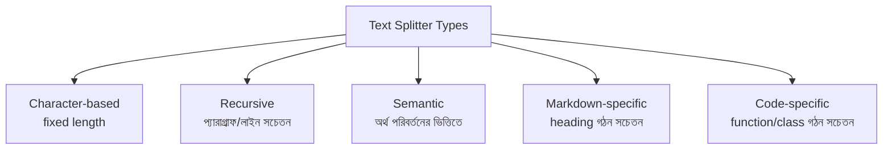
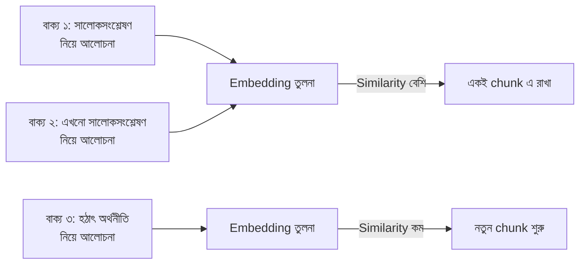

# Module 2: Document Processing and Chunking

Module 1 এ আমরা দেখেছি RAG এর Offline Phase শুরু হয় **Ingestion** দিয়ে। এই Module এ আমরা গভীরভাবে দেখব কীভাবে বিভিন্ন উৎস থেকে document লোড করতে হয়, এবং সেগুলোকে কীভাবে বুদ্ধিমত্তার সাথে ছোট ছোট chunk এ ভাগ করতে হয় — কারণ এই ধাপের গুণমান সরাসরি পুরো RAG সিস্টেমের ফলাফলকে প্রভাবিত করে।

---

## Document Loaders in LangChain

### কেন Document Loader প্রয়োজন

Raw ডেটা বিভিন্ন format এ থাকে — PDF, Word document, ওয়েবপেজ, CSV। LangChain এর Document Loader প্রতিটা ভিন্ন source কে একটা **standardized `Document` object** এ রূপান্তর করে, যাতে পরবর্তী প্রতিটা ধাপ (splitting, embedding) একই পদ্ধতিতে কাজ করতে পারে, source যাই হোক না কেন।

```python
from langchain_core.documents import Document

# প্রতিটা Loader এই একই structure রিটার্ন করে
doc = Document(
    page_content="এখানে আসল টেক্সট...",
    metadata={"source": "handbook.pdf", "page": 3}
)
```

### PDF থেকে লোড করা

```python
from langchain_community.document_loaders import PyPDFLoader

loader = PyPDFLoader("company_handbook.pdf")
documents = loader.load()

print(f"মোট পেজ: {len(documents)}")
print(documents[0].page_content[:200])
print(documents[0].metadata)  # {'source': 'company_handbook.pdf', 'page': 0}
```

### Web page থেকে লোড করা

```python
from langchain_community.document_loaders import WebBaseLoader

loader = WebBaseLoader("https://example.com/documentation")
documents = loader.load()
```

### Structured Data (CSV, JSON) থেকে লোড করা

```python
from langchain_community.document_loaders import CSVLoader

loader = CSVLoader(file_path="products.csv")
documents = loader.load()  # প্রতিটা row একটা আলাদা Document হিসেবে
```

### Structured vs Unstructured Content — পার্থক্য

| ধরন | উদাহরণ | বিশেষত্ব |
|---|---|---|
| **Unstructured** | PDF আর্টিকেল, ব্লগ পোস্ট, বই | Free-form টেক্সট, কোনো নির্দিষ্ট schema নেই |
| **Structured** | CSV, JSON, ডাটাবেস টেবিল | নির্দিষ্ট field/column, প্রতিটা entry consistent format এ |

::: tip
Structured ডেটার জন্য chunking strategy ভিন্ন হয় — একটা CSV row কে মাঝপথে ভাঙা অর্থহীন, তাই সাধারণত প্রতিটা row/record কে একটা স্বতন্ত্র chunk হিসেবে treat করা হয়। Unstructured টেক্সটে chunking অনেক বেশি বিবেচনার বিষয়, যেটা এই Module এ পরে আলোচনা হবে।
:::

---

## Text Splitting Strategies

Document লোড হওয়ার পর, বেশিরভাগ ক্ষেত্রে সেগুলো এত বড় থাকে যে সরাসরি embed করা অকার্যকর (Module 1 এ যেমন বলেছি — Text Splitting Module এ বিস্তারিত)। LangChain একাধিক splitting strategy দেয়, বিভিন্ন content type এর জন্য।



### ১. CharacterTextSplitter — সবচেয়ে সহজ

```python
from langchain_text_splitters import CharacterTextSplitter

splitter = CharacterTextSplitter(
    separator="\n\n",
    chunk_size=1000,
    chunk_overlap=200
)
chunks = splitter.split_documents(documents)
```

শুধু একটা নির্দিষ্ট separator (যেমন `\n\n`) খুঁজে ভাগ করে, নির্দিষ্ট character সংখ্যায় পৌঁছালে। টেক্সটের গঠন বিবেচনা করে না।

### ২. RecursiveCharacterTextSplitter — Industry Standard

```python
from langchain_text_splitters import RecursiveCharacterTextSplitter

splitter = RecursiveCharacterTextSplitter(
    chunk_size=1000,
    chunk_overlap=200,
    separators=["\n\n", "\n", ". ", " ", ""]
)
chunks = splitter.split_documents(documents)
```

এটা প্রথমে বড় separator (paragraph break) দিয়ে চেষ্টা করে, না হলে ধাপে ধাপে ছোট separator এ (sentence, word) নেমে আসে — যতটা সম্ভব প্রাকৃতিক ভাষার গঠন বজায় রেখে ভাগ করে। সাধারণ টেক্সটের জন্য এটাই সবচেয়ে বেশি ব্যবহৃত।

### ৩. Semantic Chunking — অর্থের ভিত্তিতে

```python
from langchain_experimental.text_splitter import SemanticChunker
from langchain_openai import OpenAIEmbeddings

splitter = SemanticChunker(
    embeddings=OpenAIEmbeddings(),
    breakpoint_threshold_type="percentile"
)
chunks = splitter.create_documents([full_text])
```

### কীভাবে কাজ করে



পাশাপাশি বাক্যের embedding similarity মেপে, similarity হঠাৎ কমে গেলে সেখানে chunk boundary বসানো হয় — অর্থাৎ, topic পরিবর্তনের জায়গায় স্বাভাবিকভাবেই ভাগ হয়।

### ৪. MarkdownHeaderTextSplitter — Heading-aware

```python
from langchain_text_splitters import MarkdownHeaderTextSplitter

headers_to_split_on = [
    ("#", "Header 1"),
    ("##", "Header 2"),
    ("###", "Header 3"),
]

splitter = MarkdownHeaderTextSplitter(headers_to_split_on=headers_to_split_on)
chunks = splitter.split_text(markdown_text)
```

প্রতিটা chunk এর সাথে তার heading hierarchy metadata হিসেবে যুক্ত থাকে — যেমন একটা chunk "Installation" heading এর নিচে থাকলে, সেই তথ্য metadata তে সংরক্ষিত থাকে, যেটা পরে filtering এ কাজে লাগে।

### ৫. Code Splitter — Programming Language-aware

```python
from langchain_text_splitters import RecursiveCharacterTextSplitter, Language

python_splitter = RecursiveCharacterTextSplitter.from_language(
    language=Language.PYTHON,
    chunk_size=500,
    chunk_overlap=50
)
chunks = python_splitter.split_text(python_code)
```

`function`/`class` definition কে মাঝপথে না কেটে, যতটা সম্ভব সম্পূর্ণ রাখার চেষ্টা করে — কোড ডকুমেন্টেশন বা কোড সার্চ RAG সিস্টেমে অপরিহার্য।

---

## Chunking Best Practices

### Chunk Size — কতটা বড় হওয়া উচিত

```
খুব ছোট chunk (যেমন ১০০ token):
- প্রতিটা chunk এ যথেষ্ট প্রসঙ্গ থাকে না
- খুব বেশি chunk তৈরি হয়, storage/search খরচ বাড়ে
- একটা সম্পূর্ণ ধারণা একাধিক chunk এ ভেঙে যেতে পারে

খুব বড় chunk (যেমন ৪০০০ token):
- Retrieval এ অপ্রাসঙ্গিক তথ্যও চলে আসে
- Embedding এর "focus" কমে যায় (অনেক ভিন্ন বিষয় একসাথে)
- LLM এর context window দ্রুত ভরে যায়
```

::: tip সাধারণ নিয়ম
বেশিরভাগ ব্যবহারিক ক্ষেত্রে **৫০০-১০০০ token** এর মধ্যে chunk size রাখা ভালো ফলাফল দেয়, কিন্তু এটা content type এবং use case অনুযায়ী পরিবর্তনশীল — code chunk ছোট রাখা ভালো, narrative document তুলনামূলক বড় chunk সহ্য করতে পারে।
:::

### Overlap Trade-offs

```python
splitter = RecursiveCharacterTextSplitter(
    chunk_size=1000,
    chunk_overlap=200  # chunk_size এর প্রায় ১৫-২০%
)
```

| Overlap | সুবিধা | অসুবিধা |
|---|---|---|
| **কম/শূন্য** | কম redundancy, কম storage | Boundary তে context হারানোর ঝুঁকি বেশি |
| **বেশি** | Context ভালো বজায় থাকে boundary তে | বেশি redundancy, বেশি storage/compute খরচ |

### When to Chunk, When NOT to Chunk

সব সময় chunking প্রয়োজন হয় না।

```
Chunking প্রয়োজন:
- বড় document (একাধিক পাতা/হাজার শব্দ)
- একাধিক ভিন্ন বিষয়/section সম্বলিত document

Chunking প্রয়োজন নাও হতে পারে:
- খুব ছোট document (যেমন একটা FAQ entry, ছোট product description)
- যেগুলো ইতিমধ্যেই ছোট, স্বয়ংসম্পূর্ণ ইউনিট (একটা row/record)
```

::: warning
ছোট, ইতিমধ্যে-atomic ডেটাকে জোরপূর্বক chunk করলে অপ্রয়োজনীয় জটিলতা তৈরি হয় — যেমন একটা ৫০ শব্দের FAQ answer কে আলাদা করে chunk করার দরকার নেই, পুরোটাই একটা chunk হওয়া উচিত।
:::

---

## Metadata Management এবং Filtering

প্রতিটা chunk এর সাথে metadata সংযুক্ত রাখা অত্যন্ত গুরুত্বপূর্ণ — এটা পরবর্তীতে filtering, source citation, এবং debugging এ কাজে লাগে।

```python
from langchain_core.documents import Document

chunk = Document(
    page_content="ছুটির নীতি সংক্রান্ত তথ্য...",
    metadata={
        "source": "employee_handbook.pdf",
        "page": 12,
        "department": "HR",
        "last_updated": "2026-01-15",
        "document_type": "policy"
    }
)
```

### কেন Metadata গুরুত্বপূর্ণ

| ব্যবহার | উদাহরণ |
|---|---|
| **Source Citation** | User কে দেখানো, উত্তর কোন document/page থেকে এসেছে |
| **Scoped Filtering** | শুধু নির্দিষ্ট department/date range এর মধ্যে retrieve করা (Module 6 এ বিস্তারিত) |
| **Debugging** | ভুল উত্তর এলে, কোন source থেকে এসেছে তা ট্র্যাক করে সমস্যা খুঁজে বের করা |
| **Access Control** | নির্দিষ্ট user শুধু নির্দিষ্ট category এর document দেখতে পাবে |

### Bulk Metadata যোগ করা

```python
chunks = splitter.split_documents(documents)

for chunk in chunks:
    chunk.metadata["ingested_at"] = "2026-08-04"
    chunk.metadata["source_type"] = "internal_policy"
```

---

## সম্পূর্ণ উদাহরণ — Ingestion থেকে Chunking পর্যন্ত

```python
from langchain_community.document_loaders import PyPDFLoader
from langchain_text_splitters import RecursiveCharacterTextSplitter

# ধাপ ১: Load
loader = PyPDFLoader("employee_handbook.pdf")
documents = loader.load()

# ধাপ ২: Split
splitter = RecursiveCharacterTextSplitter(
    chunk_size=800,
    chunk_overlap=150,
    separators=["\n\n", "\n", ". ", " ", ""]
)
chunks = splitter.split_documents(documents)

# ধাপ ৩: Metadata সমৃদ্ধ করা
for chunk in chunks:
    chunk.metadata["document_type"] = "employee_handbook"

print(f"মোট {len(documents)} পেজ → {len(chunks)} chunk")
print(chunks[0].page_content)
print(chunks[0].metadata)
```

---

## Common Mistakes

- সব ধরনের content এর জন্য একই chunk size ব্যবহার করা (code আর narrative টেক্সট এর প্রয়োজন ভিন্ন)
- `chunk_overlap` একদম শূন্য রাখা, ফলে গুরুত্বপূর্ণ প্রসঙ্গ boundary তে হারিয়ে যাওয়া
- Metadata সংযুক্ত না করে শুধু raw টেক্সট সংরক্ষণ করা — পরে source citation/filtering অসম্ভব হয়ে যাওয়া
- ছোট, ইতিমধ্যে-atomic ডেটা (যেমন FAQ) কে অপ্রয়োজনীয়ভাবে আরও ছোট chunk এ ভাগ করা

---

## Best Practices

- সাধারণ narrative টেক্সটের জন্য `RecursiveCharacterTextSplitter` দিয়ে শুরু করো — এটাই সবচেয়ে নির্ভরযোগ্য default
- Code documentation এর জন্য language-specific splitter ব্যবহার করো
- সবসময় প্রতিটা chunk এ source, page, এবং প্রাসঙ্গিক metadata যুক্ত করো
- Chunk size এবং overlap নিয়ে experiment করো — কোনো একটা "সঠিক" মান নেই, dataset এবং use case অনুযায়ী tune করতে হয়

---

## Interview Questions

**প্রশ্ন: `CharacterTextSplitter` আর `RecursiveCharacterTextSplitter` এর পার্থক্য কী?**
> `CharacterTextSplitter` একটা মাত্র separator ব্যবহার করে সরল ভাগ করে। `RecursiveCharacterTextSplitter` একাধিক separator এর একটা priority list অনুসরণ করে (paragraph → line → sentence → word), যতটা সম্ভব প্রাকৃতিক ভাষার গঠন বজায় রাখে।

**প্রশ্ন: `chunk_overlap` কেন ব্যবহার করা হয়?**
> দুইটা পাশাপাশি chunk এর মধ্যে কিছু টেক্সট সাধারণ (common) রেখে, chunk boundary তে গুরুত্বপূর্ণ প্রসঙ্গ হারিয়ে যাওয়া প্রতিরোধ করে।

**প্রশ্ন: Semantic Chunking কীভাবে কাজ করে, এবং এটা কেন উপকারী?**
> এটা পাশাপাশি বাক্যের embedding similarity মেপে, similarity হঠাৎ কমে যাওয়ার জায়গায় chunk boundary বসায় — অর্থাৎ, fixed length এর বদলে topic পরিবর্তনের ভিত্তিতে ভাগ করে, যা আরও অর্থপূর্ণ chunk তৈরি করে।

**প্রশ্ন: Metadata কেন RAG সিস্টেমে গুরুত্বপূর্ণ?**
> এটা source citation দেখাতে, scoped/filtered retrieval করতে, debugging এ সাহায্য করতে, এবং access control বাস্তবায়ন করতে ব্যবহৃত হয় — শুধু raw টেক্সট থাকলে এই সুবিধাগুলো পাওয়া যায় না।

---

## Summary

- **Document Loader** বিভিন্ন উৎস (PDF, Web, CSV) থেকে ডেটা একটা standardized `Document` object এ রূপান্তর করে
- **Structured vs Unstructured** ডেটার chunking strategy ভিন্ন
- পাঁচ ধরনের splitter: **Character, Recursive (standard), Semantic, Markdown, Code** — content type অনুযায়ী বেছে নিতে হয়
- **Chunk Size** এবং **Overlap** এর সঠিক ভারসাম্য RAG এর গুণমানের জন্য অত্যন্ত গুরুত্বপূর্ণ
- সব ডেটা chunking এর প্রয়োজন নেই — ছোট, atomic ডেটা যেমন আছে তেমনই রাখা উচিত
- **Metadata** প্রতিটা chunk এর সাথে সংযুক্ত রাখা উচিত — citation, filtering, debugging এর জন্য অপরিহার্য

## পরবর্তী ধাপ

Module 3 এ আমরা দেখব chunk করা টেক্সটকে কীভাবে **Embedding** এ রূপান্তর করতে হয় — যেটাই RAG এর semantic search ক্ষমতার মূল ভিত্তি।
