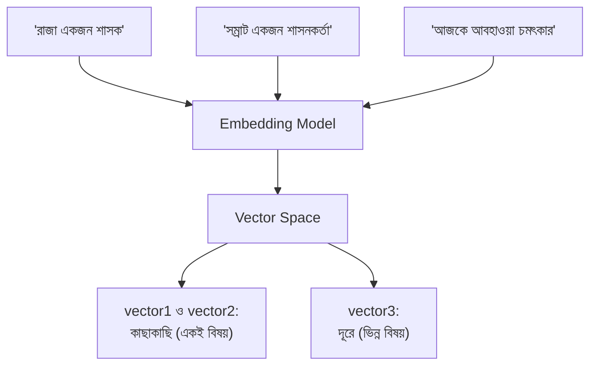
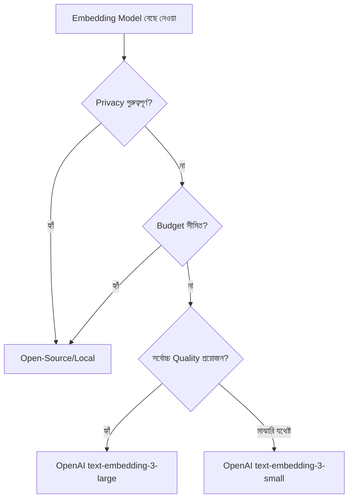

# Module 3: Embeddings and Vector Representations

Module 2 এ আমরা document কে chunk এ ভাগ করেছি। এখন প্রশ্ন হলো — কীভাবে একটা কম্পিউটার বুঝবে দুইটা ভিন্ন বাক্যের **অর্থ কাছাকাছি** কিনা? এই সমস্যার সমাধান দেয় **Embedding** — এই Module এ আমরা এটা গভীরভাবে বুঝব।

---

## How Embeddings Work — Embedding কীভাবে কাজ করে

### মূল ধারণা

**Embedding** হলো টেক্সটকে একটা সংখ্যার array (vector) এ রূপান্তর করার পদ্ধতি, যেখানে **অর্থগতভাবে কাছাকাছি টেক্সট, vector space এ ভৌগোলিকভাবেও কাছাকাছি** অবস্থান করে।

```python
from langchain_openai import OpenAIEmbeddings

embedding_model = OpenAIEmbeddings(model="text-embedding-3-small")

vector1 = embedding_model.embed_query("রাজা একজন শাসক")
vector2 = embedding_model.embed_query("সম্রাট একজন শাসনকর্তা")
vector3 = embedding_model.embed_query("আজকে আবহাওয়া চমৎকার")

print(len(vector1))  # যেমন: 1536 — এটাই vector এর dimension
```



### Semantic Similarity — অর্থগত মিল

দুইটা বাক্যের অর্থগত মিল মাপার সবচেয়ে সাধারণ পদ্ধতি হলো **Cosine Similarity** — দুইটা vector এর মধ্যে কোণ (angle) মাপা।

```python
from sklearn.metrics.pairwise import cosine_similarity

similarity_1_2 = cosine_similarity([vector1], [vector2])[0][0]
similarity_1_3 = cosine_similarity([vector1], [vector3])[0][0]

print(f"রাজা vs সম্রাট: {similarity_1_2:.4f}")   # উচ্চ মান (কাছাকাছি অর্থ)
print(f"রাজা vs আবহাওয়া: {similarity_1_3:.4f}")   # নিম্ন মান (ভিন্ন অর্থ)
```

### Distance Metrics — বিভিন্ন পরিমাপ পদ্ধতি

| Metric | কীভাবে মাপে | কখন ব্যবহার হয় |
|---|---|---|
| **Cosine Similarity** | দুই vector এর মধ্যে কোণ | সবচেয়ে জনপ্রিয়, magnitude উপেক্ষা করে শুধু দিকনির্দেশনা দেখে |
| **Euclidean Distance** | সরলরৈখিক দূরত্ব | কখনো কখনো ব্যবহৃত, তবে high-dimensional space এ কম নির্ভরযোগ্য |
| **Dot Product** | Vector গুলোর গুণফল যোগ | দ্রুত গণনা, কিছু vector database এ default |

::: tip
বেশিরভাগ text embedding ব্যবহারের ক্ষেত্রে **Cosine Similarity** default এবং সবচেয়ে নির্ভরযোগ্য পছন্দ, কারণ এটা vector এর "দৈর্ঘ্য" না দেখে শুধু "দিক" (semantic orientation) তুলনা করে।
:::

---

## Embedding Models Overview — OpenAI vs Open-Source

| ধরন | উদাহরণ | সুবিধা | অসুবিধা |
|---|---|---|---|
| **OpenAI (Proprietary)** | `text-embedding-3-small/large` | High quality, সহজ setup, নির্ভরযোগ্য | প্রতি request খরচ, ডেটা বাইরের API তে যায় |
| **Open-Source (Local/Self-hosted)** | `sentence-transformers/all-MiniLM-L6-v2`, BGE, E5 | Free, ডেটা নিজের কাছে থাকে (privacy) | Setup/infra নিজে সামলাতে হয়, GPU লাগতে পারে |
| **Open-Source (Hosted API)** | Hugging Face Inference API | Free/সস্তা tier আছে, setup সহজ | Rate limit, latency বেশি হতে পারে |

### OpenAI Embedding ব্যবহার

```python
from langchain_openai import OpenAIEmbeddings

embedding_model = OpenAIEmbeddings(model="text-embedding-3-small")
vector = embedding_model.embed_query("এটা একটা টেস্ট বাক্য")
```

### Open-Source Embedding (Local) ব্যবহার

```python
from langchain_huggingface import HuggingFaceEmbeddings

embedding_model = HuggingFaceEmbeddings(
    model_name="sentence-transformers/all-MiniLM-L6-v2"
)
vector = embedding_model.embed_query("এটা একটা টেস্ট বাক্য")
```

---

## Choosing the Right Embedding Model — Cost vs Quality Trade-offs



### বিবেচনার বিষয়গুলো

| বিষয় | প্রশ্ন করো |
|---|---|
| **Quality** | Retrieval accuracy কতটা গুরুত্বপূর্ণ এই প্রজেক্টে? |
| **Cost** | কত ভলিউম ডেটা embed করতে হবে, বাজেট কত? |
| **Latency** | Real-time response দরকার, নাকি batch processing চলবে? |
| **Privacy** | ডেটা sensitive/confidential, বাইরের API তে পাঠানো যাবে? |
| **Dimension Size** | ছোট dimension (দ্রুত search, কম storage) নাকি বড় dimension (বেশি নির্ভুলতা)? |

### Dimension Size এর প্রভাব

```python
# ছোট dimension — দ্রুত, কম storage, কিছুটা কম নির্ভুল
small_model = OpenAIEmbeddings(model="text-embedding-3-small")  # 1536 dimensions

# বড় dimension — বেশি নির্ভুল, কিন্তু বেশি storage/compute
large_model = OpenAIEmbeddings(model="text-embedding-3-large")  # 3072 dimensions
```

::: tip
বেশিরভাগ প্রজেক্টের জন্য **`text-embedding-3-small`** যথেষ্ট ভালো ফলাফল দেয়, খরচ ও performance এর একটা ভালো ভারসাম্যে। শুধু যখন খুবই সূক্ষ্ম (nuanced) semantic difference ধরা দরকার, তখন `large` মডেলে upgrade করার কথা ভাবা উচিত।
:::

---

## LangChain Embeddings Implementation — সম্পূর্ণ উদাহরণ

### Query vs Document Embedding

```python
from langchain_openai import OpenAIEmbeddings

embedding_model = OpenAIEmbeddings(model="text-embedding-3-small")

# একটা মাত্র query embed করা
query_vector = embedding_model.embed_query("বাংলাদেশের রাজধানী কী?")

# একাধিক document একসাথে embed করা (batch)
documents = [
    "ঢাকা বাংলাদেশের রাজধানী।",
    "পদ্মা সেতু একটি বিখ্যাত স্থাপনা।",
    "পাইথন একটি জনপ্রিয় প্রোগ্রামিং ভাষা।"
]
document_vectors = embedding_model.embed_documents(documents)

print(f"Document ভেক্টর সংখ্যা: {len(document_vectors)}")
```

::: tip
`embed_query()` এবং `embed_documents()` আলাদা method — কিছু provider (যেমন কিছু open-source model) query এবং document এর জন্য সামান্য ভিন্ন processing করে (যেমন query তে একটা বিশেষ প্রিফিক্স যোগ করা), তাই সবসময় সঠিক method ব্যবহার করা উচিত।
:::

### Document Similarity Search — বাস্তব উদাহরণ

```python
import numpy as np
from sklearn.metrics.pairwise import cosine_similarity

query = "বাংলাদেশের রাজধানী কোথায়?"
query_vector = embedding_model.embed_query(query)

similarities = cosine_similarity([query_vector], document_vectors)[0]

best_match_index = np.argmax(similarities)
print(f"সবচেয়ে relevant document: {documents[best_match_index]}")
print(f"Similarity score: {similarities[best_match_index]:.4f}")
```

এই একই মূলনীতি — query আর document এর মধ্যে similarity মেপে সবচেয়ে relevant টা বের করা — এটাই পরবর্তী Module এ **Vector Store** এর ভিতরে বড় স্কেলে (লক্ষ লক্ষ document এর মধ্যে দ্রুত) হবে।

---

## Embedding এর সীমাবদ্ধতা — যা জানা জরুরি

::: warning
Embedding সবসময় "নিখুঁত" অর্থ বোঝে না — কিছু সীমাবদ্ধতা মাথায় রাখা দরকার:
- **Domain-specific vocabulary** এ সাধারণ embedding model কম নির্ভুল হতে পারে (যেমন legal/medical পরিভাষা)
- **খুব ছোট টেক্সট** (একটা শব্দ) এর embedding প্রায়ই কম informative হয়
- **বিভিন্ন ভাষা** (multilingual) এর জন্য বিশেষভাবে trained model দরকার হতে পারে, general model সবসময় ভালো কাজ নাও করতে পারে
:::

---

## Common Mistakes

- `embed_query()` এবং `embed_documents()` গুলিয়ে ফেলা
- বিভিন্ন সময়ে বিভিন্ন embedding model ব্যবহার করা একই vector store এ (একবার `text-embedding-3-small` দিয়ে ডেটা embed করে, পরে `large` দিয়ে query করলে — dimension mismatch/অর্থহীন ফলাফল আসবে)
- Domain-specific প্রজেক্টে (legal, medical) সাধারণ general-purpose embedding model ব্যবহার করে হতাশ হওয়া
- Cost বিবেচনা না করেই সবসময় সবচেয়ে বড় model বেছে নেওয়া

---

## Best Practices

- একটা vector store এর জীবনচক্র জুড়ে সবসময় **একই embedding model** ব্যবহার করো
- `text-embedding-3-small` দিয়ে শুরু করো, প্রয়োজন হলেই বড় model এ upgrade করো
- Sensitive ডেটার জন্য open-source/local embedding বিবেচনা করো
- Domain-specific প্রজেক্টে fine-tuned/specialized embedding model খুঁজে দেখো

---

## Interview Questions

**প্রশ্ন: Embedding কী, এবং এটা কীভাবে semantic similarity সম্ভব করে?**
> Embedding হলো টেক্সটকে একটা সংখ্যার vector এ রূপান্তর, যেখানে অর্থগতভাবে কাছাকাছি টেক্সট, vector space এ ভৌগোলিকভাবেও কাছাকাছি থাকে — এই কারণে দুইটা vector এর মধ্যে দূরত্ব/কোণ মেপে অর্থগত মিল যাচাই করা যায়।

**প্রশ্ন: Cosine Similarity কেন সবচেয়ে বেশি ব্যবহৃত হয়?**
> এটা দুই vector এর মধ্যে দিক (angle) তুলনা করে, দৈর্ঘ্য (magnitude) না — এতে টেক্সটের দৈর্ঘ্যের প্রভাব ছাড়াই শুধু অর্থগত orientation তুলনা করা যায়।

**প্রশ্ন: একই vector store এ ভিন্ন ভিন্ন সময়ে ভিন্ন embedding model ব্যবহার করলে কী সমস্যা হয়?**
> ভিন্ন model এর vector space সম্পূর্ণ ভিন্ন — dimension সংখ্যা মিলতেও পারে, কিন্তু একই সংখ্যা ভিন্ন model এ ভিন্ন অর্থ বহন করে, তাই similarity comparison সম্পূর্ণ অর্থহীন/ভুল হয়ে যাবে।

---

## Summary

- **Embedding** টেক্সটকে vector এ রূপান্তর করে, semantic similarity গাণিতিকভাবে মাপা সম্ভব করে
- **Cosine Similarity** সবচেয়ে বেশি ব্যবহৃত distance metric
- **OpenAI vs Open-Source** — কোয়ালিটি, খরচ, privacy বিবেচনায় বেছে নিতে হয়
- `embed_query()` এবং `embed_documents()` — দুইটা আলাদা method, সঠিকভাবে ব্যবহার করা জরুরি
- একটা vector store এর জীবনচক্র জুড়ে সবসময় **একই embedding model** ব্যবহার করা আবশ্যক

## পরবর্তী ধাপ

Module 4 এ আমরা দেখব এই embedding গুলো কীভাবে **Vector Store** এ সংরক্ষণ ও index করা হয়, যাতে লক্ষ লক্ষ embedding এর মধ্যেও দ্রুত সার্চ করা যায়।
