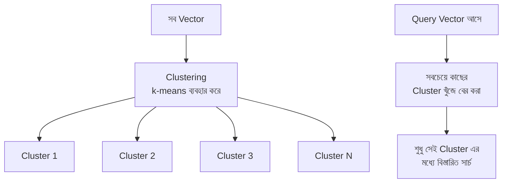
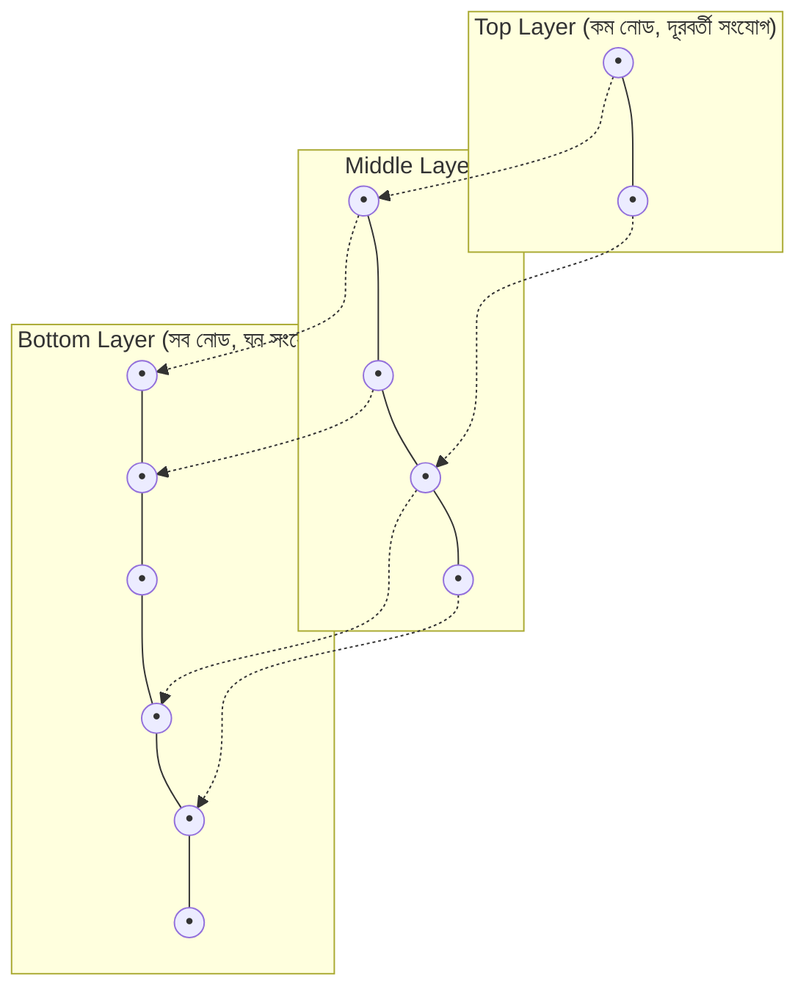
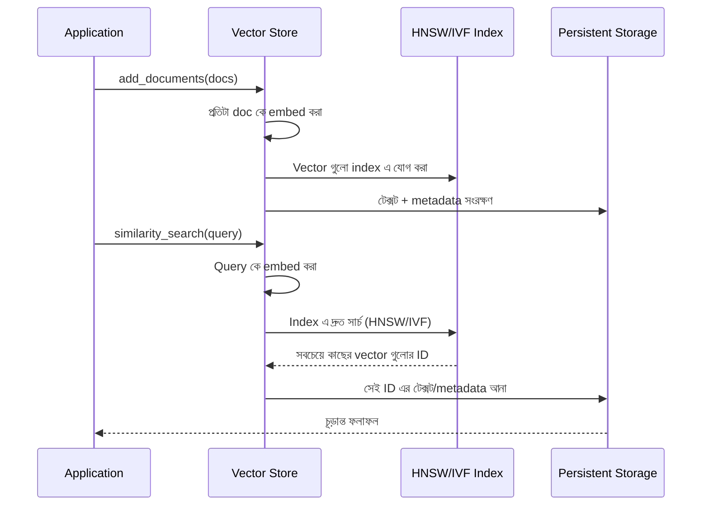

# Module 4: Vector Stores

Module 3 এ আমরা টেক্সটকে embedding এ রূপান্তর করেছি। এখন প্রশ্ন — লক্ষ লক্ষ (এমনকি কোটি) embedding থাকলে, একটা নির্দিষ্ট query এর সাথে সবচেয়ে relevant গুলো কীভাবে **দ্রুত** খুঁজে বের করা যায়? এই সমস্যার সমাধান দেয় **Vector Store** এর indexing strategy — এই Module এ আমরা এর ভিতরের কাজ এবং operation বিস্তারিত দেখব।

---

## Vector Store Working — মূল সমস্যা

### Brute-Force Search এর সীমাবদ্ধতা

সবচেয়ে সহজ পদ্ধতি হলো — query vector কে সংরক্ষিত **প্রতিটা** vector এর সাথে তুলনা করা।

```python
# ধারণাগত brute-force পদ্ধতি
def brute_force_search(query_vector, all_vectors, k=5):
    similarities = [cosine_similarity(query_vector, v) for v in all_vectors]
    top_k_indices = sorted(range(len(similarities)), key=lambda i: similarities[i], reverse=True)[:k]
    return top_k_indices
```

```
১,০০০টা vector হলে: ১,০০০টা তুলনা — দ্রুত
১০,০০,০০০টা vector হলে: ১০,০০,০০০টা তুলনা — ধীর
১০ কোটি vector হলে: ব্যবহারিকভাবে অসম্ভব ধীর
```

এই সমস্যা সমাধানের জন্য Vector Database গুলো বিশেষ **Indexing Algorithm** ব্যবহার করে, যেটা পুরো dataset না ঘেঁটেও দ্রুত approximate ফলাফল দেয়।

---

## Indexing Strategies — IVF এবং HNSW

### IVF (Inverted File Index)

**IVF** ডেটাসেটকে প্রথমে কয়েকটা **cluster** এ ভাগ করে দেয় (k-means এর মতো পদ্ধতিতে), তারপর query আসলে শুধু সবচেয়ে কাছের cluster গুলোর মধ্যে খোঁজে — পুরো dataset না ঘেঁটে।



### কীভাবে কাজ করে — ধাপে ধাপে

1. **Training Phase**: সব vector কে `nlist` সংখ্যক cluster এ ভাগ করা হয় (প্রতিটার একটা "centroid" থাকে)
2. **Query Phase**: query vector আসলে, প্রথমে সবচেয়ে কাছের কয়েকটা cluster centroid খুঁজে বের করা হয় (`nprobe` সংখ্যক cluster)
3. শুধু সেই নির্বাচিত cluster গুলোর ভিতরের vector গুলোর সাথে বিস্তারিত তুলনা করা হয়

```
IVF এর Trade-off:

nprobe কম → দ্রুত কিন্তু কম নির্ভুল (কিছু সত্যিকারের match miss হতে পারে)
nprobe বেশি → ধীর কিন্তু বেশি নির্ভুল (brute-force এর কাছাকাছি)
```

### HNSW (Hierarchical Navigable Small World)

**HNSW** একটা multi-layer graph structure তৈরি করে — উপরের layer এ কম, "দূরবর্তী" সংযোগ থাকে (দ্রুত বড় jump নেওয়ার জন্য), নিচের layer এ বেশি, "কাছের" সংযোগ থাকে (সূক্ষ্ম, নির্ভুল সার্চের জন্য)।



### কীভাবে কাজ করে

Search সবচেয়ে উপরের layer থেকে শুরু হয় — যেখানে "greedy" ভাবে সবচেয়ে কাছের নোডের দিকে এগোনো হয়, তারপর একটা একটা করে নিচের layer এ নেমে আসা হয়, প্রতিটা layer এ আরও সূক্ষ্মভাবে নির্ভুল অবস্থানের দিকে এগোনো হয় — অনেকটা একটা শহরে হাইওয়ে দিয়ে দ্রুত কাছাকাছি এলাকায় পৌঁছে, তারপর ছোট রাস্তা দিয়ে সঠিক ঠিকানায় পৌঁছানোর মতো।

### IVF vs HNSW — তুলনা

| বৈশিষ্ট্য | IVF | HNSW |
|---|---|---|
| Search Speed | দ্রুত | সাধারণত আরও দ্রুত |
| Accuracy | ভালো, tune করা যায় | সাধারণত খুব বেশি নির্ভুল |
| Memory ব্যবহার | তুলনামূলক কম | বেশি (graph structure রাখতে হয়) |
| নতুন ডেটা যোগ করা | Retraining দরকার হতে পারে | Incremental addition সহজ |
| জনপ্রিয়তা | কিছু বড়-স্কেল system এ | বর্তমানে বেশিরভাগ modern vector DB এর default |

::: tip
বেশিরভাগ modern vector database (Pinecone, Weaviate, Chroma, Qdrant) ডিফল্টভাবে **HNSW** ব্যবহার করে, কারণ এটা speed এবং accuracy এর মধ্যে চমৎকার ভারসাম্য দেয়, এবং incremental update (নতুন document যোগ করা) সহজে হ্যান্ডেল করে।
:::

---

## Vector Store Operations — CRUD

### Create (Setup) এবং Insert

```python
from langchain_chroma import Chroma
from langchain_openai import OpenAIEmbeddings
from langchain_core.documents import Document

embedding_model = OpenAIEmbeddings(model="text-embedding-3-small")

documents = [
    Document(page_content="ঢাকা বাংলাদেশের রাজধানী।", metadata={"category": "geography"}),
    Document(page_content="পদ্মা সেতু বাংলাদেশের বিখ্যাত স্থাপনা।", metadata={"category": "infrastructure"}),
]

vectorstore = Chroma.from_documents(
    documents=documents,
    embedding=embedding_model,
    persist_directory="./chroma_db"
)
```

### Read (Query/Search)

```python
results = vectorstore.similarity_search("বাংলাদেশের রাজধানী কী?", k=2)

for doc in results:
    print(doc.page_content, doc.metadata)
```

### Score সহ Search

```python
results_with_scores = vectorstore.similarity_search_with_score(
    "বাংলাদেশের রাজধানী কী?", k=2
)

for doc, score in results_with_scores:
    print(f"{doc.page_content} — Score: {score:.4f}")
```

### Update

```python
vectorstore.update_document(
    document_id="doc_id_here",
    document=Document(page_content="ঢাকা বাংলাদেশের রাজধানী ও সবচেয়ে জনবহুল শহর।")
)
```

::: warning
Update করার সময় শুধু metadata না, embedding **পুনরায় গণনা** করে নতুন করে index এ বসাতে হয় — কারণ টেক্সট বদলালে তার অর্থগত অবস্থান (vector position) ও বদলে যায়।
:::

### Delete

```python
vectorstore.delete(ids=["doc_id_here"])
```

### নতুন Document যোগ করা (বিদ্যমান Store এ)

```python
new_documents = [
    Document(page_content="কক্সবাজার বিশ্বের দীর্ঘতম সমুদ্র সৈকত।", metadata={"category": "geography"})
]
vectorstore.add_documents(new_documents)
```

---

## CRUD এর Internal Flow



---

## Managed vs Self-hosted Vector Database

| ধরন | উদাহরণ | সুবিধা | অসুবিধা |
|---|---|---|---|
| **Local/Embedded** | Chroma, FAISS | Setup সহজ, dev/prototype এ চমৎকার | নিজে স্কেল করতে হয় |
| **Self-hosted** | Weaviate, Qdrant (self-managed) | সম্পূর্ণ নিয়ন্ত্রণ, ডেটা নিজের infra তে | Infra maintenance এর দায়িত্ব নিজের |
| **Managed/Cloud** | Pinecone, Weaviate Cloud | Scaling/maintenance অটোমেটিক | চলমান খরচ, ডেটা তৃতীয়-পক্ষের কাছে |

---

## Common Mistakes

- খুব ছোট প্রজেক্টে ব্যয়বহুল managed vector database ব্যবহার করা, যেখানে Chroma/FAISS যথেষ্ট হতো
- IVF এ `nprobe` খুব কম রাখা, যার ফলে নির্ভুলতা কমে যাওয়া (retrieval quality খারাপ হওয়া)
- Document update করার সময় শুধু metadata আপডেট করে ভাবা যে embedding automatic ভাবে update হয়ে গেছে
- Production এ Vector Store এর backup strategy না রাখা

---

## Best Practices

- Prototype/development এ Chroma/FAISS দিয়ে শুরু করো, প্রয়োজন বুঝে managed solution এ move করো
- Production এ যাওয়ার আগে প্রকৃত dataset size দিয়ে load testing করো — index configuration এর প্রভাব যাচাই করতে
- `similarity_search_with_score` ব্যবহার করো, শুধু `similarity_search` না — score দেখে বুঝতে পারবে ফলাফল আসলেই কতটা relevant
- নিয়মিত backup/snapshot নাও production vector database এর

---

## Interview Questions

**প্রশ্ন: Brute-force search কেন বড় dataset এ ব্যবহারযোগ্য না?**
> কারণ এটা প্রতিটা query এ প্রতিটা সংরক্ষিত vector এর সাথে তুলনা করে — dataset বড় হলে (লক্ষ/কোটি vector) এই তুলনার সংখ্যা এতটাই বেড়ে যায় যে response time ব্যবহারিকভাবে অগ্রহণযোগ্য হয়ে যায়।

**প্রশ্ন: HNSW কীভাবে দ্রুত সার্চ সম্ভব করে?**
> এটা একটা multi-layer graph তৈরি করে — উপরের layer এ কম, দূরবর্তী সংযোগ (দ্রুত বড় jump), নিচের layer এ বেশি, ঘন সংযোগ (সূক্ষ্ম নির্ভুলতা)। Search উপর থেকে নিচে ধাপে ধাপে নেমে আসে, পুরো dataset না ঘেঁটেই কাছের ফলাফল খুঁজে পায়।

**প্রশ্ন: IVF এ `nprobe` প্যারামিটার কী নিয়ন্ত্রণ করে?**
> এটা নিয়ন্ত্রণ করে query এর সময় কতগুলো cluster পরীক্ষা করা হবে। বেশি `nprobe` মানে বেশি নির্ভুল কিন্তু ধীর, কম `nprobe` মানে দ্রুত কিন্তু সম্ভাব্য কম নির্ভুল।

---

## Summary

- Brute-force search বড় dataset এ অকার্যকর — এই কারণে **Indexing Algorithm** (IVF, HNSW) দরকার
- **IVF** clustering ব্যবহার করে, শুধু নির্বাচিত cluster এ সার্চ করে
- **HNSW** একটা multi-layer graph তৈরি করে, ধাপে ধাপে নির্ভুল ফলাফলের দিকে এগোয় — বর্তমানে সবচেয়ে জনপ্রিয় পছন্দ
- Vector Store এ **Create, Read (score সহ), Update, Delete** — সব operation সমর্থিত
- Update করলে embedding পুনরায় গণনা হয়, শুধু metadata না
- **Local, Self-hosted, Managed** — তিন ধরনের deployment option, প্রয়োজন অনুযায়ী বেছে নিতে হয়

## পরবর্তী ধাপ

Module 5 এ আমরা Retrieval এর মূল কৌশলগুলো দেখব — **Similarity Search, MMR, এবং Hybrid Search** — যেগুলো Vector Store থেকে সবচেয়ে relevant এবং বৈচিত্র্যময় ফলাফল বের করতে ব্যবহৃত হয়।
